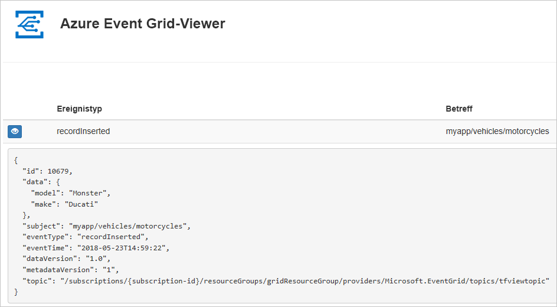
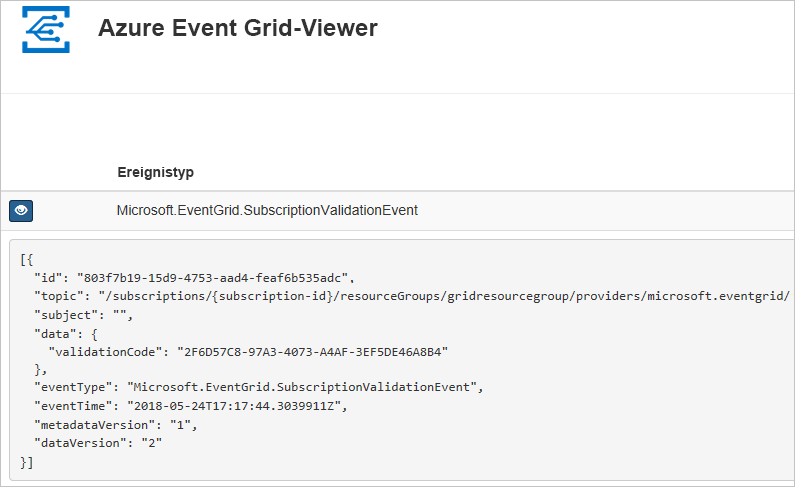

# <a name="create-and-route-custom-events-with-azure-powershell-and-event-grid"></a>Erstellen und Weiterleiten benutzerdefinierter Ereignisse mit Azure PowerShell und Event Grid

Azure Event Grid ist ein Ereignisdienst für die Cloud. In diesem Artikel erstellen Sie mithilfe von Azure PowerShell ein benutzerdefiniertes Thema, abonnieren dieses Thema und lösen das Ereignis aus, um das Ergebnis anzuzeigen. Üblicherweise senden Sie Ereignisse an einen Endpunkt, der die Ereignisdaten verarbeitet und entsprechende Aktionen ausführt. Der Einfachheit halber senden Sie die Ereignisse in diesem Artikel allerdings an eine Web-App, die die Nachrichten sammelt und anzeigt.

Am Ende sehen Sie, dass die Ereignisdaten an die Web-App gesendet wurden.



[!INCLUDE [quickstarts-free-trial-note.md](../../includes/quickstarts-free-trial-note.md)]

Dieser Artikel setzt voraus, dass Sie die aktuelle Version von Azure PowerShell verwenden. Wenn Sie eine Installation oder ein Upgrade ausführen müssen, finden Sie unter [Installieren und Konfigurieren von Azure PowerShell](/powershell/azure/install-azurerm-ps) Informationen dazu.

## <a name="create-a-resource-group"></a>Erstellen einer Ressourcengruppe

Event Grid-Themen sind Azure-Ressourcen und müssen in einer Azure-Ressourcengruppe platziert werden. Die Azure-Ressourcengruppe ist eine logische Sammlung, in der Azure-Ressourcen bereitgestellt und verwaltet werden.

Erstellen Sie mit dem Befehl [New-AzureRmResourceGroup](/powershell/module/azurerm.resources/new-azurermresourcegroup) eine Ressourcengruppe.

Das folgende Beispiel erstellt eine Ressourcengruppe namens *gridResourceGroup* am Standort *westus2*.

```powershell-interactive
New-AzureRmResourceGroup -Name gridResourceGroup -Location westus2
```

[!INCLUDE [event-grid-register-provider-powershell.md](../../includes/event-grid-register-provider-powershell.md)]

## <a name="create-a-custom-topic"></a>Erstellen eines benutzerdefinierten Themas

Ein Event Grid-Thema verfügt über einen benutzerdefinierten Endpunkt für die Veröffentlichung Ihrer Ereignisse. Im folgenden Beispiel wird das benutzerdefinierte Thema in Ihrer Ressourcengruppe erstellt. Ersetzen Sie `<your-topic-name>` durch einen eindeutigen Namen für Ihr Thema. Der Name des Themas muss eindeutig sein, da er Teil des DNS-Eintrags ist.

```powershell-interactive
$topicname="<your-topic-name>"

New-AzureRmEventGridTopic -ResourceGroupName gridResourceGroup -Location westus2 -Name $topicname
```

## <a name="create-a-message-endpoint"></a>Erstellen eines Nachrichtenendpunkts

Vor dem Abonnieren des Themas erstellen wir zunächst den Endpunkt für die Ereignisnachricht. Der Endpunkt führt in der Regel Aktionen auf der Grundlage der Ereignisdaten aus. Der Einfachheit halber stellen Sie in dieser Schnellstartanleitung eine [vorgefertigte Web-App](https://github.com/dbarkol/azure-event-grid-viewer) bereit, die die Ereignisnachrichten anzeigt. Die bereitgestellte Lösung umfasst einen App Service-Plan, eine App Service-Web-App und Quellcode von GitHub.

Ersetzen Sie `<your-site-name>` durch einen eindeutigen Namen für Ihre Web-App. Der Name der Web-App muss eindeutig sein, da er Teil des DNS-Eintrags ist.

```powershell-interactive
$sitename="<your-site-name>"

New-AzureRmResourceGroupDeployment `
  -ResourceGroupName gridResourceGroup `
  -TemplateUri "https://raw.githubusercontent.com/dbarkol/azure-event-grid-viewer/master/azuredeploy.json" `
  -siteName $sitename `
  -hostingPlanName viewerhost
```

Die Bereitstellung kann einige Minuten dauern. Nach erfolgreichem Abschluss der Bereitstellung können Sie Ihre Web-App anzeigen und sich vergewissern, dass sie ausgeführt wird. Navigieren Sie hierzu in einem Webbrowser zu `https://<your-site-name>.azurewebsites.net`.

Die Website sollte angezeigt werden, und es sollten momentan keine Nachrichten vorliegen.

## <a name="subscribe-to-a-topic"></a>Abonnieren eines Themas

Sie abonnieren ein Thema, um Event Grid mitzuteilen, welche Ereignisse Sie nachverfolgen möchten und wohin sie gesendet werden sollen. Im folgenden Beispiel wird das von Ihnen erstellte Thema abonniert. Außerdem wird die URL Ihrer Web-App als Endpunkt für Ereignisbenachrichtigungen übergeben.

Der Endpunkt für Ihre Web-App muss das Suffix `/api/updates/` enthalten.

```powershell-interactive
$endpoint="https://$sitename.azurewebsites.net/api/updates"

New-AzureRmEventGridSubscription `
  -EventSubscriptionName demoViewerSub `
  -Endpoint $endpoint `
  -ResourceGroupName gridResourceGroup `
  -TopicName $topicname
```

Zeigen Sie wieder Ihre Web-App an. Wie Sie sehen, wurde ein Abonnementüberprüfungsereignis an sie gesendet. Klicken Sie auf das Augensymbol, um die Ereignisdaten zu erweitern. Event Grid sendet das Überprüfungsereignis, damit der Endpunkt bestätigen kann, dass er Ereignisdaten empfangen möchte. Die Web-App enthält Code zur Überprüfung des Abonnements.



## <a name="send-an-event-to-your-topic"></a>Senden eines Ereignisses an Ihr Thema

Wir lösen nun ein Ereignis aus, um zu sehen, wie Event Grid die Nachricht an Ihren Endpunkt weiterleitet. Zunächst rufen wir die URL und den Schlüssel für das Thema ab.

```powershell-interactive
$endpoint = (Get-AzureRmEventGridTopic -ResourceGroupName gridResourceGroup -Name $topicname).Endpoint
$keys = Get-AzureRmEventGridTopicKey -ResourceGroupName gridResourceGroup -Name $topicname
```

Der Einfachheit halber richten wir in diesem Artikel Beispielereignisdaten ein, die an das benutzerdefinierte Thema gesendet werden können. Üblicherweise werden die Ereignisdaten von einer Anwendung oder einem Azure-Dienst gesendet. Im folgenden Beispiel wird die Hashtabelle zum Erstellen des `htbody`-Datenelements für das Ereignis verwendet, und anschließend wird die Konvertierung in das wohlgeformte JSON-Nutzlastobjekt `$body` durchgeführt:

```powershell-interactive
$eventID = Get-Random 99999

#Date format should be SortableDateTimePattern (ISO 8601)
$eventDate = Get-Date -Format s

#Construct body using Hashtable
$htbody = @{
    id= $eventID
    eventType="recordInserted"
    subject="myapp/vehicles/motorcycles"
    eventTime= $eventDate   
    data= @{
        make="Ducati"
        model="Monster"
    }
    dataVersion="1.0"
}

#Use ConvertTo-Json to convert event body from Hashtable to JSON Object
#Append square brackets to the converted JSON payload since they are expected in the event's JSON payload syntax
$body = "["+(ConvertTo-Json $htbody)+"]"
```

Mithilfe von `$body` können Sie das vollständige Ereignis anzeigen. Bei dem `data`-Element des JSON-Codes handelt es sich um die Nutzlast Ihres Ereignisses. Für dieses Feld kann ein beliebiger wohlgeformter JSON-Code verwendet werden. Sie können auch das Betrefffeld zur erweiterten Weiterleitung und Filterung verwenden.

Senden Sie jetzt das Ereignis an Ihr Thema.

```powershell-interactive
Invoke-WebRequest -Uri $endpoint -Method POST -Body $body -Headers @{"aeg-sas-key" = $keys.Key1}
```

Sie haben das Ereignis ausgelöst, und Event Grid hat die Nachricht an den Endpunkt gesendet, den Sie beim Abonnieren konfiguriert haben. Zeigen Sie Ihre Web-App an, um das soeben gesendete Ereignis anzuzeigen.

```json
[{
  "id": "1807",
  "eventType": "recordInserted",
  "subject": "myapp/vehicles/motorcycles",
  "eventTime": "2018-01-25T15:58:13",
  "data": {
    "make": "Ducati",
    "model": "Monster"
  },
  "dataVersion": "1.0",
  "metadataVersion": "1",
  "topic": "/subscriptions/{subscription-id}/resourceGroups/{resource-group}/providers/Microsoft.EventGrid/topics/{topic}"
}]
```

## <a name="clean-up-resources"></a>Bereinigen von Ressourcen

Wenn Sie dieses Ereignis oder die Ereignisanzeige-App weiterverwenden möchten, können Sie die Bereinigung der in diesem Artikel erstellten Ressourcen überspringen. Verwenden Sie andernfalls den folgenden Befehl, um die in diesem Artikel erstellten Ressourcen zu löschen.

```powershell
Remove-AzureRmResourceGroup -Name gridResourceGroup
```

## <a name="next-steps"></a>Nächste Schritte

Sie haben gelernt, wie Sie Themen und Ereignisabonnements erstellen. Nun können Sie sich ausführlicher darüber informieren, welche Möglichkeiten Event Grid bietet:

- [An introduction to Azure Event Grid](overview.md) (Einführung in Azure Event Grid)
- [Weiterleiten von Blob Storage-Ereignissen an einen benutzerdefinierten Webendpunkt](../storage/blobs/storage-blob-event-quickstart.md?toc=%2fazure%2fevent-grid%2ftoc.json)
- [Monitor virtual machine changes with Azure Event Grid and Logic Apps](monitor-virtual-machine-changes-event-grid-logic-app.md) (Überwachen von Änderungen an virtuellen Computer mit Azure Event Grid und Logic Apps)
- [Streamen von Big Data in ein Data Warehouse](event-grid-event-hubs-integration.md)
