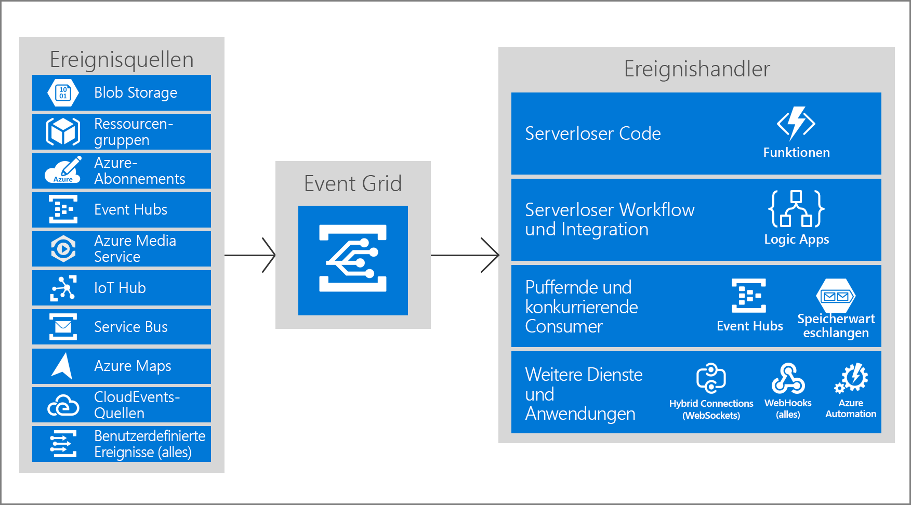

# Einführung in Azure Event Grid

Mit Azure Event Grid können Sie mühelos Anwendungen mit ereignisbasierten Architekturen erstellen. Sie wählen die Azure-Ressource aus, die Sie abonnieren möchten, und geben den Ereignishandler oder WebHook-Endpunkt an, an den das Ereignis gesendet werden soll. Event Grid verfügt über integrierte Unterstützung für Ereignisse, die aus Azure-Diensten stammen, wie Speicherblobs und Ressourcengruppen. Event Grid bietet auch mithilfe benutzerdefinierter Themen und Webhooks benutzerdefinierte Unterstützung für Anwendungs- und Drittanbieterereignisse. 

Sie können Filter zum Weiterleiten bestimmter Ereignisse an verschiedene Endpunkte verwenden, Multicasts zu mehreren Endpunkten ausführen und sicherstellen, dass Ihre Ereignisse zuverlässig übermittelt werden. Event Grid bietet auch integrierte Unterstützung für benutzerdefinierte und Drittanbieterereignisse.

Event Grid unterstützt derzeit die folgenden Regionen:

* Asien, Südosten
* Asien, Osten
* USA, Mitte
*   USA, Osten
*   USA, Osten 2
* Europa, Westen
* Europa, Norden
*   USA, Westen-Mitte
*   USA, Westen
*   USA, Westen 2

Dieser Artikel enthält eine Übersicht zu Azure Event Grid. Wenn Sie in die Verwendung von Event Grid einsteigen möchten, lesen Sie [Erstellen und Weiterleiten benutzerdefinierter Ereignisse mit Azure Event Grid](custom-event-quickstart.md). Die folgende Abbildung zeigt, wie Event Grid Verleger und Handler verbindet, bietet jedoch keine umfassende Liste der unterstützten Optionen.

## Ereignisherausgeber

Derzeit bieten die folgenden Azure-Dienste integrierte Herausgeberunterstützung für Event Grid:

* Azure-Abonnements (Verwaltungsvorgänge)
* Benutzerdefinierte Themen
* Event Hubs
* IoT Hub
* Ressourcengruppen (Verwaltungsvorgänge)
* Speicherblob
* Konten vom Typ „Allgemein v2“

## Ereignishandler

Derzeit bieten die folgenden Azure-Dienste integrierte Handlerunterstützung für Event Grid: 

* Azure-Automatisierung
* Azure-Funktionen
* Event Hubs
* Logic Apps
* Microsoft Flow
* WebHooks

Wenn Sie Azure Functions als Handler einsetzen, verwenden Sie den Event Grid-Trigger anstelle der generischen HTTP-Trigger. Event Grid überprüft Event Grid-Funktionstrigger automatisch. Bei generischen HTTP-Triggern müssen Sie die [Überprüfungsantwort](security-authentication.md#webhook-event-delivery) implementieren.

## Konzepte

Es gibt fünf Konzepte in Azure Event Grid, die Sie nutzen können:

* **Ereignisse**: Was ist passiert?
* **Ereignisquellen/-herausgeber**: Wo das Ereignis stattgefunden hat.
* **Themen**: Der Endpunkt, an den Herausgeber Ereignisse senden.
* **Ereignisabonnements**: Der Endpunkt oder integrierte Mechanismus zum Weiterleiten von Ereignissen, und zwar mitunter zu mehreren Handlern. Abonnements werden auch vom Handler verwendet, um eingehende Ereignisse intelligent zu filtern.
* **Ereignishandler**: Die App oder der Dienst, die/der auf das Ereignis reagiert.

Weitere Informationen zu diesen Konzepten finden Sie unter [Concepts in Azure Event Grid](concepts.md) (Konzepte in Azure Event Grid).

## Funktionen

Azure Event Grid bietet unter anderem folgende zentrale Features:

* **Einfachheit**: Leiten Sie Ereignisse mit Point-and-Click aus Ihrer Azure-Ressource zu einem Ereignishandler oder Endpunkt.
* **Erweiterte Filterung**: Filtern Sie nach Ereignistyp oder Ereignisveröffentlichungspfad, um sicherzustellen, dass Ereignishandler nur relevante Ereignisse empfangen.
* **Auffächern**: Abonnieren Sie mehrere Endpunkte für das gleiche Ereignis, um Kopien des Ereignisses an so viele Stellen wie erforderlich zu senden.
* **Zuverlässigkeit**: Nutzen Sie die 24-Stunden-Wiederholung mit exponentiellem Backoff, um sicherzustellen, dass Ereignisse übermittelt werden.
* **Bezahlen pro Ereignis**: Zahlen Sie nur für den Umfang, in dem Sie Event Grid nutzen.
* **Hoher Durchsatz**: Erstellen Sie Workloads mit hohem Volumen auf Event Grid mit Unterstützung für Millionen Ereignisse pro Sekunde.
* **Integrierte Ereignisse**: Mit ressourcendefinierten integrierten Ereignissen sind Sie schnell einsatzbereit.
* **Benutzerdefinierte Ereignisse**: Nutzen Sie die Weiterleitungs- und Filterfunktionen von Event Grid, um zuverlässig benutzerdefinierte Ereignisse in Ihre App zu übertragen.

Einen Vergleich von Event Grid, Event Hubs und Service Bus finden Sie unter [Auswählen zwischen Azure-Diensten für die Übermittlung von Nachrichten](compare-messaging-services.md).

## Welche Möglichkeiten bietet Event Grid?

Azure Event Grid bietet verschiedene Funktionen, die die serverlose, Betriebsautomatisierungs- und Integrationsarbeit erheblich verbessern: 

### Serverlose Anwendungsarchitekturen

Event Grid verknüpft Datenquellen und Ereignishandler. Verwenden Sie Event Grid z.B. zum automatischen Auslösen einer serverlosen Funktion, um jedes Mal, wenn ein neues Foto einem Blob Storage-Container hinzugefügt wird, eine Bildanalyse durchzuführen. 

### Betriebsautomatisierung

Mit Event Grid können Sie die Automatisierung beschleunigen und die Richtlinienerzwingung vereinfachen. Event Grid kann z.B. Azure Automation benachrichtigen, wenn ein virtueller Computer erstellt oder eine SQL-Datenbank eingerichtet wird. Diese Ereignisse können verwendet werden, um automatisch die Kompatibilität von Dienstkonfigurationen zu überprüfen, Metadaten in Betriebstools einzulesen, virtuelle Computer zu kennzeichnen oder Arbeitselemente abzulegen.

### Anwendungsintegration

Event Grid verknüpft Ihre App mit anderen Diensten. Sie können z.B. ein benutzerdefiniertes Thema erstellen, um die Ereignisdaten Ihrer App an Event Grid zu senden und von der zuverlässigen Übermittlung, den erweiterten Routingfunktionen und der direkten Integration in Azure zu profitieren. Alternativ dazu können Sie Event Grid mit Logic Apps verwenden, um Daten überall verarbeiten zu können, ohne Code schreiben zu müssen. 

## Was kostet Event Grid?

Das Preismodell von Azure Event Grid orientiert sich an einer Zahlung pro Ereignis, sodass Sie nur für die tatsächliche Verwendung zahlen. Die ersten 100.000 Vorgänge pro Monat sind kostenlos. Vorgänge sind definiert als Ereigniseingänge, erweiterte Übereinstimmungen, Übermittlungsversuche und Verwaltungsaufrufe. Details finden Sie auf der Seite mit der [Preisübersicht](https://azure.microsoft.com/pricing/details/event-grid/).

## Nächste Schritte

* [Routen von Storage Blob-Ereignissen](../storage/blobs/storage-blob-event-quickstart.md?toc=%2fazure%2fevent-grid%2ftoc.json)  
  Reagieren Sie auf Storage Blob-Ereignisse mithilfe von Event Grid.
* [Erstellen und Abonnieren von benutzerdefinierten Ereignissen](custom-event-quickstart.md)  
  Starten Sie sofort, und senden Sie Ihre eigenen benutzerdefinierten Ereignisse mithilfe des Azure Event Grid-Schnellstarts an einen beliebigen Endpunkt.
* [Verwenden von Logic Apps als Ereignishandler](monitor-virtual-machine-changes-event-grid-logic-app.md)  
  Ein Tutorial zum Erstellen einer App mit Logic Apps, um auf Ereignisse zu reagieren, die von Event Grid mithilfe von Push übertragen werden.
* [Streamen von Big Data in ein Data Warehouse](event-grid-event-hubs-integration.md)  
  Ein Tutorial, das mithilfe von Azure Functions Daten von Event Hubs in SQL Data Warehouse streamt.
* [Event Grid-REST-API-Referenz](/rest/api/eventgrid)  
  Bietet weitere technische Informationen zu Event Grid Azure und einen Verweis zum Verwalten von Ereignisabonnements, zu Routing und Filterung.