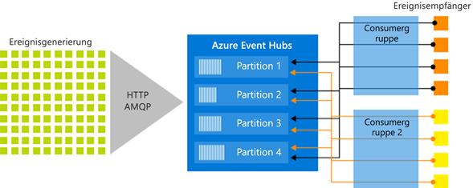

# Was ist Azure Event Hubs?

Azure Event Hubs ist eine Big Data-Streamingplattform und ein Ereigniserfassungsdienst, der pro Sekunde Millionen von Ereignissen empfangen und verarbeiten kann. Event Hubs kann Ereignisse, Daten oder Telemetriedaten, die von verteilter Software und verteilten Geräten erzeugt wurden, verarbeiten und speichern. An einen Event Hub gesendete Daten können transformiert und mit einem beliebigen Echtzeitanalyse-Anbieter oder Batchverarbeitungs-/Speicheradapter gespeichert werden. 

Event Hubs wird in einigen der folgenden gängigen Szenarios verwendet:

- Anomalieerkennung (Betrug/Ausreißer)
- Anwendungsprotokollierung
- Analyse-Pipelines, z.B. Clickstreams
- Dashboards in Echtzeit
- Archivierung von Daten
- Transaktionsverarbeitung
- Verarbeitung der Benutzertelemetrie
- Streaming der Gerätetelemetrie 

## Vorteile von Event Hubs

Daten sind nur wertvoll, wenn es eine einfache Möglichkeit für die Verarbeitung und das Abrufen frühzeitiger Einblicke von Datenquellen gibt. Event Hubs stellt eine verteilte Verarbeitungsplattform für Datenströme mit niedriger Latenz und nahtloser Integration sowie Daten und Analysediensten innerhalb und außerhalb von Azure bereit, um eine vollständige Big Data-Pipeline zu erstellen.

Event Hubs stellt die „Vordertür“ für eine Ereignispipeline dar. Dies wird in Lösungsarchitekturen oft als *Ereignisingestor* bezeichnet. Ein Ereigniserfasser ist eine Komponente oder ein Dienst zwischen Ereignisherausgeber und Ereignisverarbeitung zum Entkoppeln der Erzeugung eines Ereignisdatenstroms von der Verarbeitung dieser Ereignisse. Event Hubs bietet eine einheitliche Streamingplattform mit einem Puffer der Zeitvermerkdauer, durch den die Ereignisersteller von den Ereignisconsumern entkoppelt werden. 

In den folgenden Abschnitten werden die wichtigsten Features des Azure Event Hubs-Diensts beschrieben: 

## Vollständig verwaltete PaaS 

Event Hubs ist ein verwalteter Dienst mit geringfügigen Konfigurations- oder Verwaltungsaufwand, sodass Sie sich auf Ihre Unternehmenslösungen konzentrieren können. [Event Hubs für Apache Kafka-Ökosysteme](event-hubs-for-kafka-ecosystem-overview.md) bietet Ihnen die Funktionen von PaaS-Kafka, ohne dass Sie Cluster verwalten, konfigurieren oder ausführen müssen.

## Unterstützung für Echtzeit- und Batchverarbeitung

Erfassen, puffern, speichern und verarbeiten Sie Ihren Datenstrom in Echtzeit, um verwertbare Einblicke zu erhalten. Event Hubs verwendet ein [partitioniertes Consumermodell](event-hubs-features.md#partitions), sodass mehrere Anwendungen den Datenstrom gleichzeitig verarbeiten und Sie die Verarbeitungsgeschwindigkeit steuern können.

Erfassen Sie Ihre Daten mit [Capture](event-hubs-capture-overview.md) nahezu in Echtzeit in [Azure Blob Storage](https://azure.microsoft.com/services/storage/blobs/) oder [Azure Data Lake Store](https://azure.microsoft.com/services/data-lake-store/) für die Langzeitaufbewahrung oder die Microbatch-Verarbeitung. Sie können dies auf dem gleichen Datenstrom erreichen, den Sie zum Ableiten von Echtzeitanalysen verwenden. Das Einrichten von Capture geht schnell, für das Ausführen fallen keine Verwaltungskosten an, und die Skalierung erfolgt automatisch mit den  [Event Hub-Durchsatzeinheiten](event-hubs-features.md#throughput-units). Mit dem Event Hub-Feature Capture können Sie sich anstelle der Datenerfassung auf die Datenverarbeitung konzentrieren.

Azure Event Hubs lässt sich für eine serverlose Architektur auch mit [Azure Functions](/azure/azure-functions/) integrieren.

## Skalierbar 

Mit Event Hubs können Sie mit Datenströmen in Megabytes anfangen und zu Gigabytes oder Terabytes erweitern. Das Feature für die [automatische Vergrößerung](event-hubs-auto-inflate.md) ist eine von vielen verfügbaren Optionen zum Skalieren der Anzahl von Durchsatzeinheiten, um Ihren Nutzungsanforderungen gerecht zu werden. 

## Umfangreiches Ökosystem

Mit [Event Hubs für Apache Kafka-Ökosysteme](event-hubs-for-kafka-ecosystem-overview.md) können [Apache Kafka-Clients (1.0 und höher)](https://kafka.apache.org/) und -Anwendungen mit Event Hubs kommunizieren, ohne dass Cluster verwaltet werden müssen.
 
Mit einem umfassenden Ökosystem in verschiedenen [Sprachen (.NET, Java, Python, Go, Node.js)](https://github.com/Azure/azure-event-hubs) können Sie über Event Hubs problemlos mit der Verarbeitung Ihrer Datenströme beginnen. Mit allen unterstützten Clientsprachen wird tiefgreifende Integration gewährleistet.

## Wichtige Komponenten der Architektur

Event Hubs bietet eine Funktion zur Abwicklung von Nachrichtendatenströmen, verfügt jedoch über Eigenschaften, die sich von herkömmlichen Diensten zur Unternehmenskommunikation unterscheiden. Event Hubs-Funktionen werden für Szenarien mit hohem Durchsatz und Ereignisverarbeitung erstellt. Event Hubs enthält die folgenden [Schlüsselkomponenten](event-hubs-features.md):

- **Ereignisersteller:** Eine Entität, die Daten an eine Event Hub-Instanz sendet. Ereignisherausgeber können Ereignisse über HTTPS, AMQP 1.0 oder Apache Kafka (1.0 und höher) veröffentlichen.
- **Partitionen:** Jeder Consumer liest nur eine bestimmte Teilmenge oder Partition des Nachrichtendatenstroms.
- **Verbrauchergruppen:** Eine Ansicht (Status, Position oder Offset) einer vollständigen Event Hub-Instanz. Mithilfe von Consumergruppen können mehrere verarbeitende Anwendungen jeweils eine separate Ansicht des Ereignisdatenstroms aufweisen und den Datenstrom unabhängig voneinander in einem unabhängigen Tempo und mit eigenen Offsets lesen.
- **Durchsatzeinheiten:** Vorab erworbene Einheiten von Kapazitäten, die die Durchsatzkapazität einer Event Hub-Instanz steuern.
- **Ereignisempfänger:** Eine Entität, die Ereignisdaten von einem Event Hub liest. Alle Event Hubs-Consumer stellen über eine AMQP 1.0-Sitzung eine Verbindung her und Ereignisse werden über die Sitzung übermittelt, sobald sie verfügbar sind. Alle Kafka-Consumer verwenden zur Verbindungsherstellung mindestens das Kafka-Protokoll 1.0.

Die folgende Abbildung zeigt die Datenstromverarbeitungsarchitektur von Event Hubs:

## Nächste Schritte

In den folgenden Artikeln finden Sie Informationen zu den ersten Schritten mit Event Hubs:

* [Verarbeiten von Ereignisdatenströmen](event-hubs-quickstart-portal.md)
* [Event Hubs-Features im Überblick](event-hubs-features.md)
* [Häufig gestellte Fragen](event-hubs-faq.md)

