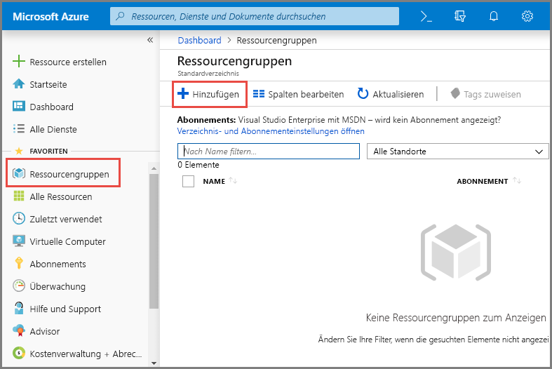
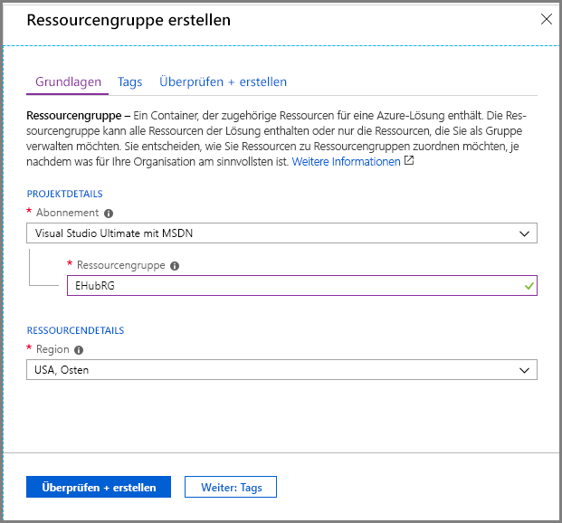
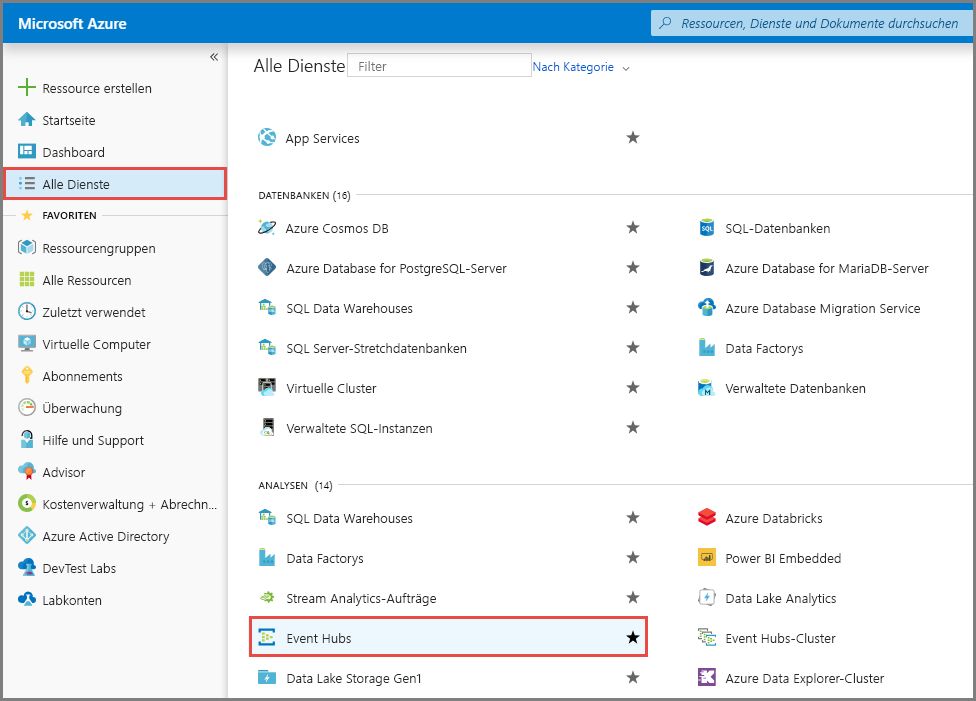
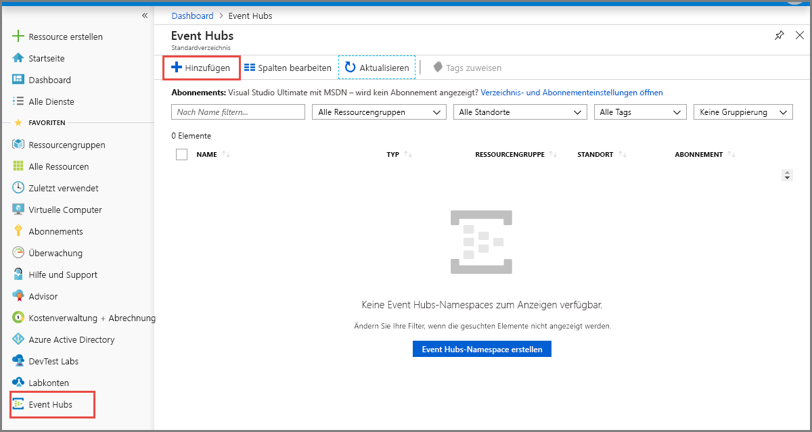
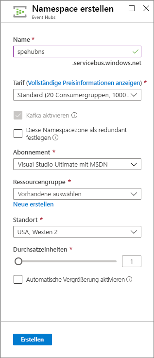
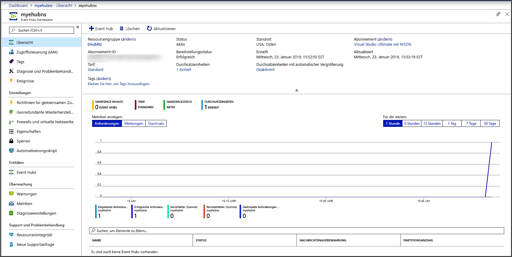
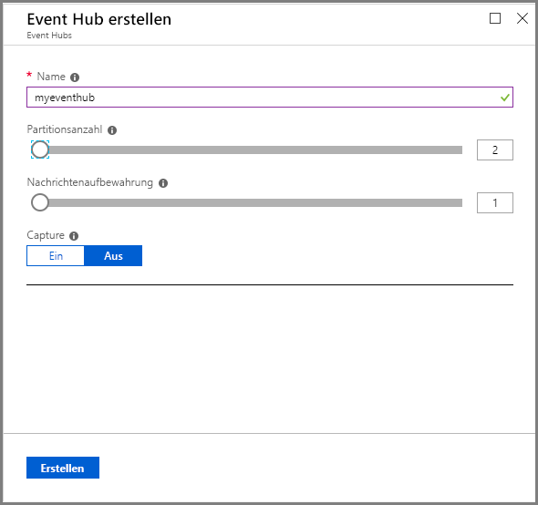

# Schnellstart: Erstellen eines Event Hubs mithilfe des Azure-Portals
Azure Event Hubs ist eine Big Data-Streamingplattform und ein Ereigniserfassungsdienst, der pro Sekunde Millionen von Ereignissen empfangen und verarbeiten kann. Event Hubs kann Ereignisse, Daten oder Telemetriedaten, die von verteilter Software und verteilten Geräten erzeugt wurden, verarbeiten und speichern. An einen Event Hub gesendete Daten können transformiert und mit einem beliebigen Echtzeitanalyse-Anbieter oder Batchverarbeitungs-/Speicheradapter gespeichert werden. Eine ausführliche Übersicht über Event Hubs finden Sie unter [Was ist Azure Event Hubs?](event-hubs-about.md) und [Event Hubs-Features im Überblick](event-hubs-features.md).

In dieser Schnellstartanleitung erstellen Sie einen Event Hub mit dem [Azure-Portal](https://portal.azure.com).

## Voraussetzungen

Stellen Sie für diese Schnellstartanleitung sicher, dass Sie über Folgendes verfügen:

- Azure-Abonnement. Falls Sie kein Abonnement besitzen, können Sie ein [kostenloses Konto erstellen](https://azure.microsoft.com/free/), bevor Sie beginnen.
- [Visual Studio 2019](https://www.visualstudio.com/vs) oder höher.
- [.NET Standard SDK](https://www.microsoft.com/net/download/windows), Version 2.0 oder höher.

## Erstellen einer Ressourcengruppe

Eine Ressourcengruppe ist eine logische Sammlung mit Azure-Ressourcen. Alle Ressourcen werden in einer Ressourcengruppe bereitgestellt und verwaltet. So erstellen Sie eine Ressourcengruppe:

1. Melden Sie sich beim [Azure-Portal](https://portal.azure.com) an.
2. Klicken Sie im linken Navigationsbereich auf **Ressourcengruppen**. Klicken Sie anschließend auf **Hinzufügen**.

   

2. Wählen Sie unter **Abonnement** den Namen des Azure-Abonnements aus, in dem Sie die Ressourcengruppe erstellen möchten.
3. Geben Sie einen eindeutigen **Namen für die Ressourcengruppe** ein. Das System überprüft sofort, ob der Name im derzeit ausgewählten Azure-Abonnement verfügbar ist.
4. Wählen Sie eine **Region** für die Ressourcengruppe aus.
5. Klicken Sie auf **Überprüfen + erstellen**.

   
6. Wählen Sie auf der Seite **Bewerten + erstellen** die Option **Erstellen**. 

## Erstellen eines Event Hubs-Namespace

Ein Event Hubs-Namespace stellt einen eindeutigen Bereichscontainer bereit, auf den über den vollqualifizierten Domänennamen verwiesen wird und in dem Sie mindestens einen Event Hub erstellen. Führen Sie die folgenden Schritte aus, um mit dem Portal einen Namespace in Ihrer Ressourcengruppe zu erstellen:

1. Klicken Sie im Azure-Portal oben links auf **Ressource erstellen**.
2. Wählen Sie im linken Menü **Alle Dienste** aus. Wählen Sie dann in der Kategorie **Analyse** neben **Event Hubs** den **Stern (`*`)** aus. Überprüfen Sie, ob **Event Hubs** im linken Navigationsmenü zu **FAVORITEN** hinzugefügt wurde. 
    
   
3. Wählen Sie im linken Navigationsmenü unter **FAVORITEN** die Option **Event Hubs**. Wählen Sie anschließend auf der Symbolleiste die Option **Hinzufügen** aus.

   
4. Gehen Sie auf der Seite **Namespace erstellen** wie folgt vor:
    1. Wählen Sie das **Abonnement** aus, in dem Sie den Namespace erstellen möchten.
    2. Wählen Sie die **Ressourcengruppe** aus, die Sie im vorherigen Schritt erstellt haben. 
    3. Geben Sie einen **Namen** für den Namespace ein. Das System überprüft sofort, ob dieser Name verfügbar ist.
    4. Wählen Sie einen **Standort** für den Namespace aus.    
    5. Wählen Sie den **Tarif** (Basic oder Standard) aus.  
    6. Lassen Sie die Einstellungen für **Durchsatzeinheiten** unverändert. Weitere Informationen zu Durchsatzeinheiten finden Sie unter [Skalierung mit Event Hubs](event-hubs-scalability.md#throughput-units).  
    5. Wählen Sie am unteren Rand der Seite die Option **Bewerten + erstellen** aus.

       
   6. Überprüfen Sie die Einstellungen auf der Seite **Bewerten + erstellen**, und wählen Sie **Erstellen** aus. Warten Sie, bis die Bereitstellung abgeschlossen ist. 

       
   7. Wählen Sie auf der Seite **Bereitstellung** die Option **Zu Ressource wechseln** aus, um zur Seite für Ihren Namespace zu navigieren. 

      
   8. Vergewissern Sie sich, dass die Seite **Event Hubs-Namespace** in etwa aussieht wie das folgende Beispiel: 

              

       > [!NOTE]
       > Von Azure Event Hubs wird ein Kafka-Endpunkt bereitgestellt. Dieser Endpunkt ermöglicht Ihrem Event Hubs-Namespace die native Erkennung des [Apache Kafka](https://kafka.apache.org/intro)-Nachrichtenprotokolls und der APIs. Mit dieser Funktion können Sie wie bei Kafka-Themen mit Ihrem Event Hubs kommunizieren, ohne Ihre Protokollclients ändern oder eigene Cluster ausführen zu müssen. Event Hubs unterstützt [Apache Kafka Version 1.0.](https://kafka.apache.org/10/documentation.html) und höher. Weitere Informationen finden Sie unter [Verwenden von Azure Event Hubs aus Apache Kafka-Anwendungen](event-hubs-for-kafka-ecosystem-overview.md).
    
## Erstellen eines Ereignis-Hubs

Führen Sie die folgenden Schritte aus, um im Namespace einen Event Hub zu erstellen:

1. Wählen Sie auf der Seite „Event Hubs-Namespace“ im linken Menü **Event Hubs** aus.
1. Klicken Sie oben im Fenster auf **+ Event Hub**.
   
    
1. Geben Sie einen Namen für den Event Hub ein, und klicken Sie auf **Erstellen**.
   
    
4. Sie können den Status der Event Hub-Erstellung in den Warnungen überprüfen. Nachdem der Event Hub erstellt wurde, wird er in der Liste der Event Hubs angezeigt, wie in der folgenden Abbildung dargestellt:

    

## Nächste Schritte

In diesem Artikel haben Sie eine Ressourcengruppe, einen Event Hubs-Namespace und einen Event Hub erstellt. Schritt-für-Schritt-Anleitungen zum Senden von Ereignissen an einen Event Hub oder Empfangen von Ereignissen von einem Event Hub finden Sie in den Tutorials zum **Senden und Empfangen von Ereignissen**: 

- [.NET Core](get-started-dotnet-standard-send-v2.md)
- [Java](get-started-java-send-v2.md)
- [Python](get-started-python-send-v2.md)
- [JavaScript](get-started-java-send-v2.md)
- [Go](event-hubs-go-get-started-send.md)
- [C (nur senden)](event-hubs-c-getstarted-send.md)
- [Apache Storm (nur empfangen)](event-hubs-storm-getstarted-receive.md)

[Azure portal]: https://portal.azure.com/
[3]: ./media/event-hubs-quickstart-portal/sender1.png
[4]: ./media/event-hubs-quickstart-portal/receiver1.png
