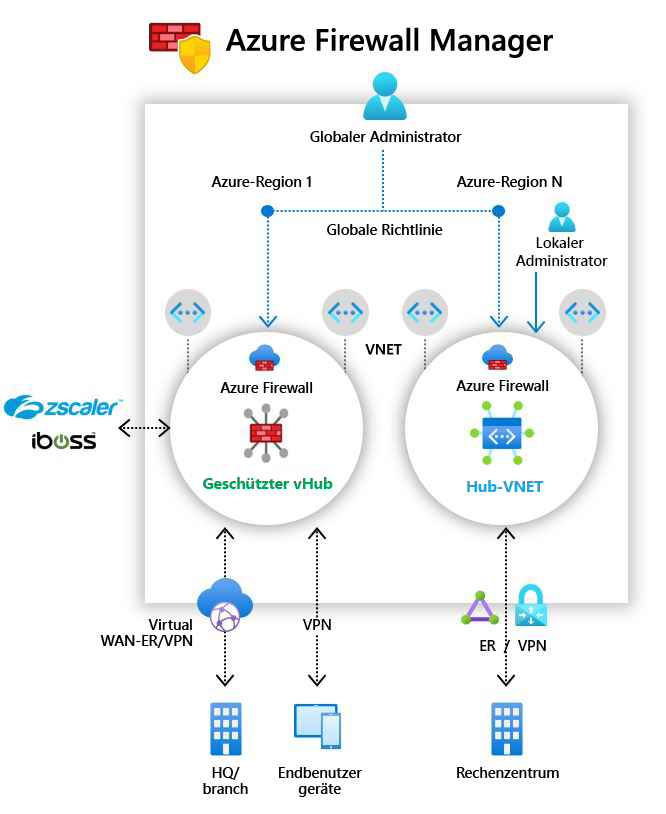

# Was ist Azure Firewall Manager (Vorschau)?

[!INCLUDE [Preview](../../includes/firewall-manager-preview-notice.md)]

Azure Firewall Manager (Vorschau) ist ein Sicherheitsverwaltungsdienst, der eine zentrale Sicherheitsrichtlinien- und Routenverwaltung für cloudbasierte Sicherheitsperimeter bereitstellt. 

Firewall Manager bietet eine Sicherheitsverwaltung für zwei Netzwerkarchitekturtypen:

- **Geschützter virtueller Hub**

   Ein [Azure Virtual WAN Hub](../virtual-wan/virtual-wan-about.md#resources) ist eine von Microsoft verwaltete Ressource, mit der Sie ganz einfach Hub-and-Spoke-Architekturen erstellen können. Wenn einem solchen Hub Sicherheits- und Routingrichtlinien zugeordnet werden, wird dieser als *[geschützter virtueller Hub](secured-virtual-hub.md)* bezeichnet. 
- **Virtuelles Hubnetzwerk**

   Hierbei handelt es sich um ein virtuelles Azure-Standardnetzwerk, das Sie selbst erstellen und verwalten. Wenn einem solchen Hub Sicherheitsrichtlinien zugeordnet werden, wird dies als *virtuelles Hubnetzwerk* bezeichnet. Zurzeit wird nur die Azure Firewall-Richtlinie unterstützt. Sie können virtuelle Spoke-Netzwerke, die Ihre Workloadserver und -dienste enthalten, per Peering verknüpfen. Sie können auch Firewalls in eigenständigen virtuellen Netzwerken verwalten, die nicht per Peering mit einem Spoke verknüpft sind.

Einen ausführlichen Vergleich des *geschützten virtuellen Hubs* und des *virtuellen Hubnetzwerks* finden Sie unter [Welche Architekturoptionen gibt es für Azure Firewall Manager?](vhubs-and-vnets.md).

## Features von Azure Firewall Manager (Vorschau)

Die Vorschau von Azure Firewall Manager bietet die folgenden Features:

### Zentrale Azure Firewall-Bereitstellung und -Konfiguration

Sie können zentral mehrere Azure Firewall-Instanzen bereitstellen und konfigurieren, die sich über verschiedene Azure-Regionen und -Abonnements erstrecken. 

### Hierarchische Richtlinien (global und lokal)

Sie können mit Azure Firewall Manager (Vorschau) Azure Firewall-Richtlinien für mehrere geschützte virtuelle Hubs zentral verwalten. Ihre zentralen IT-Teams können globale Firewallrichtlinien erstellen, um organisationsweite und teamübergreifende Firewallrichtlinien zu erzwingen. Lokal erstellte Firewallrichtlinien ermöglichen ein DevOps-Self-Service-Modell für mehr Agilität.

### Integration von Drittanbieter-SECaaS-Lösungen für höhere Sicherheit

Zusätzlich zur Azure Firewall können Sie SECaaS-Anbieter (Security-as-a-Service) von Drittanbietern integrieren, um zusätzlichen Netzwerkschutz für Ihre VNET-Verbindungen und Internetverbindungen von Zweigstellen zu erzielen.

Dieses Feature ist nur für Bereitstellungen von geschützten virtuellen Hubs verfügbar.

- Filterung von V2I-Datenverkehr (VNET-to-Internet)

   - Filtern Sie ausgehenden VNET-Datenverkehr mit einem Drittanbieter-Sicherheitsanbieter Ihrer Wahl.
   - Nutzen Sie erweiterten, benutzerfähigen Internetschutz für Ihre in Azure ausgeführten Cloudworkloads.

- Filtern von B2I-Datenverkehr (Branch-to-Internet)

   Nutzen Sie Ihre Azure-Konnektivität und die globale Verteilung, um für B2I-Szenarien auf einfache Weise eine Drittanbieterfilterung hinzuzufügen.

Weitere Informationen zu vertrauenswürdigen Sicherheitsanbietern finden Sie unter [Was sind vertrauenswürdige Sicherheitsanbieter (Vorschau)?](trusted-security-partners.md).

### Zentrale Routenverwaltung

Leiten Sie den Datenverkehr zur Filterung und Protokollierung einfach an Ihren geschützten Hub weiter, ohne dass Sie manuell benutzerdefinierte Routen (UDR) für virtuelle Spoke-Netzwerke einrichten müssen. 

Dieses Feature ist nur für Bereitstellungen von geschützten virtuellen Hubs verfügbar.

Sie können für die Filterung von B2I-Datenverkehr Anbieter von Drittanbietern verwenden, gemeinsam mit Azure Firewall für B2V (Branch-to-VNET), V2V (VNET-to-VNET) und V2I (VNET-to-Internet). Sie können auch Lösungen von Drittanbietern für die V2I-Datenverkehrsfilterung verwenden, solange Azure Firewall nicht für B2V oder V2V benötigt wird. 

## Regionale Verfügbarkeit

Azure Firewall-Richtlinien können regionsübergreifend verwendet werden. Beispielsweise können Sie eine Richtlinie in „USA, Westen“ erstellen und in „USA, Osten“ verwenden. 

## Bekannte Probleme

Für Azure Firewall Manager (Vorschau) sind die folgenden Probleme bekannt:

|Problem  |BESCHREIBUNG  |Minderung  |
|---------|---------|---------|
|Einschränkungen für Drittanbieterfilterung.|Eine V2I-Datenverkehrsfilterung mit Anbietern von Drittanbietern wird mit Azure Firewall B2V und V2V nicht unterstützt.|Wird untersucht|
|Die Trennung des Datenverkehrs wird derzeit nicht unterstützt.|Die Trennung von Office 365- und öffentlichem Azure-PaaS-Datenverkehr wird aktuell nicht unterstützt. Daher wird bei Auswahl eines Drittanbieters für V2I oder B2I auch der gesamte öffentliche Azure-PaaS- und Office 365-Datenverkehr über den Partnerdienst gesendet.|Die Datenverkehrstrennung am Hub wird untersucht.
|Ein geschützter virtueller Hub pro Region.|Sie können nicht mehr als einen geschützten virtuellen Hub pro Region verwenden.|Erstellen Sie mehrere virtuelle WANs in einer Region.|
|Basisrichtlinien müssen in derselben Region wie die lokale Richtlinie vorliegen.|Erstellen Sie sämtliche Ihrer lokalen Richtlinien in derselben Region wie die Basisrichtlinie. Eine in einer Region erstellte Richtlinie kann weiterhin auf einen geschützten Hub aus einer anderen Region angewendet werden.|Wird untersucht|
|Die Kommunikation zwischen Hubs funktioniert nicht mit dem geschützten virtuellen Hub.|Die Kommunikation zwischen geschützten virtuellen Hubs wird noch nicht unterstützt.|Wird untersucht|
|Alle geschützten virtuellen Hubs, die das gleiche virtuelle WAN nutzen, müssen sich in derselben Ressourcengruppe befinden.|Dieses Verhalten orientiert sich heute an Virtual WAN-Hubs.|Erstellen Sie mehrere Virtual WAN-Instanzen, um die Erstellung von geschützten virtuellen Hubs in verschiedenen Ressourcengruppen zu ermöglichen.|
|IP-Adressgruppen werden in der Firewallrichtlinie nicht unterstützt.|IP-Adressgruppen befinden sich in der öffentlichen Vorschauphase und werden derzeit nur mit herkömmlichen Firewallregeln unterstützt.|Fix wird angewendet.
|Keine Unterstützung von CSP-Abonnements (Cloud Solution Provider).|[CSP-Abonnements](https://azure.microsoft.com/offers/ms-azr-0145p/) werden derzeit nicht unterstützt.|Wird untersucht

## Nächste Schritte

- [Übersicht über die Bereitstellung von Azure Firewall Manager (Vorschau)](deployment-overview.md)
- Weitere Informationen über [geschützte virtuelle Hubs](secured-virtual-hub.md)