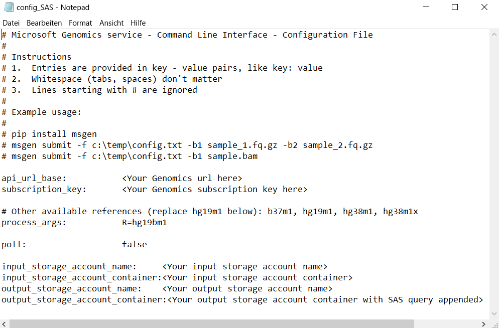

# <a name="submit-a-workflow-to-microsoft-genomics-using-a-sas-instead-of-a-storage-account-key"></a>Übermitteln eines Workflows per SAS anstelle eines Speicherkontoschlüssels an Microsoft Genomics 

In dieser Schnellstartanleitung wird veranschaulicht, wie Sie einen Workflow nicht mit Speicherkontoschlüsseln, sondern mit der Datei „config.txt“ mit [Shared Access Signatures (SAS)](https://docs.microsoft.com/azure/storage/common/storage-dotnet-shared-access-signature-part-1) an den Microsoft Genomics-Dienst übermitteln. Dieses Feature kann hilfreich sein, falls Sicherheitsbedenken bestehen, weil der Speicherkontoschlüssel in der Datei „config.txt“ sichtbar ist. In diesem Artikel wird vorausgesetzt, dass Sie den `msgen`-Client bereits installiert und ausgeführt haben und mit der Verwendung von Azure Storage vertraut sind. Wenn Sie erfolgreich einen Workflow mit den bereitgestellten Beispieldaten übermittelt haben, können Sie mit dieser Schnellstartanleitung fortfahren. 

## <a name="what-is-a-sas"></a>Was ist eine SAS?
[Shared Access Signatures (SAS)](https://docs.microsoft.com/azure/storage/common/storage-dotnet-shared-access-signature-part-1) ermöglichen den delegierten Zugriff auf Ressourcen in Ihrem Speicherkonto. Mit einer SAS können Sie Zugriff auf Ressourcen unter Ihrem Speicherkonto gewähren, ohne dafür Kontoschlüssel weitergeben zu müssen. Der wichtigste Aspekt bei der Verwendung von Shared Access Signatures in Ihren Anwendungen: Bei einer SAS handelt es sich um eine sichere Methode zur Freigabe Ihrer Speicherressurcen, ohne dass Sie Kompromisse bei der Sicherheit der Kontoschlüssel eingehen müssen.

Die an Microsoft Genomics übermittelte SAS sollte eine [Dienst-SAS](https://docs.microsoft.com/rest/api/storageservices/Constructing-a-Service-SAS) sein, bei der der Zugriff nur für das Blob oder den Container delegiert wird, in dem die Eingabe- und Ausgabedateien gespeichert sind. 

Der URI für ein SAS-Token (Shared Access Signature) auf Dienstebene umfasst den URI zu der Ressource, für die mit der SAS der Zugriff delegiert wird, gefolgt vom SAS-Token. Das SAS-Token ist die Abfragezeichenfolge, die alle erforderlichen Informationen für die SAS-Authentifizierung enthält. Außerdem sind die Ressource, die verfügbaren Berechtigungen für den Zugriff, der Gültigkeitszeitraum der Signatur, die unterstützte IP-Adresse bzw. der Adressbereich als Ursprung für Anforderungen, das unterstützte Protokoll für Anforderungen, ein optionaler Zugriffsrichtlinienbezeichner, der der Anforderung zugeordnet ist, und die eigentliche Signatur enthalten. 

## <a name="sas-needed-for-submitting-a-workflow-to-the-microsoft-genomics-service"></a>Erforderliche SAS für die Übermittlung eines Workflows an den Microsoft Genomics-Dienst
Zwei oder mehr SAS-Token sind für jeden Workflow erforderlich, der an den Microsoft Genomics-Dienst übermittelt wird: eins für jede Eingabedatei und eins für den Ausgabecontainer.

Die SAS für die Eingabedateien sollte über die folgenden Eigenschaften verfügen:
1.  Bereich (Konto, Container, Blob): Blob
2.  Ablauf: In 48 Stunden
3.  Berechtigungen: Lesen

Die SAS für den Ausgabecontainer sollte über die folgenden Eigenschaften verfügen:
1.  Bereich (Konto, Container, Blob): Container
2.  Ablauf: In 48 Stunden
3.  Berechtigungen: Lesen, Schreiben, Löschen


## <a name="create-a-sas-for-the-input-files-and-the-output-container"></a>Erstellen einer SAS für die Eingabedateien und den Ausgabecontainer
Es gibt zwei Möglichkeiten, ein SAS-Token zu erstellen: entweder mit Azure Storage-Explorer oder programmgesteuert.  Beim Schreiben von Code können Sie die SAS selbst erstellen oder das Azure Storage SDK in Ihrer bevorzugten Sprache verwenden.


### <a name="set-up-create-a-sas-using-azure-storage-explorer"></a>Einrichtung: Erstellen einer SAS mit Azure Storage-Explorer

[Azure Storage-Explorer](https://azure.microsoft.com/features/storage-explorer/) ist ein Tool zum Verwalten von Ressourcen, die Sie in Azure Storage gespeichert haben.  Weitere Informationen zur Verwendung von Azure Storage-Explorer finden Sie [hier](https://docs.microsoft.com/azure/vs-azure-tools-storage-manage-with-storage-explorer).

Der SAS-Bereich für die Eingabedateien sollte auf die spezifische Eingabedatei (Blob) festgelegt werden. Befolgen Sie [diese Anleitung](https://docs.microsoft.com/azure/storage/blobs/storage-quickstart-blobs-storage-explorer#work-with-shared-access-signatures), um ein SAS-Token zu erstellen. Nachdem Sie die SAS erstellt haben, wird die vollständige URL mit der Abfragezeichenfolge sowie die Abfragezeichenfolge selbst bereitgestellt. Sie können diese Angaben auf dem Bildschirm kopieren.

 


### <a name="set-up-create-a-sas-programattically"></a>Einrichtung: Programmgesteuertes Erstellen einer SAS

Informationen zur Erstellung einer SAS mit dem Azure Storage SDK finden Sie in der jeweiligen Dokumentation für die unterschiedlichen Sprachen, z.B. [.NET](https://docs.microsoft.com/azure/storage/blobs/storage-dotnet-shared-access-signature-part-2#generate-a-shared-access-signature-uri-for-a-blob), [Python](https://docs.microsoft.com/azure/storage/blobs/storage-python-how-to-use-blob-storage) und [Node.js](https://docs.microsoft.com/azure/storage/blobs/storage-nodejs-how-to-use-blob-storage#work-with-shared-access-signatures). 

Zum Erstellen einer SAS ohne SDK kann die SAS-Abfragezeichenfolge direkt erstellt werden, einschließlich aller Informationen, die zum Authentifizieren der SAS erforderlich sind. Diese [Anleitung](https://docs.microsoft.com/rest/api/storageservices/constructing-a-service-sas) enthält Details zu den Komponenten der SAS-Abfragezeichenfolge und zu ihrer Erstellung. Die erforderliche SAS-Signatur wird erstellt, indem ein HMAC-Element mit den Informationen zur Blob-/Containerauthentifizierung generiert wird. Dies ist [hier](https://docs.microsoft.com/rest/api/storageservices/service-sas-examples) beschrieben.


## <a name="add-the-sas-to-the-configtxt-file"></a>Hinzufügen der SAS zur Datei „config.txt“
Um einen Workflow per SAS-Abfragezeichenfolge über den Microsoft Genomics-Dienst auszuführen, müssen Sie die Schlüssel aus der Datei „config.txt“ entfernen. Fügen Sie anschließend die SAS-Abfragezeichenfolge (die mit `?` beginnt) wie gezeigt an den Namen des Ausgabecontainers an. 



Verwenden Sie den Microsoft Genomics-Python-Client, um Ihren Workflow mit dem folgenden Befehl zu übermitteln, indem Sie die entsprechende SAS-Abfragezeichenfolge an die einzelnen Eingabeblobnamen anfügen:

```python
msgen submit -f [full path to your config file] -b1 [name of your first paired end read file, SAS query string appended] -b2 [name of your second paired end read file, SAS query string appended]
```

### <a name="if-adding-the-input-file-names-to-the-configtxt-file"></a>Beim Hinzufügen der Eingabedateinamen zur Datei „config.txt“
Alternativ hierzu können die Namen der Dateien mit Abschnitten mit gepaarten Enden direkt der Datei „config.txt“ hinzugefügt werden, wobei die SAS-Abfragetoken wie hier gezeigt angefügt werden:


Verwenden Sie in diesem Fall den folgenden Befehl, um Ihren Workflow über den Microsoft Genomics-Python-Client zu übermitteln. Lassen Sie hierbei die Befehle `-b1` und `-b2` weg:

```python
msgen submit -f [full path to your config file] 
```

## <a name="next-steps"></a>Nächste Schritte
In diesem Artikel haben Sie SAS-Token anstelle der Kontoschlüssel verwendet, um einen Workflow über den `msgen`-Python-Client an den Microsoft Genomics-Dienst zu übermitteln. Weitere Informationen zur Workflowübermittlung sowie zu anderen Befehlen für den Microsoft Genomics-Dienst finden Sie in den [häufig gestellten Fragen](frequently-asked-questions-genomics.md). 
