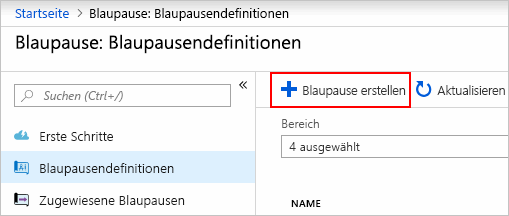
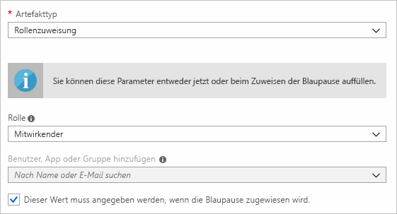
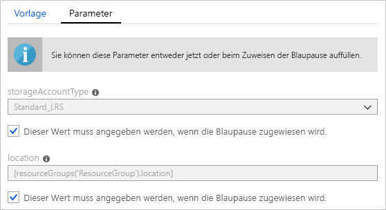
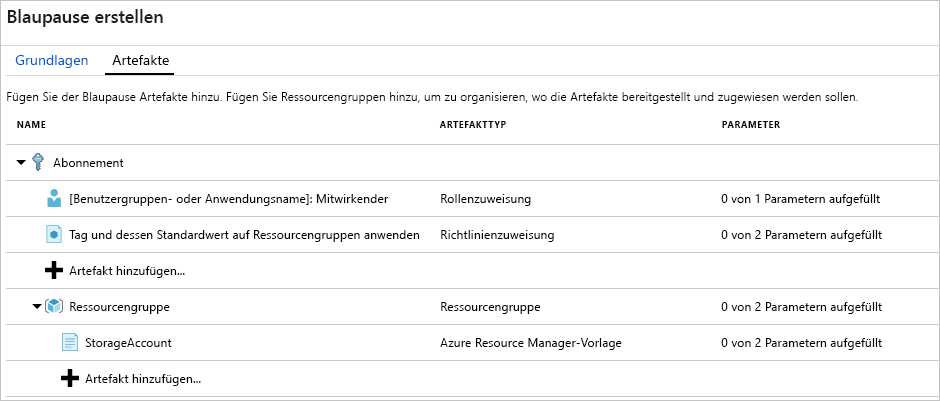
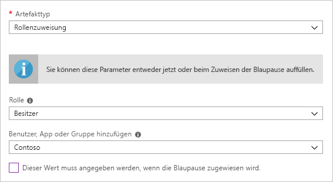
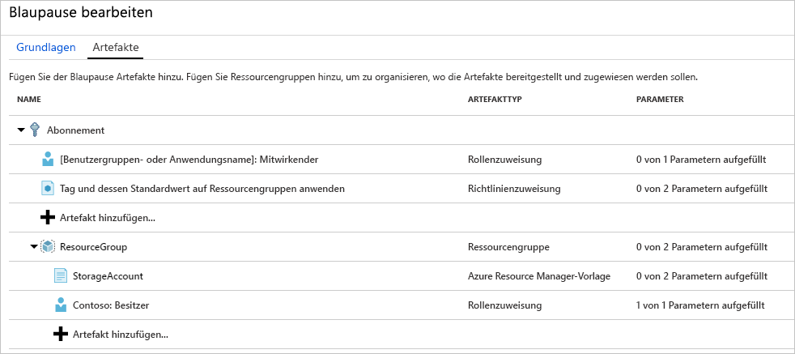
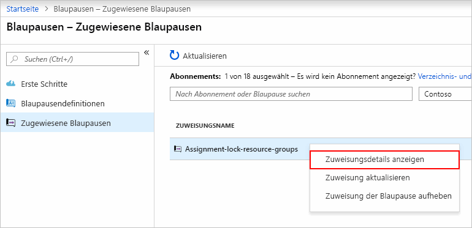

# <a name="define-and-assign-an-azure-blueprint-in-the-portal"></a>Definieren und Zuweisen einer Azure-Blaupause im Portal

Wenn Sie mit der Erstellung und Zuweisung von Blaupausen vertraut sind, können Sie allgemeine Muster definieren, um wiederverwendbare und schnell bereitstellbare Konfigurationen zu entwickeln, die auf Resource Manager-Vorlagen, Richtlinien, Sicherheit usw. basieren. In diesem Tutorial erfahren Sie, wie Sie mithilfe von Azure Blueprint einige allgemeine Aufgaben im Zusammenhang mit der organisationsweiten Erstellung, Veröffentlichung und Zuweisung einer Blaupause ausführen:

> [!div class="checklist"]
> - Erstellen einer neuen Blaupause und Hinzufügen verschiedener unterstützter Artefakte
> - Ändern einer vorhandenen Blaupause, die sich noch im **Entwurf** befindet
> - Markieren einer Blaupause als bereit für die Zuweisung mit **Veröffentlicht**
> - Zuweisen einer Blaupause zu einem vorhandenen Abonnement
> - Überprüfen von Status und Fortschritt einer zugewiesenen Blaupause
> - Entfernen einer Blaupause, die einem Abonnement zugewiesen wurde

Wenn Sie kein Azure-Abonnement besitzen, können Sie ein [kostenloses Konto](https://azure.microsoft.com/free) erstellen, bevor Sie beginnen.

## <a name="create-a-blueprint"></a>Erstellen einer Blaupause

Im ersten Schritt beim Definieren eines Standardmusters für die Konformität wird eine Blaupause aus den verfügbaren Ressourcen erstellt. In diesem Beispiel erstellen Sie eine neue Blaupause „MyBlueprint“, um Rollen- und Richtlinienzuweisungen für das Abonnement zu konfigurieren. Anschließend fügen Sie eine neue Ressourcengruppe hinzu und erstellen eine Resource Manager-Vorlage und eine Rollenzuweisung für die neue Ressourcengruppe.

1. Wählen Sie **Alle Dienste** im linken Bereich aus. Suchen Sie nach **Blaupausen**, und wählen Sie die Option aus.

1. Wählen Sie auf der linken Seite die Option**Blaupausendefinitionen**, und klicken Sie am oberen Rand der Seite auf die Schaltfläche **+ Blaupause erstellen**.

   - Klicken Sie alternativ auf **Erstellen** auf der Seite **Erste Schritte**, um direkt zum Erstellen einer Blaupause zu gehen.

   

1. Geben Sie einen **Blaupausennamen**, z. B. „MyBlueprint“ (Buchstaben und Zahlen – bis zu 48 Zeichen, aber keine Leerzeichen oder Sonderzeichen), für die Blaupause an, aber lassen Sie die **Blaupausenbeschreibung** vorerst leer. Klicken Sie im Feld **Speicherort der Definition** auf die Auslassungspunkte auf der rechten Seite, wählen Sie die [Verwaltungsgruppe](../management-groups/overview.md) oder das Abonnement aus, in der bzw. dem Sie die Blaupause speichern möchten, und klicken Sie auf **Auswählen**.

1. Überprüfen Sie, ob die Informationen korrekt sind (die Felder **Blaupausenname** und **Speicherort der Definition** können später nicht mehr geändert werden), und klicken Sie unten auf der Seite auf **Weiter: Artefakte** oder oben auf der Seite auf die Registerkarte **Artefakte**.

1. Fügen Sie unter „Abonnement“ die Rollenzuweisung hinzu: Klicken Sie unter **Abonnement** auf die Zeile **+ Artefakt hinzufügen...**. Daraufhin wird auf der rechten Seite des Browsers das Fenster „Artefakt hinzufügen“ angezeigt. Wählen Sie unter _Artefakttyp_ die Option „Rollenzuweisung“. Wählen Sie unter _Rolle_ die Option „Mitwirkender“, und behalten Sie für das Feld _Benutzer, App oder Gruppe hinzufügen_ mit dem Kontrollkästchen die Angabe **Dynamischer Parameter** bei. Klicken Sie auf **Hinzufügen**, um der Blaupause dieses Artefakt hinzuzufügen.

   

   > [!NOTE]
   > Die meisten _Artefakte_ unterstützen Parameter. Ein Parameter, dem während der Erstellung der Blaupause ein Wert zugewiesen wird, ist ein **statischer Parameter**. Wenn der Parameter während der Blaupausenzuweisung zugewiesen wird, ist er ein **dynamischer Parameter**. Weitere Informationen finden Sie unter [Blaupausenparameter](./concepts/parameters.md).

1. Fügen Sie unter „Abonnement“ die Richtlinienzuweisung hinzu: Klicken Sie unterhalb des Artefakts für die Rollenzuweisung auf die Zeile **+ Artefakt hinzufügen...**. Wählen Sie „Richtlinienzuweisung“ als _Artefakttyp_ aus. Ändern Sie _Typ_ in „Integriert“, und geben Sie in _Suche_ „Tag“ ein. Klicken Sie von _Suche_ aus, damit die Filterung ausgeführt wird. Wählen Sie „Tag und dessen Standardwert auf Ressourcengruppen anwenden“ aus, indem Sie darauf klicken. Klicken Sie auf **Hinzufügen**, um der Blaupause dieses Artefakt hinzuzufügen.

1. Klicken Sie auf die Zeile der Richtlinienzuweisung „Tag und dessen Standardwert auf Ressourcengruppen anwenden“. Das Fenster zum Bereitstellen von Parametern für das Artefakt als Teil der Blaupausendefinition wird geöffnet und ermöglicht das Festlegen der Parameter für alle Zuweisungen (**statische Parameter**) basierend auf dieser Blaupause statt bei der Zuordnung (**dynamische Parameter**). In diesem Beispiel werden bei der Blaupausenzuweisung **dynamische Parameter** verwendet. Behalten Sie daher die Standardwerte bei, und klicken Sie auf **Abbrechen**.

1. Fügen Sie unter „Abonnement“ die Ressourcengruppe hinzu: Klicken Sie auf die Zeile **+ Artefakt hinzufügen...** unter dem **Abonnement**. Wählen Sie unter _Artefakttyp_ die Option „Ressourcengruppe“. Lassen Sie die Felder _Anzeigename für Artefakt_, _Ressourcengruppenname_ und _Speicherort_ leer, aber stellen Sie sicher, dass die Kontrollkästchen aller Eigenschaften aktiviert sind, um sie zu **dynamischen Parametern** zu machen. Klicken Sie auf **Hinzufügen**, um der Blaupause dieses Artefakt hinzuzufügen.

1. Fügen Sie eine Vorlage unter der Ressourcengruppe hinzu: Klicken Sie auf **+ Artefakt hinzufügen...**. unterhalb des Eintrags **ResourceGroup**. Wählen Sie „Azure Resource Manager-Vorlage“ als _Artefakttyp_ aus, legen Sie für _Artefaktanzeigename_ „StorageAccount“ fest, und lassen Sie _Beschreibung_ leer. Fügen Sie auf der Registerkarte **Vorlage** im Editorfeld die folgende Resource Manager-Vorlage ein. Wählen Sie nach dem Einfügen der Vorlage die Registerkarte **Parameter**. Sie sehen, dass die Vorlagenparameter **storageAccountType** und **location** erkannt wurden. Jeder Parameter wurde automatisch erkannt und aufgefüllt, aber als **dynamischer Parameter** konfiguriert. Deaktivieren Sie das Kontrollkästchen **storageAccountType**, und beachten Sie, dass die Dropdownliste nur Werte enthält, die in der Resource Manager-Vorlage unter **allowedValues** enthalten sind. Aktivieren Sie das Kästchen, um es wieder auf einen **dynamischen Parameter** zurückzusetzen. Klicken Sie auf **Hinzufügen**, um der Blaupause dieses Artefakt hinzuzufügen.

   > [!IMPORTANT]
   > Wenn Sie die Vorlage importieren möchten, stellen Sie sicher, dass die Datei nur JSON-Code und keinen HTML-Code enthält. Wenn Sie auf eine URL in GitHub zeigen, stellen Sie sicher, dass Sie auf **RAW** geklickt haben, um die reine JSON-Datei und nicht die mit HTML umschlossene für die Anzeige auf GitHub zu erhalten. Wenn die importierte Vorlage kein reiner JSON-Code ist, tritt ein Fehler auf.

   ```json
   {
       "$schema": "https://schema.management.azure.com/schemas/2015-01-01/deploymentTemplate.json#",
       "contentVersion": "1.0.0.0",
       "parameters": {
           "storageAccountType": {
               "type": "string",
               "defaultValue": "Standard_LRS",
               "allowedValues": [
                   "Standard_LRS",
                   "Standard_GRS",
                   "Standard_ZRS",
                   "Premium_LRS"
               ],
               "metadata": {
                   "description": "Storage Account type"
               }
           },
           "location": {
               "type": "string",
               "defaultValue": "[resourceGroups('ResourceGroup').location]",
               "metadata": {
                   "description": "Location for all resources."
               }
           }
       },
       "variables": {
           "storageAccountName": "[concat('store', uniquestring(resourceGroup().id))]"
       },
       "resources": [{
           "type": "Microsoft.Storage/storageAccounts",
           "name": "[variables('storageAccountName')]",
           "location": "[parameters('location')]",
           "apiVersion": "2018-07-01",
           "sku": {
               "name": "[parameters('storageAccountType')]"
           },
           "kind": "StorageV2",
           "properties": {}
       }],
       "outputs": {
           "storageAccountName": {
               "type": "string",
               "value": "[variables('storageAccountName')]"
           }
       }
   }
   ```

   

1. Ihre abgeschlossene Blaupause sollte wie folgt aussehen. Beachten Sie, dass jedes Artefakt „_x_ von _y_ Parametern aufgefüllt“ unter der Spalte _Parameter_ aufweist. Die **dynamischen Parameter** werden jeweils beim Zuweisen der Blaupause festgelegt.

   

1. Nun, da alle geplanten Artefakte hinzugefügt wurden, klicken Sie am unteren Rand der Seite auf **Entwurf speichern**.

## <a name="edit-a-blueprint"></a>Bearbeiten einer Blaupause

In [Erstellen einer Blaupause](#create-a-blueprint) wurde weder eine Beschreibung angegeben noch die Rollenzuweisung zur neuen Ressourcengruppe hinzugefügt. Beides kann wie folgt behoben werden:

1. Wählen Sie auf der Seite links die Option **Blaupausendefinitionen**.

1. Klicken Sie in der Liste mit den Blaupausen mit der rechten Maustaste auf den zuvor von Ihnen erstellten Eintrag, und wählen Sie **Blaupause bearbeiten**.

1. Geben Sie in der **Blaupausenbeschreibung** einige Informationen über die Blaupause und die Artefakte an, aus denen sie besteht. Geben Sie in diesem Fall etwa Folgendes ein: „Diese Blaupause legt Richtlinien- und Rollenzuweisung für das Abonnement fest, erstellt eine Ressourcengruppe und stellt eine Ressourcenvorlage und Rollenzuweisung für diese Ressourcengruppe bereit.“

1. Klicken Sie unten auf der Seite auf **Weiter: Artefakte** oder oben auf der Seite auf die Registerkarte **Artefakte**.

1. Fügen Sie eine Rollenzuweisung unter der Ressourcengruppe hinzu: Klicken Sie auf die Zeile **+ Artefakt hinzufügen...** direkt unter dem Eintrag **Ressourcengruppe**. Wählen Sie unter _Artefakttyp_ die Option „Rollenzuweisung“. Wählen Sie unter _Rolle_ die Option „Besitzer“, und deaktivieren Sie das Kontrollkästchen _Benutzer, App oder Gruppe hinzufügen_. Suchen Sie nach einem Benutzer, einer App oder Gruppe zum Hinzufügen, und wählen Sie ihn bzw. sie aus. Dieses Artefakt verwendet einen **statischen Parameter**, der in jeder Zuordnung dieser Blaupause auf den gleichen Wert festgelegt wird. Klicken Sie auf **Hinzufügen**, um der Blaupause dieses Artefakt hinzuzufügen.

   

1. Ihre abgeschlossene Blaupause sollte wie folgt aussehen. Beachten Sie, dass die neu hinzugefügte Rollenzuweisung **1 von 1 Parameter aufgefüllt** aufweist, also ein **statischer-Parameter** ist.

   

1. Klicken Sie auf **Entwurf speichern**, da sie nun aktualisiert wurde.

## <a name="publish-a-blueprint"></a>Veröffentlichen einer Blaupause

Nach dem Hinzufügen der geplanten Artefakte kann die Blaupause veröffentlicht werden.
Durch die Veröffentlichung kann sie einem Abonnement zugewiesen werden.

1. Wählen Sie auf der Seite links die Option **Blaupausendefinitionen**.

1. Klicken Sie in der Liste mit den Blaupausen mit der rechten Maustaste auf den zuvor von Ihnen erstellten Eintrag, und wählen Sie **Blaupause veröffentlichen**.

1. Geben Sie im daraufhin angezeigten Dialogfeld eine **Version** (Buchstaben, Zahlen und Bindestriche mit einer maximalen Länge von 20 Zeichen – beispielsweise „v1“) und **Änderungshinweise** (optional – beispielsweise „Erste Veröffentlichung“) ein.

1. Klicken Sie unten auf der Seite auf **Veröffentlichen**.

## <a name="assign-a-blueprint"></a>Zuweisen einer Blaupause

Nach dem Veröffentlichen einer Blaupause kann sie einem Abonnement zugewiesen werden. Weisen Sie die erstellte Blaupause einem der Abonnements unter Ihrer Verwaltungsgruppenhierarchie zu. Wenn die Blaupause in einem Abonnement gespeichert wird, kann sie nur diesem Abonnement zugewiesen werden.

1. Wählen Sie auf der Seite links die Option **Blaupausendefinitionen**.

1. Klicken Sie in der Liste mit den Blaupausen mit der rechten Maustaste auf den zuvor von Ihnen erstellten Eintrag (oder wählen Sie die Auslassungspunkte), und wählen Sie **Blaupause zuweisen**.

1. Wählen Sie auf der Seite **Blaupause zuweisen** die Abonnements, für die Sie diese Blaupause bereitstellen möchten, in der Dropdownliste **Abonnement** aus.

   - Falls unterstützte Enterprise-Angebote der [Azure-Abrechnungsverwaltung](../../billing/index.md) vorhanden sind, wird unter dem Feld **Abonnement** der Link **Neu erstellen** aktiviert.

     1. Wählen Sie den Link **Neu erstellen**, um ein neues Abonnement zu erstellen (anstatt ein vorhandenes auszuwählen).

        

     1. Geben Sie einen **Anzeigenamen** für das neue Abonnement an.

     1. Wählen Sie in der Dropdownliste das verfügbare **Angebot** aus.

     1. Verwenden Sie die Auslassungspunkte zum Auswählen der [Verwaltungsgruppe](../management-groups/index.md), der das Abonnement untergeordnet werden soll.

     1. Wählen Sie am unteren Rand der Seite die Option **Erstellen**.

     > [!IMPORTANT]
     > Das neue Abonnement wird sofort erstellt, nachdem Sie **Erstellen** gewählt haben.

   > [!NOTE]
   > Eine Zuweisung wird für jedes ausgewählte Abonnement erstellt, sodass zu einem späteren Zeitpunkt Änderungen an einer einzelnen Abonnementzuweisung vorgenommen werden können, ohne dass dadurch Änderungen am Rest der ausgewählten Abonnements erzwungen werden.

1. Geben Sie für **Zuweisungsname** einen eindeutigen Namen an.

1. Wählen Sie unter **Standort** eine Region aus, in der die verwaltete Identität und das Abonnementbereitstellungsobjekt erstellt werden sollen. Azure Blueprint verwendet diese verwaltete Identität zum Bereitstellen aller Artefakte in der zugewiesenen Blaupause. Weitere Informationen finden Sie unter [Was sind verwaltete Identitäten für Azure-Ressourcen?](../../active-directory/managed-identities-azure-resources/overview.md).

1. Behalten Sie in der Dropdownliste **Version der Blaupausendefinition** für Versionen vom Typ **Veröffentlicht** den Eintrag „v1“ bei. (Standardmäßig wird die neueste Version vom Typ **Veröffentlicht** verwendet.)

1. Behalten Sie für **Zuweisung der Sperre** den Standardwert **Nicht sperren** bei. Weitere Informationen finden Sie unter [Grundlegendes zur Ressourcensperre in Azure Blueprint](./concepts/resource-locking.md).

   

1. Behalten Sie unter **Verwaltete Identität** die Standardeinstellung **Vom System zugewiesen** bei.

1. Suchen Sie für die Rollenzuweisung auf Abonnementebene **[Benutzergruppen- oder Anwendungsname]: Mitwirkender** nach einem Benutzer, einer App oder einer Gruppe, und wählen Sie diese(n) aus.

1. Legen Sie für die Rollenzuweisung auf Abonnementebene **Tagnamen** auf „CostCenter“ und **Tagwert** auf „ContosoIT“ fest.

1. Geben Sie für „ResourceGroup“ den **Namen** „StorageAccount“ und den **Speicherort** „USA, Osten 2“ aus der Dropdownliste ein.

   > [!NOTE]
   > Jedes Artefakt, das im Rahmen der Blaupausendefinition unter der Ressourcengruppe hinzugefügt wurde, wird eingerückt und an der Ressourcengruppe oder dem Objekt ausgerichtet, mit der bzw. dem es bereitgestellt werden soll. Artefakte, die entweder keine Parameter verwenden oder für die bei der Zuweisung keine Parameter definiert werden, werden lediglich als Kontextinformationen aufgelistet.

1. Wählen Sie auf der Azure Resource Manager-Vorlage „StorageAccount“ „Standard_GRS“ für den **storageAccountType**-Parameter aus.

1. Lesen Sie das Informationenfeld am unteren Rand der Seite, und klicken Sie dann auf **Zuweisen**.

## <a name="track-deployment-of-a-blueprint"></a>Nachverfolgen der Bereitstellung einer Blaupause

Wenn mindestens einem Abonnement eine Blaupause zugewiesen wurde, passieren zwei Dinge:

- Die Blaupause wird der Seite **Zugewiesene Blaupausen** pro zugewiesenem Abonnement hinzugefügt.
- Der Prozess der Bereitstellung aller von der Blaupause definierten Artefakte beginnt.

Nun, da die Blaupause einem Abonnement zugewiesen wurde, überprüfen Sie den Status der Bereitstellung.

1. Wählen Sie auf der Seite links **Zugewiesene Blaupausen**.

1. Klicken Sie in der Liste der Blaupausen mit der rechten Maustaste auf die zuvor von Ihnen zugewiesene Blaupause, und wählen Sie **Zuweisungsdetails anzeigen**.

   

1. Überprüfen Sie auf der Seite **Blaupausenzuweisung**, ob alle Artefakte erfolgreich bereitgestellt wurden und während der Bereitstellung keine Fehler aufgetreten sind. Sollten Fehler aufgetreten sein, ermitteln Sie anhand der Schritte unter [Problembehandlung mit Azure Blueprints](./troubleshoot/general.md), was nicht funktioniert hat.

## <a name="unassign-a-blueprint"></a>Aufheben der Zuweisung einer Blaupause

Entfernen Sie eine Blaupausenzuweisung aus einem Abonnement, wenn Sie sie nicht mehr benötigen. Möglicherweise wurde die Blaupause durch eine neuere Blaupause mit aktualisierten Mustern, Richtlinien und Entwürfen ersetzt. Wenn eine Blaupause entfernt wird, werden die als Teil der Blaupause zugewiesenen Artefakte beibehalten. Gehen Sie zum Entfernen einer Blaupausenzuweisung wie folgt vor:

1. Wählen Sie auf der Seite links die Option **Zugewiesene Blaupausen**.

1. Wählen Sie in der Liste mit den Blaupausen den Eintrag aus, für den die Zuweisung aufgehoben werden soll, und klicken Sie dann am oberen Rand der Seite auf die Schaltfläche **Zuweisung der Blaupause aufheben**.

1. Lesen Sie die Bestätigungsmeldung, und klicken Sie auf **OK**.

## <a name="delete-a-blueprint"></a>Löschen einer Blaupause

1. Wählen Sie auf der Seite links die Option **Blaupausendefinitionen**.

1. Klicken Sie mit der rechten Maustaste auf die Blaupause, die Sie löschen möchten, wählen Sie **Blaupause löschen**, und klicken Sie dann im Bestätigungsdialogfeld auf **Ja**.

> [!NOTE]
> Wenn eine Blaupause auf diese Weise gelöscht wird, werden auch alle **veröffentlichten Versionen** der ausgewählten Blaupause gelöscht. Um eine einzelne Version zu löschen, öffnen Sie die Blaupause, klicken Sie auf die Registerkarte **Veröffentlichte Versionen**, wählen Sie die zu löschende Version aus, klicken Sie darauf und dann auf **Diese Version löschen**. Darüber hinaus kann eine Blaupause mit Zuweisungen erst gelöscht werden, wenn alle diese Blaupausenzuweisungen gelöscht wurden.

## <a name="next-steps"></a>Nächste Schritte

- Erfahren Sie mehr über den [Lebenszyklus von Blaupausen](./concepts/lifecycle.md).
- Machen Sie sich mit der Verwendung [statischer und dynamischer Parameter](./concepts/parameters.md) vertraut.
- Erfahren Sie, wie Sie die [Abfolge von Blaupausen](./concepts/sequencing-order.md) anpassen können.
- Erfahren Sie, wie Sie [Ressourcen in Blaupausen sperren](./concepts/resource-locking.md) können.
- Lernen Sie, wie Sie [vorhandene Zuweisungen aktualisieren](./how-to/update-existing-assignments.md).
- Beheben Sie Probleme bei der Blaupausenzuweisung mithilfe des [allgemeinen Leitfadens zur Problembehandlung](./troubleshoot/general.md).