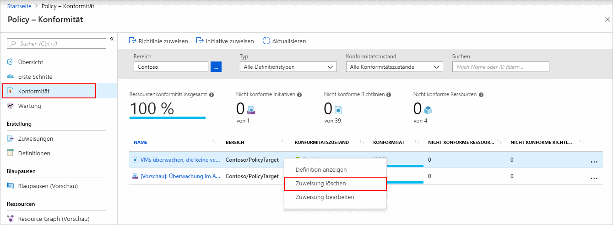

# Schnellstart: Erstellen einer Richtlinienzuweisung zum Identifizieren von nicht konformen Ressourcen mit einer Resource Manager-Vorlage

Zum Verständnis der Konformität in Azure müssen Sie zunächst wissen, wie Sie den Status Ihrer Ressourcen ermitteln.
Diese Schnellstartanleitung führt Sie schrittweise durch die Erstellung einer Richtlinienzuweisung zur Identifizierung von virtuellen Computern, die keine verwalteten Datenträger verwenden.

Am Ende dieses Prozesses können Sie erfolgreich virtuelle Computer identifizieren, die keine verwalteten Datenträger verwenden. Sie sind mit der Richtlinienzuweisung *nicht konform*.

Wenn Sie kein Azure-Abonnement besitzen, können Sie ein [kostenloses Konto](https://azure.microsoft.com/free/) erstellen, bevor Sie beginnen.

## Erstellen einer Richtlinienzuweisung

In dieser Schnellstartanleitung erstellen Sie eine Richtlinienzuweisung und weisen eine integrierte Richtliniendefinition mit dem Namen *Virtuelle Computer überwachen, die keine verwalteten Datenträger verwenden* zu. Eine Liste mit einem Teil der verfügbaren integrierten Richtlinien finden Sie unter [Azure Policy-Beispiele](./samples/index.md).

Es gibt mehrere Methoden zum Erstellen von Richtlinienzuweisungen. In dieser Schnellstartanleitung verwenden Sie eine [Schnellstartvorlage](https://azure.microsoft.com/resources/templates/101-azurepolicy-assign-builtinpolicy-resourcegroup/).
Hier ist eine Kopie der Vorlage angegeben:

[!code-json[policy-assignment](~/quickstart-templates/101-azurepolicy-assign-builtinpolicy-resourcegroup/azuredeploy.json)]

> [!NOTE]
> Der Azure Policy-Dienst ist kostenlos.  Weitere Informationen finden Sie in der [Übersicht über Azure Policy](./overview.md).

1. Wählen Sie die folgende Abbildung aus, um sich am Azure-Portal anzumelden und die Vorlage zu öffnen:

   

1. Wählen Sie die folgenden Werte aus, bzw. geben Sie sie ein:

   | NAME | Wert |
   |------|-------|
   | Subscription | Wählen Sie Ihr Azure-Abonnement. |
   | Resource group | Wählen Sie **Neu erstellen**, geben Sie einen Namen an, und wählen Sie dann **OK**. Im Screenshot lautet der Name der Ressourcengruppe *mypolicyquickstart\<Datum in MMTT>rg*. |
   | Location | Wählen Sie eine Region aus. Beispiel: **USA, Mitte**. |
   | Name der Richtlinienzuweisung | Geben Sie einen Namen für die Richtlinienzuweisung an. Bei Bedarf können Sie die Anzeige für die Richtliniendefinitionen verwenden. Beispiel: **Virtuelle Computer überwachen, die keine verwalteten Datenträger verwenden**. |
   | Ressourcengruppenname | Geben Sie den Namen einer Ressourcengruppe an, der Sie die Richtlinie zuweisen möchten. In dieser Schnellstartanleitung verwenden Sie den Standardwert **[resourceGroup().name]** . **[resourceGroup()](../../azure-resource-manager/resource-group-template-functions-resource.md#resourcegroup)** ist eine Vorlagenfunktion, mit der die Ressourcengruppe abgerufen wird. |
   | Richtliniendefinitions-ID | Geben Sie **/providers/Microsoft.Authorization/policyDefinitions/0a914e76-4921-4c19-b460-a2d36003525a** an. |
   | Ich stimme den oben genannten Geschäftsbedingungen zu | (Auswählen) |

1. Wählen Sie die Option **Kaufen**.

Einige zusätzliche Ressourcen:

- Weitere Beispielvorlagen finden Sie unter [Azure-Schnellstartvorlage](https://azure.microsoft.com/resources/templates/?resourceType=Microsoft.Authorization&pageNumber=1&sort=Popular).
- Navigieren Sie zur [Azure-Vorlagenreferenz](/azure/templates/microsoft.authorization/allversions), um die Vorlagenreferenz anzuzeigen.
- Informationen zur Entwicklung von Resource Manager-Vorlagen finden Sie in der [Azure Resource Manager-Dokumentation](/azure/azure-resource-manager/).
- Informationen zur Bereitstellung auf Abonnementebene finden Sie unter [Erstellen von Ressourcengruppen und Ressourcen auf Abonnementebene](../../azure-resource-manager/deploy-to-subscription.md).

## Identifizieren nicht konformer Ressourcen

Wählen Sie links auf der Seite die Option **Konformität** aus. Suchen Sie dann die von Ihnen erstellte Richtlinienzuweisung **Überwachen Sie die virtuellen Computer, die nicht verwaltete Datenträger verwenden**.

Falls Ressourcen vorhanden sind, die mit dieser neuen Zuweisung nicht konform sind, werden diese unter **Nicht konforme Ressourcen** angezeigt.

Weitere Informationen finden Sie unter [Funktionsweise der Konformität](./how-to/get-compliance-data.md#how-compliance-works).

## Bereinigen von Ressourcen

Um die erstellte Zuweisung zu entfernen, gehen Sie folgendermaßen vor:

1. Wählen Sie links auf der Seite „Azure Policy“ **Konformität** (oder **Zuweisungen**), und suchen Sie die von Ihnen erstellte Richtlinienzuweisung **Überwachen Sie die virtuellen Computer, die nicht verwaltete Datenträger verwenden**.

1. Klicken Sie mit der rechten Maustaste auf die Richtlinienzuweisung **Virtuelle Computer überwachen, die keine verwalteten Datenträger verwenden**, und wählen Sie **Zuweisung löschen**.

   

## Nächste Schritte

In dieser Schnellstartanleitung haben Sie einem Bereich eine integrierte Richtliniendefinition zugewiesen und deren Konformitätsbericht ausgewertet. Die Richtliniendefinition überprüft, ob alle Ressourcen im Bereich konform sind, und identifiziert die Ressourcen, die nicht konform sind.

Weitere Informationen zum Zuweisen von Richtlinien, die die Konformität neuer Ressourcen überprüfen, finden Sie im folgenden Tutorial:

> [!div class="nextstepaction"]
> [Erstellen und Verwalten von Richtlinien](./tutorials/create-and-manage.md)