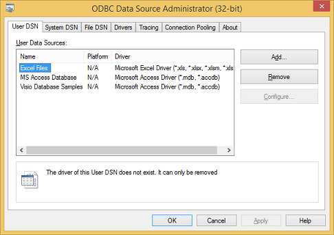
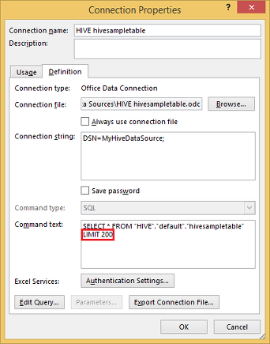

<properties linkid="manage-services-hdinsight-connect-excel-with-hive-ODBC" urlDisplayName="Connect Excel to HDInsight" pageTitle="Connect Excel to HDInsight with the Hive ODBC Driver | Azure" metaKeywords="" description="Learn how to set up and use the Microsoft Hive ODBC driver for Excel to query data in an HDInsight cluster." metaCanonical="" services="hdinsight" documentationCenter="" title="Connect Excel to HDInsight with the Microsoft Hive ODBC Driver" authors="bradsev" solutions="" manager="paulettm" editor="cgronlun" />

Verbinden von Excel über den Microsoft Hive ODBC Driver mit HDInsight
=====================================================================

Eine wichtige Funktion der Big Data-Lösung von Microsoft ist die Integration von Microsoft Business Intelligence (BI)-Komponenten in Apache Hadoop-Cluster, die über Azure HDInsight bereitgestellt werden. Ein Beispiel für diese Integration ist die Möglichkeit, Excel mit dem Hive-Data Warehouse eines HDInsight Hadoop-Clusters über den Microsoft Hive Open Database Connectivity (ODBC) Driver zu verbinden.

Es ist ebenfalls möglich, die zu einem HDInsight-Cluster gehörigen Daten und andere Datenquellen, einschließlich anderer Hadoop-Cluster (nicht aus HDInsight), zu verbinden. Hierbei verwenden Sie in Excel das Add-In Microsoft Power Query für Excel. Informationen zur Installation und Verwendung von Power Query finden Sie unter [Connect Excel to HDInsight with Power Query](/de-de/documentation/articles/hdinsight-connect-excel-power-query/) (Verbinden von Excel und HDInsight mit Power Query, in englischer Sprache).

**Voraussetzungen**:

Bevor Sie mit diesem Lernprogramm beginnen können, benötigen Sie Folgendes:

-   Einen HDInsight-Cluster Hinweise zu dessen Konfiguration finden Sie unter [Erste Schritte mit Azure HDInsight](/de-de/documentation/articles/hdinsight-get-started/).
-   Einen Computer, auf dem Windows 8, Windows 7, Windows Server 2012 oder Windows Server 2008 R2 läuft.
-   Office 2013 Professional Plus, Office 365 Pro Plus, Excel 2013 Standalone oder Office 2010 Professional Plus.

Themen in diesem Artikel
------------------------

1.  [Installieren des Microsoft Hive ODBC Driver](#InstallHiveODBCDriver)
2.  [Erstellen einer ODBC-Datenquelle](#CreateHiveODBCDataSource)
3.  [Importieren von Daten aus einem HDInsight-Cluster in Excel](#ImportData)
4.  [Nächste Schritte](#nextsteps)

Installieren des Microsoft Hive ODBC Driver
-------------------------------------------

Laden Sie aus dem [Download Center](http://go.microsoft.com/fwlink/?LinkID=286698) den Microsoft Hive ODBC Driver herunter, und installieren Sie diesen.

Dieser Treiber kann unter 32- oder 64-Bit-Versionen von Windows 7, Windows 8, Windows Server 2008 R2 und Windows Server 2012 installiert werden und erlaubt eine Verbindung zu Azure HDInsight (Version 1.6 und höher) und Azure HDInsight Emulator (Version 1.0.0.0 und höher). Installieren Sie die Version, die der Version der Anwendung entspricht, in der Sie den ODBC-Treiber verwenden. In diesem Lernprogramm wird der Treiber aus Office Excel verwendet.

Erstellen einer ODBC-Datenquelle
--------------------------------

Die folgenden Schritte zeigen Ihnen, wie Sie eine Hive-ODBC-Datenquelle erstellen können.

1.  Drücken Sie unter Windows 8 die Windows-Taste, um den Startbildschirm zu öffnen, und geben Sie dann **Datenquellen** ein.
2.  Klicken Sie auf **ODBC-Datenquellen einrichten (32-Bit)** oder **ODBC-Datenquellen einrichten (64-Bit)**, je nach verwendeter Office-Version. Wenn Sie Windows 7 verwenden, wählen Sie aus **Verwaltung** **ODBC-Datenquellen (32-Bit)** oder **ODBC-Datenquellen (64-Bit)** aus. Hierdurch wird das Dialogfeld **ODBC-Datenquellen-Administrator** aufgerufen.

    

3.  Klicken Sie aus Benutzer-DNS auf **Hinzufügen**, um den Assistenten **Neue Datenquelle erstellen** zu öffnen.
4.  Wählen Sie **Microsoft Hive ODBC Driver**, und klicken Sie dann auf **Fertig stellen**. Hierdurch wird das Dialogfeld **Microsoft Hive ODBC Driver DNS Setup** geöffnet.

5.  Geben Sie folgende Werte ein bzw. wählen Sie diese aus:

    <table data-morhtml="true" border="1">
		<tr data-morhtml="true">
			<td data-morhtml="true"><strong data-morhtml="true">Eigenschaft</strong></td>
			<td data-morhtml="true"><strong data-morhtml="true">Beschreibung</strong></td>
		</tr>
		<tr data-morhtml="true">
			<td data-morhtml="true">Name der Datenquelle</td>
			<td data-morhtml="true">Geben Sie einen Namen f&uuml;r die Datenquelle an.</td>
		</tr>
		<tr data-morhtml="true">
			<td data-morhtml="true">Host</td>
			<td data-morhtml="true">Geben Sie <hdinsightclustername data-morhtml="true">.azurehdinsight.net ein. Beispiel: myHDICluster.azurehdinsight.net</td>
		</tr>
		<tr data-morhtml="true">
			<td data-morhtml="true">Port</td>
			<td data-morhtml="true">Verwenden Sie <strong data-morhtml="true">443</strong>. (Dieser Port wurde von 563 zu 443 ge&auml;ndert.)</td>
		</tr>
		<tr data-morhtml="true">
			<td data-morhtml="true">Datenbank</td>
			<td data-morhtml="true">Verwenden Sie <strong data-morhtml="true">Standard</strong>.</td>
		</tr>
		<tr data-morhtml="true">
			<td data-morhtml="true">Hive-Servertyp</td>
			<td data-morhtml="true">W&auml;hlen Sie <strong data-morhtml="true">Hive Server 2</strong></td>
		</tr>
		<tr data-morhtml="true">
			<td data-morhtml="true">Mechanismus</td>
			<td data-morhtml="true">W&auml;hlen Sie <strong data-morhtml="true">Azure HDInsight Service.</strong></td>
		</tr>
		<tr data-morhtml="true">
			<td data-morhtml="true">HTTP-Pfad</td>
			<td data-morhtml="true">Lassen Sie dieses Feld leer.</td>
		</tr>
		<tr data-morhtml="true">
			<td data-morhtml="true">Benutzername</td>
			<td data-morhtml="true">Geben Sie Ihren Benutzernamen f&uuml;r den HDInsight-Cluster an. Es handelt sich hierbei um den Benutzernamen, der beim Bereitstellungsprozess des Clusters erstellt wurde. Wenn Sie die Schnellerfassungsoption gew&auml;hlt haben, lautet der standardm&auml;&szlig;ige Benutzername <strong data-morhtml="true">Admin</strong>.</td>
		</tr>
		<tr data-morhtml="true">
			<td data-morhtml="true">Kennwort</td>
			<td data-morhtml="true">Geben Sie Ihr Benutzerkennwort f&uuml;r den HDInsight-Cluster an.</td>
		</tr>
	</table>

    Sie müssen einige wichtige Parameter berücksichtigen, wenn Sie auf "Erweiterte Optionen" klicken:

    <table data-morhtml="true" border="1">
		<tr data-morhtml="true">
			<td data-morhtml="true">Use Native Query</td>
			<td data-morhtml="true">Wenn diese Option ausgew&auml;hlt ist, versucht der ODBC-Treiber NICHT, TSQL in HiveQL zu konvertieren. Verwenden Sie diese Option nur, wenn Sie sich absolut sicher sind, dass Sie reine HiveQL-Anweisungen absenden. Wenn Sie eine Verbindung zu SQL Server oder Azure SQL Database herstellen, sollten Sie die Option nicht aktivieren.</td>
		</tr>
		<tr data-morhtml="true">
			<td data-morhtml="true">Rows fetched per block</td>
			<td data-morhtml="true">Wenn Sie viele Datens&auml;tze abrufen, ist es m&ouml;glicherweise erforderlich, diesen Parameter zu optimieren, um optimale Leistung zu garantieren.</td>
		</tr>
		<tr data-morhtml="true">	
			<td data-morhtml="true">Default string column length,   Binary column length,   Decimal column scale</td>
			<td data-morhtml="true">L&auml;ngen und Genauigkeiten der Datentypen k&ouml;nnen beeinflussen, wie die Daten zur&uuml;ckgegeben werden. Bei zu geringer Genauigkeit und/oder Abschneiden werden falsche Informationen zur&uuml;ckgegeben.</td>
		</tr>
	</table>

    ![Advanced options][img-HiveOdbc-DataSource-AdvancedOptions]

6.  Klicken Sie auf **Test**, um die Datenquelle zu testen. Wenn die Datenquelle korrekt konfiguriert wurde, wird *TESTS ERFOLGREICH ABGESCHLOSSEN.* angezeigt.
7.  Klicken Sie auf **OK**, um den Testdialog zu schließen. Die neue Datenquelle sollte jetzt im **ODBC-Datenquellen-Administrator** aufgeführt werden.
8.  Klicken Sie auf **OK**, um den Assistenten zu beenden.

Importieren von Daten aus einem HDInsight-Cluster in Excel
----------------------------------------------------------

In den folgenden Schritten wird beschrieben, wie Sie mithilfe der ODBC-Datenquelle, die Sie in den vorangegangenen Schritten erstellt haben, Daten aus einer Hive-Tabelle in eine Excel-Arbeitsmappe importieren.

1.  Öffnen Sie eine neue oder bereits vorhandene Arbeitsmappe in Excel.
2.  Klicken Sie in der Registerkarte **Daten** auf die Kachel **Externe Daten abrufen**. Klicken Sie auf **Aus anderen Quellen**, und klicken Sie dann auf **Vom Datenverbindungs-Assistenten**, um den **Datenverbindungs-Assistenten** zu starten.

    

3.  Wählen Sie als Datenquelle **ODBC DSN** aus, und klicken Sie dann auf **Weiter**.
4.  Wählen Sie aus den ODBC-Datenquellen den Datenquellnamen aus, den Sie im vorherigen Schritt erstellt haben, und klicken Sie auf **Weiter**.
5.  Geben Sie im Assistenten erneut das Kennwort für den Cluster ein, und klicken Sie dann auf **Test**, um die Konfiguration zu prüfen.
6.  Klicken Sie auf **OK**, um den Testdialog zu schließen.
7.  Klicken Sie auf **OK**. Warten Sie, bis sich der Dialog **Datenbank und Tabelle wählen** öffnet. Dies kann einige Zeit dauern.
8.  Wählen Sie die Tabelle, die Sie importieren möchten, und klicken Sie dann auf **Weiter**. Die Tabelle *hivesampletable* ist eine Beispieltabelle, die in HDInsight-Clustern enthalten ist. Sie können sie auswählen, wenn Sie noch keine Tabelle erstellt haben. Weitere Informationen zum Ausführen von Hive-Abfragen und Erstellen von Hive-Tabellen finden Sie unter [Use Hive with HDInsight](/de-de/documentation/articles/hdinsight-use-hive/) (Verwenden von Hive mit HDInsight, in englischer Sprache).
9.  Klicken Sie auf **Fertig stellen**.
10. Im Dialog **Daten importieren** können Sie die Abfrage ändern oder spezifizieren. Klicken Sie hierfür auf **Eigenschaften**. Dies kann einige Zeit dauern.
11. Klicken Sie auf die Registerkarte **Definition**, und fügen Sie dann **LIMIT 200** zur Hive-SELECT-Anweisung im Textfeld **Befehlstext** hinzu. Diese Modifikation begrenzt die zurückgegebenen Datensätze auf 200.

    

12. Klicken Sie auf **OK**, um den Dialog Verbindungseigenschaften zu schließen.
13. Klicken Sie auf **OK**, um den Dialog **Daten importieren** zu schließen.
14. Geben Sie das Kennwort erneut ein, und klicken Sie dann auf **OK**. Es dauert einige Zeit, bis die Daten in Excel importiert werden.

Nächste Schritte
----------------

In diesem Artikel haben Sie erfahren, wie Sie den Microsoft Hive ODBC-Treiber verwenden, um Daten aus dem HDInsight-Dienst nach Excel zu übertragen. Ebenso können Sie Daten aus dem HDInsight-Dienst in eine SQL-Datenbank übertragen. Es ist außerdem möglich, Daten in einen HDInsight-Dienst hochzuladen. Weitere Informationen finden Sie unter:

-   [Analyze flight delay data using HDInsight (Analysieren von Daten zu Flugverspätungen mithilfe von HDInsight, in englischer Sprache)](/de-de/documentation/articles/hdinsight-analyze-flight-delay-data/)
-   [Upload data to HDInsight (Hochladen von Daten zu HDInsight, in englischer Sprache)](/de-de/documentation/articles/hdinsight-upload-data/)
-   [Use Sqoop with HDInsight (Verwenden von Sqoop mit HDInsight, in englischer Sprache)](../hdinsight-use-sqoop/)

[hdinsight-sqoop]: ../hdinsight-use-sqoop/
[hdinsight-analyze-flight-delay-data]: /de-de/documentation/articles/hdinsight-analyze-flight-delay-data/
[hdinsight-hive]: /de-de/documentation/articles/hdinsight-use-hive/
[hdinsight-upload-data]: /de-de/documentation/articles/hdinsight-upload-data/
[hdinsight-power-query]: /de-de/documentation/articles/hdinsight-connect-excel-power-query/
[hdinsight-get-started]: /de-de/documentation/articles/hdinsight-get-started/

[hive-odbc-driver-download]: http://go.microsoft.com/fwlink/?LinkID=286698

[img-hdi-simbahiveodbc-datasource-admin]: ./media/hdinsight-connect-excel-hive-ODBC-driver/HDI.SimbaHiveOdbc.DataSourceAdmin1.png 
[img-HiveOdbc-DataSource-AdvancedOptions]: ./media/hdinsight-connect-excel-hive-ODBC-driver/HDI.HiveOdbc.DataSource.AdvancedOptions1.png 
[img-hdi-simbahiveodbc-excel-connectionproperties]: ./media/hdinsight-connect-excel-hive-ODBC-driver/HDI.SimbaHiveODBC.Excel.ConnectionProperties1.png 
[img-hdi-simbahiveodbc.excel.dataconnection]: ./media/hdinsight-connect-excel-hive-ODBC-driver/HDI.SimbaHiveOdbc.Excel.DataConnection1.png 
