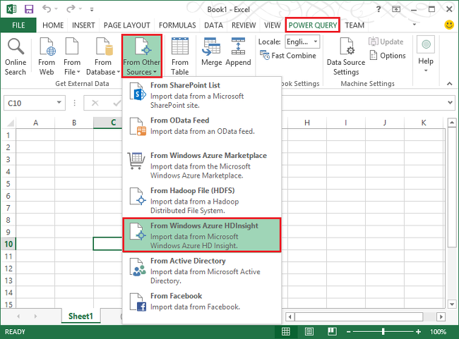

<properties linkid="manage-services-hdinsight-connect-excel-with-power-query" urlDisplayName="HDInsight and Excel" pageTitle="Connect Excel to HDInsight with Power Query | Azure" metaKeywords="hdinsight, excel, data explorer, hive excel, hdinsight excel, power query" description="Learn how to take advantage of business intelligence components and use Excel to access data stored in Azure HDInsight using Power Query." metaCanonical="" services="hdinsight" documentationCenter="" title="Connect Excel to Azure HDInsight with Power Query" authors="bradsev" solutions="" manager="paulettm" editor="cgronlun" />

Verbinden von Excel mit HDInsight über Power Query
==================================================

Ein Schlüsselmerkmal der Microsoft-Lösung für große Datenmengen ist die Integration von Microsoft Business Intelligence (BI)-Komponenten mit HDInsight Hadoop-Clustern. Ein wichtiges Beispiel für diese Integration ist die Möglichkeit, Excel mithilfe von Microsoft Power Query mit dem Azure-Speicherkonto zu verbinden, in dem die Daten für Ihr HDInsight-Cluster gespeichert werden. Dieser Artikel beschreibt die Einrichtung und Verwendung von Power Query in Excel für die Abfrage von Daten aus einem HDInsight-Cluster.

**Voraussetzungen**

Bevor Sie mit diesem Lernprogramm beginnen können, benötigen Sie Folgendes:

-   Ein HDInsight-Cluster. Hinweise zu dessen Konfiguration finden Sie unter [Erste Schritte mit Azure HDInsight](/en-us/documentation/articles/hdinsight-get-started/).
-   Einen Computer, auf dem Windows 8, Windows 7, Windows Server 2012 oder Windows Server 2008 R2 läuft.
-   Office 2013 Professional Plus, Office 365 Pro Plus, Excel 2013 Standalone oder Office 2010 Professional Plus.

Themen in diesem Artikel
------------------------

-   [Installieren von Microsoft Power Query für Excel](#InstallPowerQuery)
-   [Importieren von Daten in Excel](#ImportData)
-   [Nächste Schritte](#NextSteps)

Installieren von Microsoft Power Query für Excel
------------------------------------------------

Power Query kann zum Importieren von Daten aus verschiedensten Quellen in Excel verwendet werden, um diese in Business Intelligence (BI)-Tools wie PowerPivot und Power View zu verwenden. Insbesondere Power Query kann Daten importieren, die von einer Hadoop-Aufgabe in einem HDInsight-Cluster ausgegeben bzw. generiert wurden.

Laden Sie Microsoft Power Query für Excel aus dem [Microsoft Download Center](http://go.microsoft.com/fwlink/?LinkID=286689) herunter und installieren Sie es.

Importieren von HDInsight-Daten in Excel
----------------------------------------

Das Power Query-Add-In für Excel erleichtert den Import von Daten aus Ihrem HDInsight-Cluster in Excel. Business Intelligence-Tools wie z. B. PowerPivot und Power Map dienen zur Inspektion, Analyse und Darstellung der Daten.

**Importieren von Daten aus einem HDInsight-Cluster**

1.  Öffnen Sie Excel.

2.  Erstellen Sie eine neue leere Arbeitsmappe.

3.  Klicken Sie auf das Menü **Power Query**, klicken Sie auf **Von anderen Quellen**, und anschließend auf **Von Azure HDInsight**.

    

    Hinweis: Falls das **Power Query**-Menü nicht angezeigt wird, öffnen Sie **Datei** \> **Optionen** \> **Add-Ins** und wählen Sie **COM-Add-Ins** im Dropdownfeld **Manager** im unteren Bereich der Seite aus. Klicken Sie auf die Schaltfläche **Los...** und vergewissern Sie sich, dass das Optionsfeld des Microsoft Office Power Query für Excel-Add-In markiert ist.

4.  Geben Sie den **Kontonamen** des mit Ihrem Cluster verbundenen Azure Blob-Speicherkontos ein und klicken Sie auf **OK**.

5.  Geben Sie den **Kontoschlüssel** für das Blob-Speicherkonto ein und klicken Sie auf **Speichern**. (Sie müssen diesen Schritt nur beim ersten Zugriff auf diesen Speicher ausführen.)

6.  Doppelklicken Sie im **Navigationsbereich** links vom **Abfrage-Editor** auf den Namen des Blob-Speichercontainers. Der Containername ist standardmäßig derselbe Name wie der Clustername.

7.  Suchen Sie **HiveSampleData.txt** in der Spalte **Name** (der Pfad zum Ordner ist **../hive/warehouse/hivesampletable/**) und klicken Sie auf **Binär** links von HiveSampleData.txt.

    

8.  Bei Bedarf können Sie die Spaltennamen ändern. Klicken Sie auf **Übernehmen & schließen**, wenn Sie fertig sind.

    

Nächste Schritte
----------------

In diesem Artikel haben Sie gelernt, wie Sie Daten aus HDInsight mithilfe von Power Query in Excel verwenden können. Sie können Daten auf ähnliche Weise aus HDInsight nach SQL Azure abrufen. Außerdem können Sie Daten nach HDInsight hochladen. Weitere Informationen finden Sie in den folgenden Artikeln:

-   [Verbinden von Excel über den Microsoft Hive ODBC Driver mit HDInsight](/en-us/documentation/articles/hdinsight-connect-excel-hive-ODBC-driver/)
-   [Upload data to HDInsight](/en-us/documentation/articles/hdinsight-upload-data/) (Hochladen von Daten zu HDInsight, in englischer Sprache).

[hdinsight-excel-odbc]: /en-us/documentation/articles/hdinsight-connect-excel-hive-ODBC-driver/
[hdinsight-get-started]: /en-us/documentation/articles/hdinsight-get-started/
[hdinsight-upload-data]: /en-us/documentation/articles/hdinsight-upload-data/

[image-hdi-powerquery-hdi-source]: ./media/hdinsight-connect-excel-power-query/HDI.PowerQuery.SelectHdiSource.png
[image-hdi-powerquery-importdata]: ./media/hdinsight-connect-excel-power-query/HDI.PowerQuery.ImportData.png 
[image-hdi-powerquery-imported-table]: ./media/hdinsight-connect-excel-power-query/HDI.PowerQuery.ImportedTable.PNG 