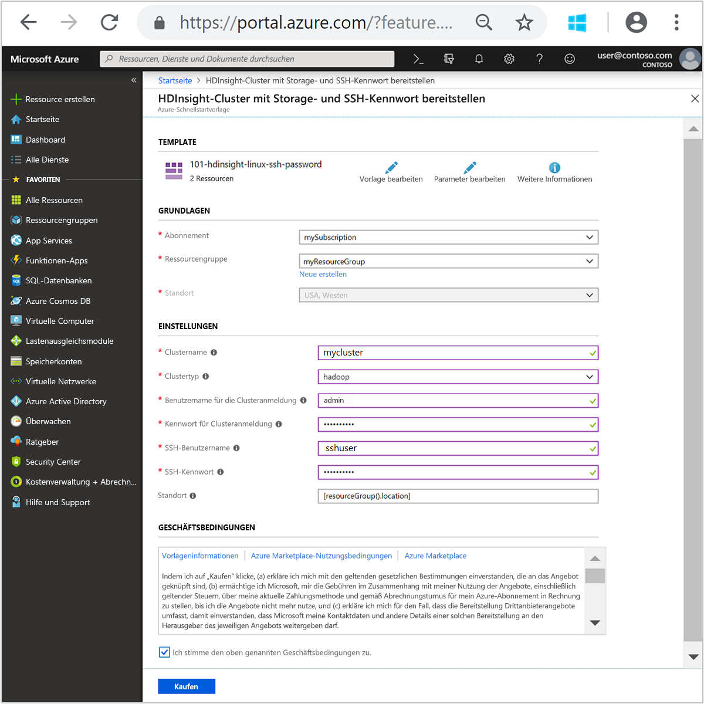
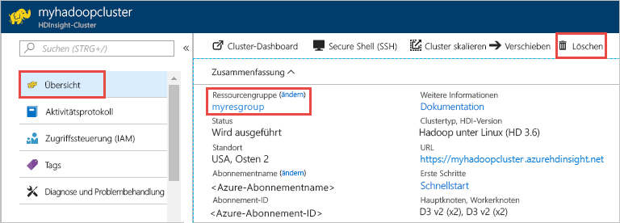

# Schnellstart: Erstellen eines Apache Hadoop-Clusters in Azure HDInsight mit einer Resource Manager-Vorlage

In diesem Schnellstart erfahren Sie, wie Sie einen Apache Hadoop-Cluster in Azure HDInsight mit einer Resource Manager-Vorlage erstellen.

Ähnliche Vorlagen finden Sie unter [Azure-Schnellstartvorlagen](https://azure.microsoft.com/resources/templates/?resourceType=Microsoft.Hdinsight&pageNumber=1&sort=Popular). Die Vorlagenreferenz finden Sie [hier](https://docs.microsoft.com/azure/templates/microsoft.hdinsight/allversions).  Sie können einen Cluster auch über das [Azure-Portal](apache-hadoop-linux-create-cluster-get-started-portal.md) erstellen.  

Zurzeit stehen in HDInsight [sieben verschiedene Clustertypen](../hdinsight-overview.md#cluster-types-in-hdinsight) zur Verfügung. Jeder Clustertyp unterstützt eine andere Gruppe von Komponenten. Alle Clustertypen unterstützen Hive. Eine Liste mit den unterstützten Komponenten in HDInsight finden Sie unter [Neuheiten in den von HDInsight bereitgestellten Hadoop-Clusterversionen](../hdinsight-component-versioning.md)  

Wenn Sie kein Azure-Abonnement besitzen, können Sie ein [kostenloses Konto](https://azure.microsoft.com/free/) erstellen, bevor Sie beginnen.

## Erstellen eines Hadoop-Clusters

1. Wählen Sie die Schaltfläche **Bereitstellung in Azure** unten aus, um sich bei Azure anzumelden und die Resource Manager-Vorlage im Azure-Portal zu öffnen.
   
    

2. Geben Sie folgende Werte ein bzw. wählen diese aus:

    |Eigenschaft  |BESCHREIBUNG  |
    |---------|---------|
    |**Abonnement**     |  Wählen Sie Ihr Azure-Abonnement. |
    |**Ressourcengruppe**     | Erstellen Sie eine Ressourcengruppe, oder wählen Sie eine vorhandene Ressourcengruppe aus.  Bei einer Ressourcengruppe handelt es sich um einen Container mit Azure-Komponenten.  In diesem Fall enthält die Ressourcengruppe den HDInsight-Cluster und das abhängige Azure Storage-Konto. |
    |**Location**     | Wählen Sie den Azure-Speicherort aus, wo Sie Ihren Cluster erstellen möchten.  Je näher der Standort, desto besser die Leistung. |
    |**Clustername**     | Geben Sie einen Namen für den Hadoop-Cluster ein. Da für alle Cluster in HDInsight gemeinsam derselbe DNS-Namespace genutzt wird, muss dieser Name eindeutig sein. Der Name darf nur Kleinbuchstaben, Ziffern und Bindestriche enthalten und muss mit einem Buchstaben beginnen.  Vor und nach jedem Bindestrich muss ein Zeichen stehen, das kein Bindestrich ist.  Der Name muss außerdem zwischen 3 und 59 Zeichen lang sein. |
    |**Clustertyp**     | Wählen Sie **hadoop** aus. |
    |**Clusteranmeldename und Kennwort**     | Der Standardanmeldename lautet **admin**. Das Kennwort muss mindestens zehn Zeichen lang sein und mindestens eine Ziffer, einen Groß- und einen Kleinbuchstaben sowie ein nicht alphanumerisches Zeichen enthalten (mit Ausnahme folgender Zeichen: ' " ` \)). Stellen Sie sicher, dass Sie **keine** häufig verwendeten Kennwörter wie „Pass@word1“ angeben.|
    |**SSH-Benutzername und Kennwort**     | Der Standardbenutzername lautet **sshuser**.  Sie können den SSH-Benutzernamen umbenennen.  Für das SSH-Benutzerkennwort gelten die gleichen Anforderungen wie für das Clusteranmeldekennwort.|

    Einige Eigenschaften wurden in der Vorlage hartcodiert.  Diese Werte können über die Vorlage konfiguriert werden. Eine ausführlichere Erläuterung dieser Eigenschaften finden Sie unter [Erstellen von Linux-basierten Apache Hadoop-Clustern in HDInsight](../hdinsight-hadoop-provision-linux-clusters.md).

    > [!NOTE]  
    > Die Werte, die Sie angeben, müssen eindeutig sein und sollten den Benennungsrichtlinien folgen. Die Vorlage führt keine Überprüfungen durch. Wenn die Werte, die Sie angeben, bereits verwendet werden oder nicht den Richtlinien entsprechen, erhalten Sie eine Fehlermeldung, nachdem Sie die Vorlage übermittelt haben.  

    

3. Wählen Sie **Ich stimme den oben genannten Geschäftsbedingungen zu**, und wählen Sie anschließend **Kaufen** aus. Sie erhalten eine Benachrichtigung, dass die Bereitstellung aktuell ausgeführt wird.  Das Erstellen eines Clusters dauert ca. 20 Minuten.

4. Nachdem der Cluster erstellt wurde, erhalten Sie eine Benachrichtigung **Bereitstellung erfolgreich** mit einem Link **Zu Ressourcengruppe navigieren**.  Ihre Seite **Ressourcengruppe** listet den neuen HDInsight-Cluster und den mit dem Cluster verbundenen Standardspeicher auf. Jeder Cluster verfügt über eine Abhängigkeit von einem [Azure Storage-Konto](../hdinsight-hadoop-use-blob-storage.md) oder einem [Azure Data Lake Storage-Konto](../hdinsight-hadoop-use-data-lake-store.md). Es wird als Standardspeicherkonto bezeichnet. Der HDInsight-Cluster und das zugehörige Speicherkonto müssen sich in derselben Azure-Region befinden. Beim Löschen von Clustern wird das Speicherkonto nicht gelöscht.

> [!NOTE]  
> Andere Methoden zur Erstellung von Clustern und Informationen zu den in diesem Schnellstart verwendeten Eigenschaften finden Sie unter [Erstellen von HDInsight-Clustern](../hdinsight-hadoop-provision-linux-clusters.md).

## Bereinigen von Ressourcen

Nachdem Sie den Schnellstart abgeschlossen haben, können Sie den Cluster löschen. Mit HDInsight werden Ihre Daten im Azure-Speicher gespeichert, sodass Sie einen Cluster problemlos löschen können, wenn er nicht verwendet wird. Für einen HDInsight-Cluster fallen auch dann Gebühren an, wenn er nicht verwendet wird. Da die Gebühren für den Cluster erheblich höher sind als die Kosten für den Speicher, ist es sinnvoll, nicht verwendete Cluster zu löschen.

> [!NOTE]  
> Wenn Sie *sofort* mit dem nächsten Tutorial fortfahren, um zu erfahren, wie Sie ETL-Vorgänge mithilfe von Hadoop in HDInsight ausführen, können Sie den Cluster weiterhin ausführen. Ansonsten müssen Sie in diesem Tutorial erneut einen Hadoop-Cluster erstellen. Wenn Sie jedoch nicht direkt mit dem nächsten Tutorial fortfahren, sollten Sie den Cluster jetzt löschen.

**So löschen Sie den Cluster bzw. das Standardspeicherkonto**

1. Wechseln Sie zurück zur Browserregisterkarte für das Azure-Portal. Die Seite mit der Clusterübersicht sollte angezeigt werden. Klicken Sie auf **Löschen**, wenn Sie nur den Cluster löschen, aber das Standardspeicherkonto behalten möchten.

    

2. Wenn Sie sowohl den Cluster als auch das Standardspeicherkonto löschen möchten, wählen Sie den Ressourcengruppennamen (im vorherigen Screenshot markiert) aus, um die Seite für die Ressourcengruppe zu öffnen.

3. Klicken Sie auf **Ressourcengruppe löschen**, um die Ressourcengruppe zu löschen, die den Cluster und das Standardspeicherkonto enthält. Beachten Sie, dass das Speicherkonto beim Löschen der Ressourcengruppe ebenfalls gelöscht wird. Wenn Sie das Speicherkonto beibehalten möchten, müssen Sie auswählen, dass nur der Cluster gelöscht werden soll.

## Nächste Schritte

In diesem Schnellstart haben Sie erfahren, wie Sie einen Apache Hadoop-Cluster in HDInsight mit einer Resource Manager-Vorlage erstellen. Im nächsten Artikel erfahren Sie, wie Sie mithilfe von Hadoop in HDInsight einen ETL-Vorgang zum Extrahieren, Transformieren und Laden von Daten ausführen.

> [!div class="nextstepaction"]
>[Extrahieren, Transformieren und Laden von Daten mithilfe von Interactive Query in HDInsight](../interactive-query/interactive-query-tutorial-analyze-flight-data.md)