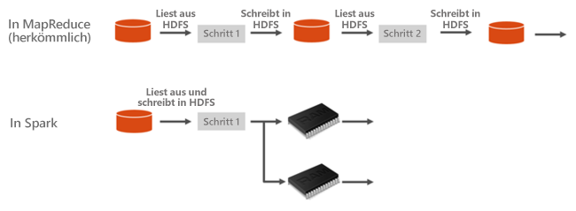
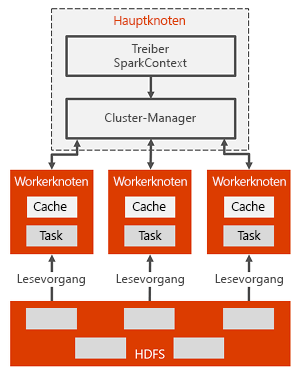

# Was ist Apache Spark in Azure HDInsight?

Apache Spark ist ein Framework für die Parallelverarbeitung, das In-Memory-Verarbeitung unterstützt, um die Leistung von Big Data-Analyseanwendungen zu steigern. Apache Spark in Azure HDInsight ist die Microsoft-Implementierung von Apache Spark in der Cloud. HDInsight vereinfacht das Erstellen und Konfigurieren eines Spark-Clusters in Azure. Spark-Cluster in HDInsight sind mit Azure Storage und mit Azure Data Lake Storage kompatibel. Dadurch können Sie HDInsight Spark-Cluster für die Verarbeitung Ihrer in Azure gespeicherten Daten verwenden. Informationen zu den Komponenten und Versionen finden Sie unter [Welche Apache Hadoop-Komponenten und -Versionen sind in HDInsight verfügbar?](../hdinsight-component-versioning.md).

## Was ist Apache Spark?

Spark stellt Primitive für das In-Memory-Clustercomputing bereit. Bei einem Spark-Auftrag können Daten in den Arbeitsspeicher geladen, zwischengespeichert und dann wiederholt abgefragt werden. In-Memory-Computing ist deutlich schneller als datenträgerbasierte Anwendungen wie Hadoop, die Daten über das Hadoop Distributed File System (HDFS) freigeben. Spark kann auch in die Scala-Programmiersprache integriert werden, damit Sie verteilte Datasets (etwa lokale Sammlungen) bearbeiten können. Es ist nicht erforderlich, alles in Form von Mapper- und Reducer-Vorgängen zu strukturieren.

Spark-Cluster in HDInsight bieten einen vollständig verwalteten Spark-Dienst. Im Anschluss sind die Vorteile der Erstellung eines Spark-Clusters in HDInsight aufgeführt.

| Funktion | Beschreibung |
| --- | --- |
| Einfache Erstellung |Über das Azure-Portal, mithilfe von Azure PowerShell oder über das HDInsight .NET SDK können Sie in wenigen Minuten einen neuen Spark-Cluster in HDInsight erstellen. Siehe [Erste Schritte mit Apache Spark-Clustern in HDInsight](apache-spark-jupyter-spark-sql-use-portal.md). |
| Einfache Bedienung |Spark-Cluster in HDInsight enthalten Jupyter und Apache Zeppelin Notebooks. Diese Notebooks können Sie für die interaktive Datenverarbeitung und -visualisierung verwenden. Weitere Informationen finden Sie unter [Verwenden von Apache Zeppelin-Notebooks mit Apache Spark](apache-spark-zeppelin-notebook.md) und [Laden von Daten und Ausführen von Abfragen in einem Apache Spark-Cluster](apache-spark-load-data-run-query.md).|
| REST-APIs |Spark-Cluster in HDInsight beinhalten [Apache Livy](https://github.com/cloudera/hue/tree/master/apps/spark/java#welcome-to-livy-the-rest-spark-server), einen auf der REST-API basierenden Spark-Auftragsserver für die Remoteübermittlung und -überwachung von Aufträgen. Siehe [Übermitteln von Remoteaufträgen an einen HDInsight Spark-Cluster mithilfe der Apache Spark-REST-API](apache-spark-livy-rest-interface.md).|
| Unterstützung für Azure Data Lake Storage | Spark-Cluster in HDInsight können Azure Data Lake Storage als primären oder zusätzlichen Speicher verwenden. Weitere Informationen zu Data Lake Storage finden Sie unter [Übersicht über Azure Data Lake Storage](../../data-lake-store/data-lake-store-overview.md). |
| Integration in Azure-Dienste |Ein Spark-Cluster in HDInsight verfügt über einen Connector für Azure Event Hubs. Sie können Streaminganwendungen unter Verwendung von Event Hubs erstellen – einschließlich Apache Kafka (bereits als Teil von Spark verfügbar). |
| Unterstützung für ML Server | Die Unterstützung für ML Server in HDInsight wird unter dem Clustertyp **ML Services** bereitgestellt. Sie können einen ML Services-Cluster einrichten, um verteilte R-Berechnungen mit den für einen Spark-Cluster garantierten Geschwindigkeiten auszuführen. Weitere Informationen finden Sie unter [Was ist ML Services in Azure HDInsight?](../r-server/r-server-overview.md). |
| Integration in Drittanbieter-IDEs | HDInsight bietet mehrere hilfreiche IDE-Plug-Ins für die Erstellung von Anwendungen und deren Übermittlung an einen HDInsight Spark-Cluster. Weitere Informationen finden Sie unter [Verwenden des Azure-Toolkits für IntelliJ IDEA](apache-spark-intellij-tool-plugin.md), [Verwenden von Spark- und Hive-Tools für VSCode](../hdinsight-for-vscode.md) und [Verwenden des Azure-Toolkits für Eclipse](apache-spark-eclipse-tool-plugin.md).|
| Gleichzeitige Abfragen |Spark-Cluster in HDInsight unterstützen gleichzeitige Abfragen. Dank dieser Funktion können mehrere Abfragen von einem Benutzer oder mehrere Abfragen von unterschiedlichen Benutzern und Anwendungen die gleichen Clusterressourcen verwenden. |
| Zwischenspeicherung auf SSDs |Sie können Daten entweder im Arbeitsspeicher oder auf SSDs zwischenspeichern, die an die Clusterknoten angefügt sind. Das Zwischenspeichern im Arbeitsspeicher liefert die beste Abfrageleistung, kann aber teuer sein. Das Zwischenspeichern auf SSDs ist eine hervorragende Möglichkeit zur Verbesserung der Abfrageleistung, ohne dass ein Cluster mit einer Größe erstellt werden muss, die für das Einfügen des gesamten Datasets in den Arbeitsspeicher ausreicht. Weitere Informationen finden Sie unter [Verbessern der Leistung von Apache Spark-Workloads per Azure HDInsight IO Cache](apache-spark-improve-performance-iocache.md). |
| Integration in BI-Tools |Spark-Cluster in HDInsight enthalten Connectors für BI-Tools wie Power BI für die Datenanalyse. |
| Vorinstallierte Anaconda-Bibliotheken |Für Spark-Cluster in HDInsight sind Anaconda-Bibliotheken vorinstalliert. [Anaconda](https://docs.continuum.io/anaconda/) bietet ca. 200 Bibliotheken für Machine Learning, Datenanalyse, Visualisierung usw. |
| Flexibilität | Mit HDInsight können Sie die Anzahl von Clusterknoten mit der Funktion für die Autoskalierung dynamisch ändern. Weitere Informationen finden Sie unter [Automatisches Skalieren von Azure HDInsight-Clustern](../hdinsight-autoscale-clusters.md). Darüber hinaus können Spark-Cluster ohne Datenverlust verworfen werden, da alle Daten in Azure Storage oder Data Lake Storage gespeichert werden. |
| SLA |Für Spark-Cluster in HDInsight ist rund um die Uhr Support verfügbar, und in der SLA ist eine Betriebszeit von 99,9 Prozent angegeben. |

Apache Spark-Cluster in HDInsight enthalten die folgenden Komponenten, die standardmäßig in den Clustern verfügbar sind:

* [Spark Core](https://spark.apache.org/docs/latest/). Umfasst Spark Core, Spark SQL, Spark-Streaming-APIs, GraphX und MLlib.
* [Anaconda](https://docs.continuum.io/anaconda/)
* [Apache Livy](https://github.com/cloudera/hue/tree/master/apps/spark/java#welcome-to-livy-the-rest-spark-server)
* [Jupyter-Notebook](https://jupyter.org)
* [Apache Zeppelin-Notebook](http://zeppelin-project.org/)

HDInsight Spark-Cluster verfügen über einen [ODBC-Treiber](https://go.microsoft.com/fwlink/?LinkId=616229) für Verbindungen von BI-Tools wie Microsoft Power BI.

## Spark-Clusterarchitektur

Die Komponenten von Spark können Sie ganz einfach verstehen, wenn Sie sich mit der Ausführung von Spark in HDInsight-Clustern vertraut machen.

Spark-Anwendungen werden in einem Cluster als unabhängige Gruppen von Prozessen ausgeführt. Sie werden vom SparkContext-Objekt in Ihrem Hauptprogramm (dem sogenannten Treiberprogramm) koordiniert.

Das SparkContext-Objekt kann eine Verbindung mit mehreren Arten von Cluster-Managern herstellen, die anwendungsübergreifend Ressourcen zuteilen. Zu diesen Cluster-Managern zählen unter anderem Apache Mesos, [Apache Hadoop YARN](https://hadoop.apache.org/docs/current/hadoop-yarn/hadoop-yarn-site/YARN.html) und der Spark-Cluster-Manager. In HDInsight wird Spark über den YARN-Cluster-Manager ausgeführt. Nach der Verbindungsherstellung ruft Spark Executors für Workerknoten im Cluster ab. Dabei handelt es sich um Prozesse, die Berechnungen ausführen und Daten für Ihre Anwendung speichern. Als Nächstes wird Ihr Anwendungscode (definiert durch JAR- oder Python-Dateien, die an SparkContext übergeben werden) an die Executors gesendet. Abschließend sendet SparkContext Aufgaben zur Ausführung an die Executors.

Das SparkContext-Objekt führt die main-Funktion des Benutzers und dann die verschiedenen parallelen Vorgänge auf den Workerknoten aus. Anschließend sammelt es die Ergebnisse der Vorgänge. Die Workerknoten lesen und schreiben Daten aus dem und in das Hadoop Distributed File System. Außerdem speichern die Workerknoten transformierte Daten im Arbeitsspeicher als RDDs (Resilient Distributed Datasets).

Das SparkContext-Objekt stellt eine Verbindung mit dem Spark-Master her und ist für die Konvertierung einer Anwendung in einen gerichteten (azyklischen) Graphen individueller Aufgaben verantwortlich. Die Aufgaben werden im Rahmen eines Executor-Prozesses auf den Workerknoten ausgeführt. Jede Anwendung erhält ihre eigenen Executor-Prozesse, die über die gesamte Anwendungsdauer hinweg aktiv bleiben und Aufgaben in mehreren Threads ausführen.

## Anwendungsfälle für Spark in HDInsight

Spark-Cluster in HDInsight ermöglichen die folgenden Schlüsselszenarien:

### Interaktive Datenanalyse und BI

Apache Spark in HDInsight speichert Daten in Azure Storage oder Azure Data Lake Storage. Experten und Entscheidungsträger in Unternehmen können diese Daten analysieren und entsprechende Berichte erstellen. Außerdem können sie mithilfe von Microsoft Power BI interaktive Berichte auf der Grundlage der analysierten Daten generieren. Analysten können mit unstrukturierten oder teilweise strukturierten Daten im Clusterspeicher beginnen, mit Notebooks ein Schema für die Daten definieren und dann mit Microsoft Power BI Datenmodelle erstellen. Von Spark-Clustern in HDInsight wird auch eine Reihe von BI-Drittanbietertools unterstützt (beispielsweise Tableau), was für Datenanalysten, Unternehmensexperten und Entscheidungsträger praktisch ist.

* [Tutorial: Visualisieren von Spark-Daten mithilfe von Power BI](apache-spark-use-bi-tools.md)

### Spark Machine Learning

Apache Spark verfügt über [MLlib](https://spark.apache.org/mllib/). Dabei handelt es sich um eine Machine Learning-Bibliothek, die auf Spark aufbaut und über einen Spark-Cluster in HDInsight verwendet werden kann. Zu Spark-Clustern in HDInsight gehört auch Anaconda – eine Python-Distribution mit verschiedenen Paketen für Machine Learning. In Kombination mit der integrierten Unterstützung von Jupyter- und Zeppelin-Notebooks erhalten Sie eine Umgebung zur Erstellung von Machine Learning-Anwendungen.

* [Tutorial: Vorhersage von Gebäudetemperaturen mithilfe von HVAC-Daten](apache-spark-ipython-notebook-machine-learning.md)  
* [Tutorial: Vorhersagen des Ergebnisses einer Lebensmittelüberwachung](apache-spark-machine-learning-mllib-ipython.md)

### Streaming und Echtzeit-Datenanalysen mit Spark

Spark-Cluster in HDInsight bieten umfassende Unterstützung für die Erstellung von Echtzeit-Analyselösungen. Spark verfügt bereits über Connectors für die Datenerfassung aus verschiedensten Quellen wie Kafka, Flume, Twitter, ZeroMQ oder TCP-Sockets. Mit Spark in HDInsight wird das Angebot zusätzlich durch eine erstklassige Unterstützung der Datenerfassung aus Azure Event Hubs erweitert. Event Hubs ist der Warteschlangendienst, der in Azure am häufigsten verwendet wird. Die vollständige Event Hubs-Unterstützung macht Spark-Cluster in HDInsight zur idealen Plattform für die Erstellung von Echtzeit-Analysepipelines.

* [Übersicht über Apache Spark Streaming](apache-spark-streaming-overview.md)
* [Übersicht über Apache Spark Structured Streaming](apache-spark-structured-streaming-overview.md)

## Wo beginne ich?

Die folgenden Artikel enthalten weitere Informationen zu Apache Spark in HDInsight:

* [Schnellstart: Erstellen eines Apache Spark-Clusters in HDInsight und Ausführen einer interaktiven Abfrage mit Jupyter](./apache-spark-jupyter-spark-sql-use-portal.md)
* [Tutorial: Ausführen eines Apache Spark-Auftrags mit Jupyter](./apache-spark-load-data-run-query.md)
* [Tutorial: Analysieren von Daten mithilfe von BI-Tools](./apache-spark-use-bi-tools.md)
* [Tutorial: Machine Learning mit Apache Spark](./apache-spark-ipython-notebook-machine-learning.md)
* [Tutorial: Erstellen einer Scala Maven-Anwendung mit IntelliJ](./apache-spark-create-standalone-application.md)

## Nächste Schritte

In dieser Übersicht haben Sie einige grundlegende Informationen zu Apache Spark in Azure HDInsight erhalten. Erfahren Sie, wie Sie einen HDInsight Spark-Cluster erstellen und einige Spark-SQL-Abfragen ausführen:

* [Erstellen von Linux-basierten Clustern in HDInsight mithilfe des Azure-Portals](./apache-spark-jupyter-spark-sql-use-portal.md)
