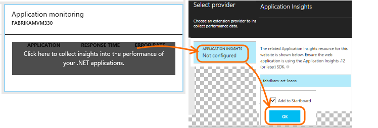

<properties 
	pageTitle="Überwachen der Anwendungsleistung" 
	description="Lade- und Antwortzeit für Diagramme, Informationen zu Abhängigkeiten und Festlegen von Leistungswarnungen." 
	services="azure-portal" 
	documentationCenter="na" 
	authors="alancameronwills" 
	manager="keboyd"/>

<tags 
	ms.service="azure-portal" 
	ms.workload="na" 
	ms.tgt_pltfrm="na" 
	ms.devlang="na" 
	ms.topic="article" 
	ms.date="04/28/2015" 
	ms.author="awills"/>

# Überwachen der Anwendungsleistung. 

Im [Azure-Portal](http://portal.azure.com) können Sie die Überwachung einrichten, um Statistiken und Detailinformationen zu den Anwendungsabhängigkeiten in Ihren Web-Apps oder virtuellen Computern zu sammeln.

Azure unterstützt die Überwachung der Anwendungsleistung durch die Nutzung von *Erweiterungen*. Diese Erweiterungen werden in Ihrer Anwendung installiert und geben die gesammelten Daten an die Überwachungsdienste zurück. 

## Aktivieren einer Erweiterung 

1. Klicken Sie auf **Durchsuchen**, und wählen Sie die App oder den virtuellen Computer aus, für den Sie eine Überwachung durchführen möchten. 

2. Klicken Sie auf die Kachel **Anwendungsüberwachung** unterhalb von **Überwachung**. 

3. Wählen Sie den Erweiterungsanbieter aus, den Sie verwenden möchten, beispielsweise **Application Insights** oder **New Relic**. 

 

Oder, falls Sie einen virtuellen Computer verwenden: 

 

## Prüfen der Daten 

Verwenden Sie Ihre Anwendung eine Zeit lang, um einige Telemetriedaten zu generieren. 

1. In der Web-App oder auf dem virtuellen Computer können Sie sehen, dass die Erweiterung installiert ist. 
2. Klicken Sie auf die Zeile, die Ihrer Anwendung entspricht, um zu diesem Anbieter zu wechseln: 
 

Sie können auch mithilfe von **Durchsuchen** direkt zur Application Insights-Komponente oder zum verwendeten New Relic-Konto wechseln.

Nachdem Sie das Blatt geöffnet haben, beispielsweise für Application Insights, können Sie folgende Aufgaben ausführen: 
- Öffnen der Einstellung "Leistung": 

 

- Ausführen von Drilldowns für einzelne Anforderungen: 

 

- Nachfolgend sehen Sie ein Beispiel, das die für eine SQL-Abhängigkeit aufgewendete Zeit einschließlich der Anzahl von SQL-Aufrufen und zugehörigen Statistiken zeigt, wie etwa die durchschnittliche Dauer und die Standardabweichung. 

 

### Zusätzliche Anforderungen für Application Insights 

New Relic kann automatisch und ohne zusätzliche Instrumentierung installiert werden, für Application Insights gilt jedoch eine zusätzliche Voraussetzung. 

 

Wenn Sie zur Anmeldung aufgefordert werden, verwenden Sie die Anmeldeinformationen für Ihr Azure-Konto. 

## Nächste Schritte 

* [Überwachen der Metriken für die Dienstintegrität](insights-how-to-customize-monitoring.md), um sicherzustellen, dass Ihr Dienst verfügbar ist und antwortet. 
* [Aktivieren von Überwachung und Diagnose](insights-how-to-use-diagnostics.md), um detaillierte Hochfrequenzmetriken zu Ihrem Dienst zu sammeln. 
* [Empfangen von Warnungsbenachrichtigungen](insights-receive-alert-notifications.md), wenn operative Ereignisse auftreten oder Metriken einen Schwellenwert überschreiten. 
* Verwenden von [Application Insights für JavaScript-Apps und -Webseiten](app-insights-web-track-usage.md), um Clientanalysen über die Browser abzurufen, die zum Besuch einer Webseite verwendet werden. 
* [Überwachen der Verfügbarkeit und Reaktionsfähigkeit einer beliebigen Webseite](app-insights-monitor-web-app-availability.md) mit Application Insights um zu ermitteln, dass eine Seite offline ist.

<!---HONumber=54-->