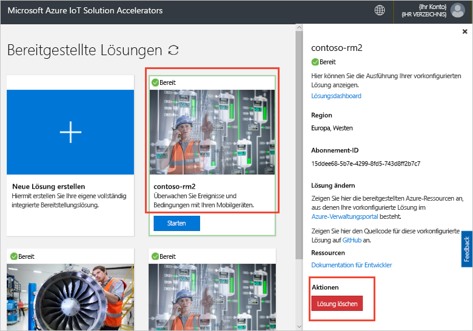

# Verbinden eines IoT DevKit-Geräts mit dem Solution Accelerator für die Remoteüberwachung

[!INCLUDE [iot-suite-selector-connecting](../../includes/iot-suite-selector-connecting.md)]

In dieser Schrittanleitung wird gezeigt, wie Sie eine Beispielanwendung auf Ihrem IoT DevKit-Gerät ausführen. Der Beispielcode sendet Telemetriedaten von den Sensoren auf dem DevKit-Gerät an Ihren Solution Accelerator.

Das [IoT DevKit](https://aka.ms/iot-devkit) ist ein mit Arduino kompatibles All-in-One-Board mit umfangreichen Peripheriegeräten und Sensoren. Sie können dafür in Visual Studio Code mithilfe der [Azure IoT Workbench](https://marketplace.visualstudio.com/items?itemName=vsciot-vscode.vscode-iot-workbench) entwickeln. Der [Projektkatalog](https://microsoft.github.io/azure-iot-developer-kit/docs/projects/) enthält Beispielanwendungen, die Sie beim Erstellen von Prototypen für IoT-Lösungen unterstützen.

## Voraussetzungen

Befolgen Sie den [Leitfaden zu den ersten Schritten mit dem IoT DevKit](https://docs.microsoft.com/azure/iot-hub/iot-hub-arduino-iot-devkit-az3166-get-started), und führen Sie nur die folgenden Abschnitte aus:

* Vorbereiten der Hardware
* Konfigurieren von WLAN
* Starten unter Verwendung von DevKit
* Vorbereiten der Entwicklungsumgebung

## Öffnen des Beispiels

So öffnen Sie das Remoteüberwachungsbeispiel in VS Code:

1. Stellen Sie sicher, dass Ihr IoT DevKit nicht mit Ihrem Computer verbunden ist. Starten Sie zuerst Visual Studio Code, und stellen Sie dann eine Verbindung von DevKit mit Ihrem Computer her.

1. Klicken Sie auf `F1`, um die Befehlspalette zu öffnen, geben Sie **IoT Workbench: Beispiele** ein, und wählen Sie es aus. Wählen Sie dann **IoT DevKit** als Board aus.

1. Suchen Sie **Remoteüberwachung**, und klicken Sie auf **Beispiel öffnen**. Daraufhin wird ein neues VS Code-Fenster mit dem Projektordner geöffnet:

  

## Konfigurieren des Geräts

So konfigurieren Sie die Verbindungszeichenfolge des IoT Hub-Geräts auf Ihrem DevKit-Gerät:

1. Versetzen Sie das IoT DevKit in den **Konfigurationsmodus**:

    * Halten Sie die Taste **A** gedrückt.
    * Drücken Sie gleichzeitig einmal die **Reset**-Taste.

1. Auf dem Bildschirm werden die DevKit-ID und `Configuration` angezeigt.

    

1. Drücken Sie **F1**, um die Befehlspalette zu öffnen, und geben Sie Folgendes ein, bzw. wählen Sie Folgendes aus: **IoT Workbench: Gerät > Geräteeinstellungen konfigurieren**.

1. Fügen Sie die zuvor kopierte Verbindungszeichenfolge ein, und drücken Sie die **EINGABETASTE**, um das Gerät zu konfigurieren.

## Erstellen des Codes

So erstellen Sie den Gerätecode und laden ihn hoch:

1. Drücken Sie **F1**, um die Befehlspalette zu öffnen, und geben Sie Folgendes ein, bzw. wählen Sie Folgendes aus: **IoT Workbench: Gerät > Gerät hochladen**:

    

1. VS Code kompiliert und lädt den Code auf Ihr DevKit-Gerät hoch:

    

1. Das DevKit-Gerät wird neu gestartet und führt den Code aus, den Sie hochgeladen haben.

## Testen des Beispiels

Um sicherzustellen, dass die auf das DevKit-Gerät hochgeladene Beispielanwendung funktioniert, führen Sie die folgenden Schritte aus:

### Anzeigen der Telemetriedaten, die an die Lösung für die Remoteüberwachung gesendet wurden

Wenn die Beispiel-App ausgeführt wird, sendet das DevKit-Gerät Telemetriedaten von den Sensoren über das WLAN an Ihren Solution Accelerator. So zeigen Sie die Telemetriedaten an:

1. Wechseln Sie zu Ihrem Lösungsdashboard, und klicken Sie auf **Geräte**.

1. Klicken Sie auf den Gerätenamen Ihres DevKit-Geräts. Auf der Registerkarte rechts sind die Telemetriedaten aus dem DevKit in Echtzeit zu sehen:

    

### Steuern des DevKit-Geräts

Mithilfe des Solution Accelerators für die Remoteüberwachung können Sie Ihr Gerät remote steuern. Durch den Beispielcode werden drei Methoden implementiert, die Sie im Abschnitt **Methode** sehen, wenn Sie das Gerät auf der Seite **Geräte** auswählen:

So ändern Sie die Farbe einer der DevKit-LEDs mithilfe der Methode **LedColor**:

1. Wählen Sie den Gerätenamen aus der Geräteliste aus, und klicken Sie auf die **Aufträge**:

    

1. Konfigurieren Sie die Aufträge mithilfe der folgenden Werte, und klicken Sie auf **Anwenden**:

    * Wählen Sie „Auftrag: **Run-Methode**“ aus.
    * Methodenname: **LedColor**
    * Auftragsname: **ChangeLedColor**

    

1. Innerhalb weniger Sekunden ändert sich die Farbe der RGB-LED an Ihrem DevKit (unterhalb der A-Taste):

    

## Bereinigen von Ressourcen

Wenn Sie mit den Tutorials fortfahren möchten, können Sie die Bereitstellung des Solution Accelerators für die Remoteüberwachung beibehalten.

Falls Sie den Solution Accelerator nicht mehr benötigen, können Sie ihn auf der Seite „Bereitgestellte Lösungen“ löschen, indem Sie ihn auswählen und dann auf „Lösung löschen“ klicken:

## Probleme und Feedback

Wenn Probleme auftreten, lesen Sie die [häufig gestellten Fragen zum IoT DevKit](https://microsoft.github.io/azure-iot-developer-kit/docs/faq/), oder wenden Sie sich über folgende Kanäle an uns:

* [Gitter.im](http://gitter.im/Microsoft/azure-iot-developer-kit)
* [Stackoverflow](https://stackoverflow.com/questions/tagged/iot-devkit)

## Nächste Schritte

Nachdem Sie nun erfahren haben, wie Sie die Verbindung eines DevKit-Geräts mit dem Solution Accelerator für die Remoteüberwachung herstellen, werden die folgenden nächsten Schritte empfohlen:

* [Was sind die IoT Solution Accelerators?](https://docs.microsoft.com/azure/iot-accelerators/)
* [Anpassen der Benutzeroberfläche](iot-accelerators-remote-monitoring-customize.md)
* [Herstellen einer Verbindung zwischen IoT DevKit und Ihrer Azure IoT Central-Anwendung](../iot-central/howto-connect-devkit.md)