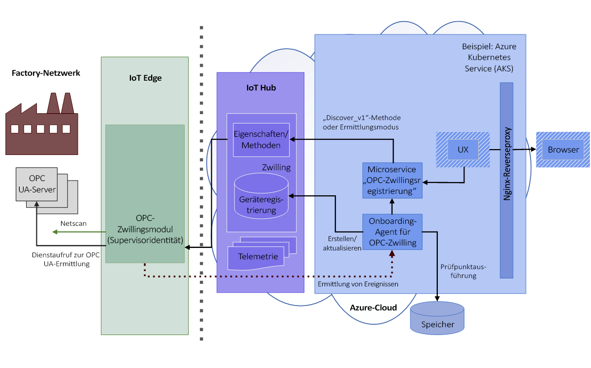
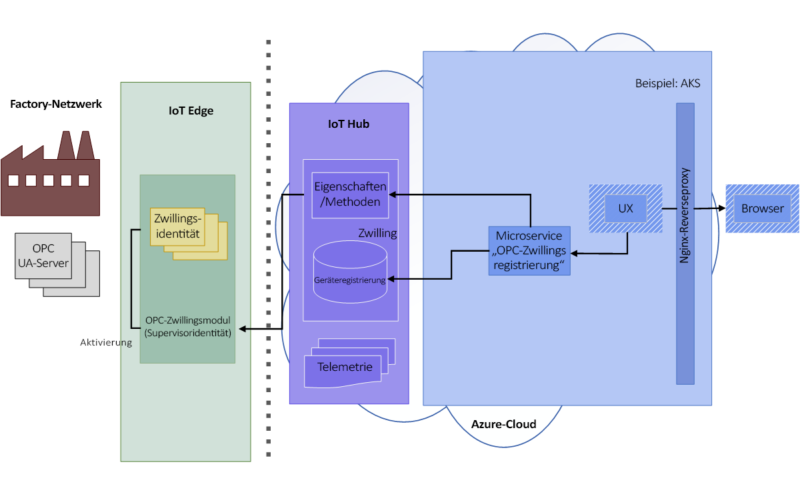

# OPC Twin-Architektur

In den folgenden Diagrammen wird die OPC Twin-Architektur veranschaulicht.

## Ermitteln und Aktivieren

1. Der Bediener aktiviert eine Netzwerküberprüfung im Modul oder führt per Ermittlungs-URL eine einmalige Ermittlung durch. Die ermittelten Endpunkte und die Anwendungsinformationen werden per Telemetriefunktion zur Verarbeitung an den Onboarding-Agent gesendet.  Der Onboarding-Agent für OPC UA-Geräte verarbeitet OPC UA-Serverermittlungsereignisse, die vom OPC Twin-IoT Edge-Modul im Ermittlungs- oder Überprüfungsmodus gesendet werden. Die Ermittlungsergebnisse führen zur Anwendungsregistrierung und zu Updates in der OPC UA-Geräteregistrierung.

   

1. Der Bediener untersucht das Zertifikat des ermittelten Endpunkts und aktiviert den registrierten Endpunktzwilling für den Zugriff. 

   

## Durchsuchen und Überwachen

1. Nach der Aktivierung kann der Bediener die Twin-Dienst-REST-API verwenden, um das Serverinformationsmodell zu durchsuchen und zu untersuchen, Objektvariablen zu lesen bzw. zu schreiben und Methoden aufzurufen.  Der Benutzer verwendet eine vereinfachte OPC UA-API, die vollständig in HTTP und JSON ausgedrückt wird.

   

1. Die REST-Schnittstelle des Twin-Diensts kann auch zum Erstellen von überwachten Elementen und Abonnements in OPC Publisher verwendet werden. Mit OPC Publisher können Telemetriedaten von OPC UA-Serversystemen an IoT Hub gesendet werden. Weitere Informationen zu OPC Publisher finden Sie im [OPC Publisher](https://github.com/Azure/iot-edge-opc-publisher)-Repository auf GitHub.

   