# Kennenlernen der Benutzeroberfläche von Azure IoT Central

In diesem Artikel wird die Benutzeroberfläche von Microsoft Azure IoT Central vorgestellt. Über die Benutzeroberfläche können Sie Azure IoT Central-Lösungen und die damit verbundenen Geräte erstellen, verwalten und verwenden.

Als _Lösungsentwickler_ verwenden Sie die Benutzeroberfläche von Azure IoT Central, um Ihre Azure IoT Central-Lösung zu definieren. Die Benutzeroberfläche bietet folgende Möglichkeiten:

* Definieren der Art von Gerät, das eine Verbindung mit Ihrer Lösung herstellt
* Konfigurieren der Regeln und Aktionen für Ihre Geräte 
* Anpassen der Benutzeroberfläche für einen _Bediener_, der Ihre Lösung verwendet

_Bediener_ verwenden die Benutzeroberfläche von Azure IoT Central, um ihre Azure IoT Central-Lösung zu verwalten. Die Benutzeroberfläche bietet folgende Möglichkeiten:

* Überwachen Ihrer Geräte
* Konfigurieren Ihrer Geräte
* Behandeln und Beheben von Problemen mit Ihren Geräten
* Bereitstellen von neuen Geräten

## IoT Central-Startseite

Auf der [IoT Central-Startseite](https://aka.ms/iotcentral-get-started) finden Sie weitere Informationen zu den aktuellen News und Features von IoT Central, zum Erstellen neuer Anwendungen und zum Anzeigen und Starten Ihrer vorhandenen Anwendung.

> [!div class="mx-imgBorder"]
> 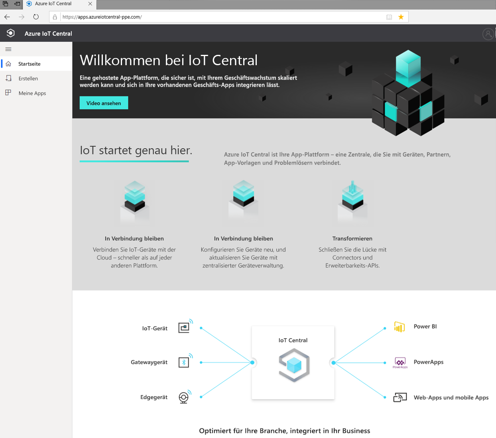

### Erstellen einer Anwendung

Im Abschnitt für die Erstellung können Sie die Liste mit den branchenrelevanten IoT Central-Vorlagen durchsuchen, um schnell einzusteigen. Alternativ können Sie auch von Grund auf neu beginnen, indem Sie eine Vorlage für eine benutzerdefinierte App verwenden.  
> [!div class="mx-imgBorder"]
> 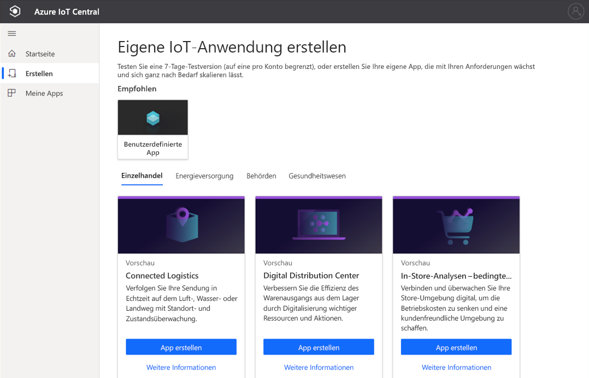

Weitere Informationen finden Sie in der Schnellstartanleitung [Erstellen einer Azure IoT Central-Anwendung](quick-deploy-iot-central.md).

### Starten Ihrer Anwendung

Sie können Ihre IoT Central-Anwendung starten, indem Sie auf die URL zugreifen, die von Ihnen bzw. Ihrem Lösungsentwickler bei der App-Erstellung ausgewählt wurde. Darüber hinaus können Sie im [App-Manager von IoT Central](https://aka.ms/iotcentral-apps) eine Liste mit allen Anwendungen anzeigen, auf die Sie Zugriff haben.

> [!div class="mx-imgBorder"]
> 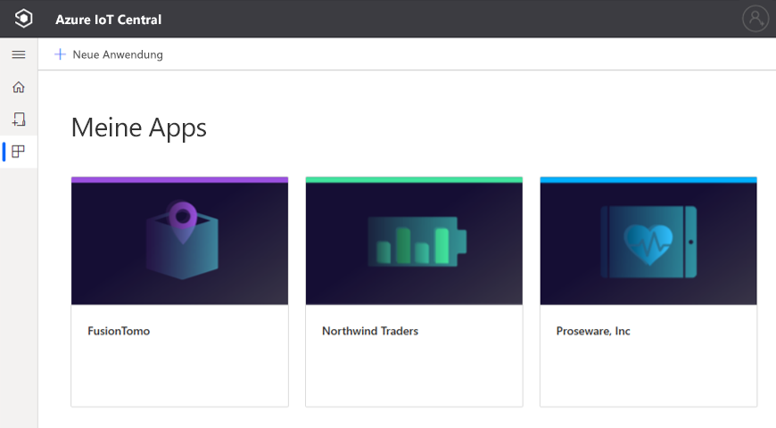

## Navigieren in der Anwendung

In der IoT-Anwendung können Sie die Navigationselemente auf der linken Seite nutzen, um auf die verschiedenen Bereiche zuzugreifen. Sie können den linken Bereich erweitern oder reduzieren, indem Sie oben im Bereich das Symbol mit den drei Linien auswählen:

> [!NOTE]
> Welche Elemente im linken Bereich angezeigt werden, hängt von ihrer Benutzerrolle ab. Lesen Sie die weiteren Informationen zum [Verwalten von Benutzern und Rollen](howto-manage-users-roles.md). 

:::row:::
  :::column span="":::
      > [!div class="mx-imgBorder"]
      > 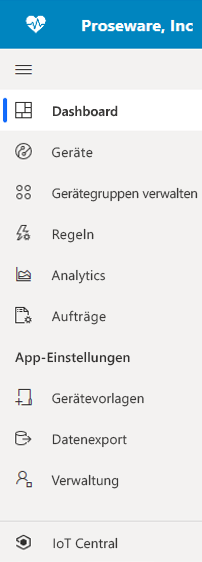
  :::column-end:::
  :::column span="2":::
     Unter **Dashboard** wird Ihr Anwendungsdashboard angezeigt. Als *Lösungsentwickler* können Sie das globale Dashboard für Ihre Bediener anpassen. Je nach Benutzerrolle können Bediener auch eigene persönliche Dashboards erstellen.
     
     Unter **Geräte** können Sie Ihre verbundenen Geräte verwalten – real oder simuliert.

     Unter **Gerätegruppen** können Sie logische Sammlungen mit Geräten anzeigen und erstellen, die per Abfrage angegeben werden. Sie können diese Abfrage speichern und Gerätegruppen über die Anwendung nutzen, um Massenvorgänge durchzuführen.

     Unter **Regeln** können Sie Regeln zur Überwachung Ihrer Geräte erstellen und bearbeiten. Regeln werden anhand der Gerätetelemetrie ausgewertet und dienen zum Auslösen von anpassbaren Aktionen.

     Unter **Analyse** können Sie benutzerdefinierte Ansichten auf der Grundlage von Gerätedaten erstellen, um basierend auf Ihrer Anwendung Erkenntnisse zu gewinnen.

     Unter **Aufträge** können Sie Ihre Geräte bedarfsgesteuert verwalten, indem Sie Massenvorgänge durchführen.

     Die Option **Gerätevorlagen** ermöglicht die Erstellung und Verwaltung der Merkmale von Geräten, für die eine Verbindung mit Ihrer Anwendung hergestellt wird.

     Unter **Datenexport** können Sie den fortlaufenden Export in externe Dienste konfigurieren, z. B. Speicher und Warteschlangen.

     Die Option **Verwaltung** ermöglicht Ihnen das Verwalten der Bereiche Einstellungen, Anpassung, Abrechnung, Benutzer und Rollen Ihrer Anwendung.

     Mit **IoT Central** können *Administratoren* zurück zum App-Manager von IoT Central wechseln.
     
   :::column-end:::
:::row-end:::

### Suche, Hilfe, Design und Support

Das obere Menü wird auf jeder Seite angezeigt:

> [!div class="mx-imgBorder"]
> 

* Wenn Sie nach Gerätevorlagen und Geräten suchen möchten, geben Sie einen Wert für die **Suche** ein.
* Wählen Sie zum Ändern der Sprache der Benutzeroberfläche oder des Designs das Symbol **Einstellungen** aus. Informieren Sie sich über das [Verwalten Ihrer Anwendungseinstellungen](howto-manage-preferences.md).
* Wählen Sie das Symbol **Konto** aus, um sich von der Anwendung abzumelden.
* Wenn Sie Hilfe oder Unterstützung benötigen, klicken Sie auf das Dropdownmenü **Hilfe**, um eine Liste mit Ressourcen anzuzeigen. Bei einer Anwendung im Tarif „Free“ beinhalten die Supportressourcen Zugriff auf den [Livechat](howto-show-hide-chat.md).

Sie können zwischen einem hellen und einem dunklen Benutzeroberflächendesign wählen:

> [!NOTE]
> Die Option zum Wählen zwischen hellen und dunklen Designs ist nicht verfügbar, wenn Ihr Administrator ein benutzerdefiniertes Design für die Anwendung konfiguriert hat.

> [!div class="mx-imgBorder"]
> 

### Dashboard
> [!div class="mx-imgBorder"]
> 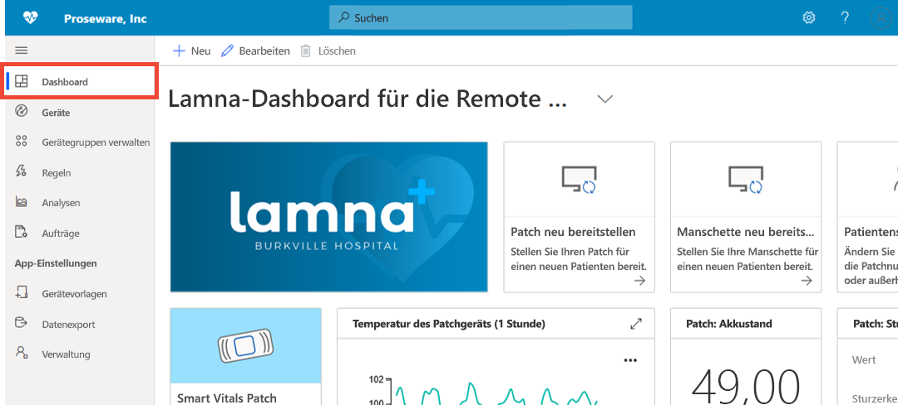

* Nach der Anmeldung bei Ihrer Azure IoT Central-Anwendung wird als Erstes das Dashboard angezeigt. Als *Lösungsentwickler* können Sie mehrere globale Anwendungsdashboards für andere Benutzer erstellen und anpassen. Informieren Sie sich über das [Hinzufügen von Kacheln zu Ihrem Dashboard](howto-add-tiles-to-your-dashboard.md).

* Sofern Ihre Benutzerrolle als *Bediener* es zulässt, können Sie persönliche Dashboards erstellen, um die für Sie wichtigen Aspekte zu überwachen. Weitere Informationen finden Sie in der Anleitung zum [Erstellen und Verwalten mehrerer Dashboards](howto-create-personal-dashboards.md).

### Geräte

> [!div class="mx-imgBorder"]
> 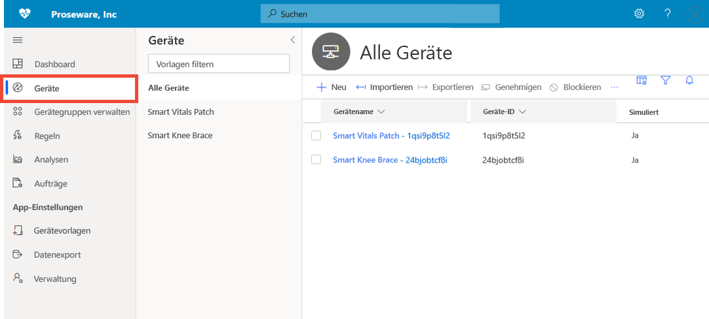

Auf der Explorer-Seite werden die _Geräte_ in Ihrer Azure IoT Central-Anwendung angezeigt (gruppiert nach _Gerätevorlage_). 

* Eine Gerätevorlage definiert einen Gerätetyp, der eine Verbindung mit Ihrer Anwendung herstellen kann.
* Bei einem Gerät handelt es sich um ein echtes oder simuliertes Gerät in Ihrer Anwendung.

Weitere Informationen finden Sie in der Schnellstartanleitung [Überwachen Ihrer Geräte](./quick-monitor-devices.md). 

### Gerätegruppen

> [!div class="mx-imgBorder"]
> 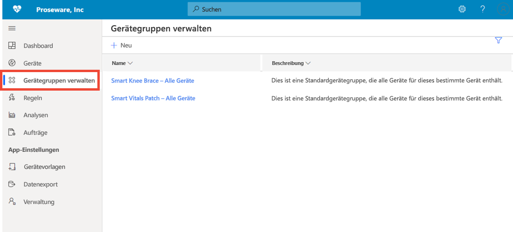

Bei einer Gerätegruppe handelt es sich um eine Sammlung mit verwandten Geräten. Ein *Lösungsentwickler* definiert eine Abfrage, um die in einer Gerätegruppe enthaltenen Geräte zu identifizieren. Sie verwenden Gerätegruppen, um in Ihrer Anwendung Massenvorgänge durchzuführen. Weitere Informationen finden Sie im Artikel [Verwenden von Gerätegruppen in Ihrer Azure IoT Central-Anwendung](tutorial-use-device-groups.md).

### Regeln
> [!div class="mx-imgBorder"]
> 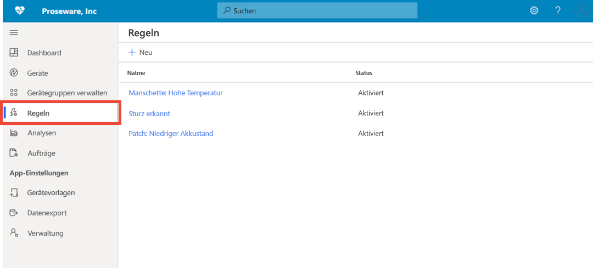

Auf der Seite „Regeln“ können Sie Regeln basierend auf den Telemetriedaten, dem Status oder den Ereignissen von Geräten definieren. Bei Auslösung einer Regel können mehrere Aktionen ausgelöst werden, z. B. das Senden einer E-Mail, das Benachrichtigen eines externen Systems über Webhookwarnungen usw. Weitere Informationen hierzu finden Sie im Tutorial zum [Konfigurieren von Regeln](tutorial-create-telemetry-rules.md). 

### Analytics

> [!div class="mx-imgBorder"]
> 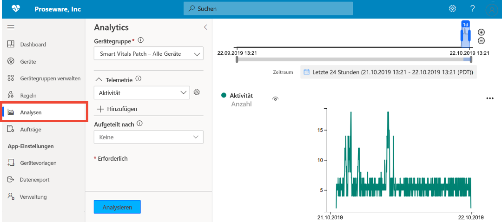

Mit der Analyse können Sie benutzerdefinierte Ansichten auf der Grundlage von Gerätedaten erstellen, um mit Ihrer Anwendung Erkenntnisse zu gewinnen. Weitere Informationen finden Sie im Artikel zum Thema [Erstellen einer Analyse für Ihre Azure IoT Central-Anwendung](howto-create-analytics.md).

### Aufträge

> [!div class="mx-imgBorder"]
> 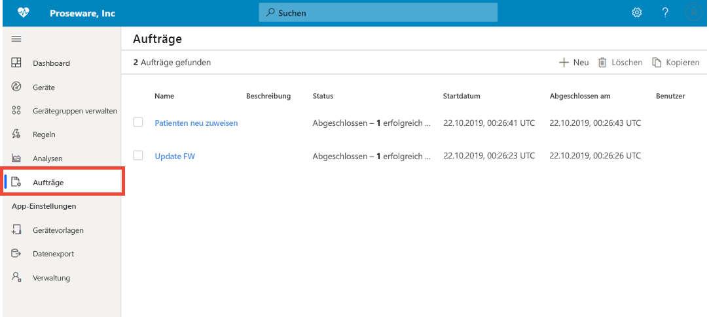

Auf der Seite „Aufträge“ können Sie Massenvorgänge für die Geräteverwaltung auf Ihren Geräten ausführen. Sie können Geräteeigenschaften und Einstellungen aktualisieren und Befehle für Gerätegruppen ausführen. Weitere Informationen finden Sie im Artikel [Ausführen eines Auftrags](howto-run-a-job.md).

### Gerätevorlagen

> [!div class="mx-imgBorder"]
> 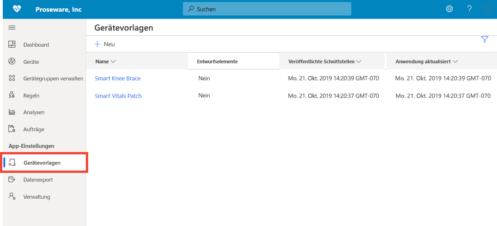

Auf der Seite „Gerätevorlagen“ können Ersteller die Gerätevorlagen in der Anwendung erstellen und verwalten. In einer Gerätevorlage werden Gerätemerkmale angegeben, z. B.:

* Telemetriedaten, Status und Ereignismessungen
* Eigenschaften
* Befehle
* Sichten

Der *Lösungsentwickler* kann auch Formulare und Dashboards für Bediener erstellen, die zum Verwalten von Geräten verwendet werden.

Weitere Informationen finden Sie im Tutorial [Define a new device type in your Azure IoT Central application](howto-set-up-template.md) (Definieren eines neuen Gerätetyps in Ihrer Azure IoT Central-Anwendung). 

### Datenexport
> [!div class="mx-imgBorder"]
> 

Per Datenexport können Sie Datenströme, z. B. für Telemetriedaten, von der Anwendung zu externen Systemen einrichten. Weitere Informationen finden Sie im Artikel [Exportieren von Daten in Azure IoT Central](./howto-export-data.md).

### Verwaltung
> [!div class="mx-imgBorder"]
> 

Auf der Seite „Verwaltung“ können Sie Ihre IoT Central-Anwendung konfigurieren und anpassen. Sie können den Anwendungsnamen, die URL und das Design ändern, Benutzer und Rollen verwalten, API-Token erstellen und Ihre Anwendung exportieren. Weitere Informationen finden Sie im Artikel [How to administer your application](howto-administer.md) (Verwalten Ihrer Anwendung).

## Nächste Schritte

Nachdem Sie sich nun einen Überblick über Azure IoT Central verschafft und sich mit dem Layout der Benutzeroberfläche vertraut gemacht haben, empfehlen wir, mit der Schnellstartanleitung zum [Erstellen einer Azure IoT Central-Anwendung](quick-deploy-iot-central.md) fortzufahren.
