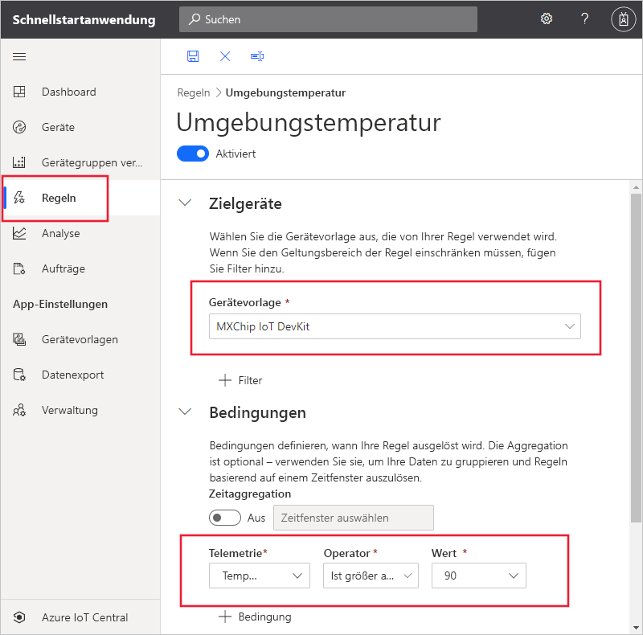
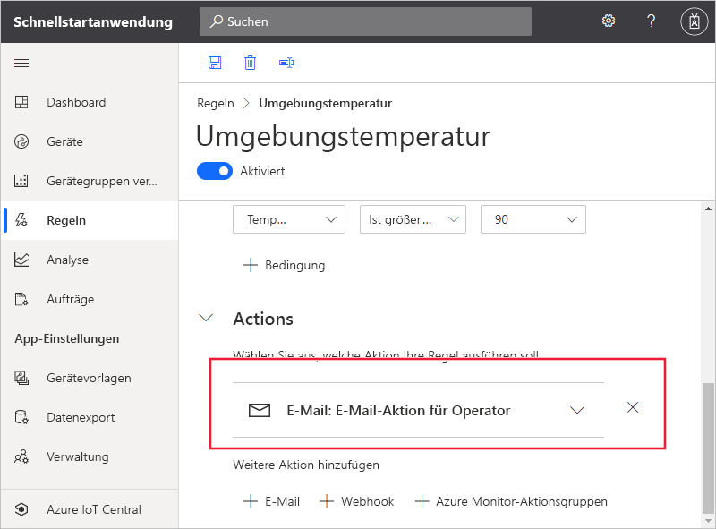

# Schnellstart: Konfigurieren von Regeln und Aktionen für Ihr Gerät in Azure IoT Central

*Dieser Artikel gilt für Betreiber, Ersteller und Administratoren.*

In dieser Schnellstartanleitung erstellen Sie eine Regel, bei der eine E-Mail gesendet wird, wenn die von einem Umgebungssensor gemeldete Temperatur 90 &deg;F (32,2 °C) übersteigt.

## Voraussetzungen

Erstellen Sie zunächst mithilfe der beiden vorherigen Schnellstartanleitungen [Erstellen einer Azure IoT Central-Anwendung](./quick-deploy-iot-central.md) und [Hinzufügen eines simulierten Geräts zu Ihrer IoT Central-Anwendung](./quick-create-pnp-device.md) die Gerätevorlage **MXChip IoT DevKit**, um sie hier verwenden zu können.

## Erstellen einer telemetriebasierten Regel

1. Wählen Sie im linken Bereich die Option **Regeln** aus, um Ihrer Anwendung eine neue telemetriebasierte Regel hinzuzufügen.

1. Wählen Sie zum Erstellen einer neuen Regel **+** aus.

1. Geben Sie als Regelname **Environmental temperature** (Umgebungstemperatur) ein.

1. Wählen Sie im Abschnitt **Zielgeräte** die Option **MXChip IoT DevKit** als Gerätevorlage aus. Diese Option filtert die Geräte, auf die die Regel angewendet wird, nach Gerätevorlagentyp. Sie können weitere Filterkriterien hinzufügen, indem Sie **+ Filter** auswählen.

1. Im Abschnitt **Bedingungen** definieren Sie, wodurch Ihre Regel ausgelöst wird. Verwenden Sie die folgenden Informationen, um eine Bedingung basierend auf Temperaturtelemetrie zu definieren:

    | Feld        | value            |
    | ------------ | ---------------- |
    | Messung  | Temperatur      |
    | Operator     | größer als  |
    | value        | 90               |

    Wählen Sie **+ Bedingung** aus, um weitere Bedingungen hinzuzufügen.

    

1. Wählen Sie **+ E-Mail** aus, um eine E-Mail-Aktion hinzuzufügen, die bei Auslösung der Regel ausgeführt werden soll.

1. Nutzen Sie beim Festlegen der Aktion die Informationen in der folgenden Tabelle, und wählen Sie anschließend **Fertig** aus:

    | Einstellung   | value                                             |
    | --------- | ------------------------------------------------- |
    | `Display name` | Operator-E-Mail-Aktion                          |
    | To        | Ihre E-Mail-Adresse                                |
    | Notizen     | Die Umgebungstemperatur hat den Schwellenwert überschritten. |

    > [!NOTE]
    > Um eine E-Mail-Benachrichtigung zu erhalten, muss es sich bei der E-Mail-Adresse um eine [Benutzer-ID in der Anwendung](howto-administer.md) handeln, und dieser Benutzer muss sich mindestens einmal bei der Anwendung angemeldet haben.

    

1. Wählen Sie **Speichern** aus. Ihre Regel ist auf der Seite **Regeln** aufgeführt.

## Testen der Regel

Die Regel wird kurz nach dem Speichern aktiv. Wenn die in der Regel festgelegten Bedingungen erfüllt werden, sendet Ihre Anwendung eine Nachricht an die in der Aktion angegebene E-Mail-Adresse.

> [!NOTE]
> Deaktivieren Sie die Regel nach Abschluss der Tests, um keine weiteren Warnungen in Ihrem Posteingang zu erhalten.

## Nächste Schritte

In diesem Schnellstart haben Sie Folgendes gelernt:

* Erstellen einer telemetriebasierten Regel
* Hinzufügen einer Aktion

Weitere Informationen zur Überwachung von Geräten, die mit Ihrer Anwendung verbunden sind, finden Sie in der folgenden Schnellstartanleitung:

> [!div class="nextstepaction"]
> [Überwachen Ihrer Geräte mithilfe von Azure IoT Central](quick-monitor-devices.md)
