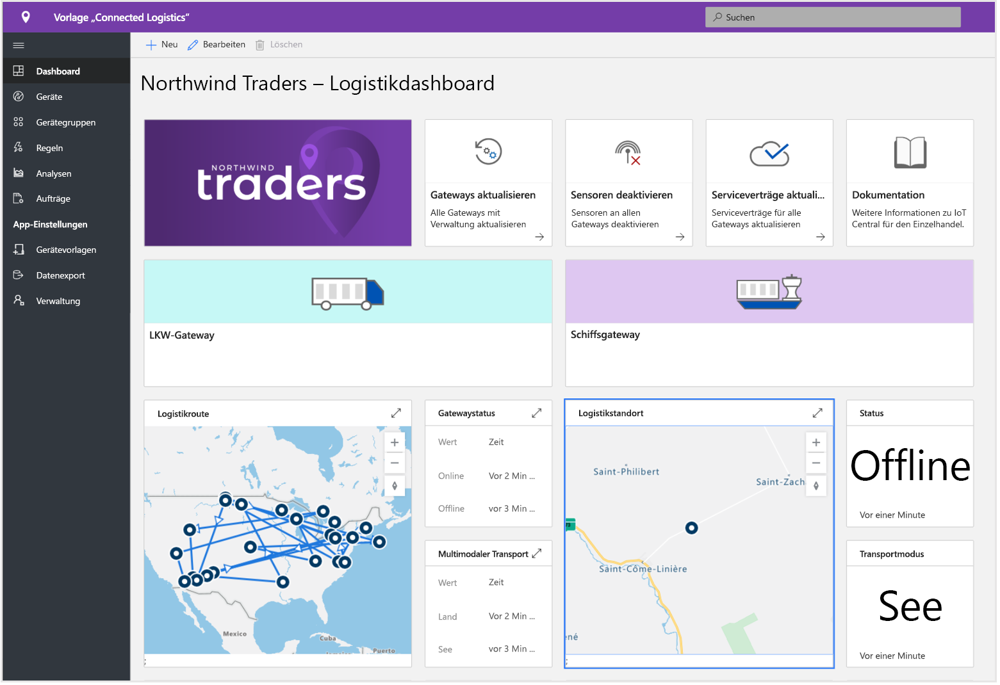
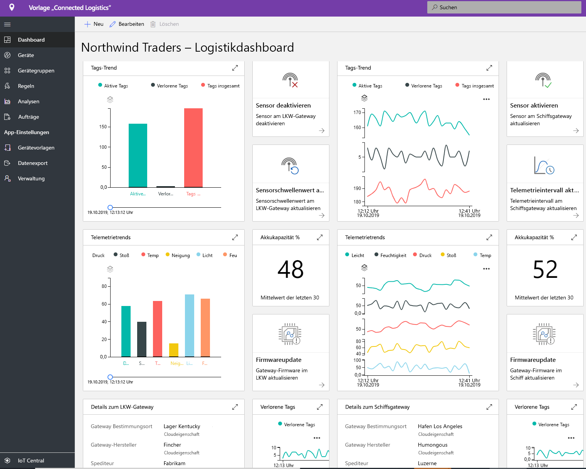
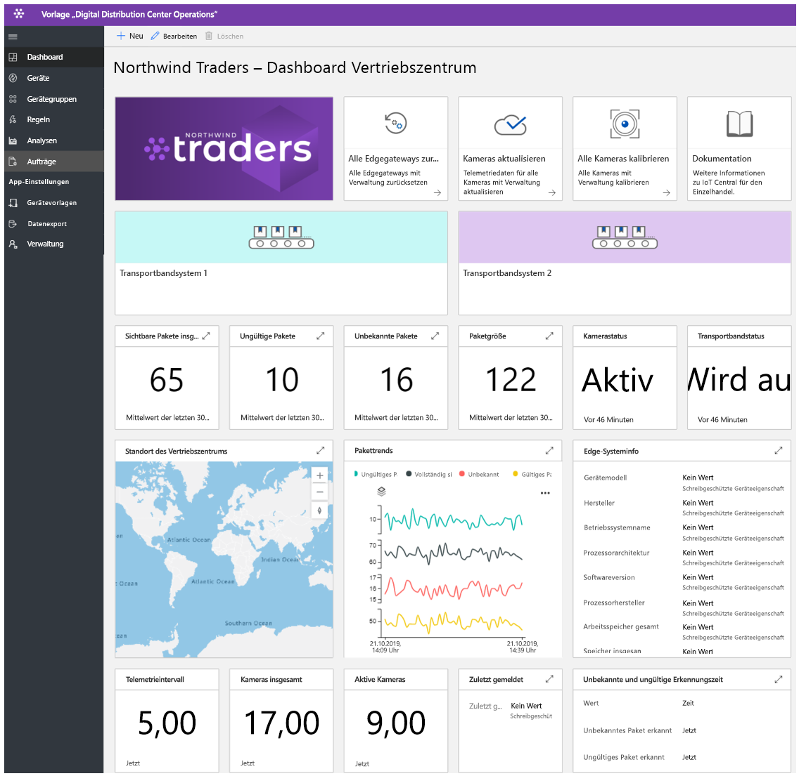
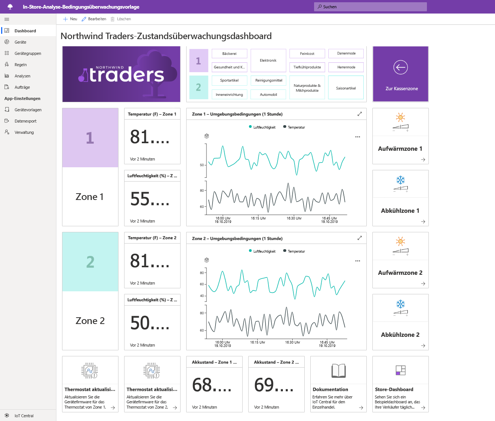

# Erstellen von Lösungen für den Einzelhandel mit Azure IoT Central

[!INCLUDE [iot-central-pnp-original](../../../includes/iot-central-pnp-original-note.md)]

Azure IoT Central ist eine IoT-App-Plattform (Internet of Things, Internet der Dinge) für Lösungsentwickler, mit der die Erstellung und Verwaltung von skalierbaren Anwendungen vereinfacht wird. In diesem Artikel gehen wir auf mehrere Anwendungsvorlagen in IoT Central ein, die für den Einzelhandel bestimmt sind. Lösungsentwickler können veröffentlichte Vorlagen zum Erstellen von IoT-Lösungen nutzen, mit denen die Lieferkette optimiert, das Einkaufserlebnis für Kunden verbessert und der Bestand effizienter nachverfolgt werden kann.

> [!div class="mx-imgBorder"]
> 

## Was ist die Lösung für vernetzte Logistik?
Für die weltweiten Ausgaben im Bereich Logistik wird für 2020 eine Summe von 10,6 Billionen US-Dollar erwartet. Dies ist der höchste BIP-Wert nach Branche. Der Großteil (70 %) der Gesamtausgaben im Bereich Logistik fällt für den Warentransport an. Anbieter von Lieferdiensten stehen unter sehr hohem Druck und unterliegen starken Einschränkungen. Firmenexterne Logistikdienstleister (Third Party Logistics, 3PL) werden mit immer höherem Zeitdruck und steigenden Entschädigungskosten konfrontiert. Weitere Belastungen in der Logistikbranche sind Risiken aufgrund von geopolitischen Zuständen, extremen Klimaereignissen und Kriminalität. 

Mithilfe von IoT-Sensoren können wir die Umgebungsbedingungen erfassen und überwachen, z. B. Temperatur, Luftfeuchtigkeit, Neigung, Stöße, Licht und Standort einer Sendung per GPS auch bei multimodaler Transformation (Luft, Wasser, Boden). Daten, die basierend auf Sensoren, Geräten, Wetter und Ereignissen erfasst werden, können in cloudbasierte Business Intelligence-Systeme integriert werden. Die Lösung für vernetzte Logistik hat folgende Vorteile:
* Sendungsübertragung mit Ablaufverfolgung und Nachverfolgung in Echtzeit 
* Sendungsintegrität mit Echtzeitüberwachung von Umgebungsbedingungen und Kühlkette
* Schutz vor Diebstahl, Verlust oder Beschädigung der Sendung
* Geofencing, Routenoptimierung, Flottenmanagement Fahrzeuganalyse
* Vorhersage und Vorhersagbarkeit von Abfahrt und Ankunft 

### Out-of-Box-Experience
Partner können eine Vorlage nutzen, um End-to-End-Lösungen für vernetzte Logistik zu entwickeln und so in den Genuss der beschriebenen Vorteile zu kommen. Bei dieser veröffentlichten Vorlage geht es um Gerätekonnektivität und die Konfiguration und Verwaltung von Geräten in IoT Central. 

> [!div class="mx-imgBorder"]
> 

> [!div class="mx-imgBorder"]
> 

Beachten Sie, dass das obige Dashboard nur ein Beispiel ist und Sie diese Anwendung vollständig an Ihren gewünschten Anwendungsfall anpassen können.

Beginnen Sie mit dem [End-to-End-Tutorial](./tutorial-iot-central-connected-logistics-pnp.md), in dem Schritt für Schritt beschrieben wird, wie Sie eine Lösung entwickeln und dabei eine der Vorlagen für die Lösung für vernetzte Logistik nutzen.

## Was ist die Lösung für digitale Verteilzentren?
Weil immer mehr Hersteller und Einzelhändler eine weltweite Präsenz anstreben, haben sich ihre Lieferketten erweitert und sind komplexer als jemals zuvor. Verteilzentren stellen eine immer größere Herausforderung dar. Vor allem in Verteilzentren und Lagern ist der hohe Druck zu spüren, der mit E-Commerce verbunden ist. Die Konsumenten erwarten mittlerweile, dass eine riesige Auswahl von Produkten verfügbar ist, die innerhalb von ein bis zwei Tagen nach dem Kauf geliefert werden. Verteilzentren sind gezwungen, sich an diese Trends anzupassen und die bestehenden Ineffizienzen zu beseitigen. 

Wenn heutzutage eine zu starke Abhängigkeit von manuellen Arbeitskräften besteht, bedeutet dies, dass 55 bis 65 % der Kosten eines Verteilzentrums für die Zusammenstellung und Verpackung von Sendungen anfallen. Es ist zwar negativ, dass die Abläufe in Verteilzentren durch manuelle Arbeitskräfte verlangsamt werden, aber aufgrund eines sich rasant ändernden Mitarbeiterbedarfs (z. B. Verzehnfachung während der Weihnachtszeit) wird es noch schwieriger, das Liefervolumen einzuhalten. Diese saisonbedingten Fluktuationen führen zu einem hohen Durchsatz und einer erhöhten Fehlerwahrscheinlichkeit, und auch der Umfang kostspieliger Nacharbeit nimmt zu.
Lösungen, die auf IoT-fähigen Kameras basieren, können Vorteile in Bezug auf die Transformation ergeben, indem eine digitale Feedbackschleife ermöglicht wird. Dieser Datenfluss aus dem gesamten Verteilzentrum führt zu verwertbaren Erkenntnissen, die wiederum eine Verbesserung der Daten nach sich ziehen.

Vorteile: 
* Waren werden bei der Ankunft und beim Durchlaufen des Fördersystems von Kameras überwacht
* Fehlerhafte Waren werden ermittelt und zur Reparatur weitergeleitet
* Aufträge können effizient nachverfolgt werden
* Kostenreduzierung, höhere Produktivität und bessere Auslastung

### Out-of-Box-Experience
Partner können diese Anwendungsvorlage zum Erstellen eines digitalen Verteilzentrums nutzen, um verwertbare Erkenntnisse zu gewinnen und in den Genuss der oben beschriebenen Vorteile zu kommen. Bei der veröffentlichten Vorlage geht es um Gerätekonnektivität und die Konfiguration und Verwaltung von Kameras und Edgegeräten in IoT Central. 

> [!div class="mx-imgBorder"]
> 

Beachten Sie, dass das obige Dashboard nur ein Beispiel ist und Sie diese Anwendung vollständig an Ihren gewünschten Anwendungsfall anpassen können.

Beginnen Sie mit dem [End-to-End-Tutorial](./tutorial-iot-central-digital-distribution-center-pnp.md), in dem Schritt für Schritt beschrieben wird, wie Sie eine Lösung entwickeln und dabei eine der Vorlagen für digitale Verteilzentren nutzen.

## Was ist „In-Store-Analyse – Bedingungsüberwachung“?
In der heutigen Wettbewerbslandschaft sind Einzelhändler auf der Suche nach neuen Wegen, wie sie Kunden etwas Einzigartiges oder Spezielles anbieten können, um die Menschen in ihre Geschäfte zu locken. Viele Einzelhändler haben erkannt, dass die Umgebungsbedingungen in ihrem Geschäft wichtig sind, um sich von der Konkurrenz abzuheben. Einzelhändler möchten sicherstellen, dass in ihren Geschäften jederzeit angenehme Bedingungen herrschen, damit die Kunden sich wohlfühlen.  

Lösungsentwickler können die Anwendungsvorlage „In-Store-Analyse – Bedingungsüberwachung“ in IoT Central verwenden, um eine End-to-End-Lösung zu erstellen. Die Anwendungsvorlage ermöglicht das digitale Verbinden und Überwachen einer Einzelhandelsumgebung mit verschiedenen Sensorgeräten. Mit diesen Sensorgeräten werden aussagekräftige Signale erfasst, die in geschäftliche Erkenntnisse verwandelt werden können. Auf diese Weise können Einzelhändler ihre Betriebskosten senken und für eine Umgebung sorgen, die ihren Kunden gefällt.

Die Anwendungsvorlage ermöglicht Ihnen Folgendes:

*  Nahtloses Verbinden einer Vielzahl von IoT-Sensoren mit einer IoT Central-Anwendungsinstanz
*  Überwachen und Verwalten der Integrität des Sensornetzwerks sowie der Gatewaygeräte in der Umgebung
*  Erstellen von benutzerdefinierten Regeln für die Umgebungsbedingungen in einem Geschäft zur Auslösung geeigneter Warnungen
*  Transformieren der Umgebungsbedingungen im Geschäft in Erkenntnisse, die von den Mitarbeitern des Einzelhandelsgeschäfts genutzt werden können
* Exportieren der aggregierten Erkenntnisse in vorhandene oder neue Geschäftsanwendungen, die den Mitarbeitern nützliche Dienste leisten

### Out-of-Box-Experience
Die Anwendungsvorlage verfügt über eine Reihe von Gerätevorlagen und eine Out-of-Box-Experience für Benutzer. Es werden einige simulierte Geräte genutzt, um die Dashboardelemente aufzufüllen. Nachdem Sie mit der App-Vorlage [In-Store-Analyse – Bedingungsüberwachung](https://aka.ms/conditiontemplate) eine IoT Central-Anwendung bereitgestellt haben, gelangen Sie wie unten gezeigt zum Standarddashboard der Anwendung. 

> [!div class="mx-imgBorder"]
> 

Beachten Sie, dass das obige Dashboard nur ein Beispiel ist und Sie diese Anwendung vollständig an Ihren gewünschten Anwendungsfall anpassen können. 

Beginnen Sie mit dem [End-to-End-Tutorial](./tutorial-in-store-analytics-create-app-pnp.md), in dem Schritt für Schritt beschrieben ist, wie Sie mit einer der Vorlagen vom Typ „In-Store-Analyse – Bedingungsüberwachung“ eine Lösung erstellen.

## Was ist „In-Store-Analyse – Auschecken“?
Aufgrund des immer stärker werdenden Wettbewerbs spüren moderne Einzelhändler den ständigen Druck, für ein Einkaufserlebnis zu sorgen, das die Erwartungen der Kunden übertrifft und somit zu Kundenbindung führt. Viele Einzelhändler haben damit begonnen, zur Erfüllung dieser Anforderung Technologie einzusetzen, aber ein bisher eher vernachlässigter Bereich ist der Bezahlvorgang an der Kasse („Auschecken“).

Mit der Anwendungsvorlage „In-Store-Analyse – Auschecken“ in IoT Central können Lösungsentwickler Umgebungen schaffen, die Mitarbeitern aussagekräftige Erkenntnisse in Bezug auf den Kassen- bzw. Bezahlbereich des Geschäfts liefern. Hierbei werden simulierte Geräte genutzt, um die derzeitige Auslastung für die einzelnen Kassenschlangen in einem Einzelhandelsgeschäft zu ermitteln. Die Sensoren ermöglichen die Erfassung der Personenanzahl sowie der durchschnittlichen Wartezeit für die einzelnen Schlangen.

Mit der Vorlage können Lösungsentwickler die Zeit bis zur Einführung verkürzen, indem sie eine IoT-Basislösung mit folgenden Möglichkeiten bereitstellen: 

* Nahtloses Verbinden einer Vielzahl von IoT-Sensoren mit einer IoT Central-Anwendungsinstanz
* Überwachen und Verwalten der Integrität des Sensornetzwerks sowie der Gatewaygeräte in der Umgebung
* Erstellen von benutzerdefinierten Regeln für die Kassenbedingungen in einem Geschäft zur Auslösung geeigneter Warnungen
* Transformieren der Kassenbedingungen im Geschäft in Erkenntnisse, die von den Mitarbeitern des Einzelhandelsgeschäfts genutzt werden können
* Exportieren der aggregierten Erkenntnisse in vorhandene oder neue Geschäftsanwendungen, die den Mitarbeitern nützliche Dienste leisten

### Out-of-Box-Experience
Die Anwendungsvorlage verfügt über eine Reihe von Gerätevorlagen und eine Out-of-Box-Experience für Benutzer. Es werden einige simulierte Geräte genutzt, um die Dashboardelemente aufzufüllen. Nachdem Sie mit der App-Vorlage [In-Store-Analyse – Auschecken](https://aka.ms/checkouttemplate) eine IoT Central-Anwendung bereitgestellt haben, gelangen Sie wie unten gezeigt zum Standarddashboard der Anwendung. 

> [!div class="mx-imgBorder"]
> 

Beachten Sie, dass das obige Dashboard nur ein Beispiel ist und Sie diese Anwendung vollständig an Ihren gewünschten Anwendungsfall anpassen können. 

Beginnen Sie mit dem [End-to-End-Tutorial](./tutorial-in-store-analytics-create-app-pnp.md), in dem Schritt für Schritt beschrieben ist, wie Sie mit einer der Vorlagen vom Typ „In-Store-Analyse – Auschecken“ eine Lösung erstellen.

## Was ist eine Lösung für die intelligente Bestandsverwaltung?
Der „Bestand“ steht für die Waren, die von einem Einzelhändler im Lager vorgehalten werden. Jeder Einzelhändler benötigt zur Einhaltung von Liefer- und Logistikzeiten einen Bestand. Der Bestand ist unzweifelhaft die wichtigste Ressource, die jeder Einzelhändler zum Betreiben seines Geschäfts benötigt. In der heutigen Geschäftswelt mit ihren vielen Kanälen kommt der Bestandsverwaltung eine entscheidende Bedeutung zu, um sicherzustellen, dass sich das richtige Produkt zur richtigen Zeit am richtigen Ort befindet. Es kann sich negativ auf das Geschäft eines Einzelhändlers auswirken, wenn der Bestand zu klein oder zu groß ist. Jedes Jahr verlieren Einzelhändler 8 bis 10 % ihres Umsatzes, weil geeignete Möglichkeiten zur Bestandsverwaltung fehlen.

Die Nutzung von IoT-Daten mithilfe von RFID (Radio-Frequency Identification), Beacons und Kameras ist die Chance, diese große Herausforderung – je nach Bedarf – zu bewältigen. Die Funktionen für Konnektivitäts- und Echtzeitanalysen anhand von IoT-Signalen sind die passende Lösung für die Probleme der Einzelhändler in Bezug auf den Bestand.  Daten, die basierend auf Sensoren, Geräten, Wetter und Ereignissen erfasst werden, können in cloudbasierte Business Intelligence-Systeme integriert werden.  
Vorteile der intelligenten Bestandsverwaltung: 
* Schutz der Organisation vor Fehlbeständen und Sicherstellung des gewünschten Servicelevels für Kunden 
* Ausführliche Analyse und Erkenntnisse zur Bestandsgenauigkeit nahezu in Echtzeit
* Ermittlung der ausreichenden Bestandsmenge für Kundenbestellungen

### Out-of-Box-Experience
Partner können die Vorlage nutzen, um End-to-End-Lösungen für die intelligente Bestandsverwaltung zu erstellen und in den Genuss der beschriebenen Vorteile zu kommen. Bei dieser veröffentlichten Vorlage geht es um Gerätekonnektivität und die Konfiguration und Verwaltung von Lesegeräten für RFID und Bluetooth Low Energy (BLE) in IoT Central. 

> [!div class="mx-imgBorder"]
> 

Beachten Sie, dass das obige Dashboard nur ein Beispiel ist und Sie diese Anwendung vollständig an Ihren gewünschten Anwendungsfall anpassen können. 

Beginnen Sie mit dem [End-to-End-Tutorial](./tutorial-iot-central-smart-inventory-management-pnp.md), in dem Schritt für Schritt beschrieben ist, wie Sie mit einer der Vorlagen für die intelligente Bestandsverwaltung eine Lösung erstellen.

## Nächste Schritte
Gehen Sie wie folgt vor, um eine Lösung für den Einzelhandel zu erstellen:
* Arbeiten Sie zuerst das [End-to-End-Tutorial](./tutorial-in-store-analytics-create-app-pnp.md) durch. Darin wird Schritt für Schritt beschrieben, wie Sie eine Lösung erstellen, indem Sie eine der Anwendungsvorlagen für die In-Store-Analyse verwenden.
* Informieren Sie sich über die Bereitstellung der [Lösungsvorlage für vernetzte Logistik](./tutorial-iot-central-connected-logistics-pnp.md).
* Informieren Sie sich über die Bereitstellung der [Vorlage für digitale Verteilzentren](./tutorial-iot-central-digital-distribution-center-pnp.md).
* Informieren Sie sich über die Bereitstellung der [Vorlage für die intelligente Bestandsverwaltung](./tutorial-iot-central-smart-inventory-management-pnp.md).
* Lesen Sie die [Übersicht über IoT Central](../core/overview-iot-central-pnp.md).
