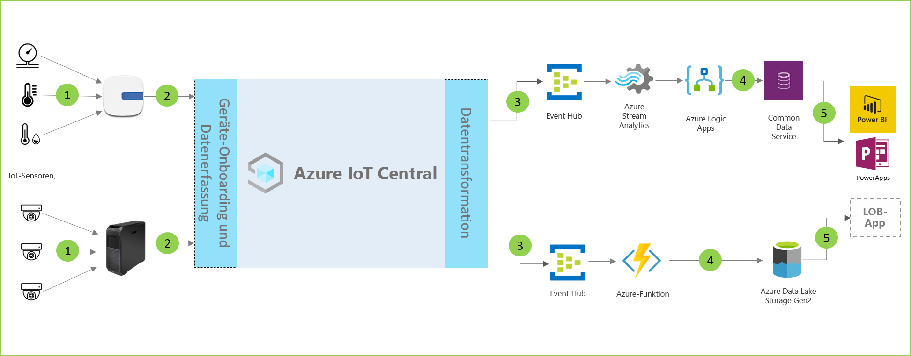

# Architektur der In-Store-Analyse

Lösungen zur In-Store-Analyse ermöglichen Ihnen das Überwachen verschiedener Bedingungen innerhalb der Einzelhandelsumgebung. Diese Lösungen können erstellt werden, indem eine der Anwendungsvorlagen in Azure IoT Central und die unten dargestellte Architektur als Richtschnur genutzt werden.

- Ein Satz von IoT-Sensoren zum Senden von Telemetriedaten an ein Gatewaygerät
- Gatewaygeräte senden Telemetrie und aggregierte Erkenntnisse an IoT Central
- Kontinuierlicher Datenexport an den gewünschten Azure-Dienst zur Bearbeitung
- Daten können im gewünschten Format strukturiert und an einen Speicherdienst gesendet werden
- Geschäftsanwendungen können Daten abfragen und Erkenntnisse generieren, die Einzelhandelsvorgänge stützen
 
Werfen wir einen Blick auf die Schlüsselkomponenten, die bei Lösungen zur In-Store-Analyse in der Regel eine Rolle spielen.

## Sensoren zur Zustandsüberwachung

Eine IoT-Lösung beginnt mit einer Reihe von Sensoren, die aussagekräftige Signale in einer Einzelhandelsumgebung erfassen. Dies wird durch verschiedene Arten von Sensoren ganz am linken Rand des obigen Architekturdiagramms wiedergespiegelt.

## Gatewaygeräte

Viele IoT-Sensoren können unformatierte Signale direkt in die Cloud oder in ein Gatewaygerät in ihrer Nähe einspeisen. Das Gatewaygerät führt vor dem Senden von zusammengefassten Einblicken an eine IoT Central-Anwendung eine Datenaggregation auf dem Edge aus. Die Gatewaygeräte sind ggf. außerdem für die Weiterleitung von Befehls- und Steuerungsvorgängen an die Sensorgeräte zuständig. 

## IoT Central-Anwendung

Die Azure IoT Central-Anwendung erfasst Daten von unterschiedlichen Arten von IoT-Sensoren sowie von Gatewaygeräten innerhalb der Einzelhandelsumgebung und generiert eine Reihe aussagekräftiger Erkenntnisse.

Azure IoT Central bietet darüber hinaus eine maßgeschneiderte Benutzeroberfläche für den Betreiber des Geschäfts, die ihm die Überwachung und Verwaltung der Infrastrukturgeräte aus der Ferne erlaubt.

## Datentransformation
Die Azure IoT Central-Anwendung kann in einer Lösung so konfiguriert werden, dass sie unformatierte oder aggregierte Erkenntnisse an eine Reihe von Azure-PaaS-Diensten (Platform-as-a-Service) exportiert, die Datenbearbeitung durchführen und diese Erkenntnisse anreichern, bevor sie in einer Geschäftsanwendung landen. 

## Geschäftsanwendung
Die IoT-Daten können die Basis verschiedener Geschäftsanwendungen bilden, die in einer Einzelhandelsumgebung bereitgestellt sind. Ein Manager oder Mitarbeiter eines Einzelhandelsunternehmens kann diese Anwendungen nutzen, um geschäftliche Erkenntnisse zu visualisieren und in Echtzeit zielgerichtete Maßnahmen zu ergreifen. Informationen zum Erstellen eines Power BI-Echtzeit-Dashboards für Ihr Einzelhandelsteam finden Sie in [diesem Tutorial](./tutorial-in-store-analytics-create-app.md).

## Nächste Schritte
* Machen Sie den Einstieg mit den Anwendungsvorlagen [In-Store-Analyse – Auschecken](https://aka.ms/checkouttemplate) und [In-Store-Analyse – Überwachen von Bedingungen](https://aka.ms/conditiontemplate). 
* Arbeiten Sie das [End-to-End-Tutorial](https://aka.ms/storeanalytics-tutorial) durch. Darin wird Schritt für Schritt beschrieben, wie Sie eine Lösung erstellen, indem Sie eine der Anwendungsvorlagen für die In-Store-Analyse nutzen.
