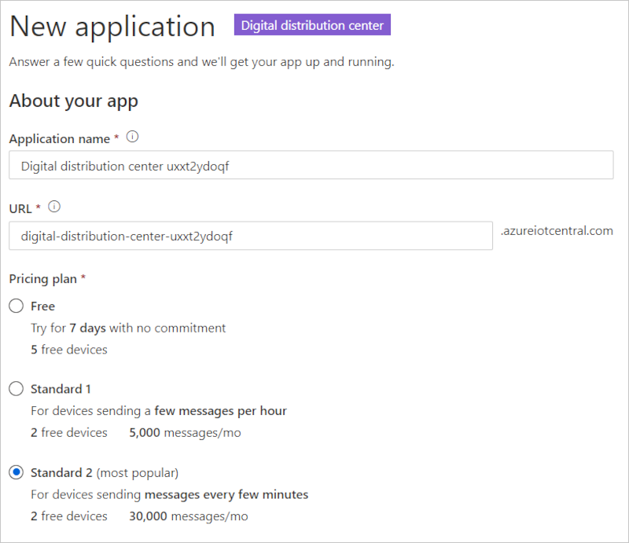
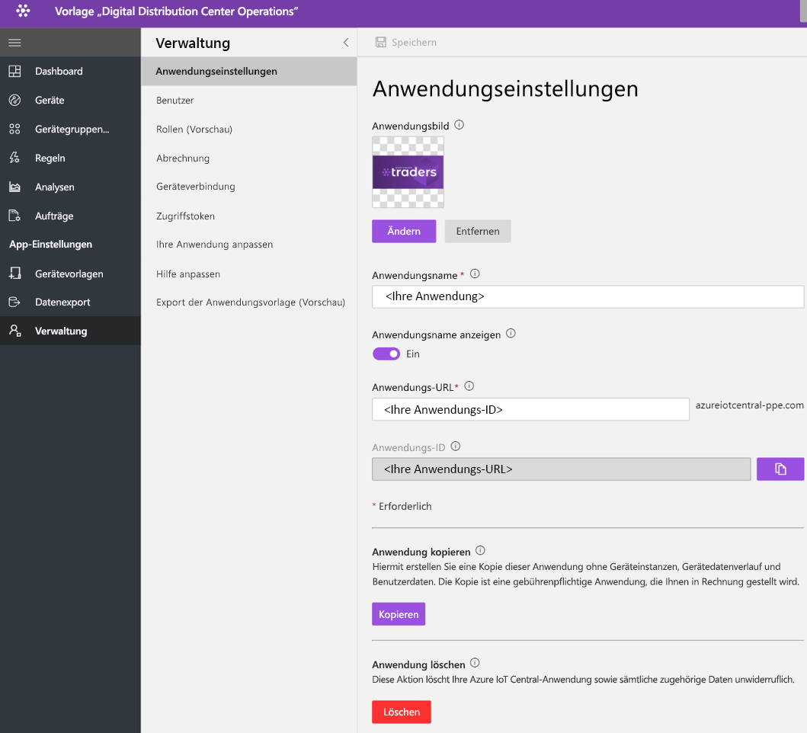

# Tutorial: Bereitstellen und Durchlaufen einer Anwendungsvorlage für digitale Verteilzentren

[!INCLUDE [iot-central-pnp-original](../../../includes/iot-central-pnp-original-note.md)]

In diesem Tutorial wird der Einstieg durch das Bereitstellen einer IoT Central-Anwendungsvorlage für **digitale Verteilzentren** gezeigt. Sie erfahren, wie Sie die Vorlage bereitstellen, was im Lieferumfang enthalten ist und welche nächsten Schritte sinnvoll sind.

In diesem Tutorial lernen Sie Folgendes: 
* Erstellen einer Anwendung für digitale Verteilzentren 
* Einführung in die Anwendung 

## Voraussetzungen
* Zum Bereitstellen dieser App sind keine besonderen Voraussetzungen erforderlich.
* Ein Azure-Abonnement ist empfehlenswert, Sie können es aber auch ohne versuchen.

## Erstellen einer Anwendungsvorlage für digitale Verteilzentren

Mithilfe der folgenden Schritte können Sie eine Anwendung erstellen.

1. Navigieren Sie zur Anwendungs-Manager-Website von Azure IoT Central. Wählen Sie auf der linken Navigationsleiste **Erstellen** aus, und klicken Sie dann auf die Registerkarte **Einzelhandel**.

> [!div class="mx-imgBorder"]
> 

2. Wählen Sie die Registerkarte **Einzelhandel** aus, und wählen Sie unter **Digital Distribution Center-Anwendung** die Option **App erstellen** aus.

3. Mit **App erstellen** wird ein neues Anwendungsformular geöffnet, wobei die erforderlichen Details wie unten dargestellt ausgefüllt werden.
   **Anwendungsname:** Sie können den vorgeschlagenen Standardnamen verwenden oder einen eigenen Anwendungsnamen eingeben.
   **URL:** Sie können die vorgeschlagene Standard-URL verwenden oder eine eigene, einfach merkbare und benutzerfreundliche URL eingeben. Als Nächstes wird die Standardeinstellung empfohlen, wenn Sie bereits über ein Azure-Abonnement verfügen. Andernfalls können Sie mit einer siebentägigen kostenlosen Testversion beginnen und jederzeit vor Ablauf der kostenlosen Testversion zur nutzungsbasierten Bezahlung wechseln.
   **Abrechnungsinfo:** Die Detailangaben zum Verzeichnis, dem Azure-Abonnement und der Region sind für die Bereitstellung der Ressourcen erforderlich.
   **Erstellen**: Wählen Sie unten auf der Seite „Erstellen“ aus, um Ihre Anwendung bereitzustellen.

> [!div class="mx-imgBorder"]
> 

## Einführung in das Anwendungsdashboard 

Nach erfolgreicher Bereitstellung der App-Vorlage ist Ihr Standarddashboard ein Portal für den Betreiber eines Verteilzentrums. Northwind Trader ist ein fiktiver Lösungsanbieter für Verteilzentren, der Transportsysteme verwaltet. 

Auf diesem Dashboard sehen Sie ein Gateway und eine Kamera als IoT-Gerät. Das Gateway stellt Telemetriedaten zu Paketen bereit, z. B. gültig, ungültig, nicht identifiziert und Größe, sowie zugehörige Eigenschaften des Gerätezwillings. Alle Downstreambefehle werden auf IoT-Geräten ausgeführt, z. B. auf einer Kamera. Dieses Dashboard ist vorkonfiguriert, sodass die Aktivität von kritischen Vorgängen auf Geräten im Verteilzentrum hervorgehoben wird.

Das Dashboard ist logisch organisiert, um die Geräteverwaltungsfunktionen des Azure-IoT-Gateways und des IoT-Geräts anzuzeigen.  
   * Sie können Gatewaybefehle und -steuerungsaufgaben ausführen.
   * Verwalten Sie alle Kameras, die zu der Lösung gehören. 

> [!div class="mx-imgBorder"]
> 

## Gerätevorlage

Klicken Sie auf die Registerkarte „Gerätevorlagen“, dann wird das Gatewayfunktionsmodell angezeigt. Ein Funktionsmodell ist um zwei unterschiedliche Schnittstellen strukturiert: **Kamera** und **Digital Distribution Gateway**.

> [!div class="mx-imgBorder"]
> 

**Kamera:** Diese Schnittstelle organisiert alle kameraspezifischen Befehlsfunktionen. 

> [!div class="mx-imgBorder"]
> 

**Digital Distribution Gateway:** Diese Schnittstelle stellt die Telemetriedaten von der Kamera, für die Cloud definierte Gerätezwillingseigenschaften und Gatewayinformationen dar.

> [!div class="mx-imgBorder"]
> 

## Gatewaybefehle
Diese Schnittstelle organisiert alle Gatewaybefehlsfunktionen.

> [!div class="mx-imgBorder"]
> 

## Regeln
Wählen Sie die Registerkarte „Regeln“ aus, um zwei verschiedene Regeln anzuzeigen, die in dieser Anwendungsvorlage vorhanden sind. Diese Regeln sind so konfiguriert, dass sie zwecks weiterer Untersuchungen E-Mail-Benachrichtigungen an die Operatoren senden.

 **Warnung über zu viele ungültige Pakete:** Diese Regel wird ausgelöst, wenn die Kamera eine große Anzahl von ungültigen Paketen erkennt, die sich durch das Transportsystem ziehen.
 
**Großes Paket:** Diese Regel wird auslöst, wenn die Kamera ein extrem großes Paket erkennt, das nicht auf Qualität überprüft werden kann. 

> [!div class="mx-imgBorder"]
> 

## Aufträge
Wählen Sie die Registerkarte „Aufträge“ aus, um fünf verschiedene Aufträge in dieser Anwendungsvorlage anzuzeigen: Sie können die Funktion für Aufträge nutzen, um lösungsweite Vorgänge auszuführen. Hier verwenden die Aufträge des digitalen Verteilzentrums die Funktion für Gerätebefehle und -zwillinge zum Ausführen von Aufgaben wie:
   * Kalibrieren der Kamera vor dem Initiieren der Paketerkennung 
   * Regelmäßiges Aktualisieren der Kamerafirmware
   * Ändern des Telemetrieintervalls zum Verwalten von Datenuploads

> [!div class="mx-imgBorder"]
> 

## Bereinigen von Ressourcen
Wenn Sie diese Anwendung nicht mehr verwenden möchten, löschen Sie die Anwendungsvorlage, indem Sie **Verwaltung** > **Anwendungseinstellungen** besuchen und auf **Löschen** klicken.

> [!div class="mx-imgBorder"]
> 

## Nächste Schritte
* Weitere Informationen zur Digital Distribution Center-Lösungsarchitektur finden Sie unter [Konzepte in Digital Distribution Center](./architecture-digital-distribution-center-pnp.md).
* Weitere Informationen zu anderen [IoT Central-Einzelhandelsvorlagen](./overview-iot-central-retail-pnp.md)
* Lesen Sie die [Übersicht über IoT Central](../preview/overview-iot-central.md).
