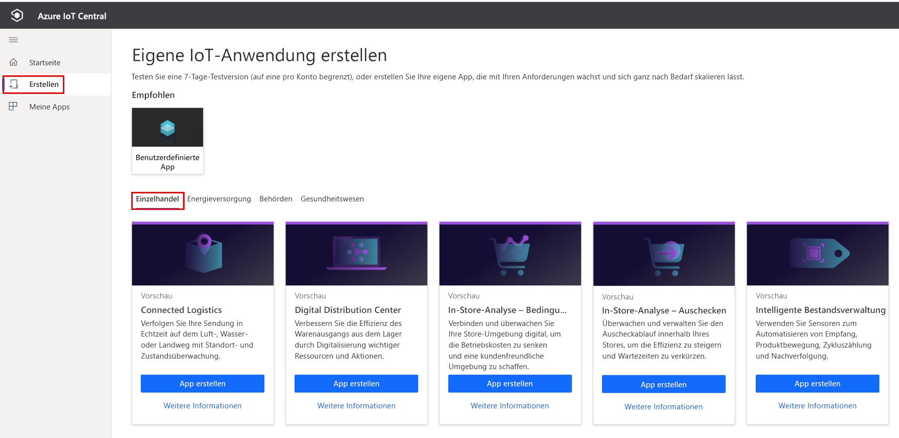
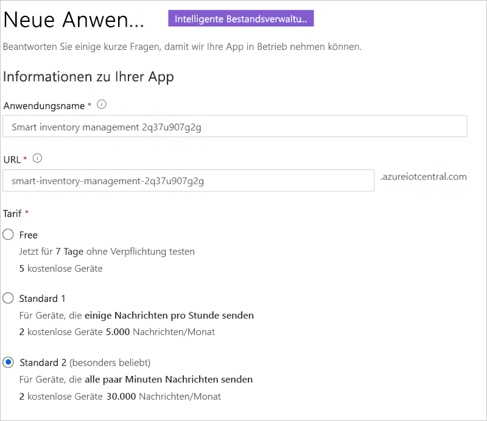
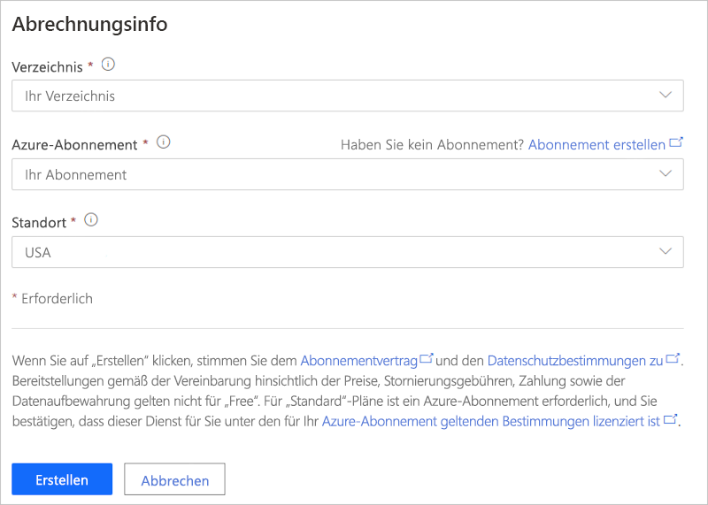
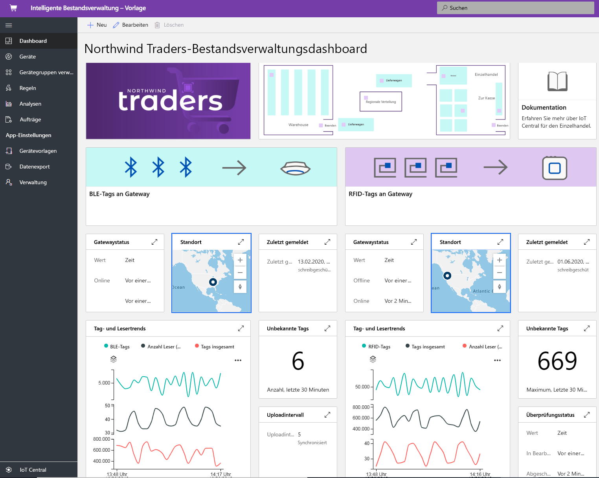
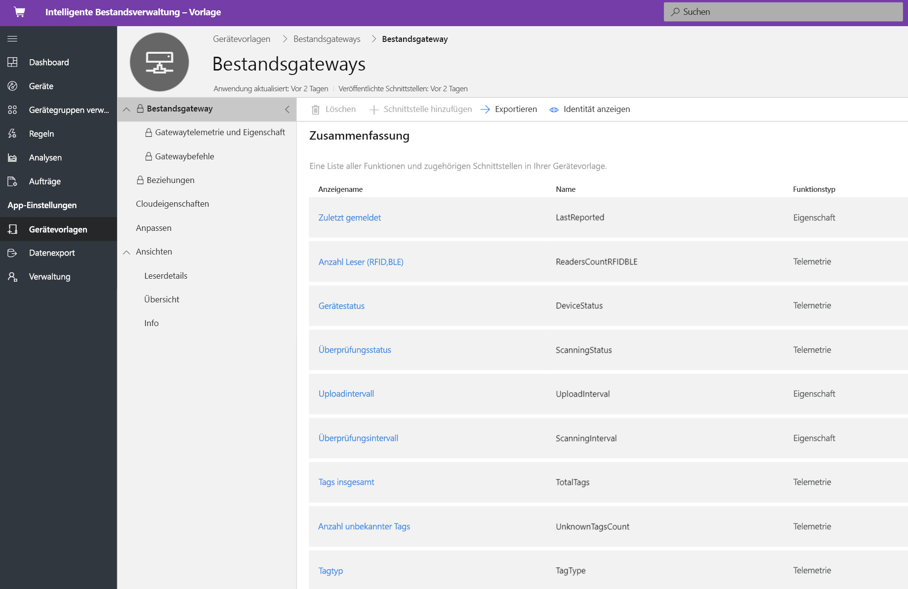
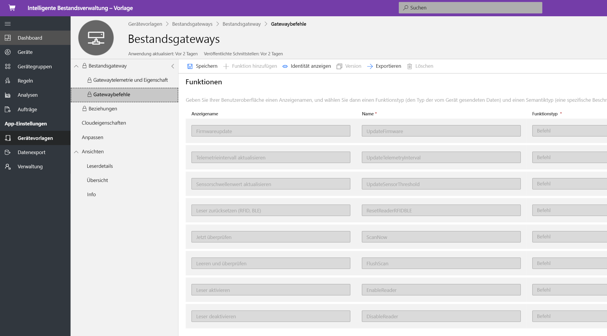
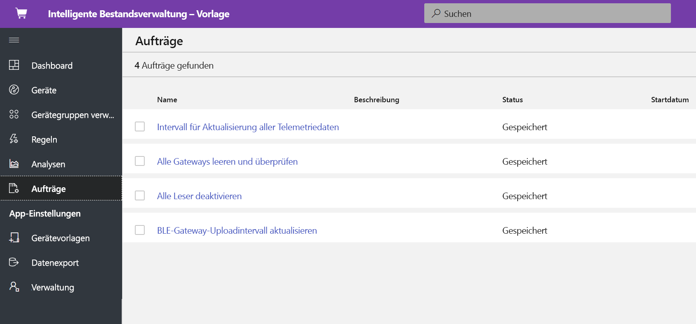
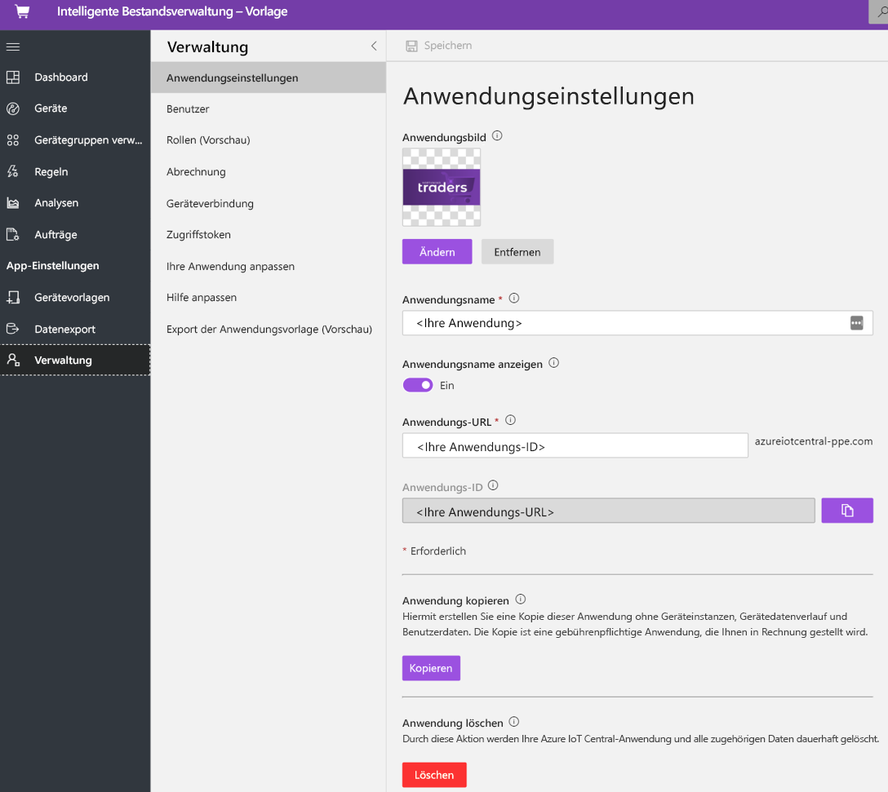

# Tutorial: Bereitstellen und Durchlaufen einer Anwendungsvorlage für intelligente Bestandsverwaltung

Dieses Tutorial zeigt, wie Sie durch Bereitstellen einer IoT Central-Vorlage in die **intelligente Bestandsverwaltung** einsteigen. Sie erfahren, wie Sie die Vorlage bereitstellen, was im Lieferumfang enthalten ist und welche nächsten Schritte sinnvoll sind.

In diesem Tutorial lernen Sie Folgendes: 
* Erstellen einer Anwendung für intelligente Bestandsverwaltung 
* Einführung in die Anwendung 

## Voraussetzungen

* Zum Bereitstellen dieser App sind keine besonderen Voraussetzungen erforderlich.
* Ein Azure-Abonnement ist empfehlenswert, Sie können es aber auch ohne versuchen.

## Erstellen einer Anwendungsvorlage für intelligente Bestandsverwaltung

Mithilfe der folgenden Schritte können Sie eine Anwendung erstellen.

1. Navigieren Sie zur Anwendungs-Manager-Website von Azure IoT Central. Wählen Sie auf der linken Navigationsleiste **Erstellen** aus, und klicken Sie dann auf die Registerkarte **Einzelhandel**.

    > [!div class="mx-imgBorder"]
    > 

2. Wählen Sie die Registerkarte **Einzelhandel** und unter **Intelligente Bestandsverwaltung** die Option **App erstellen** aus.

3. Mit **App erstellen** wird ein neues Anwendungsformular geöffnet, wobei die erforderlichen Details wie unten dargestellt ausgefüllt werden.
   **Anwendungsname:** Sie können den vorgeschlagenen Standardnamen verwenden oder einen eigenen Anwendungsnamen eingeben.
   **URL:** Sie können die vorgeschlagene Standard-URL verwenden oder eine eigene, einfach merkbare und benutzerfreundliche URL eingeben. Als Nächstes wird die Standardeinstellung empfohlen, wenn Sie bereits über ein Azure-Abonnement verfügen. Sie können mit dem Tarif für die kostenlose 7-Tage-Testversion beginnen und jederzeit vor Ablauf der kostenlosen Testversion auf einen Standard-Tarif umstellen.
   **Abrechnungsinfo**: Die Detailangaben zum Verzeichnis, dem Azure-Abonnement und der Region sind für die Bereitstellung der Ressourcen erforderlich.
   **Erstellen**: Wählen Sie unten auf der Seite „Erstellen“ aus, um Ihre Anwendung bereitzustellen.

    > [!div class="mx-imgBorder"]
    > 

    > [!div class="mx-imgBorder"]
    > 

## Einführung in die Anwendung 

### Dashboard 

Nach erfolgreicher Bereitstellung der App-Vorlage ist das Standarddashboard ein Portal für den Betreiber intelligenter Bestandsverwaltung. Northwind Trader ist ein fiktiver Anbieter von intelligenter Bestandsverwaltung, der Lagerräume mit Bluetooth Low Energy (BLE) und Einzelhandelsfilialen mit RFID (Radio Frequency Identification) verwaltet. Auf diesem Dashboard sehen Sie zwei verschiedene Gateways, die Telemetrie zum Bestand zusammen mit zugeordneten Befehlen, Aufträgen und Aktionen bereitstellen, die Sie ausführen können. Dieses Dashboard ist vorkonfiguriert, sodass die Aktivität von kritischen Vorgängen bei der intelligenten Bestandsverwaltung hervorgehoben wird.
Das Dashboard ist logisch in zwei verschiedene Gateway-Geräteverwaltungsvorgänge unterteilt. 
   * Das Lager wird mit einem festen BLE-Gateway und BLE-Tags auf den Paletten bereitgestellt, um den Bestand in einer größeren Einrichtung nachverfolgen zu können.
   * Die Einzelhandelsfiliale wird mit einem festen RFID-Gateway und RFID-Tags auf Ebene der einzelnen Posten implementiert, um den Bestand in einem Outlet nachzuverfolgen.
   * Anzeigen von Gatewaystandort, Status und zugehörigen Details 

> [!div class="mx-imgBorder"]
> 

   * Sie können die Gesamtanzahl der Gateways, der aktiven und der unbekannten Tags einfach nachverfolgen.
   * Sie können Vorgänge der Geräteverwaltung durchführen, beispielsweise Firmwareupdates, Deaktivieren und Aktivieren von Sensoren sowie Aktualisieren von Sensorschwellenwerten, Telemetrieintervallen und Geräteserviceverträgen.
   * Gatewaygeräte können mithilfe eines vollständigen oder inkrementellen Scans bedarfsgesteuert die Bestandsverwaltung durchführen.

> [!div class="mx-imgBorder"]
> 

## Gerätevorlage
Klicken Sie auf die Registerkarte „Gerätevorlagen“, dann wird das Gatewayfunktionsmodell angezeigt. Ein Funktionsmodell ist um zwei unterschiedliche Schnittstellen strukturiert: **Gatewaytelemetrie und -eigenschaften** und **Gatewaybefehle**.

**Gatewaytelemetrie und -eigenschaften:** Diese Schnittstelle stellt die gesamte Telemetrie im Zusammenhang mit Sensor-, Standort- und Geräteinformationen sowie Gerätezwillings-Eigenschaftsfunktionen wie Gatewayschwellenwerten und Aktualisierungsintervallen dar.

> [!div class="mx-imgBorder"]
> 

**Gatewaybefehle:** Diese Schnittstelle organisiert alle Gatewaybefehlsfunktionen.

> [!div class="mx-imgBorder"]
> 

## Regeln
Wählen Sie die Registerkarte „Regeln“ aus, um zwei verschiedene Regeln anzuzeigen, die in dieser Anwendungsvorlage vorhanden sind. Diese Regeln sind so konfiguriert, dass sie zwecks weiterer Untersuchungen E-Mail-Benachrichtigungen an die Operatoren senden.

**Gateway offline:** Diese Regel wird ausgelöst, wenn das Gateway für einen längeren Zeitraum keine Meldung an die Cloud sendet. Das Gateway reagiert möglicherweise aufgrund eines niedrigen Akkuladestands, eines Verbindungsverlusts oder des Gerätezustands nicht.

**Unbekannte Tags:** Es ist wichtig, alle RFID- und BLE-Tags nachzuverfolgen, die einer Ressource zugeordnet sind. Wenn das Gateway zu viele unbekannte Tags erkennt, deutet dies auf Probleme bei der Synchronisierung in den Tagbeschaffungsanwendungen hin.

> [!div class="mx-imgBorder"]
> 

## Aufträge
Wählen Sie die Registerkarte „Aufträge“ aus, um fünf verschiedene Aufträge in dieser Anwendungsvorlage anzuzeigen: Sie können die Funktion für Aufträge nutzen, um lösungsweite Vorgänge auszuführen. Hier verwenden die Aufträge der Bestandsverwaltung die Funktion für Gerätebefehle und -zwillinge zum Ausführen von Aufgaben wie:
   * Deaktivieren von Lesern auf allen Gateways
   * Ändern des Schwellenwerts für die Telemetrie 
   * Durchführen von Bestandsüberprüfung in der gesamten Lösung nach Bedarf

> [!div class="mx-imgBorder"]
> 

## Bereinigen von Ressourcen

Wenn Sie diese Anwendung nicht mehr verwenden möchten, löschen Sie die Anwendungsvorlage, indem Sie **Verwaltung** > **Anwendungseinstellungen** besuchen und auf **Löschen** klicken.

> [!div class="mx-imgBorder"]
> 

## Nächste Schritte
* Erfahren Sie mehr über [Konzepte der intelligenten Bestandsverwaltung](./architecture-smart-inventory-management-pnp.md).
* Weitere Informationen zu anderen [IoT Central-Einzelhandelsvorlagen](./overview-iot-central-retail-pnp.md)
* Lesen Sie die [Übersicht über IoT Central](../core/overview-iot-central.md).
