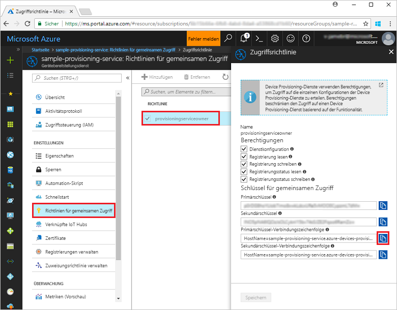
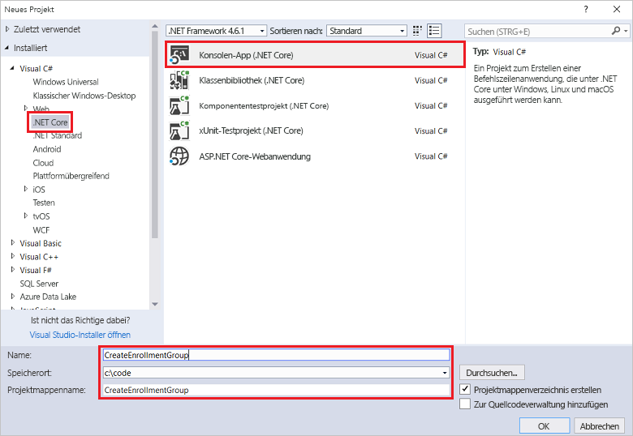
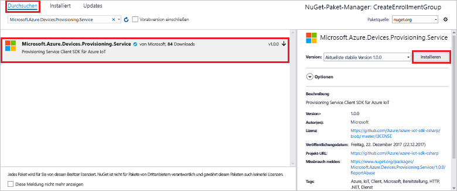
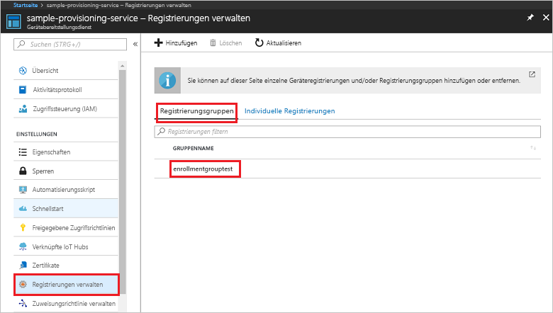

# <a name="enroll-x509-devices-to-iot-hub-device-provisioning-service-using-c-service-sdk"></a>Registrieren von X.509-Geräten für den IoT Hub Device Provisioning-Dienst per C#-Dienst-SDK

[!INCLUDE [iot-dps-selector-quick-enroll-device-x509](../../includes/iot-dps-selector-quick-enroll-device-x509.md)]


Mit diesen Schritten wird veranschaulicht, wie Sie programmgesteuert eine Registrierungsgruppe für ein X.509-Zwischenzertifikat oder -Stammzertifikat einer Zertifizierungsstelle erstellen, indem Sie das [C#-Dienst-SDK](https://github.com/Azure/azure-iot-sdk-csharp) und eine .NET Core-Anwendung in C# verwenden. Eine Registrierungsgruppe steuert den Zugriff auf den Bereitstellungsdienst für Geräte, die das gleiche allgemeine Signaturzertifikat in ihrer Zertifikatkette verwenden. Weitere Informationen finden Sie unter [Steuern des Gerätezugriffs auf den Bereitstellungsdienst mit X.509-Zertifikaten](./concepts-security.md#controlling-device-access-to-the-provisioning-service-with-x509-certificates). Weitere Informationen zur Verwendung der auf dem X.509-Zertifikat basierenden Public Key-Infrastruktur (PKI) mit Azure IoT Hub und dem Device Provisioning-Dienst finden Sie unter [Geräteauthentifizierung mit X.509-Zertifikaten](https://docs.microsoft.com/azure/iot-hub/iot-hub-x509ca-overview). Die Schritte in diesem Artikel funktionieren für Windows- und Linux-Computer, aber in diesem Artikel wird nur ein Windows-Entwicklungscomputer verwendet.

## <a name="prepare-the-development-environment"></a>Vorbereiten der Entwicklungsumgebung

1. Stellen Sie sicher, dass [Visual Studio 2017](https://www.visualstudio.com/vs/) auf Ihrem Computer installiert ist. 
2. Vergewissern Sie sich, dass auf Ihrem Computer das [.NET Core SDK](https://www.microsoft.com/net/download/windows) installiert ist. 
3. Führen Sie vor dem Fortfahren zunächst die Schritte unter [Einrichten des IoT Hub Device Provisioning-Diensts über das Azure-Portal](./quick-setup-auto-provision.md) aus.
4. Sie benötigen eine PEM- oder CER-Datei mit dem öffentlichen Teil eines X.509-Zwischenzertifikats oder -Stammzertifikats einer Zertifizierungsstelle, das für Ihren Bereitstellungsdienst hochgeladen und überprüft wurde. Das [Azure IoT C SDK](https://github.com/Azure/azure-iot-sdk-c) enthält Tools zum Erstellen einer X.509-Zertifikatkette, Hochladen eines Stamm- oder Zwischenzertifikats aus dieser Kette und Durchführen eines Eigentumsnachweises über den Dienst, um das Zertifikat zu überprüfen. Laden Sie zum Verwenden dieser Tools den Inhalt des Ordners [azure-iot-sdk-c/tools/CACertificates](https://github.com/Azure/azure-iot-sdk-c/tree/master/tools/CACertificates) in einen Arbeitsordner auf Ihrem Computer herunter, und führen Sie die Schritte unter [azure-iot-sdk-c\tools\CACertificates\CACertificateOverview.md](https://github.com/Azure/azure-iot-sdk-c/blob/master/tools/CACertificates/CACertificateOverview.md) aus. Zusätzlich zu den Tools im C SDK veranschaulicht das [Beispiel zum Überprüfen des Gruppenzertifikats](https://github.com/Azure/azure-iot-sdk-csharp/tree/master/provisioning/service/samples/GroupCertificateVerificationSample) im **C# Service SDK** das Ausführen eines Eigentumsnachweises für ein vorhandenes X.509-Zwischenzertifikat oder -Stammzertifikat einer Zertifizierungsstelle. 

  > [!IMPORTANT]
  > Die mit den SDK-Tools erstellten Zertifikate sind ausschließlich für die Verwendung in der Entwicklung vorgesehen. Informationen zum Abrufen von Zertifikaten für Produktionscode finden Sie in der Azure IoT Hub-Dokumentation unter [Abrufen eines X.509-Zertifizierungsstellenzertifikats](https://docs.microsoft.com/azure/iot-hub/iot-hub-x509ca-overview#how-to-get-an-x509-ca-certificate).

## <a name="get-the-connection-string-for-your-provisioning-service"></a>Abrufen einer Verbindungszeichenfolge für Ihren Bereitstellungsdienst

Für das Beispiel in dieser Schnellstartanleitung benötigen Sie die Verbindungszeichenfolge für Ihren Bereitstellungsdienst.
1. Melden Sie sich beim Azure-Portal an, klicken Sie im Menü auf der linken Seite auf die Schaltfläche **Alle Ressourcen**, und öffnen Sie Ihren Device Provisioning-Dienst. 
2. Klicken Sie auf **Freigegebene Zugriffsrichtlinien** und dann auf die gewünschte Zugriffsrichtlinie, um die dazugehörigen Eigenschaften zu öffnen. Kopieren Sie im Fenster **Zugriffsrichtlinie** die Primärschlüssel-Verbindungszeichenfolge, und notieren Sie sie. 

    

## <a name="create-the-enrollment-group-sample"></a>Erstellen des Registrierungsgruppenbeispiels 

Die Schritte in diesem Abschnitt zeigen, wie Sie eine .NET Core-Konsolen-App erstellen, die Ihrem Bereitstellungsdienst eine Registrierungsgruppe hinzufügt. Wenn Sie diese Schritte etwas abwandeln, können Sie damit auch eine [Windows IoT Core](https://developer.microsoft.com/en-us/windows/iot)-Konsolen-App zum Hinzufügen der Registrierungsgruppe erstellen. Weitere Informationen zum Entwickeln mit IoT Core finden Sie in der [Windows IoT Core-Dokumentation für Entwickler](https://docs.microsoft.com/windows/iot-core/).
1. Fügen Sie in Visual Studio einer neuen Projektmappe mithilfe der Projektvorlage **Konsolenanwendung (.NET Core)** ein Visual C#-Projekt für eine .NET Core-Konsolen-App hinzu. Stellen Sie sicher, dass .NET-Framework-Version 4.5.1 oder höher verwendet wird. Nennen Sie das Projekt **CreateEnrollmentGroup**.

    

2. Klicken Sie im Projektmappen-Explorer mit der rechten Maustaste auf das Projekt **CreateEnrollmentGroup**, und klicken Sie dann auf **NuGet-Pakete verwalten**.
3. Wählen Sie im Fenster **NuGet-Paket-Manager** die Option **Durchsuchen**, suchen Sie nach **Microsoft.Azure.Devices.Provisioning.Service**, und klicken Sie zum Installieren des Pakets **Microsoft.Azure.Devices.Provisioning.Service** auf **Installieren**. Akzeptieren Sie die Nutzungsbedingungen. Bei diesem Verfahren wird das NuGet-Paket mit dem [Client-SDK für den Azure IoT Provisioning-Dienst](https://www.nuget.org/packages/Microsoft.Azure.Devices.Provisioning.Service/) heruntergeladen und installiert und ein Verweis auf das Paket und seine Abhängigkeiten hinzugefügt.

    

4. Fügen Sie am Anfang der Datei **Program.cs** nach den anderen `using`-Anweisungen die folgenden `using`-Anweisungen hinzu:
   
   ```csharp
   using System.Security.Cryptography.X509Certificates;
   using System.Threading.Tasks;
   using Microsoft.Azure.Devices.Provisioning.Service;
   ```
    
5. Fügen Sie der **Program** -Klasse die folgenden Felder hinzu.  
   - Ersetzen Sie den Platzhalterwert **ProvisioningConnectionString** durch die Verbindungszeichenfolge des Bereitstellungsdiensts, für den Sie die Registrierung erstellen möchten.
   - Ersetzen Sie den Platzhalterwert **X509RootCertPath** durch den Pfad zu einer PEM- oder CER-Datei, die den öffentlichen Teil eines X.509-Zwischenzertifikats oder -Stammzertifikats einer Zertifizierungsstelle darstellt, das zuvor hochgeladen und durch Ihren Bereitstellungsdienst überprüft wurde.
   - Sie können den **EnrollmentGroupId**-Wert auch ändern. Die Zeichenfolge darf nur Kleinbuchstaben und Bindestriche enthalten. 

   > [!IMPORTANT]
   > Beachten Sie bei Produktionscode die folgenden Sicherheitshinweise:
   >
   > - Die Hartcodierung der Verbindungszeichenfolge für den Bereitstellungsdienstadministrator verstößt gegen die bewährten Methoden für die Sicherheit. Stattdessen sollte die Verbindungszeichenfolge sicher gespeichert werden, etwa in einer sicheren Konfigurationsdatei oder in der Registrierung.
   > - Achten Sie darauf, dass nur der öffentliche Teil des Signaturzertifikats hochgeladen wird. Laden Sie nie PFX-Dateien (PKCS12) oder PEM-Dateien mit privaten Schlüsseln in den Bereitstellungsdienst hoch.
        
   ```csharp
   private static string ProvisioningConnectionString = "{Your provisioning service connection string}";
   private static string EnrollmentGroupId = "enrollmentgrouptest";
   private static string X509RootCertPath = @"{Path to a .cer or .pem file for a verified root CA or intermediate CA X.509 certificate}";
   ```
    
6. Fügen Sie der **Program**-Klasse die folgende Methode hinzu. Dieser Code erstellt einen Registrierungsgruppeneintrag und ruft dann die **CreateOrUpdateEnrollmentGroupAsync**-Methode für **ProvisioningServiceClient** auf, um die Registrierungsgruppe zum Bereitstellungsdienst hinzuzufügen.
   
   ```csharp
   public static async Task RunSample()
   {
       Console.WriteLine("Starting sample...");
 
       using (ProvisioningServiceClient provisioningServiceClient =
               ProvisioningServiceClient.CreateFromConnectionString(ProvisioningConnectionString))
       {
           #region Create a new enrollmentGroup config
           Console.WriteLine("\nCreating a new enrollmentGroup...");
           var certificate = new X509Certificate2(X509RootCertPath);
           Attestation attestation = X509Attestation.CreateFromRootCertificates(certificate);
           EnrollmentGroup enrollmentGroup =
                   new EnrollmentGroup(
                           EnrollmentGroupId,
                           attestation)
                   {
                       ProvisioningStatus = ProvisioningStatus.Enabled
                   };
           Console.WriteLine(enrollmentGroup);
           #endregion
 
           #region Create the enrollmentGroup
           Console.WriteLine("\nAdding new enrollmentGroup...");
           EnrollmentGroup enrollmentGroupResult =
               await provisioningServiceClient.CreateOrUpdateEnrollmentGroupAsync(enrollmentGroup).ConfigureAwait(false);
           Console.WriteLine("\nEnrollmentGroup created with success.");
           Console.WriteLine(enrollmentGroupResult);
           #endregion
 
       }
   }
   ```

7. Ersetzen Sie schließlich den Text der Methode **Main** durch die folgenden Zeilen:
   
   ```csharp
   RunSample().GetAwaiter().GetResult();
   Console.WriteLine("\nHit <Enter> to exit ...");
   Console.ReadLine();
   ```
        
8. Erstellen Sie die Projektmappe.

## <a name="run-the-enrollment-group-sample"></a>Ausführen des Registrierungsgruppenbeispiels
  
1. Führen Sie das Beispiel in Visual Studio aus, um die Registrierungsgruppe zu erstellen.
 
2. Bei einer erfolgreichen Erstellung werden im Befehlsfenster die Eigenschaften der neuen Registrierungsgruppe angezeigt.

    

3. Um zu überprüfen, ob die Registrierungsgruppe erstellt wurde, klicken Sie im Azure-Portal auf dem Blatt „Zusammenfassung“ des Device Provisioning-Diensts auf **Registrierungen verwalten** und dann auf die Registerkarte **Registrierungsgruppen**. Sie sollten einen neuen Registrierungseintrag sehen, der der im Beispiel verwendeten Registrierungs-ID entspricht. Klicken Sie auf den Eintrag, um den Zertifikatfingerabdruck und andere Eigenschaften für den Eintrag zu überprüfen.

    
 
## <a name="clean-up-resources"></a>Bereinigen von Ressourcen
Wenn Sie planen, sich das C#-Dienstbeispiel näher anzusehen, sollten Sie die in dieser Schnellstartanleitung erstellten Ressourcen nicht bereinigen. Falls Sie nicht fortfahren möchten, führen Sie die folgenden Schritte aus, um alle erstellten Ressourcen zu löschen, die im Rahmen dieser Schnellstartanleitung erstellt wurden:

1. Schließen Sie das Ausgabefenster des C#-Beispiels auf Ihrem Computer.
2. Navigieren Sie im Azure-Portal zu Ihrem Device Provisioning-Dienst, klicken Sie auf **Registrierungen verwalten**, und wählen Sie anschließend die Registerkarte **Registrierungsgruppen**. Wählen Sie die *Registrierungs-ID* für den Registrierungseintrag aus, den Sie mit dieser Schnellstartanleitung erstellt haben, und klicken Sie oben auf dem Blatt auf die Schaltfläche **Löschen**.  
3. Klicken Sie im Azure-Portal für Ihren Device Provisioning-Dienst auf **Zertifikate**, auf das Zertifikat, das Sie für diesen Schnellstart hochgeladen haben, und dann oben im Fenster **Zertifikatdetails** auf die Schaltfläche **Löschen**.  
 
## <a name="next-steps"></a>Nächste Schritte
In dieser Schnellstartanleitung haben Sie eine Registrierungsgruppe für ein X.509-Zwischenzertifikat oder -Stammzertifikat einer Zertifizierungsstelle erstellt, indem Sie den Azure IoT Hub Device Provisioning-Dienst verwendet haben. Ausführlichere Informationen zur Gerätebereitstellung finden Sie im Tutorial zur Einrichtung des Device Provisioning-Diensts über das Azure-Portal. 
 
> [!div class="nextstepaction"]
> [Tutorials für den Azure IoT Hub Device Provisioning-Dienst](./tutorial-set-up-cloud.md)
