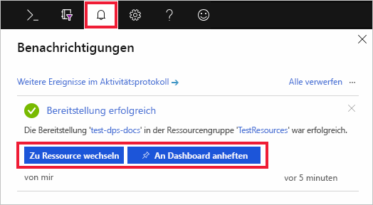

# Schnellstart: Einrichten des IoT Hub Device Provisioning-Diensts über das Azure-Portal

Diese Schritte veranschaulichen, wie Sie die Azure-Cloudressourcen im Portal für die Bereitstellung Ihrer Geräte einrichten. Dieser Artikel enthält Schritte für die Erstellung Ihres IoT Hub, die Erstellung eines neuen IoT Hub Device Provisioning-Diensts und die Verknüpfung der beiden Dienste. 

Wenn Sie kein Azure-Abonnement besitzen, können Sie ein [kostenloses Konto](https://azure.microsoft.com/free/?WT.mc_id=A261C142F) erstellen, bevor Sie beginnen.

## Erstellen eines IoT Hubs

[!INCLUDE [iot-hub-include-create-hub](../../includes/iot-hub-include-create-hub.md)]

## Erstellen einer neuen Instanz für den IoT Hub Device Provisioning-Dienst

1. Klicken Sie in der linken oberen Ecke des Azure-Portals auf die Schaltfläche **Ressource erstellen**.

2. Verwenden Sie die Option *Marketplace durchsuchen*, um den Marketplace nach dem **Device Provisioning-Dienst** zu durchsuchen. Wählen Sie den **IoT Hub Device Provisioning-Dienst** aus, und klicken Sie auf die Schaltfläche **Erstellen**. 

3. Geben Sie folgende Informationen für Ihre neue Instanz des Device Provisioning-Diensts an, und klicken Sie anschließend auf **Erstellen**.

    * **Name:** Geben Sie einen eindeutigen Namen für Ihre neue Instanz des Device Provisioning-Diensts an. Wenn der eingegebene Name verfügbar ist, wird ein grünes Häkchen angezeigt.
    * **Abonnement:** Wählen Sie das Abonnement aus, das Sie zum Erstellen dieser Instanz des Device Provisioning-Diensts verwenden möchten.
    * **Ressourcengruppe:** In diesem Feld können Sie eine neue Ressourcengruppe erstellen oder eine bereits vorhandene Ressourcengruppe für die neue Instanz auswählen. Wählen Sie die Ressourcengruppe aus, die auch die weiter oben erstellte IoT Hub-Instanz enthält (beispielsweise **TestResources**). Wenn Sie alle verwandten Ressourcen in einer Gruppe zusammenfassen, können Sie sie zusammen verwalten. Wenn Sie beispielsweise die Ressourcengruppe löschen, werden alle Ressourcen in dieser Gruppe gelöscht. Weitere Informationen finden Sie unter [Verwalten von Azure Resource Manager-Ressourcengruppen](../azure-resource-manager/manage-resource-groups-portal.md).
    * **Standort:** Wählen Sie den Standort aus, der Ihren Geräten am nächsten ist.

        

4. Klicken Sie auf die Benachrichtigungsschaltfläche, um die Erstellung der Ressourceninstanz zu überwachen. Klicken Sie nach erfolgreicher Bereitstellung des Diensts auf **An Dashboard anheften** und anschließend auf **Zu Ressource wechseln**.

    

## Verknüpfen von IoT Hub und Ihrem Device Provisioning-Dienst

In diesem Abschnitt fügen Sie der Instanz des Device Provisioning-Diensts eine Konfiguration hinzu. Diese Konfiguration legt die IoT Hub-Instanz fest, für die Geräte bereitgestellt werden.

1. Klicken Sie im Azure-Portal im Menü auf der linken Seite auf die Schaltfläche **Alle Ressourcen**. Wählen Sie die Instanz des Device Provisioning-Diensts aus, die Sie im vorherigen Abschnitt erstellt haben.  

2. Wählen Sie auf dem Zusammenfassungsblatt des Device Provisioning-Diensts die Option **Linked IoT hubs** (Verknüpfte IoT Hubs). Klicken Sie oben auf die Schaltfläche **+ Hinzufügen**. 

3. Geben Sie auf der Seite **Verknüpfung zu IoT Hub hinzufügen** die folgenden Informationen an, um Ihre neue Instanz des Device Provisioning-Diensts mit einer IoT Hub-Instanz zu verknüpfen. Klicken Sie anschließend auf **Speichern**. 

    * **Abonnement:** Wählen Sie das Abonnement mit der IoT Hub-Instanz aus, die Sie mit Ihrer neuen Instanz des Device Provisioning-Diensts verknüpfen möchten.
    * **IoT Hub:** Wählen Sie die IoT Hub-Instanz aus, die Sie mit Ihrer neuen Instanz des Device Provisioning-Diensts verknüpfen möchten.
    * **Zugriffsrichtlinie:** Wählen Sie **iothubowner** als Anmeldeinformationen für die Verknüpfung mit der IoT Hub-Instanz aus.  

        

3. Der ausgewählte Hub sollte jetzt unter dem Blatt **Linked IoT hubs** (Verknüpfte IoT Hubs) angezeigt werden. Unter Umständen müssen Sie auf **Aktualisieren** klicken, um **Linked IoT hubs** (Verknüpfte IoT Hubs) anzuzeigen.

## Bereinigen von Ressourcen

Andere Schnellstartanleitungen in dieser Sammlung bauen auf dieser Schnellstartanleitung auf. Wenn Sie planen, mit den nachfolgenden Schnellstarts oder Tutorials fortzufahren, sollten Sie die in diesem Schnellstart erstellten Ressourcen nicht bereinigen. Falls Sie nicht fortfahren möchten, können Sie die folgenden Schritte ausführen, um alle erstellten Ressourcen dieses Schnellstarts im Azure-Portal zu löschen.

1. Klicken Sie im Azure-Portal im linken Menü auf **Alle Ressourcen**, und wählen Sie Ihren Device Provisioning-Dienst aus. Klicken Sie im oberen Bereich des Blatts **Alle Ressourcen** auf **Löschen**.  
2. Klicken Sie im Azure-Portal im Menü auf der linken Seite auf **Alle Ressourcen**, und wählen Sie Ihre IoT Hub-Instanz aus. Klicken Sie im oberen Bereich des Blatts **Alle Ressourcen** auf **Löschen**.  

## Nächste Schritte

In dieser Schnellstartanleitung haben Sie eine IoT Hub-Instanz und eine Instanz des Device Provisioning-Diensts bereitgestellt und die beiden Ressourcen verknüpft. Sie können mit dem Schnellstart zur Erstellung eines simulierten Geräts fortfahren, um zu erfahren, wie Sie diese Einrichtung zum Bereitstellen eines simulierten Geräts verwenden.

> [!div class="nextstepaction"]
> [Schnellstart zum Erstellen eines simulierten Geräts](./quick-create-simulated-device.md)
