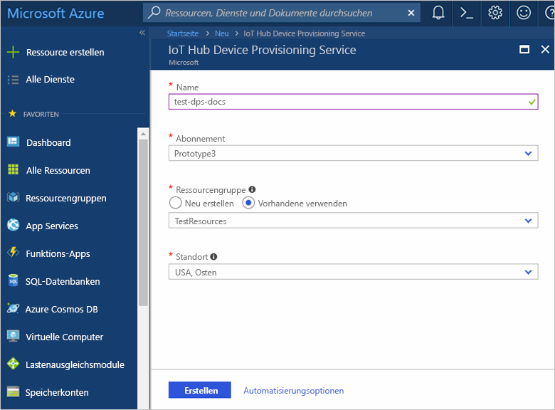
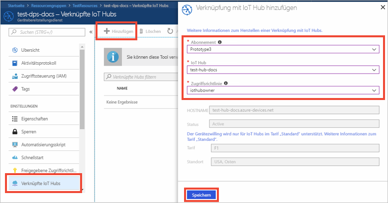

# Schnellstart: Einrichten des IoT Hub Device Provisioning-Diensts über das Azure-Portal

Der IoT Hub Device Provisioning Service kann mit IoT Hub verwendet werden, um die JIT-Bereitstellung im gewünschten IoT-Hub ohne manuelles Eingreifen zu ermöglichen, sodass Kunden Millionen von IoT-Geräten sicher und skalierbar bereitstellen können. Der Azure IOT Hub Device Provisioning Service unterstützt IoT-Geräte mit TPM, symmetrischem Schlüssel und X.509-Zertifikatauthentifizierungen. Weitere Informationen finden Sie unter [Bereitstellung von Geräten mit dem Azure IoT Hub Device Provisioning Service](./about-iot-dps.md).

In diesem Schnellstart erfahren Sie, wie Sie den IoT Hub Device Provisioning Service im Azure-Portal einrichten, um Ihre Geräte mit den folgenden Schritten bereitzustellen:
> [!div class="checklist"]
> * Erstellen eines IoT Hubs mit dem Azure-Portal
> * Erstellen eines IoT Hub Device Provisioning-Diensts und Abrufen des ID-Bereichs mit dem Azure-Portal
> * Verknüpfen von IoT Hub mit dem Device Provisioning-Dienst

Wenn Sie kein Azure-Abonnement besitzen, können Sie ein [kostenloses Konto](https://azure.microsoft.com/free/?WT.mc_id=A261C142F) erstellen, bevor Sie beginnen.

## Erstellen eines IoT Hubs

[!INCLUDE [iot-hub-include-create-hub](../../includes/iot-hub-include-create-hub.md)]

## Erstellen eines neuen IoT Hub Device Provisioning Service

1. Wählen Sie die Schaltfläche **+ Ressource erstellen** erneut aus.

2. Verwenden Sie die Option *Marketplace durchsuchen*, um den Marketplace nach **Device Provisioning Service** zu durchsuchen. Wählen Sie **IoT Hub Device Provisioning Service** und dann die Schaltfläche **Erstellen** aus. 

3. Geben Sie folgende Informationen für Ihre neue Device Provisioning Service-Instanz an, und wählen Sie **Erstellen** aus.

    * **Name:** Geben Sie einen eindeutigen Namen für Ihre neue Device Provisioning Service-Instanz an. Wenn der eingegebene Name verfügbar ist, wird ein grünes Häkchen angezeigt.
    * **Abonnement:** Wählen Sie das Abonnement aus, das Sie zum Erstellen dieser Device Provisioning Service-Instanz verwenden möchten.
    * **Ressourcengruppe:** In diesem Feld können Sie eine neue Ressourcengruppe erstellen oder eine bereits vorhandene Ressourcengruppe für die neue Instanz auswählen. Wählen Sie die Ressourcengruppe aus, die auch die weiter oben erstellte IoT Hub-Instanz enthält (beispielsweise **TestResources**). Wenn Sie alle verwandten Ressourcen in einer Gruppe zusammenfassen, können Sie sie zusammen verwalten. Wenn Sie beispielsweise die Ressourcengruppe löschen, werden alle Ressourcen in dieser Gruppe gelöscht. Weitere Informationen finden Sie unter [Verwalten von Azure Resource Manager-Ressourcengruppen](../azure-resource-manager/management/manage-resource-groups-portal.md).
    * **Standort:** Wählen Sie den Standort aus, der Ihren Geräten am nächsten ist.

        

4. Wählen Sie die Benachrichtigungsschaltfläche aus, um die Erstellung der Ressourceninstanz zu überwachen. Wählen Sie nach erfolgreicher Bereitstellung des Diensts die Option **An Dashboard anheften** und dann **Zu Ressource wechseln** aus.

    

## Verknüpfen des IoT-Hubs und Ihres Gerätebereitstellungsdiensts

In diesem Abschnitt fügen Sie der Device Provisioning Service-Instanz eine Konfiguration hinzu. Diese Konfiguration legt die IoT Hub-Instanz fest, für die Geräte bereitgestellt werden.

1. Wählen Sie im Azure-Portal im Menü links die Schaltfläche **Alle Ressourcen** aus. Wählen Sie die Instanz des Device Provisioning-Diensts aus, die Sie im vorherigen Abschnitt erstellt haben. 

    Ist Ihr Menü mit dem **Flyout**-Modus anstelle des **angedockten Modus** in den Portaleinstellungen konfiguriert, müssen Sie oben links auf die drei Linien klicken, um das Portalmenü links zu öffnen.  

2. Wählen Sie im Menü von Device Provisioning Service die Option **Verknüpfte IoT Hubs** aus. Wählen Sie oben die Schaltfläche **+ Hinzufügen** aus. 

3. Geben Sie auf der Seite **Verknüpfung zu IoT Hub hinzufügen** die folgenden Informationen an, um Ihre neue Instanz des Device Provisioning-Diensts mit einer IoT Hub-Instanz zu verknüpfen. Wählen Sie dann **Speichern** aus. 

    * **Abonnement:** Wählen Sie das Abonnement mit dem IoT-Hub aus, den Sie mit Ihrer neuen Device Provisioning Service-Instanz verknüpfen möchten.
    * **IoT Hub:** Wählen Sie den IoT-Hub aus, den Sie mit Ihrer neuen Device Provisioning Service-Instanz verknüpfen möchten.
    * **Zugriffsrichtlinie:** Wählen Sie **iothubowner** als Anmeldeinformationen für die Verknüpfung mit der IoT Hub-Instanz aus.  

        

3. Der ausgewählte Hub sollte jetzt unter dem Blatt **Linked IoT hubs** (Verknüpfte IoT Hubs) angezeigt werden. Möglicherweise müssen Sie **Aktualisieren** auswählen, damit sie angezeigt wird.

## Bereinigen von Ressourcen

Andere Schnellstarts in dieser Sammlung bauen auf diesem Schnellstart auf. Wenn Sie planen, mit den nachfolgenden Schnellstarts oder Tutorials fortzufahren, sollten Sie die in diesem Schnellstart erstellten Ressourcen nicht bereinigen. Falls Sie nicht fortfahren möchten, können Sie die folgenden Schritte ausführen, um alle erstellten Ressourcen dieses Schnellstarts im Azure-Portal zu löschen.

1. Wählen Sie im Azure-Portal im Menü links **Alle Ressourcen** und dann Ihren Gerätebereitstellungsdienst aus. Wählen Sie oben im Bereich mit den Gerätedetails **Löschen** aus.  
2. Wählen Sie im linken Menü im Azure-Portal **Alle Ressourcen** und dann Ihren IoT-Hub aus. Wählen Sie oben im Bereich mit den Hubdetails **Löschen** aus.  

## Nächste Schritte

In diesem Schnellstart haben Sie einen IoT-Hub und einen Gerätebereitstellungsdienst bereitgestellt und die beiden Ressourcen verknüpft. Sie können mit dem Schnellstart zur Erstellung eines simulierten Geräts fortfahren, um zu erfahren, wie Sie diese Einrichtung zum Bereitstellen eines simulierten Geräts verwenden.

> [!div class="nextstepaction"]
> [Schnellstart zum Erstellen eines simulierten Geräts](./quick-create-simulated-device-symm-key.md)
