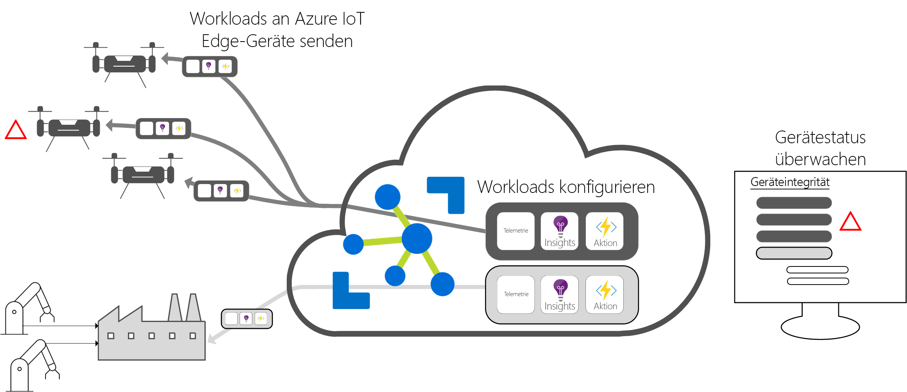

# Was ist Azure IoT Edge?

Azure IoT Edge verschiebt Cloudanalysen und benutzerdefinierte Geschäftslogik auf Geräte, damit sich Ihre Organisation auf geschäftliche Erkenntnisse konzentrieren kann und sich nicht mit der Datenverwaltung befassen muss. Erweitern Sie Ihre IoT-Lösung, indem Sie Ihre Geschäftslogik in Standardcontainer packen, dann können Sie diese Container für jedes Ihrer Geräte bereitstellen und es über die Cloud überwachen. 

Analysen (Analytics) sind die Grundlage des geschäftlichen Nutzens von IoT-Lösungen, aber nicht alle Analysen müssen sich in der Cloud befinden. Wenn Sie so schnell wie möglich auf Notfälle reagieren möchten, können Sie die Workloads zur Anomalieerkennung im Edge-Bereich ausführen. Wenn Sie die Bandbreitenkosten reduzieren und die Übertragung von Terabytes unformatierter Daten vermeiden möchten, können Sie die Daten lokal bereinigen und aggregieren und dann nur die Erkenntnisse zur Analyse an die Cloud senden. 

Azure IoT Edge besteht aus drei Komponenten:
* **IoT Edge-Module** sind Container, die Azure-Dienste, Drittanbieterdienste oder Ihren eigenen Code ausführen. Module werden auf IoT Edge-Geräten bereitgestellt und lokal auf diesen Geräten ausgeführt. 
* Die **IoT Edge-Runtime** wird auf jedem IoT Edge-Gerät ausgeführt und dient zum Verwalten der Module, die auf einem Gerät jeweils bereitgestellt wurden. 
* Mit einer **cloudbasierten Schnittstelle** können Sie für IoT Edge-Geräte die Remoteüberwachung und -verwaltung durchführen.

>[!NOTE]
>Azure IoT Edge ist im Free- und Standard-Tarif von IoT Hub verfügbar. Der Free-Tarif ist ausschließlich für Tests und Bewertungen vorgesehen. Weitere Informationen zu den Tarifen „Basic“ und „Standard“ finden Sie unter [Choose the right IoT Hub tier for your solution](../iot-hub/iot-hub-scaling.md) (Wählen des passenden IoT Hub-Tarifs für Ihre Lösung).

## IoT Edge-Module

IoT Edge-Module sind Ausführungseinheiten, die als Docker-kompatible Container implementiert werden und Ihre Geschäftslogik im Edge-Bereich ausführen. Es können mehrere Module konfiguriert werden, die miteinander kommunizieren und eine Pipeline für die Datenverarbeitung bilden. Sie können benutzerdefinierte Module entwickeln oder bestimmte Azure-Dienste in Modulen verpacken, die offline und im Edge-Bereich Erkenntnisse liefern. 

### Funktionen für künstliche Intelligenz auf Edge-Ebene

Mit Azure IoT Edge können Sie eine komplexe Ereignisverarbeitung, Machine Learning, Bilderkennung und andere KI-Komponenten mit hohem Nutzen bereitstellen, ohne diese intern schreiben zu müssen. Azure-Dienste wie Azure Functions, Azure Stream Analytics und Azure Machine Learning können allesamt lokal per Azure IoT Edge ausgeführt werden. Sie können jedoch nicht nur Azure-Dienste einsetzen. Alle Benutzer können KI-Module erstellen und über den Azure Marketplace für die Community verfügbar machen. 

### Verwenden von eigenem Code

Wenn Sie Ihren eigenen Code auf Ihren Geräten bereitstellen möchten, wird dies von Azure IoT Edge ebenfalls unterstützt. Azure IoT Edge enthält das gleiche Programmiermodell wie die anderen Azure IoT-Dienste. Derselbe Code kann auf einem Gerät oder in der Cloud ausgeführt werden. Azure IoT Edge unterstützt sowohl Linux als auch Windows, damit Sie für die Codierung die Plattform Ihrer Wahl nutzen können. Java, .NET Core 2.0, Node.js, C und Python werden unterstützt, damit Ihre Entwickler das Codieren in einer vertrauten Sprache durchführen und vorhandene Geschäftslogik verwenden können.

## IoT Edge-Laufzeit

Mit der Azure IoT Edge-Laufzeit wird die benutzerdefinierte Logik und Cloudlogik auf IoT Edge-Geräten aktiviert. Sie befindet sich auf dem IoT Edge-Gerät und ist für die Durchführung von Verwaltungs- und Kommunikationsvorgängen bestimmt. Mit der Laufzeit werden mehrere Funktionen durchgeführt:

* Installieren und Aktualisieren von Workloads auf dem Gerät
* Aufrechterhalten von Azure IoT Edge-Sicherheitsstandards auf dem Gerät
* Sicherstellen, dass die IoT Edge-Module immer ausgeführt werden
* Melden der Modulintegrität an die Cloud für die Remoteüberwachung
* Verwalten der Kommunikation zwischen nachgeschalteten Blattknotengeräten und einem IoT Edge-Gerät, zwischen Modulen auf einem IoT Edge-Gerät sowie zwischen einem IoT Edge-Gerät und der Cloud.

Sie können frei entscheiden, wie Sie ein Azure IoT Edge-Gerät einsetzen. Die Runtime wird häufig zum Bereitstellen von KI-Komponenten für Gatewaygeräte verwendet, mit denen Daten anderer lokaler Geräte aggregiert und verarbeitet werden. Dieses Bereitstellungsmodell ist jedoch nur eine der möglichen Optionen. 

Die Azure IoT Edge-Laufzeit kann auf einem umfangreichen IoT-Gerätesatz ausgeführt werden, damit die Laufzeit auf viele verschiedene Arten genutzt werden kann. Es werden sowohl Linux- als auch Windows-Betriebssysteme unterstützt, und Hardwaredetails werden abstrahiert. Verwenden Sie ein kleineres Gerät als einen Raspberry Pi 3, wenn Sie nicht viele Daten verarbeiten oder einen Industrieserver verwenden, um ressourcenintensive Workloads auszuführen.

## IoT Edge-Cloudschnittstelle

Es ist schwierig, den Softwarelebenszyklus für Millionen von IoT-Geräten zu verwalten, da es sich häufig um verschiedene Fabrikate und Modelle handelt, die unter Umständen auch geografisch verstreut sind. Workloads sind für einen bestimmten Typ von Gerät erstellt und konfiguriert und werden für alle Ihre Geräte bereitgestellt und überwacht, um Geräte mit Fehlfunktionen zu ermitteln. Diese Aktivitäten können nicht pro Gerät durchgeführt werden und müssen bedarfsabhängig erfolgen.

Azure IoT Edge kann nahtlos in Azure IoT Solution Accelerators integriert werden, um als Steuerungsebene für die Anforderungen Ihrer Lösung zu dienen. Mit Clouddiensten haben Sie folgende Möglichkeiten:

* Erstellen und konfigurieren Sie eine Workload, die auf einem bestimmten Typ von Gerät ausgeführt wird.
* Senden Sie eine Workload an eine Gruppe von Geräten.
* Überwachen Sie Workloads, die auf Geräten im Feld ausgeführt werden.

## Nächste Schritte

Probieren Sie diese Konzepte aus, indem Sie [IoT Edge auf einem simulierten Gerät bereitstellen](quickstart.md).