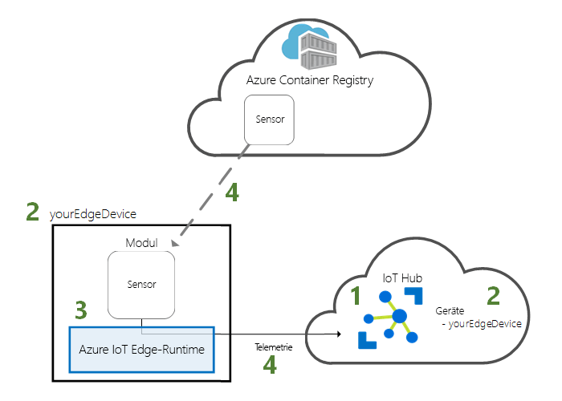
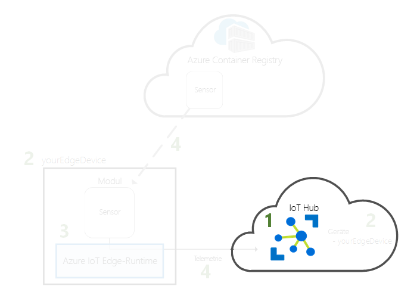
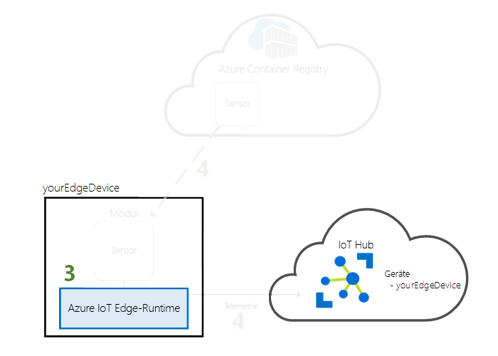
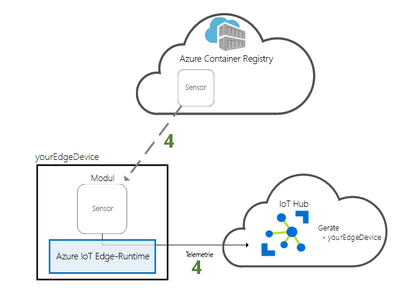

# <a name="quickstart-deploy-your-first-iot-edge-module-to-a-linux-x64-device"></a>Schnellstart: Bereitstellen des ersten IoT Edge-Moduls auf einem Linux-basierten x64-Gerät

Mit Azure IoT Edge werden die Vorteile der Cloud auf Ihre IoT-Geräte übertragen. In dieser Schnellstartanleitung erfahren Sie, wie Sie die Cloudschnittstelle für die Remotebereitstellung von vordefiniertem Code auf einem IoT Edge-Gerät verwenden.

In dieser Schnellstartanleitung wird Folgendes vermittelt:

1. Erstellen Sie einen IoT Hub.
2. Registrieren eines IoT Edge-Geräts für Ihren IoT Hub
3. Installieren und Starten der IoT Edge-Runtime auf Ihrem Gerät
4. Durchführen der Remotebereitstellung eines Moduls auf einem IoT Edge-Gerät



In dieser Schnellstartanleitung wird Ihr Linux-Computer bzw. virtueller Computer in ein IoT Edge-Gerät verwandelt. Anschließend können Sie ein Modul aus dem Azure-Portal auf Ihrem Gerät bereitstellen. Das Modul, das Sie in dieser Schnellstartanleitung bereitstellen, ist ein simulierter Sensor, mit dem Daten zu Temperatur, Luftfeuchtigkeit und Luftdruck generiert werden. Die anderen Tutorials zu Azure IoT Edge bauen darauf auf und erläutern die Bereitstellung von Modulen, mit denen die simulierten Daten analysiert werden, um geschäftsrelevante Erkenntnisse zu gewinnen.

Wenn Sie über kein aktives Azure-Abonnement verfügen, können Sie ein [kostenloses Konto](https://azure.microsoft.com/free) erstellen, bevor Sie beginnen.

[!INCLUDE [cloud-shell-try-it.md](../../includes/cloud-shell-try-it.md)]

Sie verwenden die Azure CLI für viele Schritte in dieser Schnellstartanleitung, und Azure IoT verfügt über eine Erweiterung zur Aktivierung der zusätzlichen Funktionalität. 

Fügen Sie die Azure IoT-Erweiterung der Cloud Shell-Instanz hinzu.

   ```azurecli-interactive
   az extension add --name azure-cli-iot-ext
   ```

## <a name="prerequisites"></a>Voraussetzungen

Cloudressourcen: 

* Eine Ressourcengruppe zum Verwalten aller Ressourcen, die Sie in dieser Schnellstartanleitung verwenden. 

   ```azurecli-interactive
   az group create --name IoTEdgeResources --location westus2
   ```

IoT Edge-Gerät:

* Ein Linux-Gerät oder ein virtueller Linux-Computer als IoT Edge-Gerät. Es empfiehlt sich, den von Microsoft bereitgestellten virtuellen Computer [Azure IoT Edge on Ubuntu](https://azuremarketplace.microsoft.com/en-us/marketplace/apps/microsoft_iot_edge.iot_edge_vm_ubuntu) zu verwenden, der alles vorinstalliert, was Sie zum Ausführen von IoT Edge auf einem Gerät benötigen. Erstellen Sie diesen virtuellen Computer mit dem folgenden Befehl:

   ```azurecli-interactive
   az vm create --resource-group IoTEdgeResources --name EdgeVM --image microsoft_iot_edge:iot_edge_vm_ubuntu:ubuntu_1604_edgeruntimeonly:latest --admin-username azureuser --generate-ssh-keys --size Standard_DS1_v2
   ```

   Das Erstellen und Starten des neuen virtuellen Computers kann ein paar Minuten in Anspruch nehmen. 

   Notieren Sie sich beim Erstellen eines neuen virtuellen Computers den Wert für **publicIpAddress**, der im Rahmen der Befehlsausgabe für die Erstellung bereitgestellt wird. Mit dieser öffentlichen IP-Adresse stellen Sie später in dieser Schnellstartanleitung eine Verbindung mit dem virtuellen Computer her.

* Falls Sie die Ausführung der Azure IoT Edge-Runtime auf Ihrem lokalen System vorziehen, hilft Ihnen die Anleitung unter [Installieren der Azure IoT Edge-Runtime unter Linux (x64)](how-to-install-iot-edge-linux.md) weiter.

* Wenn Sie ein ARM32-basiertes Gerät verwenden möchten, z.B. Raspberry Pi, hilft Ihnen die Anleitung unter [Installieren der Azure IoT Edge-Runtime unter Linux (ARM32v7/armhf)](how-to-install-iot-edge-linux-arm.md) weiter.

## <a name="create-an-iot-hub"></a>Erstellen eines IoT Hubs

Beginnen Sie den Schnellstart, indem Sie an der Azure-Befehlszeilenschnittstelle einen IoT-Hub erstellen.



Der kostenlose IoT Hub kann für diesen Schnellstart verwendet werden. Wenn Sie den IoT Hub schon einmal genutzt und bereits einen kostenlosen Hub erstellt haben, können Sie diesen IoT Hub verwenden. Jedes Abonnement kann nur über einen kostenlosen IoT Hub verfügen. 

Mit dem folgenden Code wird ein kostenloser **F1**-Hub in der Ressourcengruppe **IoTEdgeResources** erstellt. Ersetzen Sie *{hub_name}* durch einen eindeutigen Namen für Ihren IoT Hub.

   ```azurecli-interactive
   az iot hub create --resource-group IoTEdgeResources --name {hub_name} --sku F1 
   ```

   Wenn Sie eine Fehlermeldung erhalten, da bereits ein kostenloser Hub in Ihrem Abonnement vorhanden ist, ändern Sie die SKU auf **S1**. Sollten Sie eine Fehlermeldung mit dem Hinweis erhalten, dass der IoT Hub-Name nicht verfügbar ist, ist bereits ein Hub mit diesem Namen vorhanden. Probieren Sie einen neuen Namen aus. 

## <a name="register-an-iot-edge-device"></a>Registrieren eines IoT Edge-Geräts

Registrieren Sie ein IoT Edge-Gerät bei Ihrem neu erstellten IoT Hub.


Erstellen Sie eine Geräteidentität für das IoT Edge-Gerät, sodass es mit dem IoT Hub kommunizieren kann. Die Geräteidentität befindet sich in der Cloud, und Sie verwenden eine eindeutige Geräte-Verbindungszeichenfolge, um einem physischen Gerät eine Geräteidentität zuzuordnen. 

Da IoT Edge-Geräte sich von typischen IoT-Geräten unterscheiden und auf unterschiedliche Weise verwaltet werden können, deklarieren Sie diese Identität mit dem Flag `--edge-enabled` für ein IoT Edge-Gerät. 

1. Geben Sie in Azure Cloud Shell den folgenden Befehl ein, um in Ihrem Hub ein Gerät mit dem Namen **myEdgeDevice** zu erstellen.

   ```azurecli-interactive
   az iot hub device-identity create --hub-name {hub_name} --device-id myEdgeDevice --edge-enabled
   ```

   Falls Sie eine Fehlermeldung zu iothubowner-Richtlinienschlüsseln erhalten, überprüfen Sie, ob in Ihrer Cloud Shell-Instanz die aktuelle Version der Erweiterung „azure-cli-iot-ext“ ausgeführt wird. 

2. Rufen Sie die Verbindungszeichenfolge für Ihr Gerät ab, über die Ihr physisches Gerät mit seiner Identität auf dem IoT Hub verknüpft wird. 

   ```azurecli-interactive
   az iot hub device-identity show-connection-string --device-id myEdgeDevice --hub-name {hub_name}
   ```

3. Kopieren Sie die Verbindungszeichenfolge aus der JSON-Ausgabe, und speichern Sie sie. Sie verwenden diesen Wert, um im nächsten Abschnitt die IoT Edge-Runtime zu konfigurieren.

   

## <a name="configure-your-iot-edge-device"></a>Konfigurieren Sie Ihr IoT Edge-Gerät

Starten Sie die Azure IoT Edge-Runtime auf Ihrem IoT Edge-Gerät. 



Die IoT Edge-Runtime wird auf allen IoT Edge-Geräten bereitgestellt. Sie besteht aus drei Komponenten. Der **Daemon für die IoT Edge-Sicherheit** wird jedes Mal gestartet, wenn ein Edge-Gerät gestartet wird, und startet den IoT Edge-Agent, um einen Bootstrapvorgang durchzuführen. Der **IoT Edge-Agent** erleichtert die Bereitstellung und Überwachung von Modulen auf dem IoT Edge-Gerät, einschließlich des IoT Edge-Hubs. Der **IoT Edge-Hub** verwaltet die Kommunikation zwischen Modulen auf dem IoT Edge-Gerät sowie zwischen dem Gerät und IoT Hub. 

Bei der Konfiguration der Runtime geben Sie eine Geräte-Verbindungszeichenfolge ein. Verwenden Sie die Zeichenfolge, die Sie über die Azure CLI abgerufen haben. Diese Zeichenfolge ordnet Ihr physisches Gerät der IoT Edge-Geräteidentität in Azure zu. 

### <a name="set-the-connection-string-on-the-iot-edge-device"></a>Festlegen der Verbindungszeichenfolge auf dem Azure IoT Edge-Gerät

Wenn Sie den virtuellen Computer mit Azure IoT Edge unter Ubuntu verwenden, der in den Voraussetzungen empfohlen wurde, ist auf Ihrem Gerät die IoT Edge-Runtime bereits installiert. Sie brauchen Ihr Gerät lediglich mit der Verbindungszeichenfolge zu konfigurieren, die Sie im vorherigen Abschnitt abgerufen haben. Sie können dies remote erledigen, ohne eine Verbindung mit dem virtuellen Computer herstellen zu müssen. Führen Sie den folgenden Befehl aus, und ersetzen Sie dabei **{device_connection_string}** durch Ihre eigene Zeichenfolge. 

   ```azurecli-interactive
   az vm run-command invoke -g IoTEdgeResources -n EdgeVM --command-id RunShellScript --script '/etc/iotedge/configedge.sh "{device_connection_string}"'
   ```

Wenn Sie IoT Edge auf Ihrem lokalen Computer oder einem ARM32-Gerät ausführen, müssen Sie die IoT Edge-Runtime und deren Voraussetzungen auf Ihrem Gerät installieren. Befolgen Sie die Anweisungen in [Installieren von Azure IoT Edge-Runtime unter Linux (x64)](how-to-install-iot-edge-linux.md) oder [Installieren von Azure IoT Edge-Runtime unter Linux (ARM32v7/armhf)](how-to-install-iot-edge-linux-arm.md), und kehren Sie dann zu dieser Schnellstartanleitung zurück. 

### <a name="view-the-iot-edge-runtime-status"></a>Anzeigen des Status der IoT Edge-Runtime

Die verbleibenden Befehle in dieser Schnellstartanleitung werden auf Ihrem IoT Edge-Gerät ausgeführt, Sie können also sehen, was auf dem Gerät geschieht. Wenn Sie einen virtuellen Computer verwenden, stellen Sie jetzt mithilfe der öffentlichen IP-Adresse, die vom Erstellungsbefehl ausgegeben wurde, eine Verbindung mit diesem Computer her. Die öffentliche IP-Adresse finden Sie auch auf der Seite „Übersicht“ Ihres virtuellen Computers im Azure-Portal. Verwenden Sie den folgenden Befehl, um eine Verbindung mit Ihrem virtuellen Computer herzustellen. Ersetzen Sie **{azureuser}**, wenn Sie einen anderen als den in den Voraussetzungen vorgeschlagenen Benutzernamen verwendet haben. Ersetzen Sie **{publicIpAddress}** durch die Adresse Ihres Computers. 

   ```azurecli-interactive
   ssh azureuser@{publicIpAddress}
   ```

Vergewissern Sie sich, dass die Runtime erfolgreich auf Ihrem IoT Edge-Gerät installiert und konfiguriert wurde. 

>[!TIP]
>Sie benötigen erhöhte Rechte zum Ausführen von `iotedge`-Befehlen. Nachdem Sie sich bei Ihrem Computer abgemeldet und sich nach der Installation der IoT Edge-Runtime zum ersten Mal erneut angemeldet haben, werden Ihre Berechtigungen automatisch aktualisiert. Verwenden Sie bis dahin **sudo** vor den Befehlen. 

1. Überprüfen Sie, ob der Daemon für die Azure Edge-Sicherheit als Systemdienst ausgeführt wird.

   ```bash
   sudo systemctl status iotedge
   ```

   

2. Sollte eine Problembehandlung für den Dienst erforderlich sein, rufen Sie die Dienstprotokolle ab. 

   ```bash
   journalctl -u iotedge
   ```

3. Zeigen Sie die Module an, die auf Ihrem Gerät ausgeführt werden. 

   ```bash
   sudo iotedge list
   ```

   

Ihr IoT Edge-Gerät ist jetzt konfiguriert. Es kann nun zum Ausführen von in der Cloud bereitgestellten Modulen verwendet werden. 

## <a name="deploy-a-module"></a>Bereitstellen eines Moduls

Verwalten Sie Ihr Azure IoT Edge-Gerät über die Cloud, um ein Modul bereitzustellen, das Telemetriedaten an die IoT Hub-Instanz sendet.


[!INCLUDE [iot-edge-deploy-module](../../includes/iot-edge-deploy-module.md)]

## <a name="view-generated-data"></a>Anzeigen generierter Daten

In diesem Schnellstart haben Sie ein neues IoT Edge-Gerät erstellt und die IoT Edge-Runtime darauf installiert. Anschließend haben Sie das Azure-Portal verwendet, um ein IoT Edge-Modul zur Ausführung auf dem Gerät bereitzustellen, ohne Änderungen am Gerät selbst vornehmen zu müssen. 

In diesem Fall erstellt das per Pushvorgang übertragene Modul Beispieldaten, die Sie für das Testen verwenden können. Mit dem simulierten Temperatursensormodul werden Umgebungsdaten generiert, die Sie später zum Testen verwenden können. Der simulierte Sensor überwacht sowohl einen Computer als auch seine Umgebung. Beispielsweise kann sich dieser Sensor in einem Serverraum, in einer Fabrik oder in einer Windturbine befinden. Er meldet die Umgebungstemperatur und Luftfeuchtigkeit, die Computertemperatur und den Druck sowie einen Zeitstempel. In den IoT Edge-Tutorials werden diese vom Modul erstellten Daten als Testdaten für die Analyse verwendet.

Öffnen Sie die Eingabeaufforderung erneut auf Ihrem IoT Edge-Gerät, oder verwenden Sie die SSH-Verbindung über die Azure CLI. Vergewissern Sie sich, dass das über die Cloud bereitgestellte Modul auf dem IoT Edge-Gerät ausgeführt wird:

   ```bash
   sudo iotedge list
   ```

   

Anzeigen der Nachrichten, die vom Temperatursensormodul gesendet werden:

   ```bash
   sudo iotedge logs SimulatedTemperatureSensor -f
   ```

   >[!TIP]
   >Bei IoT Edge-Befehlen werden beim Verweis auf Modulnamen Groß- und Kleinschreibung unterschieden.

   

Sie können die bei Ihrem IoT-Hub eingehenden Nachrichten auch mit der [Azure IoT Hub-Toolkit-Erweiterung für Visual Studio Code](https://marketplace.visualstudio.com/items?itemName=vsciot-vscode.azure-iot-toolkit) (bisher als Azure IoT-Toolkit-Erweiterung bekannt) anzeigen. 

## <a name="clean-up-resources"></a>Bereinigen von Ressourcen

Wenn Sie mit den IoT Edge-Tutorials fortfahren möchten, können Sie das Gerät verwenden, das Sie in dieser Schnellstartanleitung registriert und eingerichtet haben. Andernfalls können Sie die Azure-Ressourcen löschen, die Sie erstellt haben, und die IoT Edge-Runtime von Ihrem Gerät entfernen.

### <a name="delete-azure-resources"></a>Löschen von Azure-Ressourcen

Wenn Sie Ihren virtuellen Computer und Azure IoT Hub in einer neuen Ressourcengruppe erstellt haben, können Sie diese Gruppe und alle zugehörigen Ressourcen löschen. Überprüfen Sie den Inhalt der Ressourcengruppe, um sicherzustellen, dass sie keine Elemente enthält, die Sie behalten möchten. Wenn Sie nicht die gesamte Gruppe löschen möchten, können Sie stattdessen einzelne Ressourcen löschen.

Entfernen Sie die Gruppe **IoTEdgeResources**.

   ```azurecli-interactive
   az group delete --name IoTEdgeResources 
   ```

### <a name="remove-the-iot-edge-runtime"></a>Entfernen der IoT Edge-Runtime

Verwenden Sie die folgenden Befehle, wenn Sie die Installationen von Ihrem Gerät entfernen möchten.  

Entfernen Sie die IoT Edge-Runtime.

   ```bash
   sudo apt-get remove --purge iotedge
   ```

Entfernen Sie die Containerruntime.

   ```bash
   sudo apt-get remove --purge moby-cli
   sudo apt-get remove --purge moby-engine
   ```

## <a name="next-steps"></a>Nächste Schritte

Diese Schnellstartanleitung ist die Voraussetzung für alle IoT Edge-Tutorials. Sie können mit einem der anderen Tutorials fortfahren, um zu erfahren, wie Azure IoT Edge Ihnen beim Umwandeln dieser Daten in geschäftliche Erkenntnisse auf Edge-Ebene helfen kann.

> [!div class="nextstepaction"]
> [Filtern von Sensordaten mit einer Azure-Funktion](tutorial-deploy-function.md)
