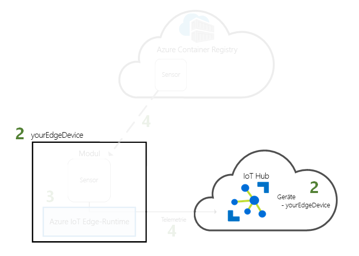
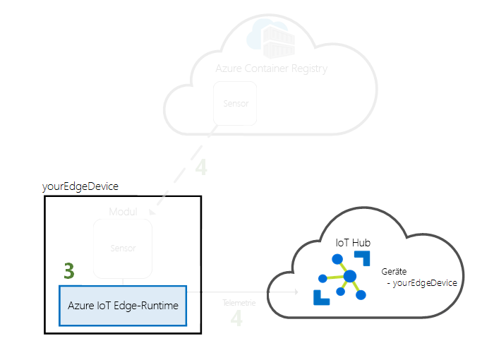

# <a name="quickstart-deploy-your-first-iot-edge-module-from-the-azure-portal-to-a-windows-device---preview"></a>Schnellstartanleitung: Bereitstellen des ersten IoT Edge-Moduls aus dem Azure-Portal auf einem Windows-Gerät – Vorschau

Bei dieser Schnellstartanleitung verwenden Sie die Azure IoT Edge-Cloudschnittstelle zur Remotebereitstellung von vorgefertigtem Code auf einem IoT Edge-Gerät. Für diese Aufgabe verwenden Sie zunächst Ihr Windows-Gerät, um ein IoT Edge-Gerät zu simulieren. Anschließend können Sie darauf ein Modul bereitstellen.

In dieser Schnellstartanleitung wird Folgendes vermittelt:

1. Erstellen Sie einen IoT Hub.
2. Registrieren eines IoT Edge-Geräts für Ihren IoT Hub
3. Installieren und Starten der IoT Edge-Runtime auf Ihrem Gerät
4. Durchführen der Remotebereitstellung eines Moduls für ein IoT Edge-Gerät und Senden von Telemetriedaten an den IoT Hub


Das Modul, das Sie in dieser Schnellstartanleitung bereitstellen, ist ein simulierter Sensor, mit dem Daten zu Temperatur, Luftfeuchtigkeit und Luftdruck generiert werden. Die anderen Tutorials zu Azure IoT Edge bauen darauf auf und erläutern die Bereitstellung von Modulen, mit denen die simulierten Daten analysiert werden, um geschäftsrelevante Erkenntnisse zu gewinnen.

>[!NOTE]
>Die IoT Edge-Runtime unter Windows befindet sich in der [öffentlichen Vorschauphase](https://azure.microsoft.com/support/legal/preview-supplemental-terms/).

Wenn Sie über kein aktives Azure-Abonnement verfügen, können Sie ein [kostenloses Konto](https://azure.microsoft.com/free) erstellen, bevor Sie beginnen.

[!INCLUDE [cloud-shell-try-it.md](../../includes/cloud-shell-try-it.md)]

Sie verwenden die Azure CLI für viele Schritte in dieser Schnellstartanleitung, und Azure IoT verfügt über eine Erweiterung zur Aktivierung der zusätzlichen Funktionalität.

Fügen Sie die Azure IoT-Erweiterung der Cloud Shell-Instanz hinzu.

   ```azurecli-interactive
   az extension add --name azure-cli-iot-ext
   ```

## <a name="prerequisites"></a>Voraussetzungen

Cloudressourcen:

* Eine Ressourcengruppe zum Verwalten aller Ressourcen, die Sie in dieser Schnellstartanleitung verwenden.

   ```azurecli-interactive
   az group create --name IoTEdgeResources --location westus
   ```

IoT Edge-Gerät:

* Ein Windows-Computer oder virtueller Computer als IoT Edge-Gerät. Verwenden Sie eine unterstützte Windows-Version:
  * Windows 10 oder höher
  * Windows Server 2016 oder höher
* Stellen Sie bei Verwendung eines Windows-Computers sicher, dass dieser die [Systemanforderungen](https://docs.microsoft.com/virtualization/hyper-v-on-windows/reference/hyper-v-requirements) für Hyper-V erfüllt.
* Wenn es sich um einen virtuellen Computer handelt, sollten Sie die [geschachtelte Virtualisierung](https://docs.microsoft.com/virtualization/hyper-v-on-windows/user-guide/nested-virtualization) aktivieren und mindestens 2 GB Speicher zuordnen.
* Installieren Sie [Docker für Windows](https://docs.docker.com/docker-for-windows/install/), und stellen Sie sicher, dass dieses Programm ausgeführt wird.

> [!TIP]
> Beim Docker-Setup können Sie zwischen der Verwendung von Windows- oder Linux-Containern wählen. In dieser Schnellstartanleitung wird beschrieben, wie Sie die IoT Edge-Laufzeit für die Verwendung mit Linux-Containern konfigurieren.

## <a name="create-an-iot-hub"></a>Erstellen eines IoT Hubs

Beginnen Sie mit der Schnellstartanleitung, indem Sie Ihre IoT Hub-Instanz mit der Azure CLI erstellen.


Der kostenlose IoT Hub kann für diesen Schnellstart verwendet werden. Wenn Sie den IoT Hub schon einmal genutzt und bereits einen kostenlosen Hub erstellt haben, können Sie diesen IoT Hub verwenden. Jedes Abonnement kann nur über einen kostenlosen IoT Hub verfügen.

Mit dem folgenden Code wird ein kostenloser **F1**-Hub in der Ressourcengruppe **IoTEdgeResources** erstellt. Ersetzen Sie *{hub_name}* durch einen eindeutigen Namen für Ihren IoT Hub.

   ```azurecli-interactive
   az iot hub create --resource-group IoTEdgeResources --name {hub_name} --sku F1
   ```

   Wenn Sie eine Fehlermeldung erhalten, da bereits ein kostenloser Hub in Ihrem Abonnement vorhanden ist, ändern Sie die SKU auf **S1**.

## <a name="register-an-iot-edge-device"></a>Registrieren eines IoT Edge-Geräts

Registrieren Sie ein IoT Edge-Gerät bei Ihrem neu erstellten IoT Hub.


Erstellen Sie eine Geräteidentität für das simulierte Gerät, sodass es mit dem IoT Hub kommunizieren kann. Die Geräteidentität befindet sich in der Cloud, und Sie verwenden eine eindeutige Geräte-Verbindungszeichenfolge, um einem physischen Gerät eine Geräteidentität zuzuordnen.

Da IoT Edge-Geräte sich von typischen IoT-Geräten unterscheiden und auf unterschiedliche Weise verwaltet werden können, deklarieren Sie dieses Gerät von Anfang an als IoT Edge-Gerät.

1. Geben Sie in Azure Cloud Shell den folgenden Befehl ein, um in Ihrem Hub ein Gerät mit dem Namen **myEdgeDevice** zu erstellen.

   ```azurecli-interactive
   az iot hub device-identity create --device-id myEdgeDevice --hub-name {hub_name} --edge-enabled
   ```

1. Rufen Sie die Verbindungszeichenfolge für Ihr Gerät ab, über die Ihr physisches Gerät mit seiner Identität auf dem IoT Hub verknüpft wird.

   ```azurecli-interactive
   az iot hub device-identity show-connection-string --device-id myEdgeDevice --hub-name {hub_name}
   ```

1. Kopieren Sie die Verbindungszeichenfolge, und speichern Sie sie. Sie verwenden diesen Wert, um im nächsten Abschnitt die IoT Edge-Runtime zu konfigurieren.

## <a name="install-and-start-the-iot-edge-runtime"></a>Installieren und Starten der IoT Edge-Runtime

Installieren Sie die Azure IoT Edge-Runtime auf Ihrem IoT Edge-Gerät, und konfigurieren Sie es mit einer Geräte-Verbindungszeichenfolge.


Die IoT Edge-Runtime wird auf allen IoT Edge-Geräten bereitgestellt. Sie besteht aus drei Komponenten. Der **Daemon für die IoT Edge-Sicherheit** wird jedes Mal gestartet, wenn ein Edge-Gerät gestartet wird, und startet den IoT Edge-Agent, um einen Bootstrapvorgang durchzuführen. Der **IoT Edge-Agent** erleichtert die Bereitstellung und Überwachung von Modulen auf dem IoT Edge-Gerät, einschließlich des IoT Edge-Hubs. Der **IoT Edge-Hub** verwaltet die Kommunikation zwischen Modulen auf dem IoT Edge-Gerät sowie zwischen dem Gerät und IoT Hub.

Bei der Installation der Runtime werden Sie zur Eingabe der Geräte-Verbindungszeichenfolge aufgefordert. Verwenden Sie die Zeichenfolge, die Sie über die Azure CLI abgerufen haben. Diese Zeichenfolge ordnet Ihr physisches Gerät der IoT Edge-Geräteidentität in Azure zu.

In den Anleitungen in diesem Abschnitt wird die IoT Edge-Runtime mit Linux-Containern konfiguriert. Informationen zur Verwendung von Windows-Containern finden Sie unter [Install Azure IoT Edge runtime on Windows to use with Windows containers (Installieren der Azure IoT Edge-Runtime unter Windows zur Verwendung von Windows-Containern)](how-to-install-iot-edge-windows-with-windows.md).

Führen Sie die folgenden Schritte auf dem Windows-Computer oder dem virtuellen Computer aus, den Sie als IoT Edge-Gerät vorbereitet haben.

### <a name="download-and-install-the-iot-edge-service"></a>Herunterladen und Installieren des IoT Edge-Diensts

Verwenden Sie PowerShell zum Herunterladen und Installieren der IoT Edge-Runtime. Verwenden Sie die aus IoT Hub abgerufene Geräte-Verbindungszeichenfolge zum Konfigurieren Ihres Geräts.

1. Führen Sie PowerShell auf Ihrem IoT Edge-Gerät als Administrator aus.

2. Laden Sie den IoT Edge-Dienst herunter, und installieren Sie ihn auf Ihrem Gerät.

   ```powershell
   . {Invoke-WebRequest -useb aka.ms/iotedge-win} | Invoke-Expression; `
   Install-SecurityDaemon -Manual -ContainerOs Linux
   ```

3. Wenn Sie zur Eingabe von **DeviceConnectionString** aufgefordert werden, geben Sie die Zeichenfolge ein, die Sie im vorherigen Abschnitt kopiert haben. Nehmen Sie die Anführungszeichen um die Verbindungszeichenfolge nicht mit auf.

### <a name="view-the-iot-edge-runtime-status"></a>Anzeigen des Status der IoT Edge-Runtime

Vergewissern Sie sich, dass die Runtime erfolgreich installiert und konfiguriert wurde.

1. Überprüfen Sie den Status des IoT Edge-Diensts.

   ```powershell
   Get-Service iotedge
   ```

2. Sollte eine Problembehandlung für den Dienst erforderlich sein, rufen Sie die Dienstprotokolle ab.

   ```powershell
   # Displays logs from today, newest at the bottom.

   Get-WinEvent -ea SilentlyContinue `
    -FilterHashtable @{ProviderName= "iotedged";
      LogName = "application"; StartTime = [datetime]::Today} |
    select TimeCreated, Message |
    sort-object @{Expression="TimeCreated";Descending=$false} |
    format-table -autosize -wrap
   ```

3. Zeigen Sie alle Module an, die auf Ihrem IoT Edge-Gerät ausgeführt werden. Da der Dienst gerade zum ersten Mal gestartet wurde, sollte nur das Modul **edgeAgent** ausgeführt werden. Das Modul „edgeAgent“ wird standardmäßig ausgeführt und unterstützt Sie beim Installieren und Starten von zusätzlichen Modulen, die Sie auf Ihrem Gerät bereitstellen.

   ```powershell
   iotedge list
   ```

   

Ihr IoT Edge-Gerät ist jetzt konfiguriert. Es kann nun zum Ausführen von in der Cloud bereitgestellten Modulen verwendet werden.

## <a name="deploy-a-module"></a>Bereitstellen eines Moduls

Verwalten Sie Ihr Azure IoT Edge-Gerät über die Cloud, um ein Modul bereitzustellen, das Telemetriedaten an die IoT Hub-Instanz sendet.


[!INCLUDE [iot-edge-deploy-module](../../includes/iot-edge-deploy-module.md)]

## <a name="view-generated-data"></a>Anzeigen generierter Daten

In diesem Schnellstart haben Sie ein neues IoT Edge-Gerät erstellt und die IoT Edge-Runtime darauf installiert. Anschließend haben Sie das Azure-Portal verwendet, um mit einem Pushvorgang ein IoT Edge-Modul zur Ausführung auf dem Gerät zu übertragen, ohne Änderungen an dem Gerät selbst vornehmen zu müssen. In diesem Fall erstellt das mit einem Pushvorgang übertragene Modul Umgebungsdaten, die Sie für die Tutorials verwenden können.

Vergewissern Sie sich, dass das über die Cloud bereitgestellte Modul auf dem IoT Edge-Gerät ausgeführt wird.

```powershell
iotedge list
```

   

Zeigen Sie die vom tempSensor-Modul an die Cloud gesendeten Nachrichten an.

```powershell
iotedge logs tempSensor -f
```

  

Sie können die von Ihrer IoT Hub-Instanz empfangenen Nachrichten auch mit der [Azure IoT-Toolkit-Erweiterung für Visual Studio Code](https://marketplace.visualstudio.com/items?itemName=vsciot-vscode.azure-iot-toolkit) anzeigen.

## <a name="clean-up-resources"></a>Bereinigen von Ressourcen

Wenn Sie mit den IoT Edge-Tutorials fortfahren möchten, können Sie das Gerät verwenden, das Sie in dieser Schnellstartanleitung registriert und eingerichtet haben. Andernfalls können Sie die Azure-Ressourcen löschen, die Sie erstellt haben, und die IoT Edge-Runtime von Ihrem Gerät entfernen.

### <a name="delete-azure-resources"></a>Löschen von Azure-Ressourcen

Wenn Sie Ihren virtuellen Computer und Azure IoT Hub in einer neuen Ressourcengruppe erstellt haben, können Sie diese Gruppe und alle zugehörigen Ressourcen löschen. Wenn Sie etwas in dieser Ressourcengruppe behalten möchten, klicken Sie einfach auf die einzelnen Ressourcen, die Sie bereinigen möchten.

Entfernen Sie die Gruppe **IoTEdgeResources**.

   ```azurecli-interactive
   az group delete --name IoTEdgeResources
   ```

### <a name="remove-the-iot-edge-runtime"></a>Entfernen der IoT Edge-Runtime

Wenn Sie vorhaben, das IoT Edge-Gerät für zukünftige Tests zu verwenden, aber das tempSensor-Modul daran hindern möchten, Daten an Ihren IoT Hub zu senden, während es nicht verwendet wird, verwenden Sie den folgenden Befehl, um den IoT Edge-Dienst zu beenden.

   ```powershell
   Stop-Service iotedge -NoWait
   ```

Sie können den Dienst neu starten, wenn Sie bereit sind, die Tests erneut zu starten.

   ```powershell
   Start-Service iotedge
   ```

Verwenden Sie die folgenden Befehle, wenn Sie die Installationen von Ihrem Gerät entfernen möchten.  

Entfernen Sie die IoT Edge-Runtime.

   ```powershell
   . {Invoke-WebRequest -useb aka.ms/iotedge-win} | Invoke-Expression; `
   Uninstall-SecurityDaemon
   ```

Sobald die IoT Edge-Runtime entfernt wird, werden die Container, die sie erstellt hat, angehalten. Sie sind jedoch weiterhin auf dem Gerät vorhanden. Zeigen Sie alle Container an.

   ```powershell
   docker ps -a
   ```

Löschen Sie die Container, die auf Ihrem Gerät von der IoT Edge-Runtime erstellt wurden. Ändern Sie den Namen des TempSensor-Containers, wenn Sie ihm einen anderen Namen gegeben haben.

   ```powershell
   docker rm -f tempSensor
   docker rm -f edgeHub
   docker rm -f edgeAgent
   ```
   
## <a name="next-steps"></a>Nächste Schritte

In dieser Schnellstartanleitung haben Sie ein neues IoT Edge-Gerät erstellt und die Azure IoT Edge-Cloudschnittstelle zum Bereitstellen von Code auf dem Gerät verwendet. Sie verfügen nun über ein Testgerät, das Rohdaten zu seiner Umgebung generiert.

Fahren Sie mit einem der anderen Tutorials fort, um zu erfahren, wie Azure IoT Edge Ihnen beim Umwandeln dieser Daten in geschäftliche Erkenntnisse auf Edge-Ebene behilflich sein kann.

> [!div class="nextstepaction"]
> [Filtern von Sensordaten mit einer Azure-Funktion](tutorial-deploy-function.md)
