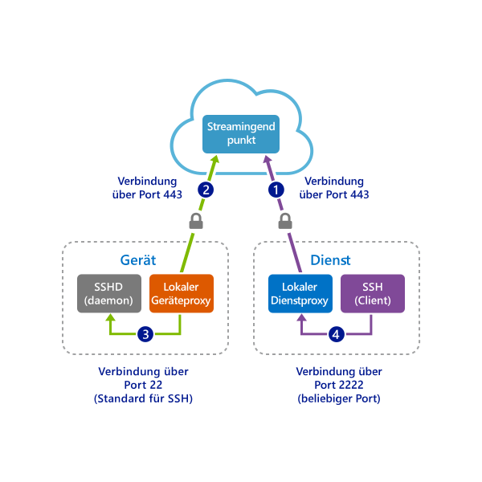
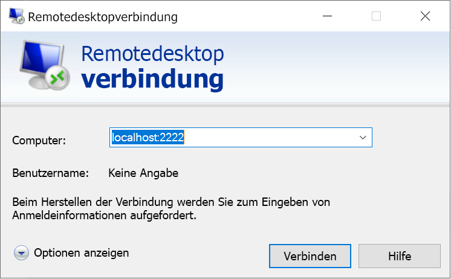

# <a name="quickstart-enable-ssh-and-rdp-over-an-iot-hub-device-stream-by-using-a-c-proxy-application-preview"></a>Schnellstart: Ermöglichen von SSH und RDP über einen IoT Hub-Gerätestream unter Verwendung einer C#-Proxyanwendung (Vorschauversion)

[!INCLUDE [iot-hub-quickstarts-4-selector](../../includes/iot-hub-quickstarts-4-selector.md)]

Microsoft Azure IoT Hub unterstützt derzeit Gerätestreams als [Previewfunktion](https://azure.microsoft.com/support/legal/preview-supplemental-terms/).

Über [IoT Hub-Gerätestreams](iot-hub-device-streams-overview.md) können Dienst- und Geräteanwendungen sicher und firewallfreundlich kommunizieren. In dieser Schnellstartanleitung werden zwei C#-Anwendungen verwendet, die es ermöglichen, Anwendungsdatenverkehr von Clients/Servern (etwa SSH [Secure Shell] und RDP [Remotedesktopprotokoll]) über einen per IoT-Hub eingerichteten Gerätestream zu senden. Eine Übersicht über das Setup finden Sie in den [Beispielen mit lokalen Proxyanwendungen für SSH und RDP](iot-hub-device-streams-overview.md#local-proxy-sample-for-ssh-or-rdp).

Dieser Artikel beschreibt zunächst das Setup für SSH (unter Verwendung von Port 22) und anschließend, wie der Port für RDP geändert wird. Gerätestreams sind anwendungs- und protokollunabhängig. Das gleiche Beispiel kann daher für andere Arten von Anwendungsdatenverkehr angepasst werden. In der Regel wird dabei nur der Kommunikationsport in den von der gewünschten Anwendung verwendeten Port geändert.

## <a name="how-it-works"></a>So funktioniert's

Die folgende Abbildung zeigt, wie die lokalen Geräte- und Dienstproxyanwendungen in diesem Beispiel eine End-to-End-Konnektivität zwischen den SSH-Clientprozessen und SSH-Daemonprozessen ermöglichen. Hierbei wird davon ausgegangen, dass der Daemon auf dem gleichen Gerät ausgeführt wird wie die lokale Geräteproxyanwendung.



1. Die lokale Dienstproxyanwendung stellt eine Verbindung mit dem IoT-Hub her und initiiert einen Gerätestream an das Zielgerät.

1. Die lokale Geräteproxyanwendung schließt den Handshake für die Streaminitiierung ab und richtet über den Streamingendpunkt des IoT-Hubs einen End-to-End-Streamingtunnel mit der Dienstseite ein.

1. Die lokale Geräteproxyanwendung stellt eine Verbindung mit dem SSH-Daemon her, der an Port 22 auf dem Gerät lauscht. Diese Einstellung ist konfigurierbar, wie im Abschnitt „Ausführen der lokalen Geräteproxyanwendung“ beschrieben.

1. Die lokale Dienstproxyanwendung wartet auf neue SSH-Verbindungen des Benutzers, indem er am angegebenen Port (in diesem Fall Port 2222) lauscht. Diese Einstellung ist konfigurierbar, wie im Abschnitt „Ausführen der lokalen Dienstproxyanwendung“ beschrieben. Wenn der Benutzer eine Verbindung über den SSH-Client herstellt, ermöglicht der Tunnel die Übertragung von SSH-Anwendungsdatenverkehr zwischen SSH-Client und Serveranwendung.

> [!NOTE]
> Über einen Gerätestream gesendeter SSH-Datenverkehr wird nicht direkt zwischen Dienst und Gerät gesendet, sondern über den Streamingendpunkt des IoT-Hubs getunnelt. Weitere Informationen finden Sie in der Beschreibung der [Vorteile der Verwendung von IoT Hub-Gerätestreams](iot-hub-device-streams-overview.md#benefits).

[!INCLUDE [cloud-shell-try-it.md](../../includes/cloud-shell-try-it.md)]

Wenn Sie kein Azure-Abonnement besitzen, können Sie ein [kostenloses Konto](https://azure.microsoft.com/free/?WT.mc_id=A261C142F) erstellen, bevor Sie beginnen.

## <a name="prerequisites"></a>Voraussetzungen

* Die Vorschau der Gerätestreams wird derzeit nur für IoT-Hubs unterstützt, die in folgenden Regionen erstellt werden:

  * USA (Mitte)
  * USA, Mitte (EUAP)
  * Asien, Südosten
  * Nordeuropa

* Die beiden in dieser Schnellstartanleitung ausgeführten Beispielanwendungen sind in C# geschrieben. Sie benötigen auf Ihrem Entwicklungscomputer das .NET Core SDK 2.1.0 oder höher.

  Sie können das [.NET Core SDK für mehrere Plattformen](https://www.microsoft.com/net/download/all) von .NET herunterladen.

* Überprüfen Sie mit dem folgenden Befehl die aktuelle C#-Version auf Ihrem Entwicklungscomputer:

    ```
    dotnet --version
    ```

* Führen Sie den folgenden Befehl aus, um Ihrer Cloud Shell-Instanz die Azure IoT-Erweiterung für die Azure-Befehlszeilenschnittstelle hinzuzufügen. Die IoT-Erweiterung fügt der Azure-Befehlszeilenschnittstelle spezifische Befehle für IoT Hub, IoT Edge und IoT Device Provisioning Service (DPS) hinzu.

   ```azurecli-interactive
   az extension add --name azure-cli-iot-ext
   ```

* [Laden Sie das C#-Beispielprojekt](https://github.com/Azure-Samples/azure-iot-samples-csharp/archive/master.zip) herunter, und extrahieren Sie das ZIP-Archiv.

* Ein gültiges Benutzerkonto und Anmeldeinformationen auf dem Gerät (Windows oder Linux), die zum Authentifizieren des Benutzers verwendet werden

## <a name="create-an-iot-hub"></a>Erstellen eines IoT Hubs

[!INCLUDE [iot-hub-include-create-hub-device-streams](../../includes/iot-hub-include-create-hub-device-streams.md)]

## <a name="register-a-device"></a>Registrieren eines Geräts

Ein Gerät muss bei Ihrer IoT Hub-Instanz registriert sein, um eine Verbindung herstellen zu können. In dieser Schnellstartanleitung verwenden Sie Azure Cloud Shell, um ein simuliertes Gerät zu registrieren.

1. Führen Sie in Cloud Shell den folgenden Befehl aus, um die Geräteidentität zu erstellen:

   > [!NOTE]
   > * Ersetzen Sie den Platzhalter *YourIoTHubName* durch den Namen, den Sie für Ihren IoT-Hub ausgewählt haben.
   > * Verwenden Sie für den Namen des Geräts, das Sie registrieren, am besten *MyDevice*, wie bereits gezeigt. Wenn Sie für Ihr Gerät einen anderen Namen auswählen, verwenden Sie diesen im gesamten Artikel, und aktualisieren Sie den Gerätenamen in den Beispielanwendungen, bevor Sie sie ausführen.

    ```azurecli-interactive
    az iot hub device-identity create --hub-name {YourIoTHubName} --device-id MyDevice
    ```

1. Führen Sie die folgenden Befehle in Cloud Shell aus, um die *Geräteverbindungszeichenfolge* für das soeben registrierte Gerät abzurufen:

   > [!NOTE]
   > Ersetzen Sie den Platzhalter *YourIoTHubName* durch den Namen, den Sie für Ihren IoT-Hub ausgewählt haben.

    ```azurecli-interactive
    az iot hub device-identity show-connection-string --hub-name {YourIoTHubName} --device-id MyDevice --output table
    ```

    Notieren Sie sich die zurückgegebene Verbindungszeichenfolge des Geräts zur späteren Verwendung in dieser Schnellstartanleitung. Dies sieht in etwa wie im folgenden Beispiel aus:

   `HostName={YourIoTHubName}.azure-devices.net;DeviceId=MyDevice;SharedAccessKey={YourSharedAccessKey}`

1. Darüber hinaus benötigen Sie die *Dienstverbindungszeichenfolge* aus Ihrem IoT-Hub, damit die dienstseitige Anwendung eine Verbindung mit Ihrem IoT-Hub herstellen und einen Gerätestream einrichten kann. Der folgende Befehl ruft diesen Wert für Ihren IoT-Hub ab:

   > [!NOTE]
   > Ersetzen Sie den Platzhalter *YourIoTHubName* durch den Namen, den Sie für Ihren IoT-Hub ausgewählt haben.

    ```azurecli-interactive
    az iot hub show-connection-string --policy-name service --name {YourIoTHubName} --output table
    ```

    Notieren Sie sich die zurückgegebene Verbindungszeichenfolge des Diensts zur späteren Verwendung in dieser Schnellstartanleitung. Dies sieht in etwa wie im folgenden Beispiel aus:

   `"HostName={YourIoTHubName}.azure-devices.net;SharedAccessKeyName=service;SharedAccessKey={YourSharedAccessKey}"`

## <a name="ssh-to-a-device-via-device-streams"></a>Herstellen einer SSH-Verbindung mit einem Gerät über Gerätestreams

In diesem Abschnitt richten Sie einen End-to-End-Stream ein, um SSH-Datenverkehr zu tunneln.

### <a name="run-the-device-local-proxy-application"></a>Ausführen der lokalen Geräteproxyanwendung

Navigieren Sie in einem lokalen Terminalfenster zum Verzeichnis `device-streams-proxy/device` in Ihrem entpackten Projektordner. Halten Sie die folgenden Informationen bereit:

| Argumentname | Argumentwert |
|----------------|-----------------|
| `DeviceConnectionString` | Die erstellte Geräteverbindungszeichenfolge des zuvor erstellten Geräts |
| `targetServiceHostName` | Die IP-Adresse, an der der SSH-Server lauscht Die Adresse lautet `localhost`, wenn es sich dabei um die gleiche IP handelt, unter der auch die lokale Geräteproxyanwendung ausgeführt wird. |
| `targetServicePort` | Der von Ihrem Anwendungsprotokoll verwendete Port. (Für SSH ist das standardmäßig Port 22.)  |

Kompilieren Sie den Code, und führen Sie ihn mit den folgenden Befehlen aus:

```
cd ./iot-hub/Quickstarts/device-streams-proxy/device/

# Build the application
dotnet build

# Run the application
# In Linux or macOS
dotnet run ${DeviceConnectionString} localhost 22

# In Windows
dotnet run {DeviceConnectionString} localhost 22
```

### <a name="run-the-service-local-proxy-application"></a>Ausführen der lokalen Dienstproxyanwendung

Navigieren Sie in einem anderen lokalen Terminalfenster zu `device-streams-proxy/service` in Ihrem entpackten Projektordner. Halten Sie die folgenden Informationen bereit:

| Parametername | Parameterwert |
|----------------|-----------------|
| `ServiceConnectionString` | Die Dienstverbindungszeichenfolge Ihres IoT-Hubs. |
| `MyDevice` | Die zuvor erstellte Geräte-ID. |
| `localPortNumber` | Ein lokaler Port für die Verbindung mit Ihrem SSH-Client. In diesem Beispiel wird Port 2222 verwendet, Sie können jedoch einen beliebigen anderen Wert verwenden. |

Kompilieren Sie den Code, und führen Sie ihn mit den folgenden Befehlen aus:

```
cd ./iot-hub/Quickstarts/device-streams-proxy/service/

# Build the application
dotnet build

# Run the application
# In Linux or macOS
dotnet run ${ServiceConnectionString} MyDevice 2222

# In Windows
dotnet run {ServiceConnectionString} MyDevice 2222
```

### <a name="run-the-ssh-client"></a>Ausführen des SSH-Clients

Stellen Sie nun über Ihre SSH-Clientanwendung eine Verbindung mit der lokalen Dienstproxyanwendung an Port 2222 her (anstatt eine Direktverbindung mit dem SSH-Daemon).

```
ssh {username}@localhost -p 2222
```

Nun werden Sie im SSH-Anmeldefenster zur Eingabe Ihrer Anmeldeinformationen aufgefordert.

Im Anschluss sehen Sie die dienstseitige Konsolenausgabe. (Die lokale Dienstproxyanwendung lauscht an Port 2222.)


Im Anschluss sehen Sie die Konsolenausgabe der lokalen Geräteproxyanwendung, die unter *IP_address:22* eine Verbindung mit dem SSH-Daemon herstellt:


Konsolenausgabe der SSH-Clientanwendung. Der SSH-Client kommuniziert mit dem SSH-Daemon, indem er eine Verbindung mit Port 22 herstellt, an dem die lokale Dienstproxyanwendung lauscht:


## <a name="rdp-to-a-device-via-device-streams"></a>Herstellen einer RDP-Verbindung mit einem Gerät über Gerätestreams

Das Setup für RDP unterscheidet sich nur minimal vom weiter oben beschriebenen Setup für SSH. Sie verwenden die RDP-Ziel-IP-Adresse und den Port 3389 sowie einen RDP-Client (anstelle des SSH-Clients).

### <a name="run-the-device-local-proxy-application-rdp"></a>Ausführen der lokalen Geräteproxyanwendung (RDP)

Navigieren Sie in einem lokalen Terminalfenster zum Verzeichnis `device-streams-proxy/device` in Ihrem entpackten Projektordner. Halten Sie die folgenden Informationen bereit:

| Argumentname | Argumentwert |
|----------------|-----------------|
| `DeviceConnectionString` | Die erstellte Geräteverbindungszeichenfolge des zuvor erstellten Geräts |
| `targetServiceHostName` | Der Hostname oder IP-Adresse für die Ausführung des RDP-Servers. Die Adresse lautet `localhost`, wenn es sich dabei um die gleiche IP handelt, unter der auch die lokale Geräteproxyanwendung ausgeführt wird. |
| `targetServicePort` | Der von Ihrem Anwendungsprotokoll verwendete Port. (Für RDP ist das standardmäßig Port 3389.)  |

Kompilieren Sie den Code, und führen Sie ihn mit den folgenden Befehlen aus:

```
cd ./iot-hub/Quickstarts/device-streams-proxy/device

# Run the application
# In Linux or macOS
dotnet run ${DeviceConnectionString} localhost 3389

# In Windows
dotnet run {DeviceConnectionString} localhost 3389
```

### <a name="run-the-service-local-proxy-application-rdp"></a>Ausführen der lokalen Dienstproxyanwendung (RDP)

Navigieren Sie in einem anderen lokalen Terminalfenster zu `device-streams-proxy/service` in Ihrem entpackten Projektordner. Halten Sie die folgenden Informationen bereit:

| Parametername | Parameterwert |
|----------------|-----------------|
| `ServiceConnectionString` | Die Dienstverbindungszeichenfolge Ihres IoT-Hubs. |
| `MyDevice` | Die zuvor erstellte Geräte-ID. |
| `localPortNumber` | Ein lokaler Port für die Verbindung mit Ihrem SSH-Client. In diesem Beispiel wird der Port 2222 verwendet, er kann jedoch auf einen beliebigen anderen Wert festgelegt werden. |

Kompilieren Sie den Code, und führen Sie ihn mit den folgenden Befehlen aus:

```
cd ./iot-hub/Quickstarts/device-streams-proxy/service/

# Build the application
dotnet build

# Run the application
# In Linux or macOS
dotnet run ${ServiceConnectionString} MyDevice 2222

# In Windows
dotnet run {ServiceConnectionString} MyDevice 2222
```

### <a name="run-rdp-client"></a>Ausführen des RDP-Clients

Stellen Sie nun mithilfe Ihrer RDP-Clientanwendung eine Verbindung mit der lokalen Dienstproxyanwendung an Port 2222 her. (Hierbei handelt es sich um einen verfügbaren Port, den Sie zuvor willkürlich ausgewählt haben.)



## <a name="clean-up-resources"></a>Bereinigen von Ressourcen

[!INCLUDE [iot-hub-quickstarts-clean-up-resources](../../includes/iot-hub-quickstarts-clean-up-resources-device-streams.md)]

## <a name="next-steps"></a>Nächste Schritte

In dieser Schnellstartanleitung haben Sie einen IoT-Hub eingerichtet, ein Gerät registriert, eine lokale Geräteproxyanwendung und eine lokale Dienstproxyanwendung bereitgestellt, um einen Gerätestream über den IoT-Hub einzurichten, sowie die Proxyanwendungen zum Tunneln von SSH- oder RDP-Datenverkehr verwendet. Das gleiche Muster kann auch für andere Client-/Serverprotokolle verwendet werden, bei denen der Server auf dem Gerät ausgeführt wird (beispielsweise der SSH-Daemon).

Weitere Informationen zu Gerätestreams finden Sie hier:

> [!div class="nextstepaction"]
> [IoT Hub-Gerätestreams (Vorschau)](./iot-hub-device-streams-overview.md)
