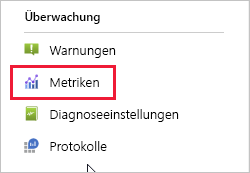
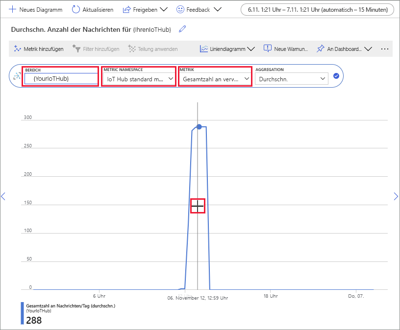

# <a name="quickstart-send-telemetry-from-a-device-to-an-iot-hub-and-monitor-it-with-the-azure-cli"></a>Schnellstart: Senden von Telemetriedaten von einem Gerät an einen IoT-Hub und Durchführen der Überwachung per Azure CLI

[!INCLUDE [iot-hub-quickstarts-1-selector](../../includes/iot-hub-quickstarts-1-selector.md)]

IoT Hub ist ein Azure-Dienst, mit dem Sie umfangreiche Telemetriedaten von Ihren Geräten in der Cloud erfassen können, um sie zu speichern oder zu verarbeiten. In dieser Schnellstartanleitung verwenden Sie die Azure CLI, um eine IoT Hub-Instanz und ein simuliertes Gerät zu erstellen, Gerätetelemetriedaten an den Hub zu senden und eine C2D-Nachricht (Cloud-zu-Gerät) zu senden. Außerdem nutzen Sie das Azure-Portal, um Gerätemetriken zu visualisieren. Dies ist ein grundlegender Workflow für Entwickler, die die CLI verwenden, um mit einer IoT Hub-Anwendung zu interagieren.

## <a name="prerequisites"></a>Voraussetzungen
- Wenn Sie kein Azure-Abonnement besitzen, können Sie ein [kostenloses Konto erstellen](https://azure.microsoft.com/free/?WT.mc_id=A261C142F), bevor Sie beginnen.
- Azure-Befehlszeilenschnittstelle. Sie können alle Befehle dieser Schnellstartanleitung über die Azure Cloud Shell ausführen. Hierbei handelt es sich um eine interaktive CLI-Shell, die in Ihrem Browser ausgeführt wird. Bei Verwendung der Cloud Shell müssen Sie nichts installieren. Falls Sie die lokale Nutzung der CLI vorziehen, müssen Sie für diese Schnellstartanleitung mindestens Version 2.0.76 der Azure CLI verwenden. Führen Sie „az --version“ aus, um die Version zu ermitteln. Informationen zum Ausführen einer Installation oder eines Upgrades finden Sie unter [Installieren der Azure CLI]( /cli/azure/install-azure-cli).

## <a name="sign-in-to-the-azure-portal"></a>Melden Sie sich auf dem Azure-Portal an.
Melden Sie sich unter https://portal.azure.com beim Azure-Portal an.

Unabhängig davon, ob Sie die CLI lokal oder in der Cloud Shell ausführen, sollten Sie das Portal in Ihrem Browser geöffnet lassen.  Es wird im weiteren Verlauf der Schnellstartanleitung noch benötigt.

## <a name="launch-the-cloud-shell"></a>Starten der Cloud Shell
In diesem Abschnitt starten Sie eine Instanz der Azure Cloud Shell. Falls Sie die CLI lokal nutzen, können Sie zum Abschnitt [Vorbereiten von zwei CLI-Sitzungen](#prepare-two-cli-sessions) springen.

Starten Sie die Cloud Shell wie folgt:

1. Wählen Sie im Azure-Portal oben rechts in der Menüleiste die Schaltfläche **Cloud Shell** aus. 

    

    > [!NOTE]
    > Falls Sie die Cloud Shell bisher noch nicht verwendet haben, werden Sie zum Erstellen von Speicher aufgefordert, der für die Nutzung der Cloud Shell erforderlich ist.  Wählen Sie ein Abonnement aus, in dem ein Speicherkonto und eine Microsoft Azure Files-Freigabe erstellt werden sollen. 

2. Wählen Sie in der Dropdownliste **Umgebung auswählen** Ihre bevorzugte CLI-Umgebung aus. In dieser Schnellstartanleitung wird die **Bash**-Umgebung verwendet. Alle folgenden CLI-Befehle funktionieren auch in der PowerShell-Umgebung. 

    

## <a name="prepare-two-cli-sessions"></a>Vorbereiten von zwei CLI-Sitzungen

In diesem Abschnitt bereiten Sie zwei Azure CLI-Sitzungen vor. Bei Verwendung der Cloud Shell führen Sie die beiden Sitzungen in separaten Browsertabs aus. Wenn Sie einen lokalen CLI-Client nutzen, führen Sie zwei separate CLI-Instanzen aus. Sie verwenden die erste Sitzung als simuliertes Gerät und die zweite Sitzung zum Überwachen und Senden von Nachrichten. Wählen Sie zum Ausführen eines Befehls die Option **Kopieren** aus, um einen Codeblock aus dieser Schnellstartanleitung zu kopieren und in Ihre Shell-Sitzung einzufügen. Anschließend können Sie den Befehl dann ausführen.

Für die Nutzung der Azure CLI müssen Sie bei Ihrem Azure-Konto angemeldet sein. Die gesamte Kommunikation zwischen Ihrer Azure CLI-Shell-Sitzung und Ihrem IoT-Hub wird authentifiziert und verschlüsselt. Für diese Schnellstartanleitung ist daher keine weitere Authentifizierung, z. B. per Verbindungszeichenfolge, wie bei einem echten Gerät erforderlich.

*  Führen Sie den Befehl [az extension add](https://docs.microsoft.com/cli/azure/extension?view=azure-cli-latest#az-extension-add) aus, um Ihrer CLI-Shell die Microsoft Azure IoT-Erweiterung für die Azure CLI hinzuzufügen. Die IoT-Erweiterung fügt der Azure-Befehlszeilenschnittstelle spezifische Befehle für IoT Hub, IoT Edge und IoT Device Provisioning Service (DPS) hinzu.

   ```azurecli
   az extension add --name azure-iot
   ```
   
   Nachdem Sie die Azure IoT-Erweiterung installiert haben, müssen Sie sie in Cloud Shell-Sitzungen nicht erneut installieren. 

   [!INCLUDE [iot-hub-cli-version-info](../../includes/iot-hub-cli-version-info.md)]

*  Öffnen Sie eine zweite CLI-Sitzung.  Wählen Sie bei Verwendung der Cloud Shell die Option **Neue Sitzung öffnen** aus. Öffnen Sie eine zweite Instanz, falls Sie die CLI lokal nutzen. 

    >[!div class="mx-imgBorder"]
    >

## <a name="create-an-iot-hub"></a>Erstellen eines IoT Hubs
In diesem Abschnitt verwenden Sie die Azure CLI zum Erstellen einer Ressourcengruppe und eines IoT-Hubs.  Eine Azure-Ressourcengruppe ist ein logischer Container, in dem Azure-Ressourcen bereitgestellt und verwaltet werden. Ein IoT-Hub fungiert als zentraler Nachrichtenhub für die bidirektionale Kommunikation zwischen Ihrer IoT-Anwendung und den Geräten. 

> [!TIP]
> Optional können Sie eine Azure-Ressourcengruppe, einen IoT-Hub und andere Ressourcen erstellen, indem Sie das [Azure-Portal](iot-hub-create-through-portal.md), [Visual Studio Code](iot-hub-create-use-iot-toolkit.md) oder andere programmgesteuerte Verfahren verwenden.  

1. Führen Sie den Befehl [az group create](https://docs.microsoft.com/cli/azure/group?view=azure-cli-latest#az-group-create) aus, um eine Ressourcengruppe zu erstellen. Mit dem folgenden Befehl wird eine Ressourcengruppe mit dem Namen *MyResourceGroup* am Standort *eastus* erstellt. 

    ```azurecli
    az group create --name MyResourceGroup --location eastus
    ```

1. Führen Sie den Befehl [az iot hub create](https://docs.microsoft.com/cli/azure/iot/hub?view=azure-cli-latest#az-iot-hub-create) aus, um einen IoT-Hub zu erstellen. Es kann einige Minuten dauern, bis ein IoT-Hub erstellt wurde. 

    *YourIotHubName*: Ersetzen Sie diesen Platzhalter unten durch den Namen, den Sie für Ihren IoT-Hub ausgewählt haben. Der Name eines IoT-Hubs muss in Azure global eindeutig sein. Dieser Platzhalter wird im restlichen Teil dieser Schnellstartanleitung als Name für Ihren IoT-Hub verwendet.

    ```azurecli
    az iot hub create --resource-group MyResourceGroup --name {YourIoTHubName}
    ```

## <a name="create-and-monitor-a-device"></a>Erstellen und Überwachen eines Geräts
In diesem Abschnitt erstellen Sie in der ersten CLI-Sitzung ein simuliertes Gerät. Mit dem simulierten Gerät werden Gerätetelemetriedaten an Ihren IoT-Hub gesendet. In der zweiten CLI-Sitzung überwachen Sie Ereignisse und Telemetriedaten und senden eine C2D-Nachricht an das simulierte Gerät.

Erstellen und starten Sie ein simuliertes Gerät wie folgt:
1. Führen Sie in der ersten CLI-Sitzung den Befehl [az iot hub device-identity create](https://docs.microsoft.com/cli/azure/ext/azure-cli-iot-ext/iot/hub/device-identity?view=azure-cli-latest#ext-azure-cli-iot-ext-az-iot-hub-device-identity-create) aus. Die Identität des simulierten Geräts wird erstellt. 

    *YourIotHubName*: Ersetzen Sie diesen Platzhalter unten durch den Namen, den Sie für Ihren IoT-Hub ausgewählt haben. 

    *simDevice*: Sie können diesen Namen im weiteren Verlauf dieser Schnellstartanleitung direkt für das simulierte Gerät verwenden. Optional können Sie auch einen anderen Namen nutzen. 

    ```azurecli
    az iot hub device-identity create --device-id simDevice --hub-name {YourIoTHubName} 
    ```

1. Führen Sie in der ersten CLI-Sitzung den Befehl [az iot device simulate](https://docs.microsoft.com/cli/azure/ext/azure-cli-iot-ext/iot/device?view=azure-cli-latest#ext-azure-cli-iot-ext-az-iot-device-simulate) aus.  Das simulierte Gerät wird gestartet. Das Gerät sendet Telemetriedaten an Ihren IoT-Hub und empfängt im Gegenzug Nachrichten.  

    *YourIotHubName*: Ersetzen Sie diesen Platzhalter unten durch den Namen, den Sie für Ihren IoT-Hub ausgewählt haben. 

    ```azurecli
    az iot device simulate -d simDevice -n {YourIoTHubName}
    ```

Überwachen Sie ein Gerät wie folgt:
1. Führen Sie in der zweiten CLI-Sitzung den Befehl [az iot hub monitor-events](https://docs.microsoft.com/cli/azure/ext/azure-cli-iot-ext/iot/hub?view=azure-cli-latest#ext-azure-cli-iot-ext-az-iot-hub-monitor-events) aus. Die Überwachung des simulierten Geräts wird gestartet. Die Ausgabe enthält Telemetriedaten, die vom simulierten Gerät an den IoT-Hub gesendet werden.

    *YourIotHubName*: Ersetzen Sie diesen Platzhalter unten durch den Namen, den Sie für Ihren IoT-Hub ausgewählt haben. 

    ```azurecli
    az iot hub monitor-events --output table --hub-name {YourIoTHubName}
    ```

    

1. Wenn Sie die Überwachung des simulierten Geräts in der zweiten CLI-Sitzung abgeschlossen haben, können Sie STRG+C drücken, um die Überwachung zu beenden. 

## <a name="use-the-cli-to-send-a-message"></a>Verwenden der CLI zum Senden einer Nachricht
In diesem Abschnitt verwenden Sie die zweite CLI-Sitzung, um eine Nachricht an das simulierte Gerät zu senden.

1. Vergewissern Sie sich in der ersten CLI-Sitzung, dass das simulierte Gerät ausgeführt wird. Wenn die Ausführung des Geräts beendet wurde, können Sie den folgenden Befehl ausführen, um es zu starten:

    *YourIotHubName*: Ersetzen Sie diesen Platzhalter unten durch den Namen, den Sie für Ihren IoT-Hub ausgewählt haben. 

    ```azurecli
    az iot device simulate -d simDevice -n {YourIoTHubName}
    ```

1. Führen Sie in der zweiten CLI-Sitzung den Befehl [az iot device c2d-message send](https://docs.microsoft.com/cli/azure/ext/azure-cli-iot-ext/iot/device/c2d-message?view=azure-cli-latest#ext-azure-cli-iot-ext-az-iot-device-c2d-message-send) aus. Hiermit wird von Ihrem IoT-Hub aus eine C2D-Nachricht an das simulierte Gerät gesendet. Die Nachricht enthält eine Zeichenfolge und zwei Schlüssel-Wert-Paare.  

    *YourIotHubName*: Ersetzen Sie diesen Platzhalter unten durch den Namen, den Sie für Ihren IoT-Hub ausgewählt haben. 

    ```azurecli
    az iot device c2d-message send -d simDevice --data "Hello World" --props "key0=value0;key1=value1" -n {YourIoTHubName}
    ```
    Optional können Sie C2D-Nachrichten über das Azure-Portal senden. Navigieren Sie hierfür zur Übersichtsseite für Ihren IoT-Hub, und wählen Sie **IoT-Geräte**, das simulierte Gerät und dann die Option **Nachricht an Gerät** aus. 

1. Vergewissern Sie sich in der ersten CLI-Sitzung, dass das simulierte die Nachricht empfangen hat. 

    

1. Nachdem Sie die Nachricht angezeigt haben, können Sie die zweite CLI-Sitzung schließen. Lassen Sie die erste CLI-Sitzung geöffnet. Sie verwenden sie in einem späteren Schritt zum Bereinigen von Ressourcen.

## <a name="view-messaging-metrics-in-the-portal"></a>Anzeigen von Nachrichtenmetriken im Portal
Im Azure-Portal können Sie alle Aspekte Ihres IoT-Hubs und der Geräte verwalten. In einer typischen IoT-Hub-Anwendung, mit der Telemetriedaten von Geräten erfasst werden, können Sie bei Bedarf Geräte überwachen oder Metriken der Gerätetelemetrie anzeigen. 

Visualisieren Sie Nachrichtenmetriken im Azure-Portal wie folgt:
1. Wählen Sie im Portal im linken Navigationsmenü die Option **Alle Ressourcen** aus. Es werden alle Ressourcen Ihres Abonnements aufgelistet, darunter auch der von Ihnen erstellte IoT-Hub. 

1. Wählen Sie den Link im von Ihnen erstellten IoT-Hub aus. Im Portal wird die Übersichtsseite für den Hub angezeigt.

1. Wählen Sie im linken Bereich Ihres IoT-Hubs die Option **Metriken** aus. 

    

1. Geben Sie unter **Bereich** den Namen Ihres IoT-Hubs ein.

2. Wählen Sie unter **Metriknamespace** die Option für die *IoT Hub-Standardmetriken* aus.

3. Wählen Sie unter **Metrik** die Option *Gesamtzahl verwendeter Nachrichten* aus. 

4. Bewegen Sie den Mauszeiger auf den Bereich der Zeitachse, in dem das Gerät Nachrichten gesendet hat. Unten links in der Zeitachse wird die Gesamtzahl der Nachrichten für den entsprechenden Zeitpunkt angezeigt.

    

5. Verwenden Sie optional die Dropdownliste **Metrik**, um andere Metriken für Ihr simuliertes Gerät anzuzeigen. Beispiele hierfür sind Metriken vom Typ *Durchgeführte Zustellungen von C2D-Nachrichten* und *Geräte gesamt (Vorschau)* . 

## <a name="clean-up-resources"></a>Bereinigen von Ressourcen
Falls Sie die in dieser Schnellstartanleitung erstellten Azure-Ressourcen nicht mehr benötigen, können Sie sie mit der Azure CLI löschen.

Falls Sie mit dem nächsten empfohlenen Artikel fortfahren, können Sie die bereits erstellten Ressourcen beibehalten und wiederverwenden. 

> [!IMPORTANT]
> Das Löschen einer Ressourcengruppe kann nicht rückgängig gemacht werden. Die Ressourcengruppe und alle darin enthaltenen Ressourcen werden unwiderruflich gelöscht. Achten Sie daher darauf, dass Sie nicht versehentlich die falsche Ressourcengruppe oder die falschen Ressourcen löschen. 

So löschen Sie eine Ressourcengruppe anhand des Namens:
1. Führen Sie den Befehl [az group delete](https://docs.microsoft.com/cli/azure/group?view=azure-cli-latest#az-group-delete) aus. Die von Ihnen erstellte Ressourcengruppe, der IoT-Hub und die Geräteregistrierung werden entfernt.

    ```azurecli
    az group delete --name MyResourceGroup
    ```
1. Führen Sie den Befehl [az group list](https://docs.microsoft.com/cli/azure/group?view=azure-cli-latest#az-group-list) aus, um sich zu vergewissern, dass die Ressourcengruppe gelöscht wurde.  

    ```azurecli
    az group list
    ```

## <a name="next-steps"></a>Nächste Schritte
In dieser Schnellstartanleitung haben Sie die Azure CLI verwendet, um einen IoT-Hub und ein simuliertes Gerät zu erstellen, Telemetriedaten zu senden und zu überwachen, eine C2D-Nachricht zu senden und die Ressourcen zu bereinigen. Sie haben das Azure-Portal genutzt, um Nachrichtenmetriken auf Ihrem Gerät zu visualisieren.

Für Geräteentwickler schlagen wir als Nächstes das Durcharbeiten der Schnellstartanleitung zu den Telemetriedaten vor, in der das Azure IoT-Geräte-SDK für C verwendet wird. Optional können Sie auch einen der verfügbaren Schnellstartartikel zur Azure IoT Hub-Telemetrie für Ihre bevorzugte Sprache bzw. ein bestimmtes SDK lesen.

> [!div class="nextstepaction"]
> [Schnellstart: Senden von Telemetriedaten von einem Gerät an einen IoT-Hub (C)](quickstart-send-telemetry-c.md)
