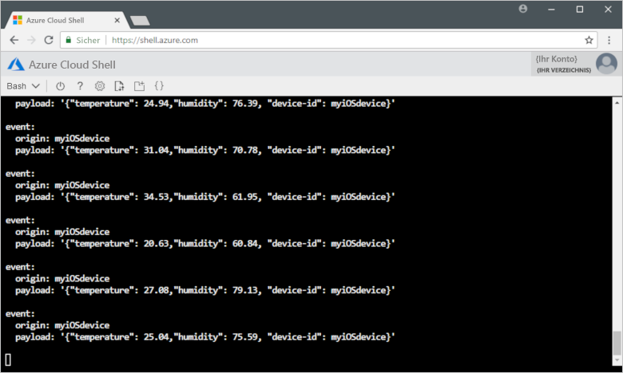

# <a name="quickstart-send-telemetry-from-a-device-to-an-iot-hub-ios"></a>Schnellstart: Senden von Telemetriedaten von einem Gerät an eine IoT Hub-Instanz (iOS)

[!INCLUDE [iot-hub-quickstarts-1-selector](../../includes/iot-hub-quickstarts-1-selector.md)]

IoT Hub ist ein Azure-Dienst, mit dem Sie umfangreiche Telemetriedaten von Ihren Geräten in der Cloud erfassen können, um sie zu speichern oder zu verarbeiten. In diesem Artikel senden Sie Telemetriedaten von einer simulierten Geräteanwendung an IoT Hub. Die Daten können dann über eine Back-End-Anwendung angezeigt werden. 

In diesem Artikel wird eine vorgefertigte Swift-Anwendung verwendet, um die Telemetriedaten zu senden. Zum Lesen aus IoT Hub wird ein CLI-Programm verwendet. 

[!INCLUDE [cloud-shell-try-it.md](../../includes/cloud-shell-try-it.md)]

Wenn Sie kein Azure-Abonnement besitzen, können Sie ein [kostenloses Konto](https://azure.microsoft.com/free/?WT.mc_id=A261C142F) erstellen, bevor Sie beginnen.

## <a name="prerequisites"></a>Voraussetzungen

- Laden Sie das Codebeispiel aus den [Azure-Beispielen](https://github.com/Azure-Samples/azure-iot-samples-ios/archive/master.zip) herunter. 
- Die neueste Version von [XCode](https://developer.apple.com/xcode/) mit der neuesten Version des iOS SDKs. Diese Schnellstartanleitung wurde mit Xcode 9.3 und iOS 11.3 getestet.
- Die neueste Version von [CocoaPods](https://guides.cocoapods.org/using/getting-started.html).

## <a name="create-an-iot-hub"></a>Erstellen eines IoT Hubs

[!INCLUDE [iot-hub-quickstarts-create-hub](../../includes/iot-hub-quickstarts-create-hub.md)]

## <a name="register-a-device"></a>Registrieren eines Geräts

Ein Gerät muss bei Ihrer IoT Hub-Instanz registriert sein, um eine Verbindung herstellen zu können. In dieser Schnellstartanleitung verwenden Sie Azure Cloud Shell, um ein simuliertes Gerät zu registrieren.

1. Führen Sie die folgenden Befehle in Azure Cloud Shell aus, um die IoT Hub-CLI-Erweiterung hinzuzufügen und die Geräteidentität zu erstellen. 

   **YourIoTHubName**: Ersetzen Sie diesen Platzhalter unten durch den Namen, den Sie für Ihren IoT Hub wählen.

   **myiOSDevice**: Der für das registrierte Gerät angegebene Name. Verwenden Sie „myiOSDevice“ wie gezeigt. Wenn Sie für Ihr Gerät einen anderen Namen wählen, müssen Sie diesen innerhalb des gesamten Artikels verwenden und den Gerätenamen in den Beispielanwendungen aktualisieren, bevor Sie sie ausführen.

   ```azurecli-interactive
   az extension add --name azure-cli-iot-ext
   az iot hub device-identity create --hub-name YourIoTHubName --device-id myiOSdevice
   ```

1. Führen Sie den folgenden Befehl aus, um die _Geräteverbindungszeichenfolge_ für das soeben registrierte Gerät abzurufen:

   ```azurecli-interactive
   az iot hub device-identity show-connection-string --hub-name YourIoTHubName --device-id myiOSdevice --output table
   ```

   Notieren Sie sich die Geräteverbindungszeichenfolge, die wie folgt aussieht:

   `HostName={YourIoTHubName}.azure-devices.net;DeviceId=MyNodeDevice;SharedAccessKey={YourSharedAccessKey}`

    Dieser Wert wird später in der Schnellstartanleitung benötigt.

## <a name="send-simulated-telemetry"></a>Senden simulierter Telemetriedaten

Die Beispielanwendung wird auf einem iOS-Gerät ausgeführt, das eine Verbindung mit einem gerätespezifischen Endpunkt in Ihrer IoT Hub-Instanz herstellt und simulierte Telemetriedaten für Temperatur und Luftfeuchtigkeit sendet. 

### <a name="install-cocoapods"></a>Installieren von CocoaPods

CocoaPods verwalten Abhängigkeiten für iOS-Projekte, die Bibliotheken von Drittanbietern verwenden.

Navigieren Sie in einem lokalen Terminalfenster zum Ordner „Azure-IoT-Samples-iOS“, den Sie im Rahmen der Vorbereitung heruntergeladen haben. Navigieren Sie dann zum Beispielprojekt:

```sh
cd quickstart/sample-device
```

Vergewissern Sie sich, dass Xcode geschlossen ist, und führen Sie den folgenden Befehl aus, um die in der Datei **Podfile** deklarierten CocoaPods zu installieren:

```sh
pod install
```

Der Installationsbefehl installiert nicht nur die erforderlichen Pods für Ihr Projekt, sondern erstellt auch eine Xcode-Arbeitsbereichsdatei, die bereits zur Verwendung der Pods für Abhängigkeiten konfiguriert ist. 

### <a name="run-the-sample-application"></a>Ausführen der Beispielanwendung 

1. Öffnen Sie den Beispielarbeitsbereich in Xcode.

   ```sh
   open "MQTT Client Sample.xcworkspace"
   ```

2. Erweitern Sie das Projekt **MQTT Client Sample** und anschließend den Ordner mit dem gleichen Namen.  
3. Öffnen Sie **ViewController.swift** zur Bearbeitung in XCode. 
4. Suchen Sie nach der Variablen **connectionString**, und aktualisieren Sie den Wert mit der zuvor notierten Geräteverbindungszeichenfolge.
5. Speichern Sie die Änderungen. 
6. Klicken Sie auf die Schaltfläche **Erstellen und Ausführen**, oder drücken Sie die Tastenkombination **BEFEHL+R**, um das Projekt im Geräteemulator auszuführen. 

   

7. Klicken Sie in der im Emulator geöffneten Beispiel-App auf **Starten**.

Der folgende Screenshot zeigt einige Beispielausgaben, während die Anwendung simulierte Telemetriedaten an Ihre IoT Hub-Instanz sendet:

   

## <a name="read-the-telemetry-from-your-hub"></a>Lesen der Telemetriedaten aus Ihrem Hub

Die Beispiel-App, die Sie im XCode-Emulator ausgeführt haben, zeigt Daten zu Nachrichten, die vom Gerät gesendet wurden. Die eingehenden Daten können auch über die IoT Hub-Instanz angezeigt werden. Die IoT Hub-CLI-Erweiterung stellt eine Verbindung mit dem dienstseitigen Endpunkt **Events** in Ihrer IoT Hub-Instanz her. Die Erweiterung empfängt die vom simulierten Gerät gesendeten Gerät-zu-Cloud-Nachrichten. Eine IoT Hub-Back-End-Anwendung wird in der Regel in der Cloud ausgeführt, um Gerät-zu-Cloud-Nachrichten zu empfangen und zu verarbeiten.

Führen Sie in Azure Cloud Shell die folgenden Befehle aus, und ersetzen Sie dabei `YourIoTHubName` durch den Namen Ihres IoT-Hubs:

```azurecli-interactive
az iot hub monitor-events --device-id myiOSdevice --hub-name YourIoTHubName
```

Der folgende Screenshot zeigt die Ausgabe, während die Erweiterung die vom simulierten Gerät an den Hub gesendeten Telemetriedaten empfängt:

Der folgende Screenshot zeigt die Art von Telemetriedaten, die in Ihrem lokalen Terminalfenster angezeigt werden:



## <a name="clean-up-resources"></a>Bereinigen von Ressourcen

[!INCLUDE [iot-hub-quickstarts-clean-up-resources](../../includes/iot-hub-quickstarts-clean-up-resources.md)]

## <a name="next-steps"></a>Nächste Schritte

In diesem Artikel haben Sie eine IoT Hub-Instanz eingerichtet sowie simulierte Telemetriedaten eines iOS-Geräts an den Hub gesendet und vom Hub gelesen. 

Um zu erfahren, wie Sie das simulierte Gerät über eine Back-End-Anwendung steuern, fahren Sie mit der nächsten Schnellstartanleitung fort.

> [!div class="nextstepaction"]
> [Schnellstart: Steuern eines mit einer IoT Hub-Instanz verbundenen Geräts](quickstart-control-device-node.md)

<!-- Links -->
[lnk-process-d2c-tutorial]: tutorial-routing.md
[lnk-device-management]: iot-hub-node-node-device-management-get-started.md
[lnk-iot-edge]: ../iot-edge/tutorial-simulate-device-linux.md
[lnk-connect-device]: https://azure.microsoft.com/develop/iot/
