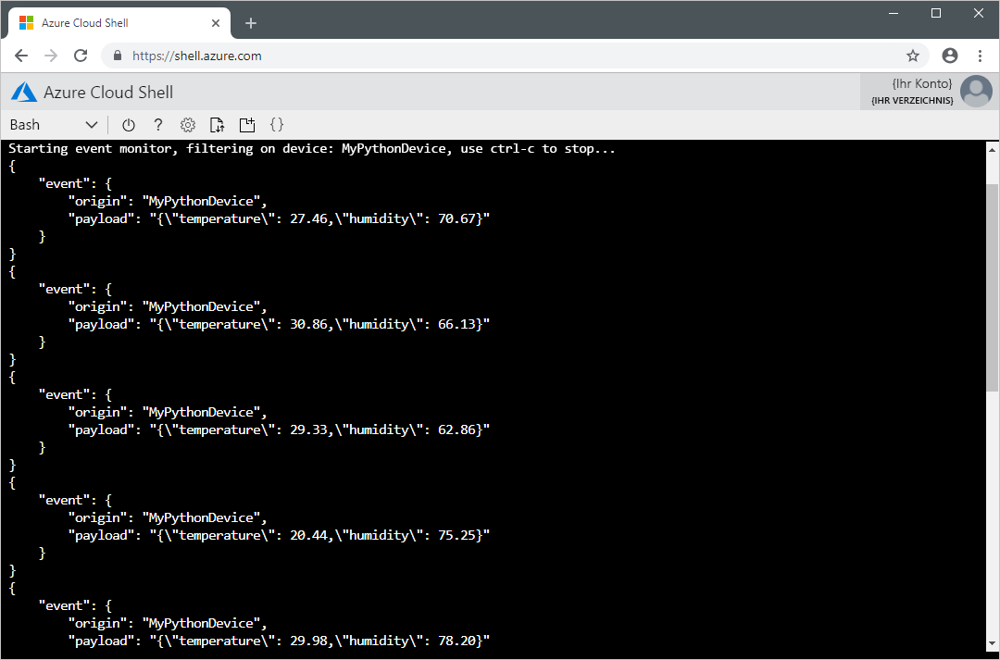

# <a name="quickstart-send-telemetry-from-a-device-to-an-iot-hub-and-read-the-telemetry-from-the-hub-with-a-back-end-application-python"></a>Schnellstart: Senden von Telemetriedaten von einem Gerät an einen IoT-Hub und Lesen der Telemetriedaten mit einer Back-End-Anwendung (Python) aus dem Hub

[!INCLUDE [iot-hub-quickstarts-1-selector](../../includes/iot-hub-quickstarts-1-selector.md)]

IoT Hub ist ein Azure-Dienst, mit dem Sie umfangreiche Telemetriedaten von Ihren Geräten in der Cloud erfassen können, um sie zu speichern oder zu verarbeiten. In dieser Schnellstartanleitung senden Sie Telemetriedaten von einer Anwendung zur Simulation eines Geräts über IoT Hub zur Verarbeitung an eine Back-End-Anwendung.

In dieser Schnellstartanleitung wird eine vorgefertigte Python-Anwendung verwendet, um die Telemetriedaten zu senden. Zum Lesen der Telemetriedaten aus IoT Hub wird ein CLI-Hilfsprogramm verwendet. Vor dem Ausführen dieser beiden Anwendungen erstellen Sie eine IoT Hub-Instanz und registrieren ein Gerät bei dieser Instanz.

[!INCLUDE [cloud-shell-try-it.md](../../includes/cloud-shell-try-it.md)]

Wenn Sie kein Azure-Abonnement besitzen, können Sie ein [kostenloses Konto](https://azure.microsoft.com/free/?WT.mc_id=A261C142F) erstellen, bevor Sie beginnen.

## <a name="prerequisites"></a>Voraussetzungen

Die beiden in dieser Schnellstartanleitung ausgeführten Beispielanwendungen sind in Python geschrieben. Sie benötigen entweder Python 2.7.x oder 3.5.x auf Ihrem Entwicklungscomputer.

Sie können Python für mehrere Plattformen von [Python.org](https://www.python.org/downloads/) herunterladen.

Mit einem der folgenden Befehle können Sie die aktuelle Python-Version auf Ihrem Entwicklungscomputer überprüfen:

```python
python --version
```

```python
python3 --version
```

Laden Sie das Python-Beispielprojekt von https://github.com/Azure-Samples/azure-iot-samples-python/archive/master.zip herunter, und extrahieren Sie das ZIP-Archiv.

Zum Installieren des CLI-Hilfsprogramms, das Telemetriedaten aus der IoT Hub-Instanz liest, installieren Sie zunächst Node.js v4.x.x oder höher auf dem Entwicklungscomputer. Sie können Node.js für mehrere Plattformen von [nodejs.org](https://nodejs.org) herunterladen.

Mit dem folgenden Befehl können Sie die aktuelle Node.js-Version auf Ihrem Entwicklungscomputer überprüfen:

```cmd/sh
node --version
```

Führen Sie zum Installieren des CLI-Hilfsprogramms `iothub-explorer` den folgenden Befehl aus:

```cmd/sh
npm install -g iothub-explorer
```

## <a name="create-an-iot-hub"></a>Erstellen eines IoT Hubs

[!INCLUDE [iot-hub-quickstarts-create-hub](../../includes/iot-hub-quickstarts-create-hub.md)]

## <a name="register-a-device"></a>Registrieren eines Geräts

Ein Gerät muss bei Ihrer IoT Hub-Instanz registriert sein, um eine Verbindung herstellen zu können. In dieser Schnellstartanleitung verwenden Sie die Azure-Befehlszeilenschnittstelle, um ein simuliertes Gerät zu registrieren.

1. Fügen Sie die IoT Hub-CLI-Erweiterung hinzu, und erstellen Sie die Geräteidentität. Ersetzen Sie `{YourIoTHubName}` durch den Namen, den Sie für Ihre IoT Hub-Instanz ausgewählt haben:

    ```azurecli-interactive
    az extension add --name azure-cli-iot-ext
    az iot hub device-identity create --hub-name {YourIoTHubName} --device-id MyPythonDevice
    ```

    Wenn Sie einen anderen Namen für Ihr Gerät auswählen, aktualisieren Sie den Gerätenamen in der Beispielanwendung, bevor sie ausgeführt wird.

1. Führen Sie den folgenden Befehl aus, um die _Geräteverbindungszeichenfolge_ für das soeben registrierte Gerät abzurufen:

    ```azurecli-interactive
    az iot hub device-identity show-connection-string --hub-name {YourIoTHubName} --device-id MyPythonDevice --output table
    ```

    Notieren Sie sich die Geräteverbindungszeichenfolge (`Hostname=...=`). Dieser Wert wird später in der Schnellstartanleitung benötigt.

1. Darüber hinaus benötigen Sie eine _Dienstverbindungszeichenfolge_, damit das CLI-Hilfsprogramm `iothub-explorer` eine Verbindung mit Ihrer IoT Hub-Instanz herstellen und die Nachrichten abrufen kann. Der folgende Befehl ruft die Dienstverbindungszeichenfolge für Ihre IoT Hub-Instanz ab:

    ```azurecli-interactive
    az iot hub show-connection-string --hub-name {YourIoTHubName} --output table
    ```

    Notieren Sie sich die Dienstverbindungszeichenfolge (`Hostname=...=`). Dieser Wert wird später in der Schnellstartanleitung benötigt. Die Dienstverbindungszeichenfolge unterscheidet sich von der Geräteverbindungszeichenfolge.

## <a name="send-simulated-telemetry"></a>Senden simulierter Telemetriedaten

Die Anwendung zur Simulation eines Geräts stellt eine Verbindung mit einem gerätespezifischen Endpunkt in Ihrer IoT Hub-Instanz her und sendet simulierte Telemetriedaten für Temperatur und Luftfeuchtigkeit.

1. Navigieren Sie in einem Terminalfenster zum Stammordner des Python-Beispielprojekts. Navigieren Sie anschließend zum Ordner **iot-hub\Quickstarts\simulated-device**.

1. Öffnen Sie die Datei **SimulatedDevice.py** in einem Text-Editor Ihrer Wahl.

    Ersetzen Sie den Wert der Variablen `CONNECTION_STRING` durch die Geräteverbindungszeichenfolge, die sie sich zuvor notiert haben. Speichern Sie dann die Änderungen an der Datei **SimulatedDevice.py**.

1. Führen Sie im Terminalfenster die folgenden Befehle aus, um die erforderlichen Bibliotheken für die simulierte Geräteanwendung zu installieren:

    ```cmd/sh
    pip install azure-iothub-device-client
    ```

1. Führen Sie im Terminalfenster die folgenden Befehle aus, um die simulierte Geräteanwendung auszuführen:

    ```cmd/sh
    python SimulatedDevice.py
    ```

    Der folgende Screenshot zeigt die Ausgabe, während die Anwendung zur Simulation eines Geräts Telemetriedaten an Ihre IoT Hub-Instanz sendet:

    

## <a name="read-the-telemetry-from-your-hub"></a>Lesen der Telemetriedaten aus Ihrem Hub

Das CLI-Hilfsprogramm `iothub-explorer` stellt eine Verbindung mit dem dienstseitigen Endpunkt **Events** in Ihrer IoT Hub-Instanz her. Das Hilfsprogramm empfängt die vom simulierten Gerät gesendeten Gerät-zu-Cloud-Nachrichten. Eine IoT Hub-Back-End-Anwendung wird in der Regel in der Cloud ausgeführt, um Gerät-zu-Cloud-Nachrichten zu empfangen und zu verarbeiten.

Führen Sie in einem anderen Terminalfenster die folgenden Befehle aus. Ersetzen Sie dabei `{your hub service connection string}` durch die Dienstverbindungszeichenfolge, die Sie sich zuvor notiert haben:

```cmd/sh
iothub-explorer monitor-events MyPythonDevice --login {your hub service connection string}
```

Der folgende Screenshot zeigt die Ausgabe, während das Hilfsprogramm vom simulierten Gerät an den Hub gesendete Telemetriedaten empfängt:



## <a name="clean-up-resources"></a>Bereinigen von Ressourcen

[!INCLUDE [iot-hub-quickstarts-clean-up-resources](../../includes/iot-hub-quickstarts-clean-up-resources.md)]

## <a name="next-steps"></a>Nächste Schritte

In dieser Schnellstartanleitung haben Sie eine IoT Hub-Instanz eingerichtet, ein Gerät registriert, mit einer Python-Anwendung simulierte Telemetriedaten an die Hub-Instanz gesendet und mit einer einfachen Back-End-Anwendung die Telemetriedaten aus der Hub-Instanz gelesen.

Wenn Sie erfahren möchten, wie Sie das simulierte Gerät über eine Back-End-Anwendung steuern, fahren Sie mit der nächsten Schnellstartanleitung fort.

> [!div class="nextstepaction"]
> [Schnellstart: Steuern eines mit einer IoT Hub-Instanz verbundenen Geräts](quickstart-control-device-python.md)