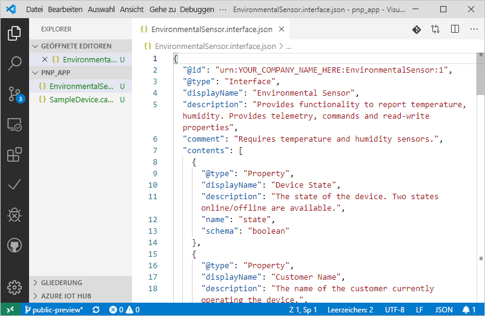
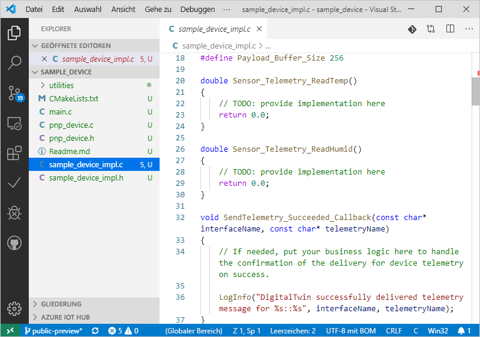

# <a name="quickstart-use-a-device-capability-model-to-create-an-iot-plug-and-play-preview-device-linux"></a>Schnellstart: Verwenden eines Gerätefunktionsmodells zum Erstellen eines IoT Plug & Play-Geräts (Vorschauversion, Linux)

Mit einem _Gerätefunktionsmodell_ (Device Capability Model, DCM) werden die Funktionen eines IoT Plug & Play-Geräts beschrieben. Ein Gerätefunktionsmodell ist häufig einer Produkt-SKU zugeordnet. Die Funktionen, die im Gerätefunktionsmodell definiert sind, werden als wiederverwendbare Schnittstellen organisiert. Sie können ein Gerüst eines Gerätecodes aus einem Gerätefunktionsmodell generieren. In dieser Schnellstartanleitung wird veranschaulicht, wie Sie VS Code unter Ubuntu Linux zum Erstellen eines IoT Plug & Play-Geräts mit einem Gerätefunktionsmodell verwenden.

## <a name="prerequisites"></a>Voraussetzungen

In diesem Schnellstart wird davon ausgegangen, dass Sie Ubuntu Linux mit einer Desktopumgebung verwenden. Die in diesem Tutorial behandelten Schritte wurden unter Ubuntu 18.04 getestet.

Zum Abschließen dieses Schnellstarts müssen Sie auf Ihrem lokalen Linux-Computer die folgende Software installieren:

* Installieren Sie **GCC**, **Git**, **cmake** und alle Abhängigkeiten mit dem Befehl `apt-get`:

    ```sh
    sudo apt-get update
    sudo apt-get install -y git cmake build-essential curl libcurl4-openssl-dev libssl-dev uuid-dev
    ```

    Überprüfen Sie, ob die Version von `cmake` höher als **2.8.12** und die Version von **GCC** höher als **4.4.7** ist.

    ```sh
    cmake --version
    gcc --version
    ```

* [Visual Studio Code](https://code.visualstudio.com/).

### <a name="install-azure-iot-tools"></a>Installieren von Azure IoT-Tools

Führen Sie die folgenden Schritte aus, um das Erweiterungspaket [Azure IoT Tools für VS Code](https://marketplace.visualstudio.com/items?itemName=vsciot-vscode.azure-iot-tools) zu installieren:

1. Wählen Sie in VS Code die Registerkarte **Erweiterungen**.
1. Suchen Sie nach **Azure IoT Tools**.
1. Wählen Sie **Installieren** aus.

### <a name="get-the-connection-string-for-your-company-model-repository"></a>Abrufen der Verbindungszeichenfolge für das Modellrepository Ihres Unternehmens

Sie finden die _Verbindungszeichenfolge für das Modellrepository Ihres Unternehmens_ im Portal [Azure Certified for IoT-Portal](https://preview.catalog.azureiotsolutions.com), wenn Sie sich mit einem Geschäfts-, Schul- oder Unikonto von Microsoft oder mit Ihrer Microsoft-Partner-ID anmelden (falls vorhanden). Wählen Sie nach dem Anmelden die Option **Company repository** (Unternehmensrepository) und dann **Verbindungszeichenfolgen**.

[!INCLUDE [cloud-shell-try-it.md](../../includes/cloud-shell-try-it.md)]

## <a name="prepare-an-iot-hub"></a>Vorbereiten eines IoT-Hubs

Für diesen Schnellstart benötigen Sie außerdem eine Azure IoT Hub-Instanz in Ihrem Azure-Abonnement. Wenn Sie kein Azure-Abonnement besitzen, können Sie ein [kostenloses Konto](https://azure.microsoft.com/free/?WT.mc_id=A261C142F) erstellen, bevor Sie beginnen. Wenn Sie noch nicht über einen IoT-Hub verfügen, erstellen Sie anhand des restlichen Abschnitts einen.

Wenn Sie die Azure-Befehlszeilenschnittstelle lokal verwenden, sollte mindestens `az` Version **2.0.75** verwendet werden. Für Azure Cloud Shell wird die neueste Version verwendet. Überprüfen Sie die auf dem Computer installierte Version mit dem Befehl `az --version`.

Führen Sie den folgenden Befehl aus, um Ihrer Cloud Shell-Instanz die Microsoft Azure IoT-Erweiterung für die Azure-Befehlszeilenschnittstelle hinzuzufügen:

```azurecli-interactive
az extension add --name azure-cli-iot-ext
```

Für die Schritte in diesem Schnellstart ist mindestens Version **0.8.5** der Erweiterung erforderlich. Überprüfen Sie die installierte Version mit dem Befehl `az extension list`, und aktualisieren Sie sie bei Bedarf mit dem Befehl `az extension update`.

Wenn Sie keinen IOT Hub haben, erstellen Sie einen mit den folgenden Befehlen, und ersetzen Sie `<YourIoTHubName>` durch einen eindeutigen Namen Ihrer Wahl. Wenn Sie diese Befehle lokal ausführen, melden Sie sich zunächst mit `az login` bei Ihrem Azure-Abonnement an. Wenn Sie diese Befehle in der Azure Cloud-Shell ausführen, werden Sie automatisch angemeldet:

  ```azurecli-interactive
  az group create --name pnpquickstarts_rg --location centralus
  az iot hub create --name <YourIoTHubName> \
    --resource-group pnpquickstarts_rg --sku S1
  ```

Mit den vorherigen Befehlen werden eine Ressourcengruppe mit dem Namen `pnpquickstarts_rg` und ein IOT Hub in der Region "USA, Mitte" erstellt.

> [!IMPORTANT]
> Während der öffentlichen Vorschauphase sind die IoT Plug & Play-Funktionen nur für IoT-Hubs verfügbar, die in den Regionen **USA, Mitte**, **Europa, Norden** und **Japan, Osten** erstellt wurden.

Führen Sie den folgenden Befehl aus, um eine Geräteidentität in Ihrem IoT-Hub zu erstellen. Ersetzen Sie die Platzhalter **YourIoTHubName** und **YourDeviceID** durch Ihren eigenen _IoT-Hub-Namen_ und eine _Geräte-ID_ Ihrer Wahl.

```azurecli-interactive
az iot hub device-identity create --hub-name <YourIoTHubName> --device-id <YourDeviceID>
```

Führen Sie die folgenden Befehle aus, um die _Geräteverbindungszeichenfolge_ für das soeben registrierte Gerät abzurufen. (Notieren Sie sie für die spätere Verwendung.)

```azurecli-interactive
az iot hub device-identity show-connection-string --hub-name <YourIoTHubName> --device-id <YourDevice> --output table
```

## <a name="prepare-the-development-environment"></a>Vorbereiten der Entwicklungsumgebung

In diesem Schnellstart verwenden Sie den [Vcpkg](https://github.com/microsoft/vcpkg)-Bibliotheks-Manager, um das Azure IoT-C-Geräte-SDK in Ihrer Entwicklungsumgebung zu installieren.

Öffnen Sie eine Shell. Führen Sie den folgenden Befehl aus, um Vcpkg zu installieren:

```bash
cd ~
git clone https://github.com/microsoft/vcpkg
cd vcpkg
./bootstrap-vcpkg.sh
./vcpkg install azure-iot-sdk-c[public-preview,use_prov_client]
```

Sie sollten damit rechnen, dass die Ausführung dieses Vorgangs mehrere Minuten in Anspruch nimmt.

## <a name="author-your-model"></a>Erstellen des Modells

In dieser Schnellstartanleitung verwenden Sie ein vorhandenes Beispiel für ein Gerätefunktionsmodell und die zugehörigen Schnittstellen.

1. Erstellen Sie das Verzeichnis `pnp_app` auf dem lokalen Laufwerk. Sie verwenden diesen Ordner für die Gerätemodelldateien und den Gerätecode-Stub.

    ```bash
    cd ~
    mkdir pnp_app
    ```

1. Laden Sie das Gerätefunktionsmodell und die Dateien des Schnittstellenbeispiels in den `pnp_app`-Ordner herunter.

    ```bash
    cd pnp_app
    curl -O -L https://raw.githubusercontent.com/Azure/IoTPlugandPlay/master/samples/SampleDevice.capabilitymodel.json
    curl -O -L https://raw.githubusercontent.com/Azure/IoTPlugandPlay/master/samples/EnvironmentalSensor.interface.json
    ```

1. Öffnen Sie den Ordner `pnp_app` mit VS Code. Sie können die Dateien mit IntelliSense anzeigen:

    

1. Ersetzen Sie in den heruntergeladenen Dateien `<YOUR_COMPANY_NAME_HERE>` in den Feldern `@id` und `schema` durch einen eindeutigen Wert. Verwenden Sie nur die Zeichen a - z, A - Z, 0 - 9 und Unterstrich. Weitere Informationen finden Sie unter [Digital Twin Identifier Format](https://github.com/Azure/IoTPlugandPlay/tree/master/DTDL#digital-twin-identifier-format) (Bezeichnerformat für digitale Zwillinge).

## <a name="generate-the-c-code-stub"></a>Generieren des C-Code-Stubs

Da Sie jetzt über ein Gerätefunktionsmodell und die zugeordneten Schnittstellen verfügen, können Sie den Gerätecode generieren, mit dem das Modell implementiert wird. So generieren Sie den C-Codestub in VS Code

1. Verwenden Sie bei geöffnetem Ordner `pnp_app` in VS Code **STRG+UMSCHALT+P**, um die Befehlspalette zu öffnen, geben Sie **IoT Plug & Play** ein, und wählen Sie **Generate Device Code Stub** (Gerätecode-Stub generieren) aus.

    > [!NOTE]
    > Wenn Sie das Hilfsprogramm „IoT Plug & Play-Codegenerator“ zum ersten Mal verwenden, dauert es einige Sekunden, bis alles heruntergeladen und automatisch installiert wurde.

1. Wählen Sie die Datei **SampleDevice.capabilitymodel.json** für die Generierung des Gerätecode-Stubs aus.

1. Geben Sie den Projektnamen **sample_device** ein. Dies ist der Name Ihrer Geräteanwendung.

1. Wählen Sie **ANSI C** als Sprache aus.

1. Wählen Sie **Via IoT Hub device connection string** (Über IoT Hub-Geräteverbindungszeichenfolge) als Verbindungsmethode aus.

1. Wählen Sie **CMake Project on Linux** als Projektvorlage aus.

1. Wählen Sie **Via Vcpkg** (Über Vcpkg) als Methode zum Einschließen des Geräte-SDK aus.

1. Ein neuer Ordner mit dem Namen **sample_device** wird am selben Speicherort wie die DCM-Datei erstellt. Dort befinden sich die generierten Gerätecodestub-Dateien. VS Code öffnet zum Anzeigen dieser Dateien ein neues Fenster.
    

## <a name="build-and-run-the-code"></a>Erstellen und Ausführen des Codes

Sie verwenden den Quellcode des Geräte-SDK, um den generierten Gerätecode-Stub zu erstellen. Die von Ihnen erstellte Anwendung simuliert ein Gerät, mit dem eine Verbindung mit einem IoT-Hub hergestellt wird. Die Anwendung sendet Telemetriedaten und Eigenschaften und empfängt Befehle.

1. Erstellen Sie einen **CMake**-Buildordner für die **sample_device**-Anwendung:

    ```bash
    cd ~/pnp_app/sample_device
    mkdir cmake
    cd cmake
    ```

1. Führen Sie CMake aus, um Ihre App mit dem SDK zu erstellen. Beim folgenden Befehl wird vorausgesetzt, dass Sie **Vcpkg** in Ihrem Stammordner installiert haben:

    ```bash
    cmake .. -DCMAKE_TOOLCHAIN_FILE=~/vcpkg/scripts/buildsystems/vcpkg.cmake -Duse_prov_client=ON -Dhsm_type_symm_key:BOOL=ON
    cmake --build .
    ```

1. Führen Sie nach dem erfolgreichen Abschluss des Buildvorgangs Ihre Anwendung aus, und übergeben Sie die IoT Hub-Geräteverbindungszeichenfolge als Parameter.

    ```sh
    cd ~/pnp_app/sample_device/cmake
    ./sample_device "<YourDeviceConnectionString>"
    ```

1. Die Geräteanwendung beginnt mit dem Senden von Daten an IoT Hub.

    

## <a name="validate-the-code"></a>Überprüfen des Codes

### <a name="publish-device-model-files-to-model-repository"></a>Veröffentlichen von Gerätemodelldateien im Modellrepository

Zum Überprüfen des Gerätecodes mithilfe der **az**-CLI müssen Sie die Dateien im Modellrepository veröffentlichen.

1. Verwenden Sie bei in VS Code geöffnetem `pnp_app`-Ordner **STRG+UMSCHALT+P**, um die Befehlspalette zu öffnen, geben Sie **IoT Plug & Play: Submit files to Model Repository** (IoT Plug & Play: Dateien an Modellrepository übermitteln) ein, und wählen Sie diese Option aus.

1. Wählen Sie die Dateien `SampleDevice.capabilitymodel.json` und `EnvironmentalSensor.interface.json` aus.

1. Geben Sie die Verbindungszeichenfolge für das Modellrepository Ihres Unternehmens ein.

    > [!NOTE]
    > Sie benötigen die Verbindungszeichenfolge nur, wenn Sie sich zum ersten Mal am Repository anmelden.

1. Im VS Code-Ausgabefenster und anhand der Benachrichtigung können Sie sich vergewissern, dass die Dateien erfolgreich veröffentlicht wurden.

    > [!NOTE]
    > Falls Sie beim Veröffentlichen der Gerätemodelldateien Fehler erhalten, können Sie den Befehl **IoT Plug & Play: Sign out Model Repository** (IoT Plug & Play: Modellrepository abmelden) verwenden, um sich abzumelden, und die Schritte dann erneut ausführen.

### <a name="use-the-azure-iot-cli-to-validate-the-code"></a>Verwenden der Azure IoT-Befehlszeilenschnittstelle zum Überprüfen des Codes

Nach dem Starten des Geräteclientbeispiels können Sie seine Funktion mit der Azure-Befehlszeilenschnittstelle prüfen.

Verwenden Sie den folgenden Befehl, um die Telemetriedaten anzuzeigen, die das Beispielgerät sendet. Möglicherweise müssen Sie ein oder zwei Minuten warten, bevor Telemetriedaten in der Ausgabe aufgeführt werden:

```azurecli-interactive
az iot dt monitor-events --hub-name <YourIoTHubNme> --device-id <YourDevice>
```

Verwenden Sie den folgenden Befehl, um alle vom Gerät gesendeten Eigenschaften anzuzeigen:

```azurecli-interactive
az iot dt list-properties --device-id <YourDevice> --hub-name <YourIoTHubNme> --source private --repo-login "<YourCompanyModelRepositoryConnectionString>"
```

[!INCLUDE [iot-pnp-clean-resources.md](../../includes/iot-pnp-clean-resources.md)]

## <a name="next-steps"></a>Nächste Schritte

In dieser Schnellstartanleitung wurde beschrieben, wie Sie mit einem Gerätefunktionsmodell ein IoT Plug & Play-Gerät erstellen.

Weitere Informationen zu Gerätefunktionsmodellen und zur Erstellung Ihrer eigenen Modelle finden Sie im Tutorial:

> [!div class="nextstepaction"]
> [Tutorial: Erstellen und Testen eines Gerätefunktionsmodells mit Visual Studio Code](tutorial-pnp-visual-studio-code.md)
