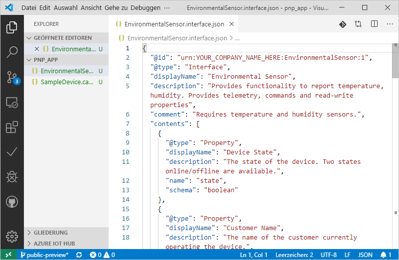
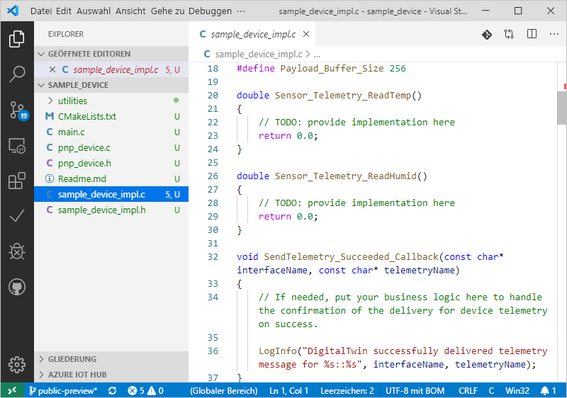

# <a name="quickstart-use-a-device-capability-model-to-create-an-iot-plug-and-play-device"></a>Schnellstart: Verwenden eines Gerätefunktionsmodells zum Erstellen eines IoT Plug & Play-Geräts

Mit einem _Gerätefunktionsmodell_ (Device Capability Model, DCM) werden die Funktionen eines IoT Plug & Play-Geräts beschrieben. Ein Gerätefunktionsmodell ist häufig einer Produkt-SKU zugeordnet. Die Funktionen, die im Gerätefunktionsmodell definiert sind, werden als wiederverwendbare Schnittstellen organisiert. Sie können ein Gerüst eines Gerätecodes aus einem Gerätefunktionsmodell generieren. In dieser Schnellstartanleitung wird veranschaulicht, wie Sie VS Code zum Erstellen eines IoT Plug & Play-Geräts mit einem Gerätefunktionsmodell verwenden.

## <a name="prerequisites"></a>Voraussetzungen

Zum Abschließen dieses Schnellstarts müssen Sie auf Ihrem lokalen Computer die folgende Software installieren:

* [Visual Studio (Community, Professional oder Enterprise):](https://visualstudio.microsoft.com/downloads/) Stellen Sie sicher, dass Sie die Komponente **NuGet-Paket-Manager** und die Workload **Desktopentwicklung mit C++** aktivieren, wenn Sie Visual Studio installieren.
* [Git](https://git-scm.com/download/).
* [CMake](https://cmake.org/download/).
* [Visual Studio Code](https://code.visualstudio.com/).

### <a name="install-azure-iot-tools"></a>Installieren von Azure IoT-Tools

Führen Sie die folgenden Schritte aus, um das Erweiterungspaket [Azure IoT Tools für VS Code](https://marketplace.visualstudio.com/items?itemName=vsciot-vscode.azure-iot-tools) zu installieren:

1. Wählen Sie in VS Code die Registerkarte **Erweiterungen**.
1. Suchen Sie nach **Azure IoT Tools**.
1. Wählen Sie **Installieren** aus.

### <a name="install-the-azure-iot-explorer"></a>Installieren von Azure IoT-Explorer

Laden Sie das Tool Azure IoT-Explorer von der Seite mit dem [aktuellen Release](https://github.com/Azure/azure-iot-explorer/releases) herunter.

### <a name="get-the-connection-string-for-your-company-model-repository"></a>Abrufen der Verbindungszeichenfolge für das Modellrepository Ihres Unternehmens

Sie finden die _Verbindungszeichenfolge für das Modellrepository Ihres Unternehmens_ im Portal [Azure Certified for IoT-Portal](https://preview.catalog.azureiotsolutions.com), wenn Sie sich mit einem Geschäfts-, Schul- oder Unikonto von Microsoft oder mit Ihrer Microsoft-Partner-ID anmelden (falls vorhanden). Wählen Sie nach dem Anmelden die Option **Company repository** (Unternehmensrepository) und dann **Verbindungszeichenfolgen**.

[!INCLUDE [cloud-shell-try-it.md](../../includes/cloud-shell-try-it.md)]

## <a name="prepare-an-iot-hub"></a>Vorbereiten eines IoT-Hubs

Für diesen Schnellstart benötigen Sie außerdem eine Azure IoT Hub-Instanz in Ihrem Azure-Abonnement. Wenn Sie kein Azure-Abonnement besitzen, können Sie ein [kostenloses Konto](https://azure.microsoft.com/free/?WT.mc_id=A261C142F) erstellen, bevor Sie beginnen.

> [!NOTE]
> Während der öffentlichen Vorschauphase sind die IoT Plug & Play-Funktionen nur für IoT-Hubs verfügbar, die in den Regionen **USA, Mitte**, **Europa, Norden** und **Japan, Osten** erstellt wurden.

Fügen Sie die Microsoft Azure IoT-Erweiterung für die Azure CLI hinzu:

```azurecli-interactive
az extension add --name azure-cli-iot-ext
```

Führen Sie den folgenden Befehl aus, um die Geräteidentität in Ihrem IoT-Hub zu erstellen. Ersetzen Sie die Platzhalter **YourIoTHubName** und **YourDevice** durch Ihre entsprechenden Namen. Falls Sie nicht über eine IoT Hub-Instanz verfügen, dient Ihnen diese [Anleitung als Hilfe bei der Erstellung](../iot-hub/iot-hub-create-using-cli.md):

```azurecli-interactive
az iot hub device-identity create --hub-name [YourIoTHubName] --device-id [YourDevice]
```

Führen Sie die folgenden Befehle aus, um die _Geräteverbindungszeichenfolge_ für das soeben registrierte Gerät abzurufen:

```azurecli-interactive
az iot hub device-identity show-connection-string --hub-name [YourIoTHubName] --device-id [YourDevice] --output table
```

Führen Sie die folgenden Befehle aus, um die _IoT Hub-Verbindungszeichenfolge_ für Ihren Hub auszuführen:

```azurecli-interactive
az iot hub show-connection-string --hub-name [YourIoTHubName] --output table
```

## <a name="prepare-the-development-environment"></a>Vorbereiten der Entwicklungsumgebung

### <a name="get-azure-iot-device-sdk-for-c"></a>Abrufen des Azure IoT-Geräte-SDK für C

In dieser Schnellstartanleitung bereiten Sie eine Entwicklungsumgebung vor, die Sie zum Klonen und Erstellen des Azure IoT-Geräte-SDK für C verwenden können.

1. Öffnen Sie eine Eingabeaufforderung. Führen Sie den folgenden Befehl zum Klonen des [Azure IoT C SDK](https://github.com/Azure/azure-iot-sdk-c)-GitHub-Repositorys aus:

    ```cmd/sh
    git clone https://github.com/Azure/azure-iot-sdk-c --recursive -b public-preview
    ```

    Sie sollten damit rechnen, dass die Ausführung dieses Vorgangs mehrere Minuten in Anspruch nimmt.

1. Erstellen Sie im Stammverzeichnis des lokalen Repositoryklons das Unterverzeichnis `pnp_app`. Sie verwenden diesen Ordner für die Gerätemodelldateien und den Gerätecode-Stub.

    ```cmd/sh
    cd azure-iot-sdk-c
    mkdir pnp_app
    ```

## <a name="author-your-model"></a>Erstellen des Modells

In dieser Schnellstartanleitung verwenden Sie ein vorhandenes Beispiel für ein Gerätefunktionsmodell und die zugehörigen Schnittstellen.

1. Laden Sie das [Gerätefunktionsmodell](https://github.com/Azure/IoTPlugandPlay/blob/master/samples/SampleDevice.capabilitymodel.json) und das [Schnittstellenbeispiel](https://github.com/Azure/IoTPlugandPlay/blob/master/samples/EnvironmentalSensor.interface.json) herunter, und speichern Sie die Dateien im Ordner `pnp_app`.

    > [!TIP]
    > Navigieren Sie zum Herunterladen einer Datei aus GitHub zur gewünschten Datei, klicken Sie mit der rechten Maustaste auf **Raw**, und wählen Sie dann die Option **Save link as** (Link speichern als).

1. Öffnen Sie den Ordner `pnp_app` mit VS Code. Sie können die Dateien mit IntelliSense anzeigen:

    

1. Ersetzen Sie in den heruntergeladenen Dateien `<YOUR_COMPANY_NAME_HERE>` in den Feldern `@id` und `schema` durch einen eindeutigen Wert. Verwenden Sie nur die Zeichen a - z, A - Z, 0 - 9 und Unterstrich. Weitere Informationen finden Sie unter [Digital Twin Identifier Format](https://github.com/Azure/IoTPlugandPlay/tree/master/DTDL#digital-twin-identifier-format) (Bezeichnerformat für digitale Zwillinge).

## <a name="generate-the-c-code-stub"></a>Generieren des C-Code-Stubs

Da Sie jetzt über ein Gerätefunktionsmodell und die zugeordneten Schnittstellen verfügen, können Sie den Gerätecode generieren, mit dem das Modell implementiert wird. Generieren Sie wie folgt den C-Code-Stub in VS Code:

1. Drücken Sie bei geöffnetem Ordner mit den Gerätefunktionsmodell-Dateien die Tastenkombination **STRG+UMSCHALT+P**, um die Befehlspalette zu öffnen. Geben Sie **IoT Plug & Play** ein, und wählen Sie **Generate Device Code Stub** (Gerätecode-Stub generieren).

    > [!NOTE]
    > Wenn Sie das Hilfsprogramm „IoT Plug & Play-Codegenerator“ zum ersten Mal verwenden, dauert der Download einige Sekunden.

1. Wählen Sie die Gerätefunktionsmodell-Datei aus, die Sie verwenden möchten, um den Gerätecode-Stub zu generieren.

1. Geben Sie den Projektnamen **sample_device** ein. Dies ist der Name für Ihre Geräteanwendung.

1. Wählen Sie **ANSI C** als Sprache aus.

1. Wählen Sie **CMake-Projekt** als Projekttyp aus.

1. Wählen Sie **Via IoT Hub device connection string** (Über IoT Hub-Geräteverbindungszeichenfolge) als Verbindungsmethode aus.

1. VS Code öffnet ein neues Fenster mit generierten Gerätecode-Stubdateien.
    

## <a name="build-the-code"></a>Erstellen des Codes

Sie verwenden das Geräte-SDK, um den generierten Gerätecode-Stub zu erstellen. Die von Ihnen erstellte Anwendung simuliert ein Gerät, mit dem eine Verbindung mit einem IoT-Hub hergestellt wird. Die Anwendung sendet Telemetriedaten und Eigenschaften und empfängt Befehle.

1. Öffnen Sie in VS Code die Datei `CMakeLists.txt` im Stammordner des Geräte-SDK.

1. Fügen Sie die unten angegebene Zeile am Ende der Datei `CMakeLists.txt` hinzu, um beim Kompilieren den Ordner mit dem Gerätecode-Stub einzubinden:

    ```txt
    add_subdirectory(pnp_app/sample_device)
    ```

1. Erstellen Sie im Stammordner des Geräte-SDK den Unterordner „cmake“, und navigieren Sie zu diesem Ordner:

    ```cmd\sh
    mkdir cmake
    cd cmake
    ```

1. Führen Sie die folgenden Befehle aus, um das Geräte-SDK und den generierten Code-Stub zu erstellen:

    ```cmd\sh
    cmake .. -Duse_prov_client=ON -Dhsm_type_symm_key:BOOL=ON
    cmake --build . -- /m /p:Configuration=Release
    ```

    > [!NOTE]
    > Falls CMake Ihren C++-Compiler nicht finden kann, treten beim Ausführen des obigen Befehls Buildfehler auf. Führen Sie den Befehl in diesem Fall an der [Visual Studio-Eingabeaufforderung](https://docs.microsoft.com/dotnet/framework/tools/developer-command-prompt-for-vs) aus.

1. Führen Sie nach dem erfolgreichen Abschluss des Buildvorgangs Ihre Anwendung aus, und übergeben Sie die IoT Hub-Geräteverbindungszeichenfolge als Parameter.

    ```cmd\sh
    cd azure-iot-sdk-c\cmake\pnp_app\sample_device\Release\
    sample_device.exe "[IoT Hub device connection string]"
    ```

1. Die Geräteanwendung beginnt mit dem Senden von Daten an IoT Hub.

    

## <a name="validate-the-code"></a>Überprüfen des Codes

### <a name="publish-device-model-files-to-model-repository"></a>Veröffentlichen von Gerätemodelldateien im Modellrepository

Zum Überprüfen des Gerätecodes mit **Azure IoT-Explorer** müssen Sie die Dateien im Modellrepository veröffentlichen.

1. Drücken Sie bei geöffnetem Ordner mit den Gerätefunktionsmodell-Dateien **STRG+UMSCHALT+P**, um die Befehlspalette zu öffnen. Geben Sie **IoT Plug & Play: Submit files to Model Repository** (IoT Plug & Play: Dateien an Modellrepository übermitteln) ein, und wählen Sie diese Option aus.

1. Wählen Sie die Dateien `SampleDevice.capabilitymodel.json` und `EnvironmentalSensor.interface.json` aus.

1. Geben Sie die Verbindungszeichenfolge für das Modellrepository Ihres Unternehmens ein.

    > [!NOTE]
    > Sie benötigen die Verbindungszeichenfolge nur, wenn Sie sich zum ersten Mal am Repository anmelden.

1. Im VS Code-Ausgabefenster und anhand der Benachrichtigung können Sie überprüfen, ob die Veröffentlichung der Dateien erfolgreich war.

    > [!NOTE]
    > Falls Sie beim Veröffentlichen der Gerätemodelldateien Fehler erhalten, können Sie den Befehl **IoT Plug & Play: Sign out Model Repository** (IoT Plug & Play: Modellrepository abmelden) verwenden, um sich abzumelden, und die Schritte dann erneut ausführen.

### <a name="use-the-azure-iot-explorer-to-validate-the-code"></a>Verwenden von Azure IoT-Explorer zum Überprüfen des Codes

1. Öffnen Sie Azure IoT-Explorer. Die Seite mit den **App-Konfigurationen** wird angezeigt.

1. Geben Sie Ihre IoT Hub-Verbindungszeichenfolge ein, und klicken Sie auf **Verbinden**.

1. Nachdem Sie eine Verbindung hergestellt haben, wird die Seite mit der Geräteübersicht angezeigt.

1. Wählen Sie zum Hinzufügen Ihres Unternehmensrepositorys die Option **Einstellungen**, **+ Neu** und dann **Company repository** (Unternehmensrepository).

1. Fügen Sie Ihre Verbindungszeichenfolge für das Modellrepository Ihres Unternehmens hinzu. Wählen Sie **Verbinden**aus.

1. Suchen Sie auf der Seite mit der Geräteübersicht nach der Geräteidentität, die Sie zuvor erstellt haben, und wählen Sie sie aus, um weitere Details anzuzeigen.

1. Erweitern Sie die Schnittstelle mit der ID **urn:azureiot:EnvironmentalSensor:1**, um die IoT Plug & Play-Primitive anzuzeigen: Eigenschaften, Befehle und Telemetriedaten.

1. Wählen Sie die Seite **Telemetrie** aus, um die vom Gerät gesendeten Telemetriedaten anzuzeigen.

1. Wählen Sie die Seite **Properties(non-writable)** (Eigenschaften (nicht schreibbar)) aus, um die vom Gerät gemeldeten nicht schreibbaren Eigenschaften anzuzeigen.

1. Wählen Sie die Seite **Properties(writable)** (Eigenschaften (schreibbar)) aus, um die schreibbaren Eigenschaften anzuzeigen, die Sie aktualisieren können.

1. Erweitern Sie die Eigenschaft **name**, aktualisieren Sie sie mit einem neuen Namen, und wählen Sie **update writable property** (Schreibbare Eigenschaft aktualisieren) aus. 
2. Klicken Sie zum Anzeigen des neuen Namens in der Spalte **Gemeldete Eigenschaft** oben auf der Seite auf die Schaltfläche **Aktualisieren**.

1. Wählen Sie die Seite **Befehl** aus, um alle Befehle anzuzeigen, die vom Gerät unterstützt werden.

1. Erweitern Sie den Befehl **blink** (Blinken), und legen Sie ein neues Intervall für die Blinkzeit fest. Wählen Sie **Befehl senden** aus, um den Befehl auf dem Gerät aufzurufen.

1. Navigieren Sie zum simulierten Gerät, um zu überprüfen, ob der Befehl wie erwartet ausgeführt wird.

## <a name="next-steps"></a>Nächste Schritte

In dieser Schnellstartanleitung wurde beschrieben, wie Sie mit einem Gerätefunktionsmodell ein IoT Plug & Play-Gerät erstellen.

Weitere Informationen zu IoT Plug & Play finden Sie im folgenden Tutorial:

> [!div class="nextstepaction"]
> [Erstellen und Testen eines Gerätefunktionsmodells mit Visual Studio Code](tutorial-pnp-visual-studio-code.md)
