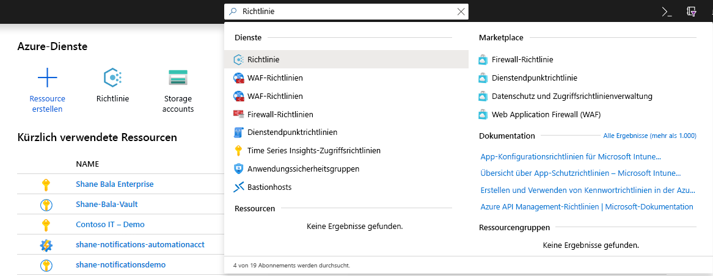
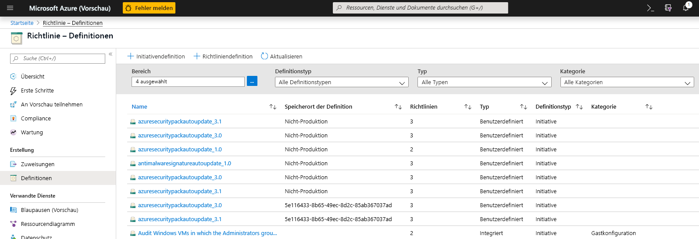
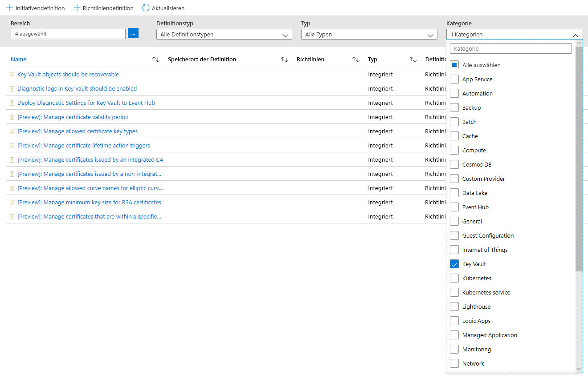
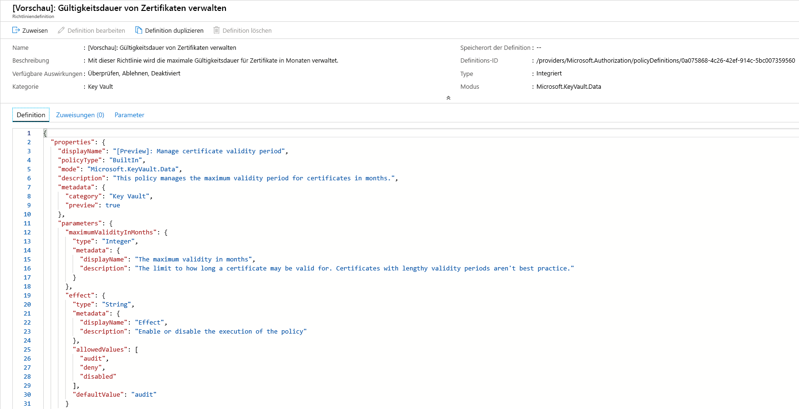
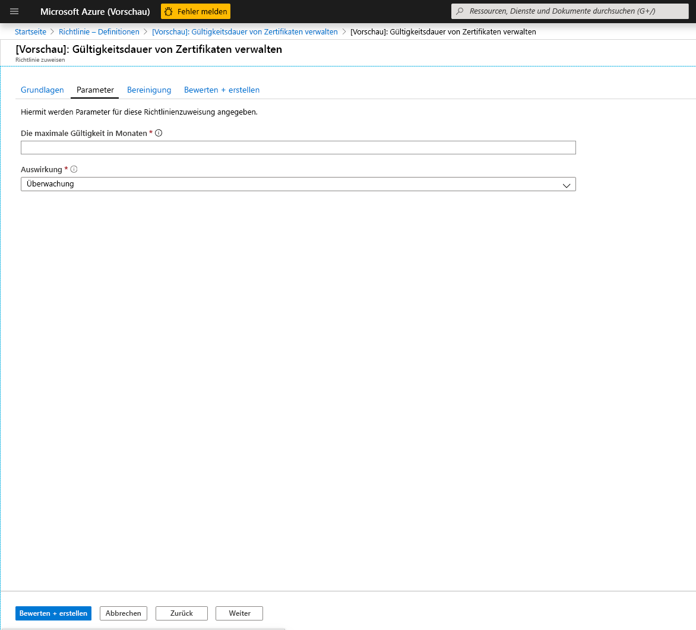
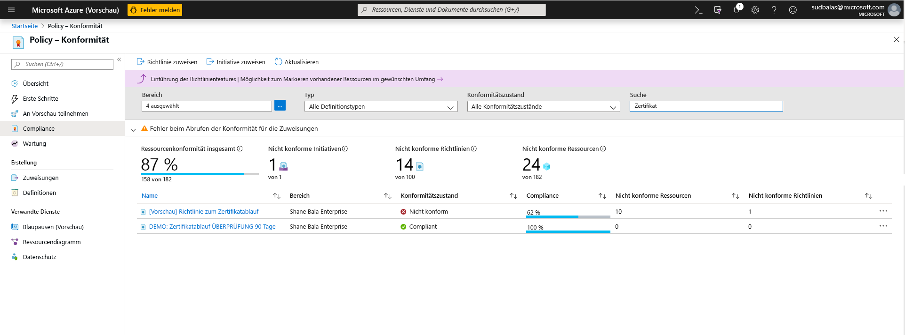
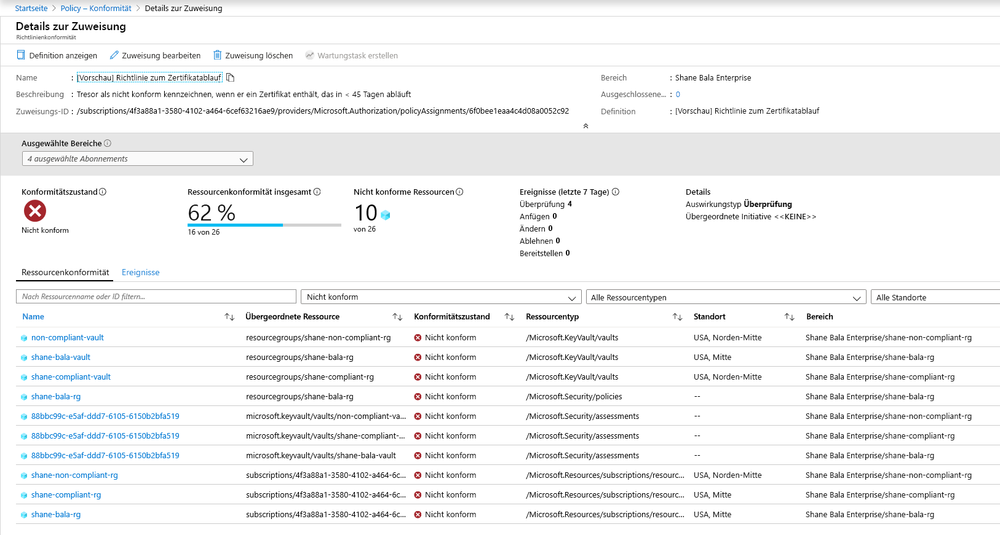
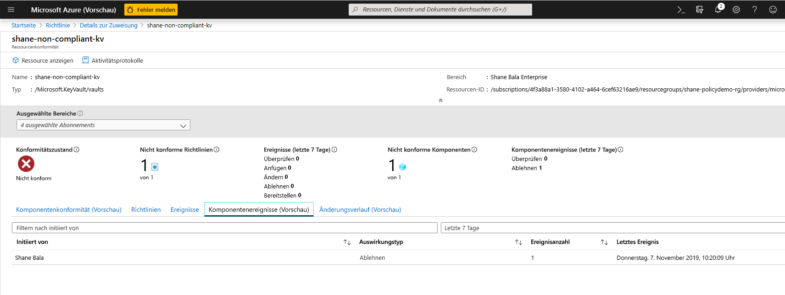

# Integrieren von Azure Key Vault in Azure Policy

[Azure Policy](../governance/policy/index.yml) ist ein Governancetool, mit dem Benutzer ihre Azure-Umgebung bedarfsorientiert überwachen und verwalten können. Azure Policy bietet die Möglichkeit, Schutzmaßnahmen für Azure-Ressourcen zu platzieren, um sicherzustellen, dass diese mit den zugewiesenen Richtlinienregeln konform sind. Es ermöglicht es Benutzern, eine Überwachung, Echtzeiterzwingung und Wiederherstellung ihrer Azure-Umgebung auszuführen. Die Ergebnisse von Überwachungen, die von Policy durchgeführt werden, stehen Benutzern in einem Kompatibilitätsdashboard zur Verfügung, in dem sie sehen können, welche Ressourcen und Komponenten kompatibel sind und welche nicht.  Weitere Informationen finden Sie unter [Übersicht über den Azure Policy-Dienst](../governance/policy/overview.md).

Beispiele für Nutzungsszenarien:

- Sie möchten die Sicherheitsstufe Ihres Unternehmens verbessern, indem Sie Anforderungen in Bezug auf die Mindestschlüsselgrößen und die maximalen Gültigkeitsdauern von Zertifikaten in den Schlüsseltresoren Ihres Unternehmens implementieren, aber Sie wissen nicht, welche Teams konform sind und welche nicht. 
- Zurzeit haben Sie keine Lösung, um eine Überwachung in Ihrer Organisation durchzuführen, oder Sie führen manuelle Überwachungen Ihrer Umgebung durch, indem Sie die einzelnen Teams in Ihrer Organisation bitten, ihre Konformität zu melden. Sie suchen nach einer Möglichkeit, diese Aufgabe zu automatisieren, Überwachungen in Echtzeit durchzuführen und die Genauigkeit der Überwachung sicherzustellen.
- Sie möchten die Sicherheitsrichtlinien Ihres Unternehmens erzwingen und verhindern, dass Benutzer selbstsignierte Zertifikate erstellen, Ihnen steht aber keine automatisierte Methode zur Verfügung, um diese Erstellung zu blockieren. 
- Sie möchten einige Anforderungen für Ihre Testteams lockern, aber Sie möchten auch eine strenge Kontrolle über Ihre Produktionsumgebung beibehalten. Sie benötigen eine einfache automatisierte Methode, um die Erzwingung Ihrer Ressourcen zu trennen. 
- Sie möchten sicherstellen, dass Sie ein Rollback der Erzwingung neuer Richtlinien durchführen können, falls ein Problem mit der Livewebsite auftritt. Sie benötigen eine One-Click-Lösung, um die Erzwingung der Richtlinie zu deaktivieren. 
- Sie verlassen sich auf eine Drittanbieterlösung zur Überwachung Ihrer Umgebung, und Sie möchten ein internes Microsoft-Angebot verwenden. 

## Arten von Richtlinienauswirkungen und Anleitung

**Überwachen**: Wenn die Auswirkung einer Richtlinie auf „Überwachen“ festgelegt ist, verursacht die Richtlinie keine Breaking Changes an Ihrer Umgebung. Sie werden nur auf Komponenten wie z. B. Zertifikate aufmerksam gemacht, die nicht mit den Richtliniendefinitionen innerhalb eines angegebenen Bereichs übereinstimmen. Dabei werden diese Komponenten im Dashboard für die Richtlinienkonformität als nicht konform markiert. Die Überwachung ist Standard, wenn keine Richtlinienauswirkung ausgewählt ist. 

**Verweigern:** Wenn die Auswirkung einer Richtlinie auf „Verweigern“ festgelegt ist, blockiert die Richtlinie die Erstellung neuer Komponenten wie z. B. Zertifikaten und blockiert zudem neue Versionen vorhandener Komponenten, die der Richtliniendefinition nicht entsprechen. Vorhandene nicht konforme Ressourcen innerhalb eines Schlüsseltresors sind nicht betroffen. Die Überwachungsfunktionen werden weiterhin ausgeführt.

## Verfügbare integrierte Richtliniendefinitionen

Key Vault hat eine Reihe von Richtlinien erstellt, die Sie häufigen Szenarien zuweisen können, um Zertifikate zu verwalten. Diese Richtlinien sind integriert. Das bedeutet, dass Sie keinen benutzerdefinierten JSON-Code schreiben müssen, um sie zu aktivieren, und sie sind im Azure-Portal für die Zuweisung verfügbar. Sie können aber weiterhin bestimmte Parameter an die Anforderungen Ihrer Organisation anpassen. 

Im Folgenden finden Sie die acht Vorschaurichtlinien.

### Gültigkeitsdauer von Zertifikaten verwalten (Vorschau)

Mit dieser Richtlinie können Sie die maximale Gültigkeitsdauer Ihrer Zertifikate verwalten, die im Schlüsseltresor gespeichert sind. In Sachen Sicherheit hat es sich bewährt, die maximale Gültigkeitsdauer der Zertifikate zu beschränken. Wenn ein privater Schlüssel Ihres Zertifikats ohne Erkennung kompromittiert wird, minimiert die Verwendung kurzlebiger Zertifikate den Zeitrahmen für den aktuellen Schaden und reduziert den Wert des Zertifikats für einen Angreifer. 

### Zulässige Zertifikatschlüsseltypen verwalten (Vorschau)
Mit dieser Richtlinie können Sie den Zertifikattyp einschränken, der in Ihrem Schlüsseltresor vorhanden sein kann. Sie können diese Richtlinie verwenden, um sicherzustellen, dass Ihre privaten Zertifikatschlüssel durch RSA, ECC oder HSM gesichert sind. Sie können aus der folgenden Liste auswählen, welche Zertifikattypen zulässig sind.
- RSA
- RSA - HSM
- ECC 
- ECC - HSM 

### Aktionstrigger für Zertifikatlebensdauer verwalten (Vorschau)

Diese Richtlinie ermöglicht Ihnen die Verwaltung der Lebensdaueraktion, die für Zertifikate festgelegt wurde, die entweder die innerhalb einer angegebenen Anzahl von Tagen ablaufen oder einen bestimmten Prozentsatz ihrer nutzbaren Lebensdauer erreicht haben. 

### Durch eine integrierte Zertifizierungsstelle ausgestellte Zertifikate verwalten (Vorschau)

Wenn Sie eine in Key Vault integrierte Zertifizierungsstelle (Digicert oder GlobalSign) verwenden und möchten, dass Benutzer einen oder beide Anbieter verwenden, können Sie diese Richtlinie verwenden, um Ihre Auswahl zu überwachen oder zu erzwingen. Diese Richtlinie kann auch verwendet werden, um die Erstellung von selbstsignierten Zertifikaten im Schlüsseltresor zu überwachen oder zu verweigern. 

### Durch eine integrierte Zertifizierungsstelle ausgestellte Zertifikate verwalten (Vorschau)

Wenn Sie eine interne Zertifizierungsstelle oder eine nicht in den Schlüsseltresor integrierte Zertifizierungsstelle verwenden und möchten, dass Benutzer eine Zertifizierungsstelle aus einer von Ihnen bereitgestellten Liste verwenden, können Sie diese Richtlinie verwenden, um eine Liste der zulässigen Zertifizierungsstellen anhand des Ausstellernamens zu erstellen. Diese Richtlinie kann auch verwendet werden, um die Erstellung von selbstsignierten Zertifikaten im Schlüsseltresor zu überwachen oder zu verweigern. 

### Zulässige Kurvennamen für ECC-Zertifikate (Kryptografie für elliptische Kurve) verwalten (Vorschau)
Wenn Sie Kryptografie für elliptische Kurven oder ECC-Zertifikate verwenden, können Sie eine zulässige Liste von Kurvennamen aus der folgenden Liste erstellen. Die Standardoption lässt alle folgenden Kurvennamen zu. 
- P-256
- P-256K
- P-384
- P-521

### Mindestschlüsselgröße für RSA-Zertifikate verwalten (Vorschau)
Wenn Sie RSA-Zertifikate verwenden, können Sie eine Mindestschlüsselgröße für Ihre Zertifikate auswählen. Sie können aus der folgenden Liste eine Option auswählen. 
- 2048 Bit
- 3072 Bit
- 4096 Bit

### Zertifikate verwalten, die innerhalb einer angegebenen Anzahl von Tagen ablaufen (Vorschau)
Ihr Dienst kann einen Ausfall erleben, wenn ein Zertifikat, das nicht ausreichend überwacht wird, vor seinem Ablauf nicht rotiert wird. Diese Richtlinie ist wichtig, um sicherzustellen, dass Ihre im Schlüsseltresor gespeicherten Zertifikate überwacht werden. Es wird empfohlen, diese Richtlinie mehrmals mit unterschiedlichen Ablaufschwellenwerten anzuwenden, z. B. mit Schwellenwerten von 180, 90, 60 und 30 Tagen. Diese Richtlinie kann verwendet werden, um den Ablauf von Zertifikaten in Ihrer Organisation zu überwachen und zu überprüfen. 

## Beispielszenario

Sie verwalten einen Schlüsseltresor mit 100 Zertifikaten, der von mehreren Teams verwendet wird, und Sie möchten sicherstellen, dass keines der Zertifikate im Schlüsseltresor länger als zwei Jahre gültig ist.

1. Sie weisen die Richtlinie [Gültigkeitsdauer von Zertifikaten verwalten](#manage-certificate-validity-period-preview) zu, legen eine maximale Gültigkeitsdauer von 24 Monaten für die Zertifikate fest und legen die Auswirkung der Richtlinie auf „Überwachen“ fest. 
1. Im [Konformitätsbericht im Azure-Portal](#view-compliance-results) sehen Sie, dass 20 Zertifikate nicht konform und länger als zwei Jahre gültig sind. Die restlichen Zertifikate sind konform. 
1. Sie wenden sich an die Besitzer dieser Zertifikate und teilen die neue Sicherheitsanforderung mit, aufgrund derer Zertifikate nicht länger als zwei Jahre gültig sein dürfen. Einige Teams reagieren, und 15 Zertifikate werden mit einer maximalen Gültigkeitsdauer von zwei Jahren oder weniger aktualisiert. Andere Teams reagieren nicht, und Sie verfügen weiterhin über fünf nicht konforme Zertifikate in Ihrem Schlüsseltresor.
1. Sie ändern die Auswirkung der zugewiesenen Richtlinie in „Verweigern“. Die fünf nicht konformen Zertifikate werden nicht widerrufen und funktionieren weiterhin. Sie können jedoch nicht mit einer Gültigkeitsdauer von mehr als zwei Jahren aktualisiert werden. 

## Aktivieren und Verwalten einer Key Vault-Richtlinie über das Azure-Portal

### Auswählen einer Richtliniendefinition

1. Melden Sie sich beim Azure-Portal an. 
1. Suchen Sie in der Suchleiste nach „Richtlinie“, und wählen Sie **Richtlinie**aus.

    

1. Wählen Sie im Fenster „Richtlinie“ die Option **Definitionen** aus.

    

1. Deaktivieren Sie im Kategoriefilter **Alle auswählen**, und wählen Sie **Key Vault** aus. 

    

1. Jetzt sollten Ihnen alle Richtlinien angezeigt werden, die für Azure Key Vault für die Public Preview verfügbar sind. Stellen Sie sicher, dass Sie den Abschnitt mit den Richtlinienanweisungen gelesen und verstanden haben, und wählen Sie eine Richtlinie aus, die Sie einem Bereich zuweisen möchten.  

    

### Zuweisen einer Richtlinie zu einem Bereich 

1. Wählen Sie eine Richtlinie aus, die Sie anwenden möchten. In diesem Beispiel wird die Richtlinie **Gültigkeitsdauer von Zertifikaten verwalten** angezeigt. Klicken Sie oben links auf die Schaltfläche „Zuweisen“.

    
  
1. Wählen Sie das Abonnement aus, für das die Richtlinie gelten soll. Sie können den Gültigkeitsbereich auf nur eine einzelne Ressourcengruppe innerhalb eines Abonnements beschränken. Wenn Sie die Richtlinie auf das gesamte Abonnement anwenden und einige Ressourcengruppen ausschließen möchten, können Sie auch eine Ausschlussliste konfigurieren. Legen Sie den Selektor für die Richtlinienerzwingung auf **Aktiviert** fest, wenn die Auswirkung der Richtlinie (Überwachen oder Verweigern) erfolgen soll, oder auf **Deaktiviert**, um die Auswirkung (Überwachen oder Verweigern) zu deaktivieren. 

    

1. Klicken Sie oben auf dem Bildschirm auf die Registerkarte „Parameter“, um die gewünschte maximale Gültigkeitsdauer (in Monaten) festzulegen. Wählen Sie **Überwachen** oder **Verweigern** aus, um die Auswirkung der Richtlinie gemäß der Anleitung in den obigen Abschnitten zu erhalten. Wählen Sie anschließend die Schaltfläche „Überprüfen und erstellen“ aus. 

    

### Anzeigen von Konformitätsergebnissen

1. Wechseln Sie zurück zum Blatt „Richtlinie“, und wählen Sie die Registerkarte „Konformität“ aus. Klicken Sie auf die Richtlinienzuweisung, für die Sie die Konformitätsergebnisse anzeigen möchten.

    

1. Auf dieser Seite können Sie Ergebnisse nach konformen oder nicht konformen Tresoren filtern. Hier sehen Sie eine Liste nicht konformer Schlüsseltresore innerhalb des Gültigkeitsbereichs der Richtlinienzuweisung. Ein Tresor wird als nicht konform eingestuft, wenn eine der Komponenten (Zertifikate) im Tresor nicht konform ist. Sie können einen einzelnen Tresor auswählen, um die einzelnen nicht konformen Komponenten (Zertifikate) anzuzeigen. 

    

1. Anzeigen des Namens der Komponenten in einem Tresor, die nicht konform sind

    

1. Wenn Sie überprüfen müssen, ob den Benutzern die Möglichkeit zum Erstellen von Ressourcen in Key Vault verweigert wird, klicken Sie auf die Registerkarte **Komponentenereignisse (Vorschau)** , um eine Zusammenfassung der verweigerten Zertifikatvorgänge mit dem Anforderer und Zeitstempeln der Anforderungen anzuzeigen. 

    

## Funktionseinschränkungen

Beim Zuweisen einer Richtlinie mit der Auswirkung „Verweigern“ kann es im Durchschnitt bis zu 30 Minuten, im ungünstigsten Fall bis zu einer Stunde dauern, bis die Erstellung nicht konformer Ressourcen verweigert wird. Bei der Richtlinienauswertung vorhandener Komponenten in einem Tresor kann es im Durchschnitt bis zu einer Stunde und im ungünstigsten Fall zwei Stunden dauern, bis die Konformitätsergebnisse in der Benutzeroberfläche des Portals angezeigt werden. Wenn die Konformitätsergebnisse als „Nicht gestartet“ angezeigt werden, kann dies auf folgende Gründe zurückzuführen sein:
- Die Richtlinienauswertung ist noch nicht abgeschlossen. Die anfängliche Wartezeit für die Auswertung kann im schlimmsten Fall bis zu zwei Stunden in Anspruch nehmen. 
- Im Gültigkeitsbereich der Richtlinienzuweisung sind keine Schlüsseltresore vorhanden.
- Im Gültigkeitsbereich der Richtlinienzuweisung sind keine Schlüsseltresore mit Zertifikaten vorhanden. 

## Nächste Schritte

- Weitere Informationen zu [Azure Policy](../governance/policy/overview.md)
- Key Vault-Beispiele: [Integrierte Azure Policy-Richtliniendefinitionen: Key Vault](../governance/policy/samples/built-in-policies.md#key-vault)