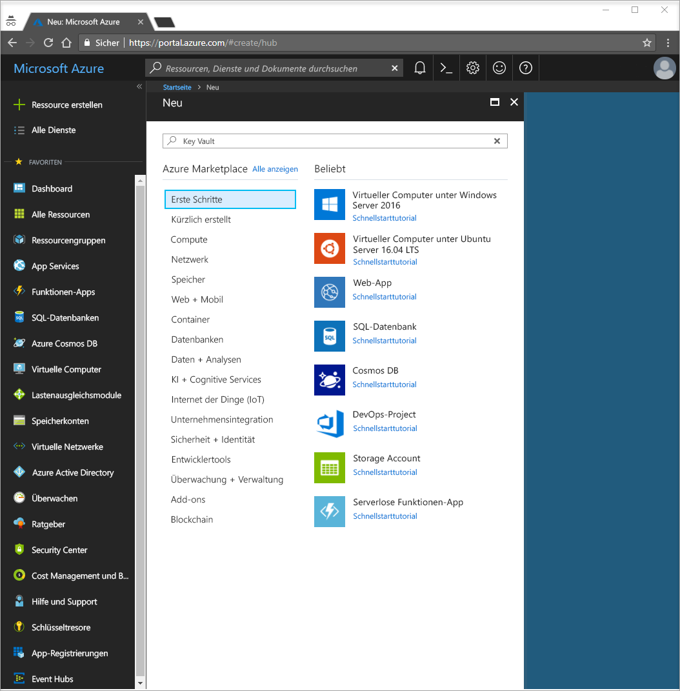
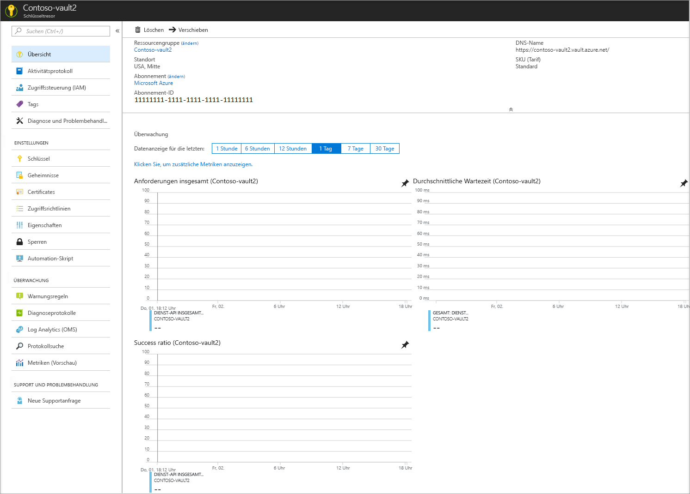

# Schnellstart: Festlegen eines Geheimnisses und Abrufen des Geheimnisses aus Azure Key Vault mithilfe des Azure-Portals

Azure Key Vault ist ein Clouddienst, der als sicherer Geheimnisspeicher fungiert. Dadurch können Schlüssel, Kennwörter, Zertifikate und andere Geheimnisse sicher gespeichert werden. Weitere Informationen zu Key Vault finden Sie in der [Übersicht](key-vault-overview.md). Azure Key Vault-Instanzen können über das Azure-Portal erstellt und verwaltet werden. In dieser Schnellstartanleitung erstellen Sie einen Schlüsseltresor. Danach speichern Sie ein Geheimnis.

Wenn Sie kein Azure-Abonnement besitzen, können Sie ein [kostenloses Konto](https://azure.microsoft.com/free/?WT.mc_id=A261C142F) erstellen, bevor Sie beginnen.

## Anmelden bei Azure

Melden Sie sich unter http://portal.azure.com beim Azure-Portal an.

## Erstellen eines Tresors

1. Klicken Sie in der linken oberen Ecke des Azure-Portals auf die Option **Ressource erstellen**.

    
2. Geben Sie **Key Vault** in das Suchfeld ein.
3. Wählen Sie in der Ergebnisliste **Key Vault** aus.
4. Klicken Sie im Abschnitt „Key Vault“ auf **Erstellen**.
5. Geben Sie im Abschnitt **Schlüsseltresor erstellen** folgende Informationen ein:
    - **Name:** Im Rahmen dieser Schnellstartanleitung verwenden wir **Contoso-vault2**. Geben Sie bei Ihren Tests einen eindeutigen Namen an.
    - **Abonnement:** Wählen Sie das Abonnement aus, das Sie für diese Schnellstartanleitung verwenden möchten.
    - Klicken Sie unter **Ressourcengruppe** auf **Neu erstellen**, und geben Sie einen Ressourcengruppennamen ein.
    - Wählen Sie im Pulldownmenü **Standort** einen Standort aus.
    - Aktivieren Sie das Kontrollkästchen **An Dashboard anheften**.
    - Behalten Sie bei den anderen Optionen die Standardeinstellungen bei.
6. Klicken Sie nach der Angabe der obigen Informationen auf **Erstellen**.

Beachten Sie die beiden folgenden Eigenschaften:

* **Tresorname:** In diesem Beispiel wird **Contoso-Vault2** verwendet. Dieser Name wird noch für andere Schritte benötigt.
* **Tresor-URI:** https://contoso-vault2.vault.azure.net/ in diesem Beispiel. Anwendungen, die Ihren Tresor über die zugehörige REST-API nutzen, müssen diesen URI verwenden.

An diesem Punkt ist nur Ihr Azure-Konto zum Ausführen von Vorgängen für den neuen Tresor autorisiert.

## Hinzufügen eines Geheimnisses zu Key Vault

Ein Geheimnis kann dem Tresor mit einigen wenigen Zusatzschritten hinzugefügt werden. In diesem Fall fügen wir ein Kennwort hinzu, das von einer Anwendung verwendet werden kann. Das Kennwort heißt **ExamplePassword** und enthält den Wert **Pa$$w0rd**.

1. Klicken Sie auf der Key Vault-Eigenschaftenseite auf **Geheimnisse**.
2. Klicken Sie auf **Generieren/Importieren**.
3. Wählen Sie auf dem Bildschirm **Geheimnis erstellen** Folgendes aus:
    - **Uploadoptionen:** Manuell
    - **Name:** ExamplePassword
    - **Wert:** Pa$$w0rd
    - Behalten Sie bei den anderen Optionen die Standardwerte bei. Klicken Sie auf **Create**.

Nachdem Sie die Meldung erhalten haben, dass das Geheimnis erfolgreich erstellt wurde, können Sie in der Liste auf das Geheimnis klicken. Daraufhin werden einige der Eigenschaften angezeigt. Wenn Sie auf die aktuelle Version klicken, sehen Sie den Wert, den Sie im vorherigen Schritt angegeben haben.

## Bereinigen von Ressourcen

Andere Schnellstartanleitungen und Tutorials für Key Vault bauen auf dieser Schnellstartanleitung auf. Falls Sie mit weiteren Schnellstartanleitungen und Tutorials fortfahren möchten, sollten Sie die Ressourcen nicht bereinigen.
Wenn Sie die Ressourcen nicht mehr benötigen, löschen Sie die Ressourcengruppe. Dadurch werden die Key Vault-Instanz und die dazugehörigen Ressourcen gelöscht. So löschen Sie die Ressourcengruppe über das Portal:

1. Geben Sie den Namen Ihrer Ressourcengruppe in das Suchfeld am oberen Rand des Portals ein. Klicken Sie in den Suchergebnissen auf die Ressourcengruppe aus dieser Schnellstartanleitung.
2. Wählen Sie die Option **Ressourcengruppe löschen**.
3. Geben Sie im Feld **GEBEN SIE DEN RESSOURCENGRUPPENNAMEN EIN:** den Namen der Ressourcengruppe ein, und klicken Sie anschließend auf **Löschen**.

## Nächste Schritte

In dieser Schnellstartanleitung haben Sie eine Key Vault-Instanz erstellt und ein Geheimnis gespeichert. Das Tutorial zu Webanwendungen mit Key Vault enthält weitere Informationen zu Key Vault und zur Verwendung mit Ihren Anwendungen.

> [!div class="nextstepaction"]
> Wenn Sie erfahren möchten, wie Sie ein Geheimnis aus Key Vault aus einer Webanwendung mit verwalteten Dienstidentitäten lesen, fahren Sie mit dem Tutorial [Konfigurieren einer Azure-Webanwendung für das Lesen eines Geheimnisses aus Key Vault](tutorial-web-application-keyvault.md) fort.
