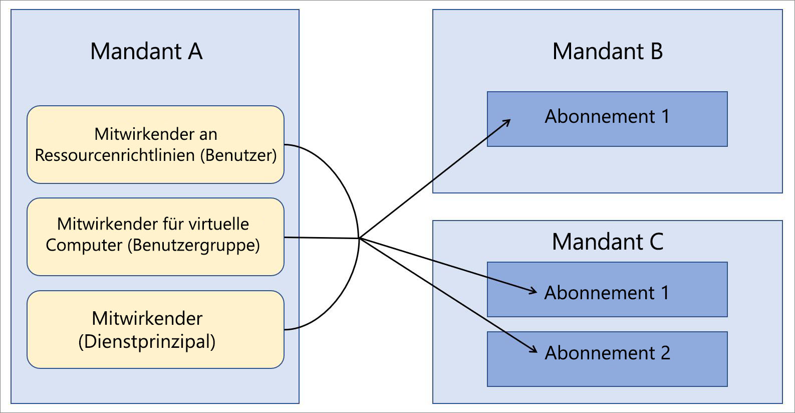

# Azure Lighthouse in Unternehmensszenarien

Das häufigste Szenario für [Azure Lighthouse](../overview.md) ist ein Dienstanbieter, der Ressourcen auf den Azure AD-Mandanten (Azure Active Directory) seiner Kunden verwaltet. Die Funktionen von Azure Lighthouse können aber auch zum Vereinfachen der mandantenübergreifenden Verwaltung in einem Unternehmen, in dem mehrere Azure AD-Mandanten vorhanden sind, verwendet werden.

## Einzelner Mandant und mehrere Mandanten

Für die meisten Organisationen ist die Verwaltung mit nur einem Azure AD-Mandanten einfacher. Wenn sich alle Ressourcen unter einem Mandanten befinden, können die Verwaltungsaufgaben nach den jeweiligen Benutzern, Benutzergruppen oder Dienstprinzipalen des Mandanten zentralisiert werden. Wir empfehlen Ihnen, nach Möglichkeit nur einen Mandanten für Ihre Organisation zu verwenden.

Es kann aber auch Situationen geben, in denen eine Organisation mehrere Azure AD-Mandanten verwalten muss. In einigen Fällen ist dies unter Umständen nur vorübergehend erforderlich, wenn beispielsweise Übernahmen erfolgt sind und es einige Zeit dauert, eine langfristige Konsolidierungsstrategie für Mandanten zu definieren. Es kann auch sein, dass eine Organisation fortlaufend mehrere Mandanten verwalten muss (aufgrund von unabhängigen Tochtergesellschaften, geografischen oder rechtlichen Anforderungen usw.). Falls eine Architektur mit mehreren Mandanten benötigt wird, kann die von Azure delegierte Ressourcenverwaltung genutzt werden, um die Verwaltungsvorgänge zu zentralisieren und zu optimieren. Für Abonnements mehrerer Mandanten kann das Onboarding für die [delegierte Azure-Ressourcenverwaltung](azure-delegated-resource-management.md) durchgeführt werden, damit die festgelegten Benutzer eines verwalteten Mandanten [mandantenübergreifende Verwaltungsfunktionen](cross-tenant-management-experience.md) zentral und skalierbar ausführen können.

## Architektur für die Mandantenverwaltung

Beim Zentralisieren von Verwaltungsvorgängen für mehrere Mandanten müssen Sie ermitteln, welcher Mandant die Benutzer enthält, die Verwaltungsvorgänge für die anderen Mandanten durchführen. Sie müssen also ermitteln, welcher Mandant der verwaltende Mandant für die anderen Mandanten ist.

Angenommen, Ihre Organisation verfügt über einen einzelnen Mandanten mit dem Namen *Mandant A*. Ihre Organisation beschafft dann zwei weitere Mandanten (*Mandant B* und *Mandant C*), die aus geschäftlichen Gründen separat verwaltet werden müssen.

Ihre Organisation möchte auf allen Mandanten die gleichen Richtliniendefinitionen, Sicherungsmethoden und Sicherheitsprozesse verwenden. Da Sie bereits über Benutzer verfügen (einschließlich Benutzergruppen und Dienstprinzipalen), die für die Durchführung dieser Aufgaben auf Mandant A zuständig sind, können Sie für alle Abonnements auf Mandant B und Mandant C das Onboarding durchführen, damit die gleichen Benutzer von Mandant A diese Aufgaben erledigen können.

## Sicherheits- und Zugriffsaspekte

In den meisten Unternehmensszenarien ist es ratsam, ein vollständiges Abonnement für die delegierte Azure-Ressourcenverwaltung zu delegieren. Es ist aber auch möglich, in einem Abonnement nur bestimmte Ressourcengruppen zu delegieren.

Achten Sie aber jeweils darauf, dass Sie sich [beim Festlegen, welche Benutzer Zugriff auf die Ressourcen haben, an das Prinzip der geringsten Rechte halten](recommended-security-practices.md#assign-permissions-to-groups-using-the-principle-of-least-privilege). So stellen Sie sicher, dass die Benutzer nur über die Berechtigungen verfügen, die sie zum Durchführen der erforderlichen Aufgaben benötigen, und das Risiko unbeabsichtigter Fehler wird reduziert.

Bei Azure Lighthouse und der delegierten Azure-Ressourcenverwaltung werden nur Verknüpfungen zwischen einem verwaltenden Mandanten und den verwalteten Mandanten bereitgestellt, anstatt Daten oder Ressourcen physisch zu verschieben. Außerdem ist der Zugriff immer nur in einer Richtung möglich, und zwar vom verwaltenden Mandanten zu den verwalteten Mandanten.  Für Benutzer und Gruppen auf dem verwaltenden Mandanten sollte weiterhin die mehrstufige Authentifizierung genutzt werden, wenn Verwaltungsvorgänge auf verwalteten Mandantenressourcen durchgeführt werden.

Unternehmen mit Leitlinien für interne oder externe Governance und Compliance können [Azure-Aktivitätsprotokolle](../../azure-monitor/platform/activity-logs-overview.md) verwenden, um die jeweiligen Transparenzanforderungen zu erfüllen. Wenn für Unternehmensmandanten Beziehungen zwischen verwaltenden und verwalteten Mandanten eingerichtet wurden, können die Benutzer auf den Mandanten Aktionen überwachen und Einblicke in die Aktionen erlangen, die von Benutzern auf dem anderen Mandanten durchgeführt werden, indem sie die protokollierte Aktivität anzeigen.

## Aspekte des Onboardingprozesses

Für Abonnements (bzw. Ressourcengruppen unter einem Abonnement) kann das Onboarding für die delegierte Ressourcenverwaltung durchgeführt werden. Hierzu werden entweder Azure Resource Manager-Vorlagen bereitgestellt oder auf dem Azure Marketplace veröffentlichte Angebote für verwaltete Dienste genutzt (privat oder öffentlich).

Da Unternehmensbenutzer normalerweise Direktzugriff auf die Mandanten des Unternehmens erhalten können und für ein Verwaltungsangebot keine Marketing- und Förderungsmaßnahmen erforderlich sind, ist es im Allgemeinen schneller und einfacher, die Bereitstellung direkt mit Azure Resource Manager-Vorlagen durchzuführen. Wir verweisen in der [Anleitung für das Onboarding](../how-to/onboard-customer.md) zwar auf Dienstanbieter und Kunden, aber Unternehmen können die gleichen Prozesse verwenden.

Falls Sie diese Vorgehensweise bevorzugen, kann das Onboarding für Mandanten eines Unternehmens durchgeführt werden, indem ein [Angebot für verwaltete Dienste im Azure Marketplace veröffentlicht wird](../how-to/publish-managed-services-offers.md). Achten Sie darauf, dass Ihre Pläne als „Privat“ gekennzeichnet sind, um sicherzustellen, dass das Angebot nur für die richtigen Mandanten verfügbar ist. Bei einem privaten Plan können Sie die Abonnement-IDs für jeden Mandanten angeben, für den das Onboarding durchgeführt werden soll. Keine anderen Personen erhalten dann Ihr Angebot.

## Hinweise zur Terminologie

Für die mandantenübergreifende Verwaltung im Unternehmen können Verweise auf Dienstanbieter in der Azure Lighthouse-Dokumentation so interpretiert werden, dass sie für den verwaltenden Mandanten eines Unternehmens gelten. Dies ist der Mandant mit den Benutzern, die per delegierter Azure-Ressourcenverwaltung Ressourcen auf anderen Mandanten verwalten. Verweise auf Kunden können entsprechend so interpretiert werden, dass sie für die Mandanten gelten, die Ressourcen für die Verwaltung durch Benutzer des verwaltenden Mandanten delegieren.

Im obigen Beispiel können Sie sich Mandant A als Dienstanbietermandanten (verwaltender Mandant) und Mandant B und Mandant C als Kundenmandanten vorstellen.

In diesem Beispiel können Benutzer von Mandant A, die über die richtigen Berechtigungen verfügen, [delegierte Ressourcen anzeigen und verwalten](../how-to/view-manage-customers.md), indem sie im Azure-Portal die Seite **Meine Kunden** verwenden. Ebenso können Benutzer von Mandant B und Mandant C mit den richtigen Berechtigungen [die Ressourcen anzeigen und verwalten](../how-to/view-manage-service-providers.md), die an Mandant A delegiert wurden, indem sie im Azure-Portal die Seite **Dienstanbieter** verwenden.

## Nächste Schritte

- Erfahren Sie über [Mandantenübergreifende Verwaltungsmöglichkeiten](cross-tenant-management-experience.md).
- Informationen zur [delegierten Azure-Ressourcenverwaltung](azure-delegated-resource-management.md)