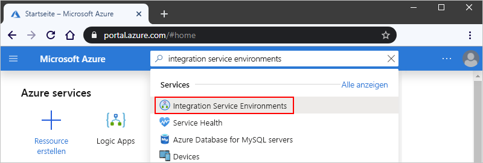

# Verwalten Ihrer Integrationsdienstumgebung (Integration Service Environment, ISE) in Azure Logic Apps

Führen Sie die Schritte in diesem Thema aus, um die Netzwerkintegrität Ihrer [Integrationsdienstumgebung](../logic-apps/connect-virtual-network-vnet-isolated-environment-overview.md) (Integration Service Environment, ISE) zu überprüfen und die Logik-Apps, Verbindungen, Integrationskonten und benutzerdefinierten Connectors in Ihrer ISE zu verwalten.

## Anzeigen Ihrer Integrationsdienstumgebung

1. Melden Sie sich beim [Azure-Portal](https://portal.azure.com) an.

1. Geben Sie im Suchfeld des Portals „Integrationsdienstumgebungen“ ein, und wählen Sie dann **Integrationsdienstumgebungen** aus.

   

1. Wählen Sie in der Ergebnisliste Ihre Integrationsdienstumgebung aus.

   

1. Fahren Sie mit den nächsten Abschnitten fort, um Logik-Apps, Verbindungen, Connectors oder Integrationskonten in Ihrer ISE zu finden.

## Überprüfen der Netzwerkintegrität

Wählen Sie im ISE-Menü unter **Einstellungen** die Option **Netzwerkintegrität** aus. In diesem Bereich wird der Integritätsstatus für Ihre Subnetze und ausgehenden Abhängigkeiten von anderen Diensten angezeigt.

## Verwalten Ihrer Logik-Apps

1. Wählen Sie im ISE-Menü unter **Einstellungen** die Option **Logik-Apps** aus.

   

1. Wenn Sie nicht mehr benötigte Logik-Apps aus Ihrer ISE entfernen möchten, wählen Sie diese Logik-Apps und dann **Löschen** aus.

## Verwalten von API-Verbindungen

1. Um die API-Verbindungen anzuzeigen, die von in Ihrer ISE ausgeführten Logik-Apps erstellt wurden, wählen Sie im ISE-Menü unter **Einstellungen** die Option **API-Verbindungen** aus.

   

1. Um nicht mehr benötigte Verbindungen aus Ihrer ISE zu entfernen, wählen Sie diese Verbindungen und dann **Löschen** aus.

## Verwalten benutzerdefinierter Connectors

1. Wenn Sie benutzerdefinierte Connectors anzeigen möchten, die in Ihrer ISE erstellt wurden, wählen Sie im ISE-Menü unter **Einstellungen** die Option **Benutzerdefinierte Connectors** aus.

   

1. Um nicht mehr benötigte Connectors aus Ihrer ISE zu entfernen, wählen Sie diese Connectors und dann **Löschen** aus.

## Verwalten von Integrationskonten

1. Wählen Sie im ISE-Menü unter **Einstellungen** die Option **Integrationskonten** aus.

   

1. Um nicht mehr benötigte Integrationskonten aus Ihrer ISE zu entfernen, wählen Sie diese Integrationskonten und dann **Löschen** aus.

## Nächste Schritte

* Erfahren Sie, wie Sie [eine Verbindung mit virtuellen Azure-Netzwerken über isolierte Logik-Apps herstellen können](../logic-apps/connect-virtual-network-vnet-isolated-environment.md).
