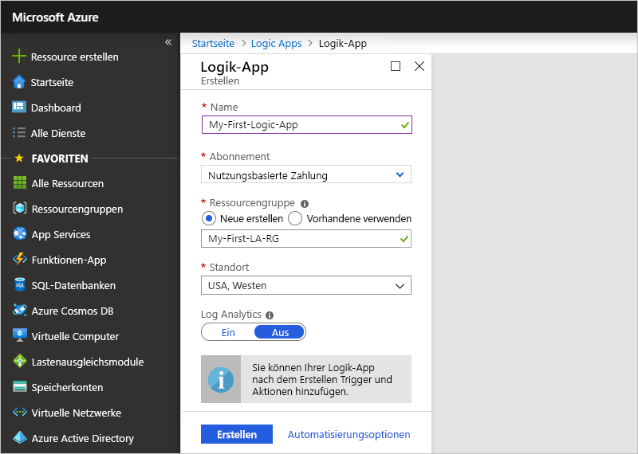
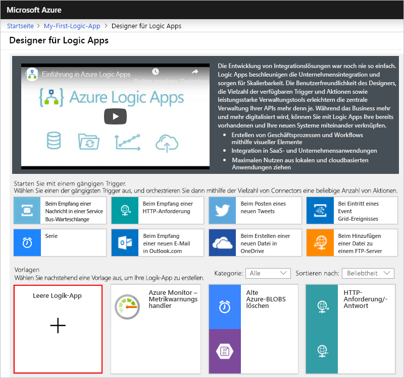
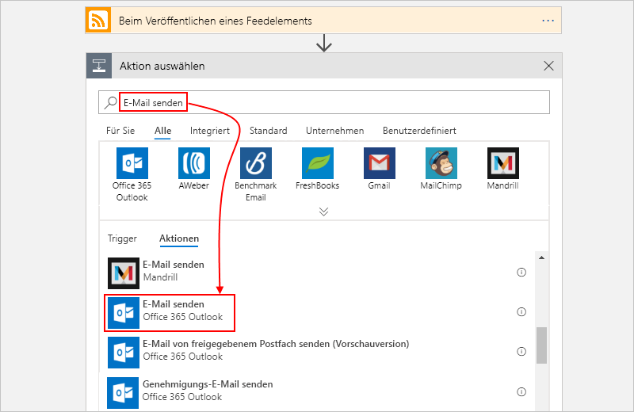
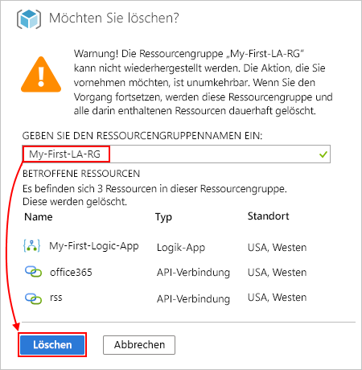

# <a name="quickstart-create-your-first-automated-workflow-with-azure-logic-apps---azure-portal"></a>Schnellstart: Erstellen Ihres ersten automatisierten Workflows mit Azure Logic Apps – Azure-Portal

Diese Schnellstartanleitung enthält eine Einführung in die Erstellung Ihres ersten automatisierten Workflows mit [Azure Logic Apps](../logic-apps/logic-apps-overview.md). In diesem Artikel erstellen Sie eine Logik-App, die den RSS-Feed einer Website regelmäßig auf neue Elemente überprüft. Wenn neue Elemente vorhanden sind, sendet die Logik-App eine E-Mail für jedes Element. Am Ende entspricht Ihre Logik-App grob dem folgenden Workflow:


Für diese Schnellstartanleitung benötigen Sie ein E-Mail-Konto bei einem von Logic Apps unterstützten E-Mail-Anbieter wie Office 365 Outlook, Outlook.com oder Gmail. Informationen zu Connectors für andere Anbieter finden Sie in [dieser Liste](https://docs.microsoft.com/connectors/). In dieser Logik-App verwenden wir ein Office 365 Outlook-Konto. Bei Verwendung eines anderen E-Mail-Kontos sind die Schritte im Großen und Ganzen identisch, aber die Benutzeroberfläche weicht ggf. etwas ab. 

Wenn Sie nicht über ein Azure-Abonnement verfügen, können Sie sich darüber hinaus <a href="https://azure.microsoft.com/free/" target="_blank">für ein kostenloses Azure-Konto registrieren</a>.

## <a name="sign-in-to-the-azure-portal"></a>Melden Sie sich auf dem Azure-Portal an.

Melden Sie sich mit den Anmeldeinformationen Ihres Azure-Kontos beim <a href="https://portal.azure.com" target="_blank">Azure-Portal</a> an.

## <a name="create-your-logic-app"></a>Erstellen Ihrer Logik-App 

1. Wählen Sie im Hauptmenü von Azure **Ressource erstellen** > **Integration** > **Logik-App** aus.

   

3. Geben Sie unter **Logik-App erstellen** Details zur Logik-App wie hier gezeigt ein. Wenn Sie fertig sind, wählen Sie **Erstellen**.

   

   | Eigenschaft | Wert | BESCHREIBUNG | 
   |----------|-------|-------------| 
   | **NAME** | MyFirstLogicApp | Der Name Ihrer Logik-App | 
   | **Abonnement** | <*Name Ihres Azure Abonnements*> | Der Name Ihres Azure-Abonnements | 
   | **Ressourcengruppe** | My-First-LA-RG | Der Name der [Azure-Ressourcengruppe](../azure-resource-manager/resource-group-overview.md), die zum Organisieren verwandter Ressourcen verwendet wird. | 
   | **Standort** | USA (Westen) | Die Region, in der die Informationen zu Ihrer Logik-App gespeichert werden sollen | 
   | **Log Analytics** | Aus | Behalten Sie die Einstellung **Aus** für die Diagnoseprotokollierung bei. | 
   |||| 

3. Nachdem Ihre Logik-App von Azure bereitgestellt wurde, wird der Designer für Logik-Apps geöffnet, und es wird eine Seite mit einem Einführungsvideo und häufig verwendeten Triggern angezeigt. Wählen Sie unter **Vorlagen** die Option **Leere Logik-App**.

   

Fügen Sie als Nächstes einen [Trigger](../logic-apps/logic-apps-overview.md#logic-app-concepts) hinzu, der bei einem neuen RSS-Feedelement ausgelöst wird. Jede Logik-App muss mit einem Trigger beginnen, der ausgelöst wird, wenn ein bestimmtes Ereignis eintritt oder eine bestimmte Bedingung erfüllt wird. Bei jeder Auslösung des Triggers erstellt die Logic Apps-Engine eine Logik-App-Instanz, mit der Ihr Workflow gestartet und ausgeführt wird.

<a name="add-rss-trigger"></a>

## <a name="check-rss-feed-with-a-trigger"></a>Überprüfen des RSS-Feeds mit einem Trigger

1. Geben Sie im Designer „rss“ in das Suchfeld ein. Wählen Sie den folgenden Trigger aus: **RSS: Beim Veröffentlichen eines Feedelements**

   

2. Geben Sie wie gezeigt und beschrieben die folgenden Informationen für Ihren Trigger ein: 

   

   | Eigenschaft | Wert | BESCHREIBUNG | 
   |----------|-------|-------------| 
   | **Die URL des RSS-Feeds** | ```http://feeds.reuters.com/reuters/topNews``` | Der Link für den RSS-Feed, den Sie überwachen möchten | 
   | **Intervall** | 1 | Die Anzahl von Warteintervallen zwischen Überprüfungen | 
   | **Frequency** | Minute | Die Zeiteinheit für die Intervalle zwischen Überprüfungen.  | 
   |||| 

   Das Intervall und die Häufigkeit definieren zusammen den Zeitplan für den Trigger Ihrer Logik-App. 
   Diese Logik-App überprüft den Feed minütlich.

3. Klicken Sie auf die Titelleiste des Triggers, um die Triggerdetails vorerst auszublenden.

   

4. Speichern Sie Ihre Logik-App. Wählen Sie auf der Symbolleiste des Designers **Speichern**. 

Ihre Logik-App befindet sich jetzt im Livemodus, aber es wird vorerst nur der RSS-Feed überprüft. Fügen Sie daher eine Aktion hinzu, die reagiert, wenn der Trigger ausgelöst wird.

## <a name="send-email-with-an-action"></a>Senden einer E-Mail mit einer Aktion

Fügen Sie nun eine [Aktion](../logic-apps/logic-apps-overview.md#logic-app-concepts) hinzu, die eine E-Mail sendet, wenn im RSS-Feed ein neues Element erscheint. 

1. Klicken Sie im Trigger **Beim Veröffentlichen eines Feedelements** auf **+ Neuer Schritt**.

   

2. Geben Sie unter **Aktion auswählen** im Suchfeld „E-Mail senden“ ein. Wählen Sie unter dem Suchfeld **Alle** aus. Wählen Sie aus der Liste der Aktionen die Aktion "E-Mail senden" für den gewünschten E-Mail-Anbieter aus. 

   

   Um die Liste der Aktionen nach einer bestimmten App oder einem Dienst zu filtern, können Sie zuerst die App oder den Dienst auswählen:

   * Wählen Sie für Geschäfts-, Schul- oder Unikonten für Azure die Option „Office 365 Outlook“. 
   * Wählen Sie für persönliche Microsoft-Konten die Option „Outlook.com“.

3. Falls Sie zur Eingabe von Anmeldeinformationen aufgefordert werden, melden Sie sich bei Ihrem E-Mail-Konto an, damit Logic Apps eine Verbindung mit Ihrem E-Mail-Konto herstellt.

4. Geben Sie in der Aktion **E-Mail senden** die Daten an, die die E-Mail enthalten soll. 

   1. Geben Sie im Feld **An** die E-Mail-Adresse des Empfängers ein. 
   Zu Testzwecken können Sie hier Ihre eigene E-Mail-Adresse angeben.

      Ignorieren Sie vorerst die angezeigte Liste **Dynamischen Inhalt hinzufügen**. 
      Wenn Sie in einige Bearbeitungsfelder klicken, wird die Liste mit verfügbaren Parametern aus dem vorherigen Schritt angezeigt, die Sie als Eingaben in Ihren Workflow aufnehmen können. 

   2. Geben Sie im Feld **Betreff** den folgenden Text mit einem nachstehenden Leerzeichen ein: ```New RSS item:```.

      
 
   3. Wählen Sie in der Liste **Dynamischen Inhalt hinzufügen** die Option **Feedtitel** aus, um den Titel des RSS-Elements aufzunehmen.

      

      Wenn der Vorgang abgeschlossen ist, sieht der Betreff der E-Mail wie in diesem Beispiel aus:

      

      Wenn im Designer eine For each-Schleife angezeigt wird, haben Sie ein Token für ein Array ausgewählt, etwa das Token **categories-Item**. 
      Für diese Art von Token fügt der Designer automatisch diese Schleife für die Aktion hinzu, die auf das Token verweist. 
      Auf diese Weise führt Ihre Logik-App die gleiche Aktion für jedes Arrayelement durch. 
      Klicken Sie zum Entfernen der Schleife in der Titelleiste der Schleife auf die **Auslassungspunkte** (**...**) und dann auf **Löschen**.

   4. Geben Sie im Feld **Text** den folgenden Text ein, und wählen Sie die folgenden Token für den E-Mail-Text aus. 
   Drücken Sie UMSCHALT+EINGABETASTE, um in einem Bearbeitungsfeld leere Zeilen hinzuzufügen. 

      

      | Eigenschaft | BESCHREIBUNG | 
      |----------|-------------| 
      | **Feedtitel** | Der Titel des Elements | 
      | **Feed veröffentlicht am** | Datum und Uhrzeit der Elementveröffentlichung | 
      | **Link zum primären Feed** | Die URL für das Element | 
      ||| 
   
5. Speichern Sie Ihre Logik-App.

Testen Sie als Nächstes Ihre Logik-App.

## <a name="run-your-logic-app"></a>Ausführen Ihrer Logik-App

Wählen Sie in der Symbolleiste des Designers die Option **Ausführen**, um Ihre Logik-App manuell zu starten. Oder warten Sie, bis Ihre Logik-App den RSS-Feed gemäß dem festgelegten Zeitplan (minütlich) überprüft. Falls der RSS-Feed über neue Elemente verfügt, sendet Ihre Logik-App für jedes neue Element eine E-Mail. Andernfalls wartet Ihre Logik mit einer erneuten Prüfung bis zum nächsten Intervall. 

Im Anschluss sehen Sie eine Beispiel-E-Mail, die von dieser Logik-App gesendet wird. Überprüfen Sie Ihren Ordner mit den Junk-E-Mails, falls Sie keine E-Mails erhalten.


Aus technischer Sicht passiert Folgendes: Wenn der Trigger den RSS-Feed prüft und neue Elemente findet, wird der Trigger ausgelöst, und die Logic Apps-Engine erstellt eine Instanz Ihres Logik-App-Workflows, mit der Aktionen im Workflow ausgeführt werden.
Falls der Trigger keine neuen Elemente findet, wird er nicht ausgelöst und überspringt das Instanziieren des Workflows.

Herzlichen Glückwunsch! Sie haben Ihre erste Logik-App über das Azure-Portal erstellt und ausgeführt.

## <a name="clean-up-resources"></a>Bereinigen von Ressourcen

Wenn Sie dieses Beispiel nicht mehr benötigen, löschen Sie die Ressourcengruppe mit Ihrer Logik-App und den dazugehörigen Ressourcen. 

1. Navigieren Sie im Azure-Hauptmenü zu **Ressourcengruppen**, und wählen Sie die Ressourcengruppe Ihrer Logik-App aus. Wählen Sie auf der Seite **Übersicht** die Option **Ressourcengruppe löschen** aus. 

   

2. Geben Sie zur Bestätigung den Ressourcengruppennamen ein, und klicken Sie auf **Löschen**.

   

> [!NOTE]
> Wenn Sie eine Logik-App löschen, werden keine neuen Ausführungen instanziiert. Alle in Bearbeitung befindlichen und ausstehenden Ausführungen werden abgebrochen. Bei Tausenden von Ausführungen kann der Abbruch möglicherweise erhebliche Zeit in Anspruch nehmen.

## <a name="get-support"></a>Support

* Sollten Sie Fragen haben, besuchen Sie das [Azure Logic Apps-Forum](https://social.msdn.microsoft.com/Forums/en-US/home?forum=azurelogicapps).
* Wenn Sie Features vorschlagen oder für Vorschläge abstimmen möchten, besuchen Sie die [Website für Logic Apps-Benutzerfeedback](https://aka.ms/logicapps-wish).

## <a name="next-steps"></a>Nächste Schritte

In dieser Schnellstartanleitung haben Sie Ihre erste Logik-App erstellt, die gemäß einem festgelegten Zeitplan (minütlich) nach RSS-Updates sucht und eine Aktion ausführt (E-Mail senden), wenn ein Update vorhanden ist. Weitere Informationen finden Sie im folgenden Tutorial, in dem komplexere zeitplanbasierte Workflows erstellt werden:

> [!div class="nextstepaction"]
> [Überprüfen der Verkehrslage mit einer planerbasierten Logik-App](../logic-apps/tutorial-build-schedule-recurring-logic-app-workflow.md)
