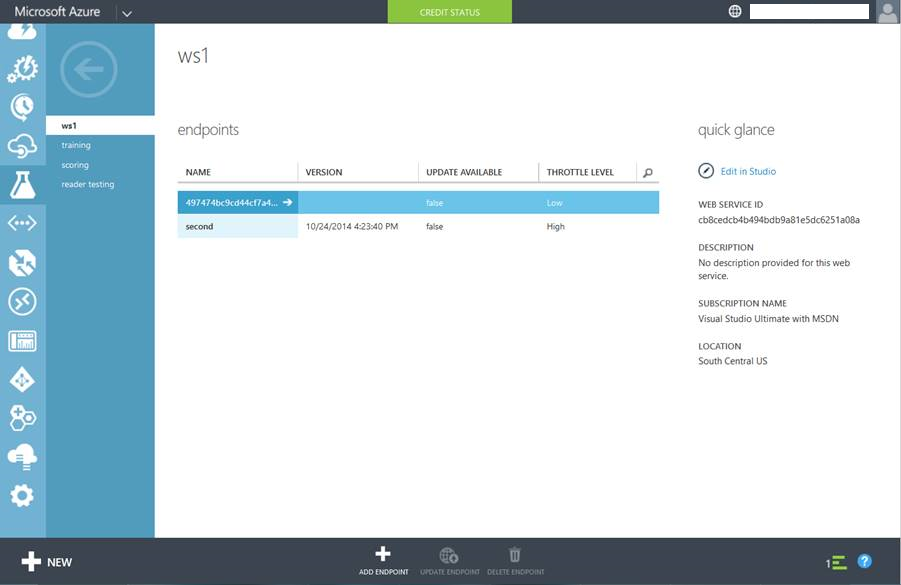

<properties 
	pageTitle="Erstellen von Endpunkten" 
	description="Erstellen von Webdienst-Endpunkten in Azure Machine Learning" 
	services="machine-learning" 
	authors="hiteshmadan" 
	manager="padou" 
	editor="cgronlun"/>

<tags
	ms.service="machine-learning"
	ms.devlang="multiple"
	ms.topic="article"
	ms.tgt_pltfrm="na"
	ms.workload="tbd" 
	ms.date="02/19/2015"
	ms.author="himad"/>

# Erstellen von Endpunkten

Mit Azure Machine Learning können Sie mehrere Endpunkte für einen veröffentlichten Webdienst erstellen. Jeder Endpunkt kann einzeln behandelt, eingeschränkt und verwaltet werden, unabhängig von den anderen Endpunkten dieses Webdiensts. Für jeden Endpunkt gibt es eine eindeutige URL und einen eindeutigen Autorisierungsschlüssel.

Dadurch können Benutzer von Azure Machine Learning Webdienste erstellen, die sie dann weiter an ihre Kunden verkaufen können. Jeder Endpunkt kann mit eigenen trainierten Modellen individuell angepasst werden und weiterhin mit dem Experiment verknüpft bleiben, das diesen Webdienst erstellt hat. Darüber hinaus können alle Aktualisierungen für das Experiment selektiv auf einen Endpunkt angewendet werden, ohne die Anpassungen zu überschreiben.

## Erstellungsschritte für Endpunkte
- Öffnen Sie "manage.windowsazure.com", und klicken Sie in der linken Spalte auf "Machine Learning". Klicken Sie auf den Arbeitsbereich mit den Webdienst, für den Sie sich interessieren.

- Klicken Sie auf die Registerkarte "Web Services".

- Klicken Sie auf den Webdienst, für den Sie sich interessieren, um die Liste der verfügbaren Endpunkte anzuzeigen.

- Klicken Sie am unteren Rand auf die Schaltfläche "Add endpoipnt". Geben Sie einen Namen und eine Beschreibung ein, und stellen Sie sicher, dass keine anderen Endpunkte mit demselben Namen in diesem Webdienst vorhanden sind. Behalten Sie die Standardeinstellung des Einschränkungsgrads bei, sofern keine besonderen Anforderungen bestehen.
Wenn Sie mehr über Einschränkungen erfahren möchten, besuchen Sie die Seite [Skalieren von API-Endpunkten](machine-learning-scaling-endpoints.md).

Nach dem Erstellen kann der Endpunkt über synchrone APIs, Stapelverarbeitungs-APIs und Excel-Arbeitsblätter genutzt werden.

<!--HONumber=49-->