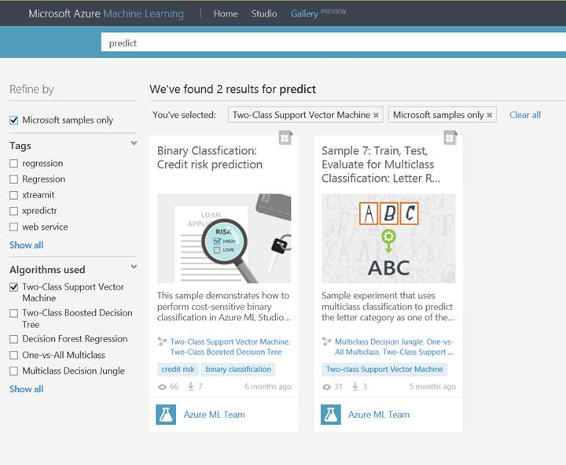

<properties 
    pageTitle="Verwenden von Beispielexperimenten zum Erstellen neuer Experimente | Azure" 
    description="Erstellen neuer Azure Machine Learning-Experimente anhand von Beispielexperimenten und Experimenten, die von der Community freigegeben wurden." 
    services="machine-learning" 
    documentationCenter="" 
    authors="cjgronlund" 
    manager="paulettm" 
    editor="cgronlun"/>

<tags 
    ms.service="machine-learning" 
    ms.workload="data-services" 
    ms.tgt_pltfrm="na" 
    ms.devlang="na" 
    ms.topic="article" 
    ms.date="02/16/2015" 
    ms.author="chhavib;olgali"/>

# Verwenden von Beispielexperimenten zum Erstellen neuer Experimente
Wenn Sie ein Experiment erstellen möchten, suchen Sie in den Beispielexperimenten des Machine Learning-Teams und in den von der Machine Learning-Community freigegebenen Experimenten nach Beispielen. Sie können auch in der [Galerie](http://gallery.azureml.net/) Fragen stellen oder Anmerkungen zu Experimenten veröffentlichen.

[AZURE.INCLUDE [machine-learning-kostenlose-Testversion](../includes/machine-learning-free-trial.md)]

## Durchsuchen der Galerie
1. Wechseln Sie zu [Gallery](http://gallery.azureml.net/) \(Galerie\).
2. Durchsuchen Sie **Trending Experiments** \(Trendanalyse-Experimente\) oder **Microsoft Samples** \(Microsoft-Beispiele\).
3. Verwenden Sie die Suchfunktion und Filter, um die Ergebnisse einzugrenzen: 
4. Klicken Sie auf ein Experiment, um mehr darüber zu erfahren. Zum Ausführen und/oder Ändern des Experiments klicken Sie auf **Open in Studio** \(In Studio öffnen\). 
5.  Melden Sie sich mit den Anmeldeinformationen für ihr Microsoft-Konto an. Wenn Sie noch keinen Machine Learning-Arbeitsbereich besitzen, wird ein Arbeitsbereich in der kostenlosen Testversion erstellt. [Informieren Sie sich über den Funktionsumfang der kostenlosen Testversion von Machine Learning](http://azure.microsoft.com/pricing/details/machine-learning/). 

## Verwenden einer Vorlage in Studio
1. Melden Sie sich mit den Anmeldeinformationen für ihr Microsoft-Konto bei [Studio](https://studio.azureml.net) an, und klicken Sie dann auf **New**\* \(Neu\), um ein neues Experiment zu erstellen. 
2. Durchsuchen Sie die Beispiele, und wählen Sie dann das Beispiel aus, das Sie als Vorlage verwenden möchten.

## Nächste Schritte
- [Vorbereiten der Daten](machine-learning-import-data.md)
- [Verwenden von R im Experiment](machine-learning-r-quickstart.md)
- [Überprüfen der R-Beispielexperimente](machine-learning-r-csharp-web-service-examples.md)
- [Erstellen einer Webdienst-API](machine-learning-publish-a-machine-learning-web-service.md)
- [Durchsuchen einsatzbereiter Anwendungen](https://datamarket.azure.com/browse?query=machine+learning)

<!--HONumber=54-->