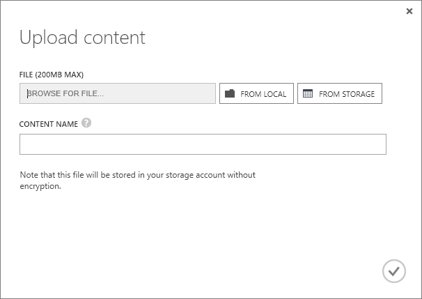
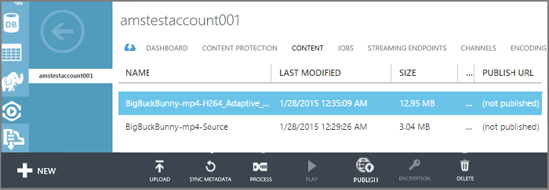

<properties linkid="manage-services-mediaservices-manage-media-services-content" urlDisplayName="How to manage media content" pageTitle="How to manage media content - Azure Media Services" metaKeywords="" description="Learn how to manage your media content in Azure Media Services." metaCanonical="" services="media-services" documentationCenter="" title="How to Manage Content in Media Services" authors="migree" solutions="" manager="" editor="" />

Verwalten von Inhalten in Media Services
========================================

Mit der Inhaltsansicht von Azure Media Services können Sie die Medieninhalte Ihres Media Services-Kontos verwalten.

Derzeit können Sie im Portal die folgenden Inhaltsoperationen direkt ausführen:

-   Anzeigen von Inhaltsinformationen wie Veröffentlichungsstatus, veröffentlichte URL, Größe sowie Datum und Uhrzeit der letzten Aktualisierung
-   Hochladen neuer Inhalte
-   Codieren von Inhalten
-   Wiedergeben von Videoinhalten
-   Veröffentlichen/Aufheben der Veröffentlichung von Inhalten
-   Löschen von Inhalten

Vorgehensweise: Hochladen von Inhalten
--------------------------------------

1.  Klicken Sie im [Verwaltungsportal](http://go.microsoft.com/fwlink/?LinkID=256666&clcid=0x409) auf **Media Services** und dann auf den Media Services-Kontonamen.
2.  Wählen Sie die Seite "INHALT" aus.
3.  Klicken Sie auf der Seite oder unten im Portal auf **Hochladen**.
4.  Navigieren Sie im Dialogfeld **Inhalte hochladen** zur gewünschten Ressourcendatei. Klicken Sie auf die Datei, und klicken Sie dann auf **Öffnen**, oder drücken Sie **Eingabe**.

    

5.  Klicken Sie im Dialogfeld "Inhalte hochladen" auf den Häkchenknopf, um die Datei und den Inhaltsnamen zu akzeptieren.
6.  Das Hochladen beginnt, und Sie können den Fortschritt unten im Portal verfolgen.

    

Nach Abschluss des Hochladevorgangs wird in der Liste "Inhalt" die neue Ressource aufgeführt. Entsprechend der Namenskonvention wird "**-Source**" an das Ende gehängt, damit neue Inhalte als Quellinhalte für Codieraufgaben erfasst werden können.

Wenn der Wert für die Dateigröße nach dem Hochladen nicht aktualisiert wird, drücken Sie die Schaltfläche **Metadaten synchronisieren**. Damit wird die Dateigröße der Ressource mit der tatsächlichen Dateigröße im Speicher synchronisiert, und der Wert auf der Seite "Inhalt" wird aktualisiert.

Vorgehensweise: Codieren von Inhalten
-------------------------------------

1.  Klicken Sie im [Verwaltungsportal](http://go.microsoft.com/fwlink/?LinkID=256666&clcid=0x409) auf **Media Services** und dann auf den Media Services-Kontonamen.
2.  Klicken Sie oben auf der Seite auf die Seite "INHALT".
3.  Klicken Sie auf das gewünschte Quellvideo für den Verschlüsselungsauftrag, und klicken Sie dann unten auf der Seite auf **Codieren**.
4.  Wählen Sie im Dialogfeld "Azure Media Encoder" eine der häufig verwendeten oder erweiterten Voreinstellungen für das Codieren.

    **Häufig verwendete Voreinstellungen**

    -   Wiedergabe auf PC/Mac (über Flash/Silverlight)**. Diese Voreinstellung erzeugt eine Smooth Streaming-Ressource mit den folgenden Eigenschaften: AAC-Stereo-Audio mit 44,1 kHz und 16 Bits/Sample, codiert mit konstanter Bitrate (96 Kbit/s) und 720p-Video codiert mit 6 konstanten Bitraten von 3400 Kbit/s bis 400 Kbit/s mithilfe des H.264-Hauptprofils und 2-Sekunden-GOPs.
    -   Wiedergabe über HTML5 (IE/Chrome/Safari)**. Diese Voreinstellung erzeugt eine einzelne MP4-Datei mit den folgenden Eigenschaften: AAC-Stereo-Audio mit 44,1 kHz und 16 Bits/Sample codiert mit konstanter Bitrate (128 Kbit/s) und 720p-Video codiert mit konstanter Bitrate von 4500 Kbit/s mithilfe des H.264-Hauptprofils.
    -   Wiedergabe auf iOS-Geräten und PC/Mac**. Diese Voreinstellung erzeugt eine Ressource mit den gleichen Eigenschaften wie die Smooth Streaming-Ressource (Beschreibung siehe oben), jedoch in einem Format, das zur Übermittlung von Apple HLS-Streams auf iOS-Geräten verwendet werden kann.

    **Erweiterte Voreinstellungen**

    -   Im Thema [Systemvoreinstellungen von Media Services Encoder](http://go.microsoft.com/fwlink/?LinkId=270865) wird die Bedeutung der einzelnen Voreinstellungen in der Liste der erweiterten Voreinstellungen erläutert.

    

    Das Portal unterstützt derzeit nicht alle Codierungsformate, die vom Media Encoder unterstützt werden. Außerdem wird die Medienressourcenverschlüsselung/-entschlüsselung nicht unterstützt. Sie können diese Aufgaben programmgesteuert ausführen. Weitere Informationen finden Sie unter [Erstellen von Anwendungen mit dem Media Services SDK für .NET](http://go.microsoft.com/fwlink/?LinkId=270866) und [Systemvoreinstellungen von Media Services Encoder](http://go.microsoft.com/fwlink/?LinkId=270865).

5.  Geben Sie im Dialogfeld "Azure Media Encoder" den gewünschten benutzerfreundlichen Namen für den Ausgabeinhalt ein, oder akzeptieren Sie den Standardnamen. Klicken Sie anschließend auf den Häkchenknopf, um den Codiervorgang zu starten. Den Fortschritt des Vorgangs können Sie unten im Portal verfolgen.

Nach der Codierung entspricht die Ansicht etwa dem unten dargestellten Screenshot.

    ![PortalViewUploadCompleted][portaloverview]

Wenn der Wert für die Dateigröße nach dem Codieren nicht aktualisiert wird, drücken Sie die Schaltfläche **Metadaten synchronisieren**. Damit wird die Dateigröße der Ausgaberessource mit der tatsächlichen Dateigröße im Speicher synchronisiert, und der Wert auf der Seite "Inhalt" wird aktualisiert.

Vorgehensweise: Veröffentlichen von Inhalten
--------------------------------------------

1.  Klicken Sie im [Verwaltungsportal](http://go.microsoft.com/fwlink/?LinkID=256666&clcid=0x409) auf **Media Services** und dann auf den Media Services-Kontonamen.
2.  Klicken Sie oben auf der Seite auf die Seite "INHALT".
3.  Klicken Sie auf eine Ressource, die nicht veröffentlicht ist. Klicken Sie dann auf die Schaltfläche "Veröffentlichen", um sie unter einer öffentlichen URL zu veröffentlichen. Sobald die Inhalte unter einer URL veröffentlicht sind, kann die URL von einem Client-Player geöffnet werden, der den codierten Inhalt wiedergeben kann.

 

Vorgehensweise: Wiedergeben von Inhalten im Portal
--------------------------------------------------

1.  Klicken Sie im [Verwaltungsportal](http://go.microsoft.com/fwlink/?LinkID=256666&clcid=0x409) auf **Media Services** und dann auf den Media Services-Kontonamen.
2.  Klicken Sie oben auf der Seite auf die Seite "INHALT".
3.  Klicken Sie auf den gewünschten Videoinhalt, und klicken Sie unten im Portal auf **Wiedergabe**. Im Portal können nur Inhalte wiedergegeben werden, die veröffentlicht wurden. Außerdem muss die Codierung vom Browser unterstützt werden.

