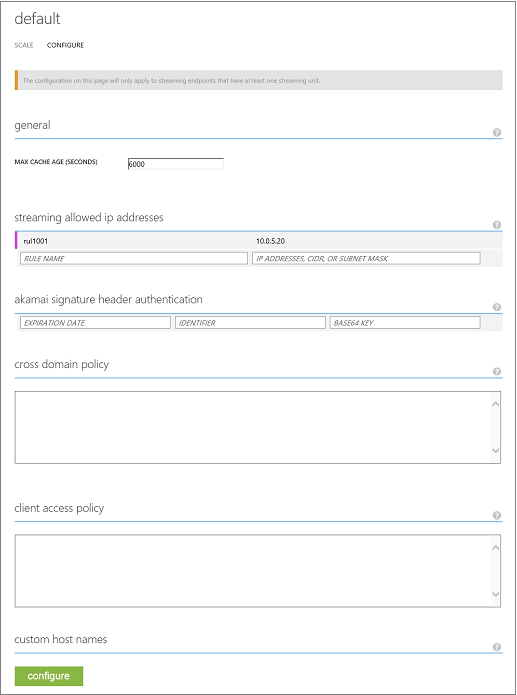

<properties linkid="scripting-center-index" urlDisplayName="index" pageTitle="Scripting Center Index" metaKeywords="" description="" metaCanonical="" services="" documentationCenter="" title="How to Manage Origins in a Media Services Account" authors="juliako" solutions="" manager="" editor="" />

Gewusst wie: Verwalten von Ursprüngen in einem Mediendienstekonto
=================================================================

Mithilfe von Mediendiensten können Sie Ihrem Konto mehrere Ursprünge für Streaminginhalte hinzufügen und konfigurieren. Jedes Media Service-Konto enthält mindestens einen Streaming-Ursprung mit dem Namen **default**.

Hinzufügen oder Löschen von Ursprüngen
--------------------------------------

1.  Klicken Sie im [Management Portal](https://manage.windowsazure.com/) auf **Media Services**. Klicken Sie anschließend auf den Namen des Mediendienstes.
2.  Wählen Sie die Seite ORIGINS aus.
3.  Klicken Sie unten auf der Seite auf ADD oder DELETE. Der Standard-Ursprung kann nicht gelöscht werden.
4.  Klicken Sie auf START, um den Ursprung zu starten.
5.  Klicken Sie auf den Namen des Ursprungs, um den Ursprung zu konfigurieren.

    

Konfigurieren des Ursprungs
---------------------------

In der Registerkarte CONFIGURE können Sie die folgenden Konfigurationen vornehmen:

1.  Einstellen der maximalen Zwischenspeicherungsdauer, die im cache control-Header der HTTP-Antworten angegeben wird. Dieser Wert überschreibt nicht den maximalen Zwischenspeicherungswert, der für den Blob-Inhalt ausdrücklich festgelegt wurde.

2.  Angabe von IP-Adressen, die sich mit dem veröffentlichten Streaming-Endpunkt verbinden dürfen. Falls keine IP-Adressen angegeben sind, dürfen sich alle IP-Adressen verbinden.

3.  Angabe der Konfiguration für G20-Authentifizierungsanfragen von Akami-Servern.

    

    Die Konfiguration auf dieser Seite gilt nur für Ursprünge, die mindestens eine reservierte Einheit haben. Wechseln Sie zur Reservieren SCALE, um die reservierten Einheiten für bedarfsgesteuertes Streaming zu reservieren. Detaillierte Informationen zu reservierten Einheiten finden Sie unter [Skalieren von Mediendiensten](http://go.microsoft.com/fwlink/?LinkID=275847&clcid=0x409/).

