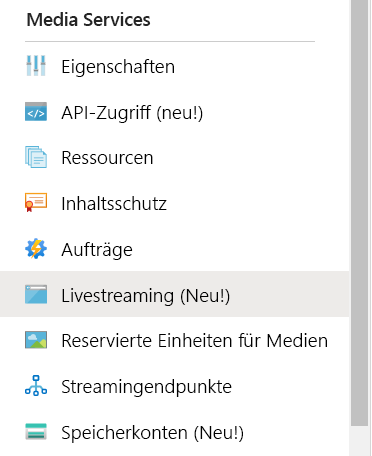
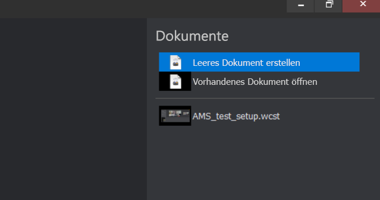
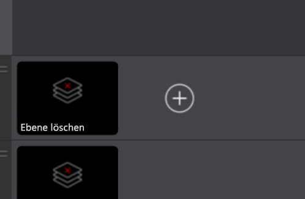
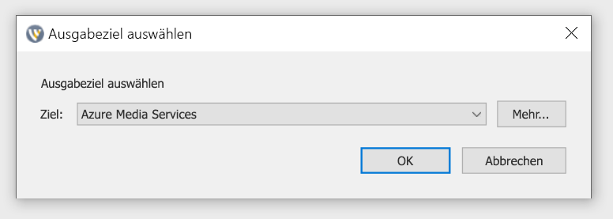
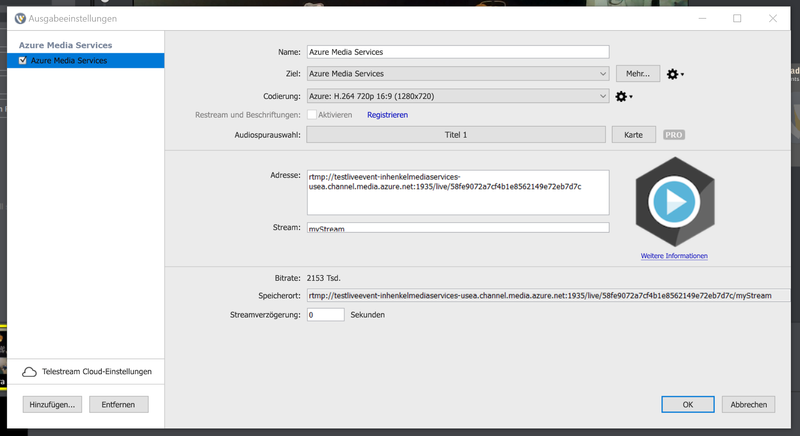
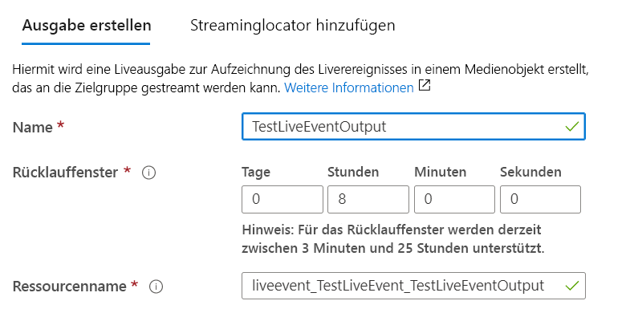
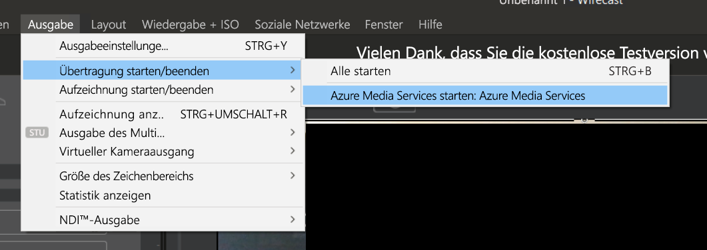
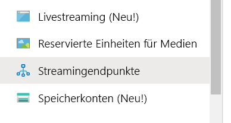

# Erstellen eines Azure Media Services-Livestreams mit dem Portal und Wirecast

In diesem Leitfaden für erste Schritte wird davon ausgegangen, dass Sie über ein Azure-Abonnement verfügen und ein Azure Media Services-Konto erstellt haben.

Wenn Sie kein Azure-Abonnement besitzen, können Sie ein [kostenloses Konto](https://azure.microsoft.com/free/) erstellen, bevor Sie beginnen.

## Anmelden beim Azure-Portal

Öffnen Sie Ihren Webbrowser, und navigieren Sie zum [Microsoft Azure-Portal](https://portal.azure.com/). Geben Sie Ihre Anmeldeinformationen ein, um sich beim Portal anzumelden. Die Standardansicht ist Ihr Dienstdashboard.

In dieser Schnellstartanleitung wird Folgendes behandelt:

- Einrichten eines lokalen Encoders mit einer kostenlosen Testversion von Telestream Wirecast
- Einrichten eines Livestreams
- Einrichten von Livestreamausgaben
- Ausführen eines Standard-Streamingendpunkts
- Anzeigen des Livestreams und der On-Demand-Ausgabe im Azure Media Player

Der Einfachheit halber verwenden wir eine Codierungsvoreinstellung für Azure Media Services in Wirecast, Passthrough-Cloudcodierung und RTMP.

## Einrichten eines lokalen Encoders mit Wirecast

1. Laden Sie unter https://www.telestream.net Wirecast für Ihr Betriebssystem herunter, und installieren Sie es.
1. Starten Sie die Anwendung, und registrieren Sie das Produkt mit Ihrer bevorzugten E-Mail-Adresse.  Lassen Sie die Anwendung geöffnet.
1. Sie erhalten eine E-Mail, in der Sie zur Bestätigung Ihrer E-Mail-Adresse aufgefordert werden. Danach beginnt der kostenlose Testzeitraum.
1. EMPFOHLEN: Sehen Sie sich das Videotutorial auf dem Startbildschirm der Anwendung an.

## Einrichten eines Azure Media Services-Livestreams

1. Wählen Sie im Portal unter dem Azure Media Services-Konto in der Media Services-Liste die Option **Livestreaming** aus. 
 
1. Klicken Sie auf **Liveereignis hinzufügen**, um ein neues Livestreamingereignis zu erstellen. 
 
1. Geben Sie im Feld **Name** des Liveereignisses einen Namen für Ihr neues Ereignis ein (beispielsweise *TestLiveEvent*). 
 
1. Geben Sie im Feld **Beschreibung** eine optionale Beschreibung des Ereignisses ein.
1. Aktivieren Sie das Optionsfeld **Passthrough – keine Cloudcodierung**. 

1. Aktivieren Sie das Optionsfeld **RTMP**.
1. Vergewissern Sie sich, dass für „Liveereignis starten“ das Optionsfeld **Nein** ausgewählt ist, um zu verhindern, dass für das Liveereignis Kosten anfallen, bevor es bereit ist.  (Die Abrechnung beginnt, sobald das Liveereignis gestartet wird.)  
1. Klicken Sie auf die Schaltfläche **Überprüfen + erstellen**, um die Einstellungen zu überprüfen.
1. Klicken Sie auf die Schaltfläche **Erstellen**, um das Liveereignis zu erstellen. Anschließend wird wieder die Liste mit den Liveereignissen angezeigt.
1. Klicken Sie auf den **Link zu dem Liveereignis**, das Sie soeben erstellt haben. Beachten Sie, dass Ihr Ereignis beendet ist.
1. Lassen Sie diese Seite in Ihrem Browser geöffnet.  Sie wird später noch benötigt.

## Einrichten eines Livestreams mit Wirecast Studio

1. Wählen Sie im Hauptmenü der geöffneten Wirecast-Anwendung die Option **Create Empty Document** (Leeres Dokument erstellen) aus, und klicken Sie anschließend auf **Continue** (Fortsetzen).

1. Zeigen Sie im Bereich mit den Wirecast-Ebenen auf die erste Ebene.  Klicken Sie auf das eingeblendete Symbol **Hinzufügen**, und wählen Sie die Videoeingabe aus, die Sie streamen möchten.  Das Dialogfeld für die Masterebene 1 wird geöffnet. 

1. Wählen Sie im Menü die Option **Video capture** (Videoaufnahme) und anschließend die gewünschte Kamera aus. Wenn Sie eine Kamera auswählen, wird im Vorschaubereich das Kamerabild angezeigt.

1. Zeigen Sie im Bereich mit den Wirecast-Ebenen auf die zweite Ebene. Klicken Sie auf das eingeblendete Symbol **Hinzufügen**, und wählen Sie die Audioeingabe aus, die Sie streamen möchten.  Das Dialogfeld für die Masterebene 2 wird geöffnet.
1. Wählen Sie im Menü die Option **Audio capture** (Audioaufnahme) und anschließend die gewünschte Audioeingabe aus.

1. Wählen Sie im Hauptmenü die Option **Output settings** (Ausgabeeinstellungen) aus.  Das Ausgabedialogfeld wird angezeigt.
1. Wählen Sie in der Dropdownliste für die Ausgabe die Option **Azure Media Services** aus.  Durch die Ausgabeeinstellung für Azure Media Services werden *die meisten* der Ausgabeeinstellungen automatisch aufgefüllt. 

1. Im nächsten Abschnitt kehren Sie zu Azure Media Services in Ihrem Browser zurück, um die *Eingabe-URL* zu kopieren, damit Sie sie in die Ausgabeeinstellungen eingeben können.

### Kopieren und Einfügen der Eingabe-URL

1. Klicken Sie im Portal auf der Seite „Azure Media Services“ auf **Starten**, um das Livestreamereignis zu starten. (Die Abrechnung beginnt.) 

2. Klicken Sie auf die Umschaltfläche **Sicher/Nicht sicher**, um sie auf **Nicht sicher** festzulegen.  Dadurch wird das Protokoll auf RTMP (anstelle von RTMPS) festgelegt.
3. Kopieren Sie die **Eingabe-URL** in die Zwischenablage.

4. Wechseln Sie zur Wirecast-Anwendung, und fügen Sie die **Eingabe-URL** in den Ausgabeeinstellungen in das Feld **Address** (Adresse) ein. 

5. Klicken Sie auf **Okay**.

## Einrichten von Ausgaben

In diesem Teil werden Ihre Ausgaben und eine Möglichkeit zum Aufzeichnen Ihres Livestreams eingerichtet.  

> [!NOTE]
> Zum Streamen dieser Ausgabe muss der Streamingendpunkt aktiv sein.  Weitere Informationen finden Sie weiter unten im Abschnitt „Ausführen des Standard-Streamingendpunkts“.

1. Klicken Sie unter der Videoansicht „Ausgaben“ auf den Link **Ausgaben erstellen**.
1. Der Name der Ausgabe kann im Feld **Name** auf Wunsch in einen benutzerfreundlicheren Wert geändert werden, damit die Ausgabe später leichter zu finden ist.

1. Lassen Sie alle anderen Felder vorerst unverändert.
1. Klicken Sie auf **Weiter: Streaminglocator hinzufügen**.
1. Falls gewünscht, ändern Sie den Namen des Locators in einen benutzerfreundlicheren Wert.

1. Lassen Sie alle anderen Angaben unverändert.
1. Klicken Sie auf **Erstellen**.

## Starten der Übertragung

1. Wählen Sie im Hauptmenü von Wirecast Folgendes aus: **Output > Start / Stop broadcasting > Start Azure Media Services : Azure Media Services** (Ausgabe > Übertragung starten/beenden > Azure Media Services starten: Azure Media Services).  Wenn der Stream an das Liveereignis gesendet wurde, wird das Livefenster in Wirecast im Liveereignis-Videoplayer auf der Liveereignisseite in Azure Media Services angezeigt.

   

1. Klicken Sie unter dem Vorschaufenster auf die Schaltfläche **Los**, um die Übertragung der Video- und Audiodaten zu starten, die Sie für die Wirecast-Ebenen ausgewählt haben.

   

   > [!TIP]
   > Versuchen Sie im Falle eines Fehlers, den Player neu zu laden, indem Sie über dem Player auf die Schaltfläche „Player neu laden“ klicken.

## Ausführen des Standard-Streamingendpunkts

1. Vergewissern Sie sich, dass Ihr Streamingendpunkt aktiv ist, indem Sie in der Media Services-Liste die Option **Streamingendpunkte** auswählen. Daraufhin wird die Seite mit den Streamingendpunkten angezeigt. 

1. Wenn sich der Standard-Streamingendpunkt im Status „Beendet“ befindet, klicken Sie auf den Streamingendpunkt **Standard**. Daraufhin wird die Seite für diesen Endpunkt angezeigt.
1. Klicken Sie auf **Start**.  Dadurch wird der Streamingendpunkt gestartet. 

## Wiedergeben der Ausgabeübertragung mit dem Azure Media Player

1. Kopieren Sie die **Streaming-URL** unter dem Ausgabevideoplayer.
1. Öffnen Sie in einem Webbrowser die Demoversion für den Azure Media Player: https://ampdemo.azureedge.net/azuremediaplayer.html.
1. Fügen Sie die **Streaming-URL** in das URL-Feld des Azure Media Players ein.
1. Klicken Sie auf die Schaltfläche **Player aktualisieren**.
1. Klicken Sie im Video auf das Symbol **Wiedergeben**, um Ihren Livestream anzuzeigen.

## Beenden der Übertragung

Wenn Sie genügend Inhalt gestreamt haben, beenden Sie die Übertragung.

1. Klicken Sie in Wirecast auf die Schaltfläche **Broadcast** (Übertragen).  Dadurch wird die Übertragung von Wirecast beendet.
1. Klicken Sie im Portal auf **Beenden**. Es wird eine Warnmeldung mit dem Hinweis angezeigt, dass der Livestream beendet und die Ausgabe nun als On-Demand-Medienobjekt bereitgestellt wird.
1. Klicken Sie in der Warnmeldung auf **Beenden**. Daraufhin wird auch im Azure Media Player ein Fehler angezeigt, da der Livestream nicht mehr verfügbar ist.

## Wiedergeben der On-Demand-Ausgabe mit dem Azure Media Player

Die erstellte Ausgabe steht nun für On-Demand-Streaming zur Verfügung, solange Ihr Streamingendpunkt aktiv ist.

1. Navigieren Sie zur Media Services-Liste, und wählen Sie **Medienobjekte** aus.
1. Suchen Sie die zuvor erstellte Ereignisausgabe, und klicken Sie auf den **Link zum Medienobjekt**. Daraufhin wird die Seite für die Medienobjektausgabe geöffnet.
1. Kopieren Sie die **Streaming-URL** unter dem Videoplayer für das Medienobjekt.
1. Kehren Sie zum Azure Media Player im Browser zurück, und fügen Sie die **Streaming-URL** in das URL-Feld des Azure Media Players ein.
1. Klicken Sie auf **Player aktualisieren**.
1. Klicken Sie im Video auf das Symbol **Wiedergeben**, um das On-Demand-Medienobjekt anzuzeigen.

## Bereinigen von Ressourcen

> [!IMPORTANT]
> Beenden Sie die Dienste. Nach Abschluss dieser Schnellstartanleitung müssen das Liveereignis und der Streamingendpunkt unbedingt beendet werden, da Ihnen ansonsten die weitere Laufzeit in Rechnung gestellt wird. Informationen zum Beenden des Liveereignisses finden Sie unter „Beenden der Übertragung“ (Schritt 2 und 3).

### Beenden des Streamingendpunkts

1. Wählen Sie in der Media Services-Liste die Option **Streamingendpunkte** aus.
2. Klicken Sie auf den Streamingendpunkt **Standard**, den Sie weiter oben gestartet haben. Dadurch wird die Seite des Endpunkts geöffnet.
3. Klicken Sie auf **Beenden**.  Dadurch wird der Streamingendpunkt beendet.

> [!TIP]
> Wenn Sie die Medienobjekte des Ereignisses nicht mehr benötigen, löschen Sie sie, um Kosten für die Speicherung zu vermeiden.

## Nächste Schritte
> [!div class="nextstepaction"]
> [Liveereignisse und Liveausgaben in Media Services](./live-events-outputs-concept.md)
