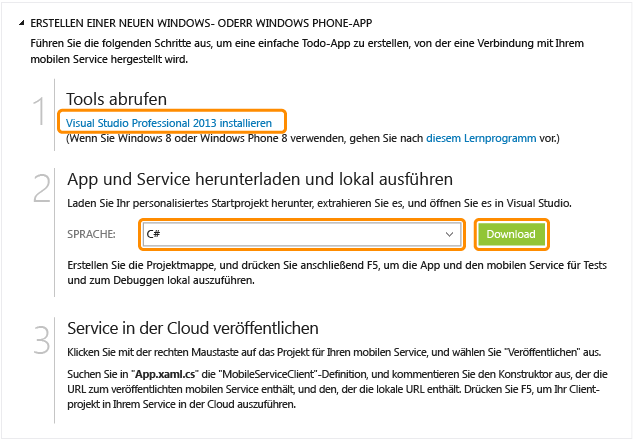

<properties linkid="develop-mobile-tutorials-get-started" pageTitle="Get Started with Mobile Services for Windows Store apps | Mobile Dev Center" metaKeywords="" description="Follow this tutorial to get started using Azure Mobile Services for Windows Store development in C#, VB, or JavaScript. " metaCanonical="" services="" documentationCenter="Mobile" title="Get started with Mobile Services" authors="glenga" solutions="" manager="" editor="" />

Erste Schritte mit Mobile Services
==================================

	<a href="/de-de/documentation/articles/mobile-services-dotnet-backend-windows-store-dotnet-get-started" title="Windows Store C#" class="current">Windows Store C#</a>
	<a href="/de-de/documentation/articles/mobile-services-dotnet-backend-windows-store-javascript-get-started" title="Windows Store JavaScript">Windows Store JavaScript</a>
	<a href="/de-de/documentation/articles/mobile-services-dotnet-backend-windows-phone-get-started" title="Windows Phone">Windows Phone</a>
	<a href="/de-de/documentation/articles/mobile-services-dotnet-backend-ios-get-started" title="iOS">iOS</a>
	<a href="/de-de/documentation/articles/mobile-services-dotnet-backend-android-get-started" title="Android">Android</a>
	<!--<a href="/de-de/documentation/articles/partner-xamarin-mobile-services-ios-get-started" title="Xamarin.iOS">Xamarin.iOS</a>
	<a href="/de-de/documentation/articles/partner-xamarin-mobile-services-android-get-started" title="Xamarin.Android">Xamarin.Android</a>
	<a href="/de-de/documentation/articles/partner-sencha-mobile-services-get-started/" title="Sencha">Sencha</a>
	<a href="/de-de/documentation/articles/mobile-services-javascript-backend-phonegap-get-started/" title="PhoneGap">PhoneGap</a>-->

	<a href="/de-de/documentation/articles/mobile-services-dotnet-backend-windows-store-dotnet-get-started/" title=".NET backend" class="current">.NET backend</a> | <a href="/de-de/documentation/articles/mobile-services-windows-store-get-started/"  title="JavaScript backend" >JavaScript backend</a>

Dieses Lernprogramm zeigt Ihnen, wie Sie einen cloudbasierten Backend-Dienst zu einer Windows Store-App mithilfe von Azure Mobile Services hinzufügen. In diesem Lernprogramm erstellen Sie einen neuen mobilen Dienst und eine einfache *To-Do-Listen*-App, die App-Daten im neuen mobilen Dienst speichert. Der von Ihnen erstellte mobile Dienst verwendet die unterstützten .NET-Sprachen unter Verwendung von Visual Studio für die serverseitige Geschäftslogik und zur Verwaltung des mobilen Diensts. Informationen zum Erstellen eines mobilen Diensts, dessen serverseitige Geschäftslogik Sie in JavaScript schreiben können, finden Sie in der [JavaScript-Backend-Version](/de-de/documentation/articles/mobile-services-windows-store-get-started) dieses Themas.

> [WACOM.NOTE]In diesem Thema wird das Erstellen eines neuen mobilen Dienstprojekts und einer Windows Store-App mithilfe des Azure-Verwaltungsportals erläutert. Unter Verwendung von Visual Studio 2013 Update 2 können Sie außerdem neue mobile Dienstprojekte zu einer vorhandenen Visual Studio-Lösung hinzufügen. Weitere Informationen finden Sie unter [Schnellstart: Hinzufügen von mobilen Diensten (.NET-Backend)](http://msdn.microsoft.com/en-us/library/windows/apps/dn629482.aspx)

Unten finden Sie einen Screenshot aus der fertigen App:

Das Abschließen dieses Lernprogramms ist eine Voraussetzung für alle anderen Mobile Services-Lernprogramme für Windows Store-Apps.

> [WACOM.NOTE]Sie benötigen ein Windows Azure-Konto, um dieses Lernprogramm durchführen zu können. Wenn Sie über kein Konto verfügen, können Sie in nur wenigen Minuten ein kostenloses Testkonto erstellen. Ausführliche Informationen erhalten Sie unter [Kostenloses Azure-Testkonto](http://www.windowsazure.com/en-us/pricing/free-trial/?WT.mc_id=A0E0E5C02&returnurl=http%3A%2F%2Fwww.windowsazure.com%2Fen-us%2Fdocumentation%2Farticles%2Fmobile-services-dotnet-backend-windows-store-get-started%2F).
> Für dieses Lernprogramm ist [Visual Studio Professional 2013](https://go.microsoft.com/fwLink/p/?LinkID=257546) erforderlich. Dazu ist eine kostenlose Testversion verfügbar.

Erstellen eines neuen mobilen Diensts
-------------------------------------

[WACOM.INCLUDE [mobile-services-dotnet-backend-create-new-service](../includes/mobile-services-dotnet-backend-create-new-service.md)]

Erstellen einer neuen Windows Store-App
---------------------------------------

Sobald Sie den mobilen Dienst erstellt haben, können Sie einem einfachen Schnellstart im Verwaltungsportal folgen, um eine neue App zu erstellen oder eine vorhandene App für die Verbindung zum mobilen Dienst zu ändern.

In diesem Abschnitt erstellen Sie eine neue Windows Store-App, die mit dem mobilen Dienst verbunden ist.

1.  Klicken Sie im Verwaltungsportal auf **Mobile Services** und anschließend auf den mobilen Dienst, den Sie gerade erstellt haben.

2.  Klicken Sie auf der Schnellstartregisterkarte unter **Plattform auswählen** auf **Windows**. Erweitern Sie dann **Neue Windows Store-App erstellen**.

	![][6]

	Auf diese Weise werden die drei einfachen Schritte zum Erstellen einer Windows Store-App, die mit dem mobilen Dienst verbunden ist, angezeigt.

	

1.  Falls noch nicht geschehen, sollten Sie [Visual Studio Professional 2013](https://go.microsoft.com/fwLink/p/?LinkID=257546) auf den lokalen Computer oder virtuellen Computer herunterladen und installieren.

2.  Wählen Sie unter **Download and run your app and service locally** eine Sprache für die Windows Store-App aus. Klicken Sie dann auf **Herunterladen**.

    Daraufhin wird eine Lösung heruntergeladen, die Projekte für den mobilen Dienst und für die beispielhafte *To-Do-Listen*-Anwendung, die mit dem mobilen Dienst verbunden ist, enthält. Speichern Sie die komprimierte Projektdatei auf dem lokalen Computer und merken Sie sich, wo Sie sie gespeichert haben.

1.  Laden Sie unter **Publish your service to the cloud** das Veröffentlichungsprofil herunter, speichern Sie die heruntergeladene Datei auf dem lokalen Computer, und notieren Sie sich, wo Sie sie gespeichert haben.

Testen der App mit dem lokalen mobilen Dienst
---------------------------------------------

[WACOM.INCLUDE [mobile-services-dotnet-backend-test-local-service-dotnet](../includes/mobile-services-dotnet-backend-test-local-service-dotnet.md)]

> [WACOM.NOTE]Sie können den Code überprüfen, der auf Ihren mobilen Dienst zum Abfragen und Einfügen von Daten zugreift. Der Code befindet sich in der Datei "MainPage.xaml.cs".

Veröffentlichen des mobilen Diensts
-----------------------------------

[WACOM.INCLUDE [mobile-services-dotnet-backend-publish-service](../includes/mobile-services-dotnet-backend-publish-service.md)]

<ol start="4">
<li>
Öffnen Sie im Windows Store-App-Projekt die Datei "App.xaml.cs", suchen Sie den Code, der eine <a href="http://msdn.microsoft.com/en-us/library/Windowsazure/microsoft.windowsazure.mobileservices.mobileserviceclient.aspx" target="_blank">MobileServiceClient</a>-Instanz erstellt, kommentieren Sie den Code aus, der diesen Client mit *localhost* erstellt, und entfernen Sie den Kommentar für den Code, der den Client mit der mobilen Remote-Dienst-URL erstellt. Das Ergebnis ist wie folgt:

        <pre><code>public static MobileServiceClient MobileService = new MobileServiceClient(
            "https://todolist.azure-mobile.net/",
            "XXXX-APPLICATION-KEY-XXXXX");</code></pre>

    
Der Client greift jetzt auf den in Azure veröffentlichten mobilen Dienst zu.
</li>

<li>
Drücken Sie die <b>F5</b>-Taste, um das Projekt neu zu erstellen und die App zu starten.
</li>

<li>
Geben Sie in der App einen beschreibenden Text ein, zum Beispiel *Lernprogramm abschließen*, unter <b>TodoItem einfügen</b>. Klicken Sie dann auf <b>Speichern</b>.

    
Dadurch wird eine POST-Anforderung an den neuen, in Azure gehosteten mobilen Dienst gesendet.

</li>
</ol>

Nächste Schritte
----------------

Da Sie den Schnellstart jetzt abgeschlossen haben, erfahren Sie, wie zusätzliche wichtige Aufgaben in Mobile Services ausgeführt werden:

-   [Erste Schritte mit Daten](/de-de/documentation/articles/mobile-services-dotnet-backend-windows-store-dotnet-get-started-data)
     Weitere Informationen zum Speichern und Abfragen von Daten mit mobilen Diensten.

-   [Erste Schritte mit der Authentifizierung](/de-de/documentation/articles/mobile-services-dotnet-backend-windows-store-dotnet-get-started-users)
     Informationen zur Authentifizierung von Benutzern Ihrer App bei einem Identitätsanbieter.

-   [Erste Schritte mit Pushbenachrichtigungen](/de-de/documentation/articles/mobile-services-dotnet-backend-windows-store-dotnet-get-started-push)
     Informationen zum Senden einer einfachen Pushbenachrichtigung an Ihre App.

<!-- Images. -->
[0]: ./media/mobile-services-dotnet-backend-windows-store-dotnet-get-started/mobile-quickstart-completed.png

[6]: ./media/mobile-services-dotnet-backend-windows-store-dotnet-get-started/mobile-portal-quickstart.png
[7]: ./media/mobile-services-dotnet-backend-windows-store-dotnet-get-started/mobile-quickstart-steps.png
[8]: ./media/mobile-services-dotnet-backend-windows-store-dotnet-get-started/mobile-service-startup.png

[10]: ./media/mobile-services-dotnet-backend-windows-store-dotnet-get-started/mobile-quickstart-startup.png

<!-- URLs. -->
[Get started with data]: /de-de/documentation/articles/mobile-services-dotnet-backend-windows-store-dotnet-get-started-data
[Get started with authentication]: /de-de/documentation/articles/mobile-services-dotnet-backend-windows-store-dotnet-get-started-users
[Get started with push notifications]: /de-de/documentation/articles/mobile-services-dotnet-backend-windows-store-dotnet-get-started-push
[Visual Studio Professional 2013]: https://go.microsoft.com/fwLink/p/?LinkID=257546
[Mobile Services SDK]: http://go.microsoft.com/fwlink/?LinkId=257545
[JavaScript and HTML]: mobile-services-win8-javascript/
[Management Portal]: https://manage.windowsazure.com/
[JavaScript backend version]: /de-de/documentation/articles/mobile-services-windows-store-get-started
[Get started with data in Mobile Services using Visual Studio 2012]: /de-de/documentation/articles/mobile-services-windows-store-dotnet-get-started-data-vs2012

