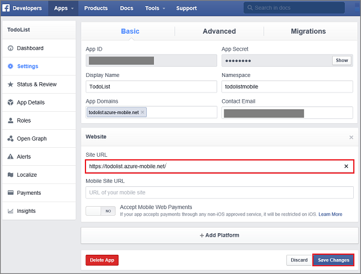

<properties linkid="develop-mobile-how-to-guides-register-for-facebook-authentication" urlDisplayName="Register for Facebook Authentication" pageTitle="Register for Facebook authentication - Mobile Services" metaKeywords="Azure Facebook, Azure Facebook, Azure authenticate Mobile Services" description="Learn how to use Facebook authentication in your Azure Mobile Services app." metaCanonical="" services="" documentationCenter="" title="Register your apps for Facebook authentication with Mobile Services" authors="glenga" solutions="" manager="" editor="" />

Registrieren Ihrer App für die Facebook-Authentifizierung mit Mobile Services
=============================================================================

In diesem Thema erfahren Sie, wie Sie Ihre Apps registrieren, um Facebook zur Authentifizierung mit Azure Mobile Services zu verwenden.

**Hinweis**

Sie benötigen ein Facebook-Konto mit verifizierter E-Mail-Adresse und einer Mobiltelefonnummer, um den in diesem Thema beschriebenen Vorgang abzuschließen. Rufen Sie die Seite [facebook.com](http://go.microsoft.com/fwlink/p/?LinkId=268285) auf, um ein neues Facebook-Konto zu erstellen.

1.  Navigieren Sie zur Website [Facebook-Entwickler](http://go.microsoft.com/fwlink/p/?LinkId=268286), und melden Sie sich mit Ihren Facebook-Anmeldeinformationen an.

2.  (Optional) Falls Sie sich noch nicht registriert haben, klicken Sie auf **Apps** und dann auf **Register as a Developer**, akzeptieren Sie die Richtlinie, und führen Sie die Registrierungsschritte durch.

        ![][0]

3.  Klicken Sie auf **Apps** und dann auf **Create a New App**.

        ![][1]

4.  Wählen Sie einen eindeutigen Namen für Ihre App, wählen Sie **Apps for Pages**, klicken Sie auf **Create App**, und beantworten Sie die Sicherheitsfrage.

        ![][2]

    Daraufhin wird die App bei Facebook registriert.

5.  Klicken Sie auf **Einstellungen**, geben Sie die Domäne Ihres Mobile Service unter **App-Domänen** ein, klicken Sie auf **Plattform hinzufügen**, und wählen Sie **Website**.

        ![][3]

6.  Geben Sie die URL Ihres Mobile Service unter **Site URL** ein, und klicken Sie auf **Änderungen speichern**.

    

7.  Klicken Sie auf **Anzeigen**, geben Sie falls erforderlich Ihr Kennwort an, und notieren Sie sich die Werte von **App-ID** und **App-Schlüssel**.

        ![][5]

    **Sicherheitshinweis**

    Der App-Schlüssel ist eine wichtige Anmeldeinformation. Teilen Sie diesen Schlüssel mit niemandem, und geben Sie ihn nicht über Ihre App frei.

Sie können nun ein Facebook-Login für die Authentifizierung in Ihrer App verwenden, indem Sie die App-ID und den App-Schlüssel für Mobile Services bereitstellen.

