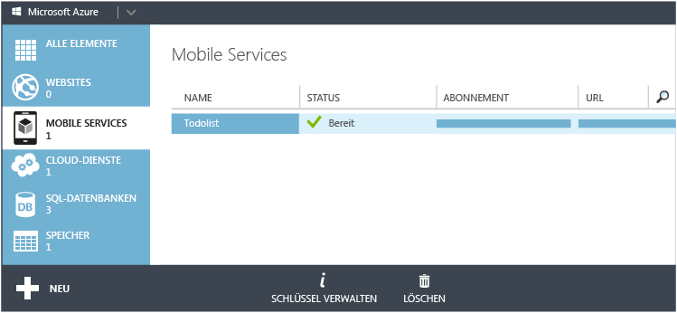
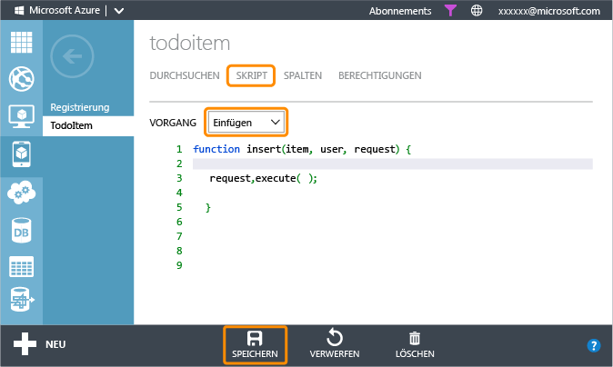
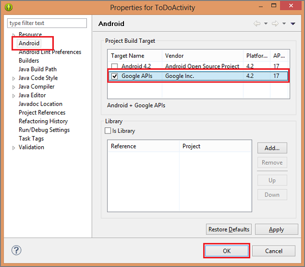

<properties linkid="develop-mobile-tutorials-get-started-with-push-js-vs2013" urlDisplayName="Get Started with Push (JS)" pageTitle="Get started with push notifications (Android JavaScript) | Mobile Dev Center" metaKeywords="" description="Learn how to use Windows Azure Mobile Services to send push notifications to your Android JavaScript app." metaCanonical="http://www.windowsazure.com/en-us/develop/mobile/tutorials/get-started-with-push-dotnet/" services="" documentationCenter="Mobile" title="Get started with push notifications in Mobile Services" authors="ricksal" solutions="" writer="ricksal" manager="" editor="" />

Erste Schritte mit Pushbenachrichtigungen in Mobile Services
============================================================

	<a href="/en-us/documentation/articles/mobile-services-javascript-backend-windows-store-dotnet-get-started-push" title="Windows Store C#">Windows Store C#</a>
	<a href="/en-us/documentation/articles/mobile-services-javascript-backend-windows-store-javascript-get-started-push" title="Windows Store JavaScript">Windows Store JavaScript</a>
	<a href="/en-us/documentation/articles/mobile-services-javascript-backend-windows-phone-get-started-push" title="Windows Phone">Windows Phone</a>
	<a href="/en-us/documentation/articles/mobile-services-ios-get-started-push" title="iOS">iOS</a> 
	<a href="/en-us/documentation/articles/mobile-services-javascript-backend-android-get-started-push" title="Android">Android</a>

In diesem Thema erfahren Sie, wie Sie mithilfe von Azure Mobile Services eine Pushbenachrichtigung an Ihre Android-App senden. In diesem Lernprogramm fügen Sie Pushbenachrichtigungen mithilfe von Google Cloud Messaging (GCM) zu dem Schnellstartprojekt hinzu. Wenn dies abgeschlossen ist, sendet Ihr mobiler Dienst immer dann, wenn ein Datensatz eingefügt wird, eine Pushbenachrichtigung.

[WACOM.NOTE]Dieses Lernprogramm zeigt die Mobile Services-Integration mit Notification Hubs, was sich momentan in der Vorschauphase befindet. Das Senden von Pushbenachrichtigungen mithilfe von Notification Hubs ist standardmäßig nicht über ein JavaScript-Backend aktiviert. Sobald der neue Benachrichtigungshub erstellt wurde, kann der Integrationsvorgang nicht rückgängig gemacht werden. Pushbenachrichtigungen für iOS stehen nur heute zur Verfügung, indem die standardmäßige Push-Unterstützung verwendet wird, die in [dieser Version des Themas](/en-us/documentation/articles/mobile-services-android-get-started-push/) beschrieben wird.

In diesem Lernprogramm werden die folgenden grundlegenden Schritte zur Aktivierung von Pushbenachrichtigungen behandelt:

1.  [Aktivieren von Google Cloud Messaging](#register)
2.  [Konfigurieren von Mobile Services](#configure)
3.  [Hinzufügen von Pushbenachrichtigungen zur App](#add-push)
4.  [Aktualisieren von Skripts zum Senden von Pushbenachrichtigungen](#update-scripts)
5.  [Einfügen von Daten zum Empfangen von Benachrichtigungen](#test)

Dieses Lernprogramm baut auf dem Mobile Services-Schnellstart auf. Bevor Sie mit diesem Lernprogramm beginnen, müssen Sie zunächst entweder [Erste Schritte mit Mobile Services](/en-us/develop/mobile/tutorials/get-started/) oder [Erste Schritte mit Daten](/en-us/develop/mobile/tutorials/get-started-with-data-js/) abschließen, um Ihr Projekt mit Mobile Services zu verbinden.

Aktivieren von Google Cloud Messaging
-------------------------------------

[WACOM.INCLUDE [Enable GCM](../includes/mobile-services-enable-Google-cloud-messaging.md)]

Als Nächstes verwenden Sie diesen API-Schlüsselwert, um Mobile Services für die Authentifizierung mit GCM zu aktivieren und Pushbenachrichtigungen im Auftrag Ihrer App zu senden.

Konfigurieren von Mobile Services zum Senden von Pushanforderungen
------------------------------------------------------------------

1.  Melden Sie sich am [Windows Azure-Verwaltungsportal](https://manage.windowsazure.com/) an, klicken Sie auf **Mobile Services** und dann auf Ihre Anwendung.

	

2.  Klicken Sie auf die Registerkarte **Push** und dann auf **Erweiterten Push aktivieren**. Wählen Sie anschließend **Ja** aus, um die Konfigurationsänderung zu übernehmen.

    

    

    Daraufhin wird die Konfiguration Ihres mobilen Diensts aktualisiert, sodass erweiterte Pushbenachrichtigungsfunktionen, die von Notification Hubs zur Verfügung gestellt werden, genutzt werden können. Die Nutzung einiger Notification Hubs ist bei Ihrem kostenpflichtigen mobilen Dienst kostenlos. Weitere Informationen finden Sie unter [Mobile Services – Preisdetails](http://go.microsoft.com/fwlink/p/?LinkID=311786).

    
<b>Wichtig</b>
	

    Durch diesen Vorgang werden Ihre Pushanmeldeinformationen zurückgesetzt, und darüber hinaus wird das Verhalten der Pushmethoden in Ihren Skripts geändert. Diese Änderungen können nicht mehr rückgängig gemacht werden. Verwenden Sie diese Methode nicht, wenn Sie einer Produktionsumgebung im mobilen Dienst einen Benachrichtigungshub hinzufügen möchten. Anweisungen zum Aktivieren der erweiterten Pushbenachrichtigungen in einer Produktionsumgebung im mobilen Dienst finden Sie in [dieser Anleitung](http://go.microsoft.com/fwlink/p/?LinkId=391951).

3.  Geben Sie den Wert **API-Schlüssel** ein, den Sie zuvor von GCM erhalten haben, und klicken Sie auf **Speichern**.

	

    
<b>Wichtig</b>
	

    Wenn Sie Ihre GCM-Anmeldeinformationen für erweiterte Pushbenachrichtigungen auf der Registerkarte "Push" im Portal festlegen, werden diese für Notification Hubs freigegeben, sodass der Benachrichtigungshub mit Ihrer App konfiguriert wird.

Sowohl Ihr Mobile Service als auch Ihre App sind nun konfiguriert und funktionieren mit GCM und Notification Hubs.

Hinzufügen von Pushbenachrichtigungen zur App
---------------------------------------------

### Prüfen der Version des Android-SDK

[WACOM.INCLUDE [Verify SDK](../includes/mobile-services-verify-android-sdk-version.md)]

Als Nächstes installieren Sie Google Play Services. Google Cloud Messaging verfügt über einige Mindestanforderungen an den API-Level für Entwicklung und Tests, denen die Eigenschaft **minSdkVersion** im Manifest entsprechen muss.

Wenn Sie den Testvorgang mit einem älteren Gerät durchführen, konsultieren Sie [Set Up Google Play Services SDK](http://go.microsoft.com/fwlink/?LinkId=389801) (Einrichten des Google Play Services SDK, in englischer Sprache), um zu ermitteln, wie niedrig Sie diesen Wert einstellen können. Legen Sie den Wert anschließend entsprechend fest.

### Hinzufügen von Google Play Services zum Projekt

[WACOM.INCLUDE [Add Play Services](../includes/mobile-services-add-Google-play-services.md)]

### Hinzufügen des Codes

1.  Öffnen Sie die Datei `AndroidManifest.xml`. Ersetzen Sie im Code in den nächsten beiden Schritten _`**my_app_package**`_ durch den Namen des App-Pakets für Ihr Projekt, der dem Wert des Attributs `package` des Tags `manifest` entspricht.

2.  Fügen Sie die folgenden neuen Berechtigungen nach dem vorhandenen Element `uses-permission` ein:

         <permission android:name="**my_app_package**.permission.C2D_MESSAGE" 
             android:protectionLevel="signature" />
         <uses-permission android:name="**my_app_package**.permission.C2D_MESSAGE" /> 
         <uses-permission android:name="com.google.android.c2dm.permission.RECEIVE" />
         <uses-permission android:name="android.permission.GET_ACCOUNTS"/>
         <uses-permission android:name="android.permission.WAKE_LOCK"/>

3.  Fügen Sie den folgenden Code nach dem Starttag `application` ein:

         <receiver android:name="com.microsoft.windowsazure.notifications.NotificationsBroadcastReceiver"
                                        android:permission="com.google.android.c2dm.permission.SEND">
             <intent-filter>
                 <action android:name="com.google.android.c2dm.intent.RECEIVE" />
                 <category android:name="**my_app_package**" />
             </intent-filter>
         </receiver>

4.  Laden Sie das [Mobile Services Android SDK] herunter, und entzippen Sie es. Öffnen Sie den Ordner **Benachrichtigungen**, kopieren Sie die Datei **notifications-1.0.1.jar** in den Ordner *libs* Ihres Eclipse-Projekts, und aktualisieren Sie den Ordner *libs*.

    
<b>Hinweis</b>
	

    Die Nummern am Ende des Dateinamens können sich in den nachfolgenden SDK-Versionen ändern.

5.  Öffnen Sie die Datei *ToDoItemActivity.java*, und fügen Sie den folgenden Import-Ausdruck ein:

        import com.microsoft.windowsazure.notifications.NotificationsManager;

6.  Fügen Sie die folgende private Variable zu der Klasse hinzu. *`<PROJECT_NUMBER>`* steht für die Projektnummer, die Ihrer App im vorherigen Vorgang durch Google zugewiesen wurde:

         public static final String SENDER_ID = "<PROJECT_NUMBER>";

7.  Bevor der MobileServiceClient instanziiert wird, fügen Sie in der Methode **onCreate** diesen Code hinzu. Er registriert die Benachrichtigungsbehandlung für das Gerät:

         NotificationsManager.handleNotifications(this, SENDER_ID, MyHandler.class);

    Zu einem späteren Zeitpunkt definieren wir die MyHandler-Klasse, auf die in diesem Code verwiesen wird.

8.  Klicken Sie im Paket-Explorer mit der rechten Maustaste auf das Paket (unter dem Knoten `src`), klicken Sie auf **Neu** und dann auf **Klasse**.

9.  Geben Sie unter **Name** `MyHandler` ein, unter **Übergeordnete Klasse** `com.microsoft.windowsazure.notifications.NotificationsHandler`, und klicken Sie dann auf **Fertig stellen**.

    

    Daraufhin wird die neue MyHandler-Klasse erstellt.

10. Fügen Sie den folgenden Import-Ausdruck ein:

        import android.content.Context;

11. Als Nächstes fügen Sie der Klasse diesen Code hinzu:

        public static final int NOTIFICATION_ID = 1;
        private NotificationManager mNotificationManager;
        NotificationCompat.Builder builder;
        Context ctx;

12. Fügen Sie den folgenden Code zum Überschreiben der **onRegistered**-Methode hinzu, wodurch Ihr Gerät im Benachrichtigungshub des mobilen Diensts registriert wird.

        @Override
        public void onRegistered(Context context, String gcmRegistrationId) {
            super.onRegistered(context, gcmRegistrationId);
                
            ToDoActivity.mClient.getPush().register(gcmRegistrationId, null, new RegistrationCallback() {
                @Override
                public void onRegister(Registration registration, Exception exception) {
                      if (exception != null) {
                            // Fehler beheben
                      }
                }
            });
        }

13. Fügen Sie den folgenden Code zum Überschreiben der **onReceive**-Methode hinzu, wodurch die Benachrichtigung angezeigt wird, nachdem diese empfangen wurde.

        @Override
        public void onReceive(Context context, Bundle bundle) {
            ctx = context;
            String nhMessage = bundle.getString("message");

            sendNotification(nhMessage);
        }

        private void sendNotification(String msg) {
            mNotificationManager = (NotificationManager)
                      ctx.getSystemService(Context.NOTIFICATION_SERVICE);

            PendingIntent contentIntent = PendingIntent.getActivity(ctx, 0,
                  new Intent(ctx, ToDoActivity.class), 0);

            NotificationCompat.Builder mBuilder =
                  new NotificationCompat.Builder(ctx)
                  .setSmallIcon(R.drawable.ic_launcher)
                  .setContentTitle("Notification Hub Demo")
                  .setStyle(new NotificationCompat.BigTextStyle()
                             .bigText(msg))
                  .setContentText(msg);

             mBuilder.setContentIntent(contentIntent);
             mNotificationManager.notify(NOTIFICATION_ID, mBuilder.build());
        }

Ihre App kann Pushbenachrichtigungen nun unterstützen.

Aktualisieren des registrierten Einfügeskripts im Verwaltungsportal
-------------------------------------------------------------------

1.  Klicken Sie im Verwaltungsportal auf die Registerkarte **Daten** und dann auf die Tabelle **TodoItem**.

	

2.  Klicken Sie unter **todoitem** auf die Registerkarte **Skript**, und wählen Sie **Einfügen** aus.

	 

	Daraufhin wird die Funktion angezeigt, die aufgerufen wird, wenn etwas in die Tabelle **TodoItem** eingefügt wird.

1.  Ersetzen Sie die Einfügefunktion durch den folgenden Code, und klicken Sie auf **Speichern**:

         function insert(item, user, request) {
         // Definieren Sie eine Nutzlast für die Google Cloud Messaging-Toastbenachrichtigung.
         var payload = 
             '{"data":{"message" : "Hello from Mobile Services!"}}';
            
         request.execute({
             success: function() {
                 // Wenn der Einfügevorgang erfolgreich war, senden Sie eine Benachrichtigung.
                 push.gcm.send(null, payload, {
                     success: function(pushResponse) {
                         console.log("Sent push:", pushResponse, payload);
                         request.respond();
                         },              
                     error: function(pushResponse) {
                         console.log("Error Sending push:", pushResponse);
                         request.respond(500, { error: pushResponse });
                         }
                     });
                 },
             error: function(err) {
                 console.log("request.execute error", err)
                 request.respond();
             }
           });
         }

	Daraufhin wird ein neues Einfügeskript registriert, das das [gcm object] zum Senden einer Pushbenachrichtigung an alle registrierten Geräte verwendet, nachdem der Einfügevorgang erfolgreich war. 

Testen von Pushbenachrichtigungen in der App
--------------------------------------------

Sie können die App testen, indem Sie ein Android-Telefon direkt mit einem USB-Kabel verbinden oder ein virtuelles Gerät im Emulator verwenden.

### Einrichten des Emulators für den Testvorgang

Wenn Sie diese App im Emulator ausführen, stellen Sie sicher, dass Sie ein Android Virtual Device (AVD) verwenden, das Google-APIs unterstützt.

1.  Starten Sie Eclipse neu, und klicken Sie dann im Paket-Explorer mit der rechten Maustaste auf das Projekt. Klicken Sie auf **Eigenschaften**, dann auf **Android**, überprüfen Sie **Google APIs**, und klicken Sie dann auf **OK**.

    

	Dies gibt das Projekt für die Google-APIs vor.

1.  Wählen Sie unter **Fenster** **Android Virtual Device Manager**, wählen Sie Ihr Gerät aus, und klicken Sie auf **Bearbeiten**.

    

2.  Wählen Sie **Google APIs** in **Ziel** aus, und klicken Sie auf **OK**.

	

    Dies gibt das AVD zur Verwendung von Google-APIs vor.

### Ausführen des Tests

1.  Klicken Sie in Eclipse im Menü **Run** auf **Run**, um die App zu starten.

2.  Geben Sie in der App einen sinnvollen Text ein, beispielsweise *Eine neue Mobile Services-Aufgabe hinzufügen*, und klicken Sie dann auf die Schaltfläche **Hinzufügen**.

	

1.  Führen Sie eine Streifbewegung vom oberen Bildschirmrand aus, um das Notification Center des Geräts zu öffnen, sodass die Benachrichtigung angezeigt wird.

Sie haben dieses Lernprogramm erfolgreich abgeschlossen.

Nächste Schritte
----------------

In diesem Lernprogramm wurden die Grundlagen der von Mobile Services bereitgestellten Pushbenachrichtigungsfunktion gezeigt. Wenn Sie Ihrer App fortgeschrittenere Funktionen, wie z. B. Senden von plattformübergreifenden Benachrichtigungen, abonnementbasiertes Routing oder sehr große Mengen von Benachrichtigungen, hinzufügen möchten, sollten Sie Azure Notification Hubs mit Ihrem mobilen Dienst verwenden. Weitere Informationen finden Sie in einem der folgenden Themen zu Notification Hubs:

-   [Erste Schritte mit Notification Hubs](/en-us/manage/services/notification-hubs/getting-started-windows-dotnet/)
    Lernen Sie, wie Sie Notification Hubs in Ihrer Android-App einsetzen können.

-   [Senden von Benachrichtigungen an Abonnenten](/en-us/manage/services/notification-hubs/breaking-news-dotnet/)
    Lernen Sie, wie Benutzer sich registrieren und Pushbenachrichtigungen für Kategorien erhalten können, an denen sie interessiert sind.

-   [Senden von Benachrichtigungen an Benutzer](/en-us/manage/services/notification-hubs/notify-users/)
    Lernen Sie, wie Sie Pushbenachrichtigungen von einem mobilen Dienst an bestimmte Benutzer auf beliebigen Geräten senden können.

-   [Senden plattformübergreifender Benachrichtigungen an Benutzer](/en-us/manage/services/notification-hubs/notify-users-xplat-mobile-services/)
    Lernen Sie, wie Vorlagen zum Senden von Pushbenachrichtigungen mit einem mobilen Dienst gesendet werden, ohne dass Sie in Ihrem Backend auf plattformspezifische Nutzlasten zurückgreifen müssen.

Weitere Informationen zu Mobile Services:

-   [Erste Schritte mit Daten](/en-us/develop/mobile/tutorials/get-started-with-data-js/)
    Weitere Informationen zum Speichern und Abfragen von Daten mit Mobile Services.

-   [Erste Schritte mit der Authentifizierung](/en-us/develop/mobile/tutorials/get-started-with-users-js)
    Lernen Sie, wie Benutzer Ihrer App mit einem Windows-Konto authentifiziert werden.

-   [Mobile Services: Serverskriptreferenz](http://go.microsoft.com/fwlink/?LinkId=262293)
    Lernen Sie mehr über das Registrieren und Verwenden von Serverskripts.

-   [Mobile Services HTML/JavaScript-Anleitungen: Konzeptionelle Referenz](/en-us/develop/mobile/how-to-guides/work-with-html-js-client/)
    Lernen Sie mehr über die Verwendung von Mobile Services mit HTML und JavaScript.

