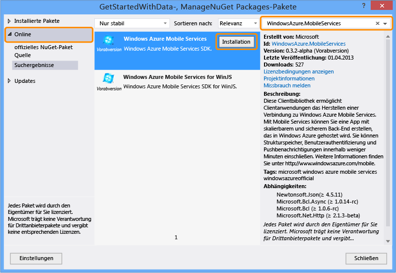
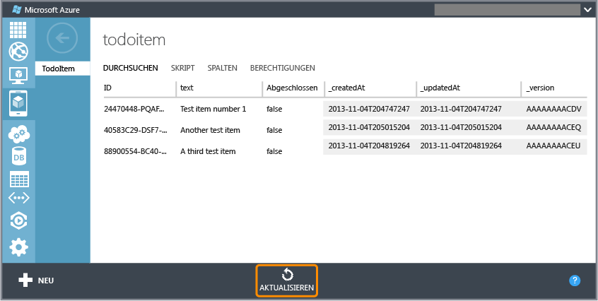

<properties linkid="develop-mobile-tutorials-get-started-with-data-wp8" urlDisplayName="Get Started with Data" pageTitle="Get started with data (WP8) - Azure Mobile Services" metaKeywords="" description="Learn how to get started using data from your Azure Mobile Services Windows Phone 8 app." metaCanonical="" services="" documentationCenter="Mobile" title="Get started with data in Mobile Services" authors="glenga" solutions="" manager="" editor="" />

Erste Schritte mit Daten in Mobile Services
===========================================

[Windows Store C\#](/de-de/develop/mobile/tutorials/get-started-with-data-dotnet "Windows Store C#")[Windows Store JavaScript](/de-de/develop/mobile/tutorials/get-started-with-data-js "Windows Store JavaScript")[Windows Phone](/de-de/develop/mobile/tutorials/get-started-with-data-wp8 "Windows Phone")[iOS](/de-de/develop/mobile/tutorials/get-started-with-data-ios "iOS")[Android](/de-de/develop/mobile/tutorials/get-started-with-data-android "Android")[HTML](/de-de/develop/mobile/tutorials/get-started-with-data-html "HTML")[Xamarin.iOS](/de-de/develop/mobile/tutorials/get-started-with-data-xamarin-ios "Xamarin.iOS")[Xamarin.Android](/de-de/develop/mobile/tutorials/get-started-with-data-xamarin-android "Xamarin.Android")[.NET-Backend](/de-de/documentation/articles/mobile-services-dotnet-backend-windows-phone-get-started-data/ ".NET-Backend") | [JavaScript-Backend](/de-de/documentation/articles/mobile-services-windows-phone-get-started-data/ "JavaScript-Back-End")

In diesem Thema wird gezeigt, wie Sie mit Azure Mobile Services Daten in einer Windows Phone 8-App nutzen können. In diesem Lernprogramm laden Sie eine App herunter, die Daten im Arbeitsspeicher speichert, erstellen einen neuen mobilen Dienst, integrieren den mobilen Dienst in eine App und melden sich dann beim Azure-Verwaltungsportal an, um Datenänderungen beim Ausführen der App anzuzeigen.

[Lernprogramm ansehen](http://go.microsoft.com/fwlink/?LinkID=298628) [Video abspielen](http://go.microsoft.com/fwlink/?LinkID=298628) 12:54:00

**Hinweis**

Anhand dieses Lernprogramms soll Ihnen ein besseres Verständnis über die Mobile Services dahingehend vermittelt werden, wie Sie mit deren Hilfe Azure verwenden können, um Daten in einer Windows Phone 8-App zu speichern und abzurufen. Dieses Thema behandelt viele der Schritte, die Ihnen im Schnellstart für mobile Dienste abgenommen werden. Falls Sie noch keine Erfahrung mit mobilen Diensten haben, sollten Sie eventuell zuerst das Lernprogramm [Erste Schritte mit Mobile Services](/de-de/develop/mobile/tutorials/get-started-wp8) abschließen.

In diesem Lernprogramm werden die folgenden grundlegenden Schritte behandelt:

1.  [Herunterladen des Windows Phone 8-App-Projekts](#download-app)
2.  [Erstellen des mobilen Dienstes](#create-service)
3.  [Erstellen einer Datentabelle als Datenspeicher](#add-table)
4.  [Aktualisieren der App zur Verwendung von Mobile Services](#update-app)
5.  [Testen der App mit Mobile Services](#test-app)

Dieses Lernprogramm erfordert das [Windows Phone 8 SDK](http://go.microsoft.com/fwlink/p/?LinkID=268374), welches unter Windows 8 läuft.

**Hinweis**

Sie benötigen ein Azure-Konto mit aktivierter "Azure Mobile Services"-Funktion, um dieses Lernprogramm auszuführen.

-   Wenn Sie über kein Konto verfügen, können Sie in nur wenigen Minuten ein kostenloses Testkonto erstellen. Weitere Informationen finden Sie unter [Kostenloses Azure-Testkonto](http://www.windowsazure.com/de-de/pricing/free-trial/?WT.mc_id=A756A2826&returnurl=http%3A%2F%2Fwww.windowsazure.com%2Fen-us%2Fdevelop%2Fmobile%2Ftutorials%2Fget-started-with-data-wp8%2F).

Herunterladen des ProjektsHerunterladen des GetStartedWithData-Projekts
-----------------------------------------------------------------------

Dieses Lernprogramm baut auf der [GetStartedWithData-App](http://go.microsoft.com/fwlink/p/?LinkId=271146) auf, bei der es sich um eine Windows Phone 8-App handelt. Die Benutzeroberfläche dieser App und die vom Mobile Services-Schnellstart generierte Benutzeroberfläche sind identisch, mit der Ausnahme, dass hinzugefügte Einträge lokal im Arbeitsspeicher gespeichert werden.

1.  Laden Sie die GetStartedWithData-Beispiel-App von der [Website mit den Codebeispielen für Entwickler](http://go.microsoft.com/fwlink/p/?LinkId=271146) herunter.

2.  Öffnen Sie in Visual Studio 2012 Express für Windows Phone 8 das heruntergeladene Projekt, und sehen Sie sich die Datei "MainPage.xaml.cs" an.

   Beachten Sie, dass die hinzugefügten **TodoItem**-Objekte in einem speicherinternen **ObservableCollection<TodoItem>**-Element gespeichert werden.

3.  Drücken Sie die **F5**-Taste, um das Projekt neu zu erstellen und die App zu starten.

4.  Geben Sie in der App einen Text in das Textfeld ein. Klicken Sie anschließend auf die Schaltfläche **Speichern**.

     

   Beachten Sie, dass der gespeicherte Text in der unteren Liste angezeigt wird.

Erstellen eines mobilen DienstesErstellen eines neuen mobilen Dienstes im Verwaltungsportal
-------------------------------------------------------------------------------------------

[WACOM.INCLUDE [mobile-services-create-new-service-data](../includes/mobile-services-create-new-service-data.md)]

Erstellen einer neuen TabelleHinzufügen einer neuen Tabelle zum mobilen Dienst
------------------------------------------------------------------------------

[WACOM.INCLUDE [mobile-services-create-new-service-data-2](../includes/mobile-services-create-new-service-data-2.md)]

Aktualisieren der AppAktualisieren der App für den Datenzugriff über mobile Dienste
-----------------------------------------------------------------------------------

Ihr mobiler Dienst ist nun bereit und Sie können die App aktualisieren, sodass dieser Elemente im mobilen Dienst anstatt in einer lokalen Sammlung speichert.

1.  Klicken Sie im **Projektmappen-Explorer** in Visual Studio mit der rechten Maustaste auf den Projektnamen, und wählen Sie dann **NuGet-Pakete verwalten** aus.

2.  Wählen Sie im linken Bereich die Kategorie **Online** aus, suchen Sie nach `WindowsAzure.MobileServices`, klicken Sie auf **Installieren** im Paket **Azure Mobile Services**, und stimmen Sie dem Lizenzvertrag zu.

     

    Dadurch wird die Mobile Services-Clientbibliothek zum Projekt hinzugefügt.

1.  Klicken Sie im Verwaltungsportal auf **Mobile Services** und dann auf den mobilen Dienst, den Sie gerade erstellt haben.

2.  Klicken Sie auf die Registerkarte **Dashboard**, und notieren Sie sich die **Site URL**. Klicken Sie anschließend auf **Schlüssel verwalten**, und notieren Sie sich den **Anwendungsschlüssel**.

   

    Sie benötigen diese Werte beim Zugriff auf den mobilen Dienst über den App-Code.

1.  Öffnen Sie in Visual Studio die Datei "App.xaml.cs". Fügen Sie die folgende `using`-Anweisung hinzu, oder heben Sie die Auskommentierung hierfür auf:

         using Microsoft.WindowsAzure.MobileServices;

2.  Heben Sie in derselben Datei die Auskommentierung für den Code auf, der die Variable **MobileService** festlegt, und stellen Sie die URL und den Anwendungsschlüssel aus dem mobilen Dienst im **MobileServiceClient**-Konstruktor bereit. Beachten Sie hierbei die angegebene Reihenfolge.

         //public static MobileServiceClient MobileService = new MobileServiceClient( 
         //    "AppUrl", 
         //    "AppKey" 
         //); 

     Hierdurch wird eine neue Instanz des **MobileServiceClient** erstellt, der für den Zugriff auf Ihren mobilen Dienst verwendet wird.

1.  Fügen Sie in der Datei "MainPage.xaml.cs" die folgenden `using`-Anweisungen hinzu, oder heben Sie deren Auskommentierung auf:

         using Microsoft.WindowsAzure.MobileServices;
         using Newtonsoft.Json;

2.  Ersetzen Sie in derselben Datei die **TodoItem**-Klassendefinition durch den folgenden Code:

         public class TodoItem
         {
             public string Id { get; set; }

             [JsonProperty(PropertyName = "text")]
             public string Text { get; set; }

             [JsonProperty(PropertyName = "complete")]
             public bool Complete { get; set; }
         }

3.  Kommentieren Sie die Zeile aus, welche die bestehende **items**-Sammlung festlegt. Heben Sie anschließend die Auskommentierung für die folgenden Zeilen auf:

         private MobileServiceCollection<TodoItem, TodoItem> items;
         private IMobileServiceTable<TodoItem> todoTable = 
             App.MobileService.GetTable<TodoItem>();

   Dieser Code erstellt eine mobile dienstunterstützende Bindungssammlung (**items**) und eine Proxyklasse für die SQL-Datenbanktabelle **TodoItem** (**todoTable**). 

4.  Entfernen Sie aus der **InsertTodoItem**-Methode die Codezeile, in der die **TodoItem**.**Id**-Eigenschaft festgelegt wird. Fügen Sie der Methode den **async**-Modifizierer hinzu, und heben Sie die Auskommentierung der folgenden Codezeile auf:

         await todoTable.InsertAsync(todoItem);

    Mit diesem Code wird ein neuer Eintrag in die Tabelle eingefügt.

1.  Fügen Sie der **RefreshTodoItems**-Methode den **async**-Modifizierer hinzu, und heben Sie dann die Auskommentierung der folgenden Codezeile auf:

         items = await todoTable.ToCollectionAsync();

    Damit wird die Bindung an die Sammlung der Einträge in der todoTable festgelegt, die alle vom mobilen Dienst zurückgegebenen TodoItem-Objekte enthält. 

2.  Fügen Sie der **UpdateCheckedTodoItem**-Methode den **async**-Modifizierer hinzu, und heben Sie die Auskommentierung der folgenden Codezeile auf:

          await todoTable.UpdateAsync(item);

    Damit wird eine Eintragsaktualisierung an den mobilen Dienst gesendet.

Nachdem nun die App für die Verwendung von Mobile Services als Back-End-Speicher aktualisiert ist, können Sie die App mit Mobile Services testen.

Testen der AppTesten der App mit Ihrem neuen mobilen Dienst
-----------------------------------------------------------

1.  Drücken Sie in Visual Studio die Taste F5, um die App auszuführen.

2.  Geben Sie wie zuvor Text im Textfeld ein, und klicken Sie danach auf die Schaltfläche **Speichern**.

   Dieser Code schickt ein neues einzufügendes Element an den mobilen Dienst.

3.  Klicken Sie im [Verwaltungsportal](https://manage.windowsazure.com/) auf **Mobile Dienste** und dann auf Ihren mobilen Dienst.

4.  Klicken Sie auf die Registerkarte **Daten** und dann auf **Durchsuchen**.

   
          
    Die **TodoItem**-Tabelle enthält nun Daten, mit von Mobile Services generierten ID-Werten, und der Tabelle wurden automatisch Spalten entsprechend der TodoItem-Klasse der App hinzugefügt.

Damit ist das Lernprogramm **Erste Schritte mit Daten** für Windows Phone 8 beendet.

Nächste Schritte
----------------

In diesem Lernprogramm wurden die Grundlagen der Aktivierung einer Windows Phone 8-App für die Arbeit mit Daten in Mobile Services aufgezeigt. Als Nächstes können Sie das folgende Lernprogramm ausführen, das auf der GetStartedWithData-App aufbaut, die Sie in diesem Lernprogramm erstellt haben:

-   [Prüfen und Ändern von Daten mit Skripten](/de-de/develop/mobile/tutorials/validate-modify-and-augment-data-wp8)
    
    Informationen zur Verwendung von Serverskripten in Mobile Services, um von Ihrer App gesendete Daten zu prüfen und zu ändern.

-   [Optimieren von Abfragen mittels Paging](/de-de/develop/mobile/tutorials/add-paging-to-data-wp8)
    
    Informationen zur Verwendung von Paging in Abfragen, um die in einer einzelnen Anforderung behandelte Datenmenge zu steuern.

Sobald Sie die Datenreihe abgeschlossen haben, können Sie sich auch an einem der folgenden Windows Phone 8-Lernprogramme versuchen:

-   [Erste Schritte mit der Authentifizierung](/de-de/develop/mobile/tutorials/get-started-with-users-wp8)
    
    Informationen zur Authentifizierung von Benutzern Ihrer App.

-   [Erste Schritte mit Pushbenachrichtigungen](/de-de/develop/mobile/tutorials/get-started-with-push-wp8)
    
    Verschicken Sie mit Mobile Services eine einfache Pushbenachrichtigung an Ihre App.

