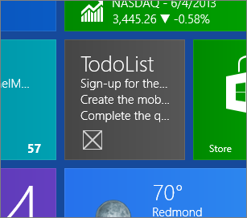

<properties linkid="develop-mobile-tutorials-create-pull-notifications-dotnet" urlDisplayName="Define a custom API that supports pull notifications" pageTitle="Define a custom API that supports pull notifications - Azure Mobile Services" metaKeywords="" description="Learn how to Define a custom API that supports periodic notifications in Windows Store apps that use Azure Mobile Services." metaCanonical="" services="" documentationCenter="" title="Define a custom API that supports periodic notifications" authors="glenga" solutions="" manager="" editor="" />

Definieren benutzerdefinierter APIs mit Unterstützung für periodische Benachrichtigungen
========================================================================================

[Windows Store C\#](/en-us/develop/mobile/tutorials/create-pull-notifications-dotnet "Windows Store C#")[Windows Store JavaScript](/en-us/develop/mobile/tutorials/create-pull-notifications-js "Windows Store JavaScript")

In diesem Thema lernen Sie, wie Sie eine benutzerdefinierte API für periodische Benachrichtigungen aus einer Windows Store-App aufrufen. Durch die Aktivierung von periodischen Benachrichtigungen greift Windows periodisch auf Ihren benutzerdefinierten API-Endpunkt zu und verwendet die zurückgegebene XML, in einem kachelspezifischen Format, um die App-Kachel im Startmenü zu aktualisieren. Weitere Informationen finden Sie unter [Periodische Benachrichtigungen](http://msdn.microsoft.com/en-us/library/windows/apps/jj150587.aspx).

Sie fügen diese Funktionen zu der App hinzu, welche Sie beim Abschluss entweder des Lernprogramms [Erste Schritte mit Mobile Services](/en-us/develop/mobile/tutorials/get-started/#create-new-service) oder [Erste Schritte mit Daten](/en-us/develop/mobile/tutorials/get-started-with-data-dotnet) erstellen. Dafür führen Sie die folgenden Schritte aus:

1.  [Definieren der benutzerdefinierten API](#define-custom-api)
2.  [Aktualisieren der App zum Aktivieren periodischer Benachrichtigungen](#update-app)
3.  [Testen der App](#test-app)

Dieses Lernprogramm baut auf dem Mobile Services-Schnellstart auf. Sie müssen zuerst [Erste Schritte mit Mobile Services](/en-us/develop/mobile/tutorials/get-started/#create-new-service) oder [Erste Schritte mit Daten](/en-us/develop/mobile/tutorials/get-started-with-data-dotnet) abschließen, bevor Sie mit diesem Lernprogramm beginnen.

Definieren der benutzerdefinierten API
--------------------------------------

1.  Melden Sie sich beim [Azure-Verwaltungsportal](https://manage.windowsazure.com/) an. Klicken Sie auf **Mobile Services** und dann auf Ihre App.

   	![][0]

2.  Klicken Sie auf die Registerkarte **API** und dann auf **Create a custom API**.

   	![][1]

    Das Dialogfeld **Create a new custom API** wird angezeigt.

3.  Ändern Sie **Get permission** zu **Everyone**, geben Sie *tiles* unter **API name** ein und klicken Sie auf das Kontrollkästchen.

   	![][2]

    Daraufhin wird die neue API mit öffentlichem GET-Zugriff erstellt.

4.  Klicken Sie auf den neuen Eintrag tiles in der API-Tabelle.

   	

5.  Klicken Sie auf die Registerkarte **Skript**, und ersetzen Sie den vorhandenen Code durch den folgenden:

         exports.get = function(request, response) {
             var wns = require('wns');
             var todoItems = request.service.tables.getTable('TodoItem');
             todoItems.where({
                 complete: false
             }).read({
                 success: sendResponse
             });
            
             function sendResponse(results) {
                 var tileText = {
                     text1: "My todo list"
                 };
                 var i = 0;
                 console.log(results)
                 results.forEach(function(item) {
                     tileText["text" + (i + 2)] = item.text;
                     i++;
                 });
                 var xml = wns.createTileSquareText01(tileText);
                 response.set('content-type', 'application/xml');
                 response.send(200, xml);
             }
         };

    Dieser Code gibt die ersten 3 nicht abgeschlossenen Element aus der Tabelle TodoItem zurück und lädt sie in ein JSON-Objekt, das an die Funktion **wns**.**createTileSquareText01** übergeben wird. Diese Funktion gibt das folgende XML für tile-Vorlagen zurück:

         <tile>
             <visual>
                 <binding template="TileSquareText01">
                     <text id="1">My todo list</text>
                     <text id="2">Task 1</text>
                     <text id="3">Task 2</text>
                     <text id="4">Task 3</text>
                 </binding>
             </visual>
         </tile>

    Die Funktion **exports.get** wird verwendet, da der Client eine GET-Anfrage für den Zugriff auf die tile-Vorlage sendet.

   	
<b>Note</b>
   		
Dieses API-Skript verwendet das Node.js-Modul <a href="http://go.microsoft.com/fwlink/p/
        LinkId=306750">wns</a>, das durch die <strong>require</strong>-Funktion referenziert wird. Dieses Modul unterscheidet sich vom <a href="http://go.microsoft.com/fwlink/p/
        LinkId=260591">wns-Objekt</a> , das vom <a href="http://msdn.microsoft.com/en-us/library/windowsazure/jj554217.aspx">push-Objekt</a> zurückgegeben wird, welches zum Versand von Pushbenachrichtigungen aus Serverskripts dient.

        

Als Nächstes ändern Sie die Quickstart-App, um periodische Benachrichtigungen zu verschicken, die das Live Tile durch Anfragen an die neue benutzerdefinierte API aktualisiert.

Aktualisieren der AppAktualisieren der App zum Aktivieren periodischer Benachrichtigungen
-----------------------------------------------------------------------------------------

1.  Drücken Sie in Visual Studio die Taste F5, um die Schnellstart-App aus dem vorherigen Lernprogramm auszuführen.

2.  Stellen Sie sicher, dass mindestens ein Element angezeigt wird. Falls kein Element angezeigt wird, geben Sie in der App einen Text in **Insert a TodoItem** ein, und klicken Sie dann auf **Save**.

3.  Öffnen Sie in Visual Studio die Projektdatei "App.xaml.cs". Fügen Sie die folgende using-Anweisung hinzu:

         using Windows.UI.Notifications;

4.  Fügen Sie den folgenden Code zum **OnLaunched**-Ereignishandler hinzu:

         TileUpdateManager.CreateTileUpdaterForApplication().StartPeriodicUpdate(
             new System.Uri(MobileService.ApplicationUri, "/api/tiles"),
             PeriodicUpdateRecurrence.Hour
         );

    Dieser Code aktiviert periodische Benachrichtigungen zur Abfrage von Tile-Vorlagendaten aus der neuen **tiles**-API. Wählen Sie einen passenden Wert unter [PeriodicUpdateRecurrance] für das Aktualisierungsintervall Ihrer Daten aus.

Testen der App
--------------

1.  Drücken Sie in Visual Studio die Taste F5, um die App erneut auszuführen.

    Daraufhin werden die periodischen Benachrichtigungen aktiviert.

2.  Navigieren Sie zum Startbildschirm, suchen Sie das Live Tile der App und beachten Sie, dass dieses Tile nun Elementdaten enthält.

 	

Nächste Schritte
----------------

Da Sie nun eine periodische Benachrichtigung erstellt haben, können Sie weitere Einzelheiten über die folgenden Mobile Services-Themen erfahren:

-   [Erste Schritte mit Pushbenachrichtigungen](/en-us/develop/mobile/tutorials/get-started-with-push-dotnet)
	 Periodische Benachrichtigungen werden von Windows verwaltet und erfolgen nach einem vordefinierten Zeitplan. Pushbenachrichtigungen können bedarfsgesteuert vom mobilen Dienst gesendet werden und vom Typ Popup, Tile oder reine Benachrichtigungen sein.

-   [Mobile Services: Serverskriptreferenz](http://go.microsoft.com/fwlink/?LinkId=262293)
	 Erfahren Sie mehr über das Erstellen von benutzerdefinierten APIs.

-   [Mobile Services .NET-Anleitungen: Konzeptionelle Referenz](/en-us/develop/mobile/how-to-guides/work-with-net-client-library)
	 Lernen Sie mehr über die Verwendung von Mobile Services mit .NET.

<!-- Images. -->
[0]: ./media/mobile-services-windows-store-dotnet-create-pull-notifications/mobile-services-selection.png
[1]: ./media/mobile-services-windows-store-dotnet-create-pull-notifications/mobile-custom-api-create.png
[2]: ./media/mobile-services-windows-store-dotnet-create-pull-notifications/mobile-custom-api-create-dialog.png
[3]: ./media/mobile-services-windows-store-dotnet-create-pull-notifications/mobile-custom-api-select.png
[4]: ./media/mobile-services-windows-store-dotnet-create-pull-notifications/mobile-custom-api-live-tile.png
