<properties linkid="develop-mobile-tutorials-optimistic-concurrent-data-dotnet" urlDisplayName="Optimistic concurrency" pageTitle="Handle database write conflicts with optimistic concurrency (Windows Store) | Mobile Dev Center" metaKeywords="" description="Learn how to handle database write conflicts on both the server and in your Windows Store application." metaCanonical="" disqusComments="1" umbracoNaviHide="1" documentationCenter="Mobile" title="Handling database write conflicts" authors="" />

Behandeln von Schreibkonflikten in Datenbanken
==============================================

[Windows Store C\#](/de-de/develop/mobile/tutorials/handle-database-write-conflicts-dotnet/ "Windows Store C#") [Windows Store JavaScript](/de-de/develop/mobile/tutorials/handle-database-write-conflicts-javascript/ "Windows Store JavaScript") [Windows Phone](/de-de/develop/mobile/tutorials/handle-database-write-conflicts-wp8/ "Windows Phone")

Dieses Lernprogramm beschreibt die Behandlung von Konflikten, die auftreten, wenn zwei oder mehr Clients in denselben Datenbankeintrag in einer Windows Store-App schreiben. In manchen Szenarien können zwei oder mehr Clients gleichzeitig versuchen, dasselbe Element zu bearbeiten. Ohne Konflikterkennung würde der letzte Schreibvorgang alle vorherigen Aktualisierungen überschreiben, selbst wenn dies nicht so gewollt wäre. Azure Mobile Services bietet Unterstützung für die Erkennung und Auflösung dieser Konflikte. Dieser Artikel beschreibt die Schritte, mit denen Sie Datenbank-Schreibkonflikte sowohl auf dem Server als auch in Ihrer Anwendung behandeln können.

In diesem Lernprogramm fügen Sie eine Funktion zur Schnellstart-App hinzu, die Konflikte bei Änderungen in der TodoItem-Datenbank behandelt. In diesem Lernprogramm werden die grundlegenden Schritte erläutert:

1.  [Aktualisieren der Anwendung, um Änderungen zu ermöglichen](#uiupdate)
2.  [Aktivieren der Konflikterkennung in Ihrer Anwendung](#enableOC)
3.  [Testen auf Datenbank-Schreibkonflikte in Ihrer Anwendung](#test-app)
4.  [Automatische Konfliktauflösung in Serverskripts](#scriptsexample)

Für dieses Lernprogramm ist Folgendes erforderlich:

-   Microsoft Visual Studio 2012 Express für Windows oder eine höhere Version.
-   Dieses Lernprogramm baut auf dem Mobile Services-Schnellstart auf. Bevor Sie mit diesem Lernprogramm beginnen, müssen Sie zunächst [Erste Schritte mit Mobile Services](/de-de/develop/mobile/tutorials/get-started) abschließen.
-   [Azure-Konto](http://www.windowsazure.com/de-de/pricing/free-trial/)
-   Azure Mobile Services NuGet-Paket 1.1.0 oder neuer. Führen Sie die folgenden Schritte aus, um die neueste Version herunterzuladen:
    1.  Öffnen Sie das Projekt in Visual Studio, klicken Sie im Projektmappen-Explorer mit der rechten Maustaste auf das Projekt und wählen Sie dann **Manage NuGet Packages** aus.

        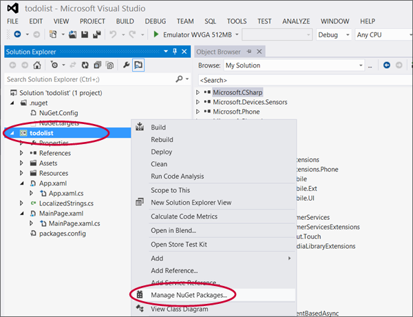

    2.  Erweitern Sie **Online** und klicken Sie auf **Microsoft and .NET**. Geben Sie im Suchfeld **Azure Mobile Services** ein. Klicken Sie auf **Install** für das **Azure Mobile Services** NuGet-Paket.

        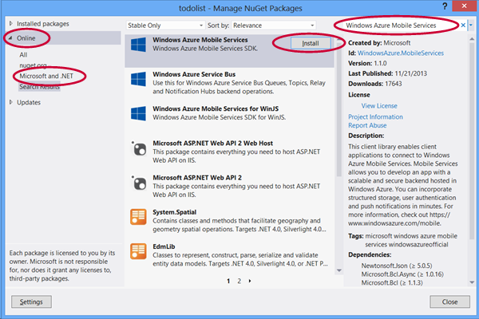

Aktualisieren der AnwendungAktualisieren der Anwendung, um Änderungen zu ermöglichen
------------------------------------------------------------------------------------

In diesem Abschnitt aktualisieren Sie die TodoList Benutzeroberfläche, um Änderungen an den Textelementen in einem Listenfeld-Steuerelement zu ermöglichen. Das Listenfeld enthält ein Kontrollkästchen und ein TextBox-Steuerelement für jeden Eintrag in der Datenbanktabelle. Sie können das Textfeld des TodoItems ändern. Die Anwendung verarbeitet das `LostFocus` Ereignis von dieser TextBox, um das Element in der Datenbank zu aktualisieren.

1.  Öffnen Sie in Visual Studio das Projekt, das Sie im Lernprogramm [Erste Schritte mit mobilen Diensten](/de-de/develop/mobile/tutorials/get-started) heruntergeladen haben.
2.  Öffnen Sie die Datei MainPage.xaml im Projektmappen-Explorer in Visual Studio, ersetzen Sie die `ListView` Definition durch die folgende `ListView` Definition und speichern Sie Ihre Änderungen.

         <ListView Name="ListItems" Margin="62,10,0,0" Grid.Row="1">
             <ListView.ItemTemplate>
                 <DataTemplate>
                     <StackPanel Orientation="Horizontal">
                         <CheckBox Name="CheckBoxComplete" IsChecked="{Binding Complete, Mode=TwoWay}" Checked="CheckBoxComplete_Checked" Margin="10,5" VerticalAlignment="Center"/>
                         <TextBox x:Name="ToDoText" Height="25" Width="300" Margin="10" Text="{Binding Text, Mode=TwoWay}" AcceptsReturn="False" LostFocus="ToDoText_LostFocus"/>
                     </StackPanel>
                 </DataTemplate>
             </ListView.ItemTemplate>
         </ListView>

3.  Fügen Sie in MainPage.xaml.cs die folgende `using` Anweisung am Anfang der Seite hinzu.

         using System.Threading.Tasks;

4.  Öffnen Sie MainPage.xaml.cs im Projektmappen-Explorer in Visual Studio. Fügen Sie den Ereignishandler zur MainPage für das `LostFocus` Ereignis der TextBox hinzu.

         private async void ToDoText_LostFocus(object sender, RoutedEventArgs e)
         {
             TextBox tb = (TextBox)sender;
             TodoItem item = tb.DataContext as TodoItem;
             //Prüfen, ob der Text geändert wurde
             if (item.Text != tb.Text)
             {
                 item.Text = tb.Text;
                 await UpdateToDoItem(item);
             }
         }

5.  Fügen Sie in MainPage.xaml.cs die Definition für die `UpdateToDoItem()` Methode der MainPage hinzu, die im oben gezeigten Ereignishandler aufgerufen wird.

         private async Task UpdateToDoItem(TodoItem item)
         {
             Exception exception = null;            
             try
             {
                 //Remotetabelle aktualisieren
                 await todoTable.UpdateAsync(item);
             }
             catch (Exception ex)
             {
                 exception = ex;
             }          
             if (exception != null)
             {
                 await new MessageDialog(exception.Message, "Update Failed").ShowAsync();
             }
         }

Die Anwendung schreibt nun die Textänderungen der einzelnen Elemente in die Datenbank, wenn der Fokus der TextBox verloren geht.

Aktivieren der optimistischen ParallelitätAktivieren der Konflikterkennung in Ihrer Anwendung
---------------------------------------------------------------------------------------------

In manchen Szenarien können zwei oder mehr Clients gleichzeitig versuchen, dasselbe Element zu bearbeiten. Ohne Konflikterkennung würde der letzte Schreibvorgang alle vorherigen Aktualisierungen überschreiben, selbst wenn dies nicht so gewollt wäre. [Die Steuerung für optimistische Parallelität](http://go.microsoft.com/fwlink/?LinkId=330935) nimmt an, dass jede Transaktion Commits ausführen kann und sperrt daher keine Ressourcen. Vor dem Commit einer Transaktion prüft die Steuerung für optimistische Parallelität, ob die Daten von einer anderen Transaktion geändert wurden. Falls die Daten geändert wurden, wird für die Transaktion, die den Commit durchführen sollte, ein Rollback durchgeführt. Azure Mobile Services unterstützen optimistische Parallelität, indem Änderungen an Elementen in der `__version` Systemeigenschaftenspalte registriert werden, die in allen Tabellen existiert. In diesem Abschnitt erweitern wir die Anwendung um die Erkennung dieser Schreibkonflikte anhand der `__version` Systemeigenschaft. Die Anwendung wird durch eine `MobileServicePreconditionFailedException` bei einem Änderungsversuch benachrichtigt, falls der Eintrag seit der letzten Abfrage geändert wurde. Anschließend kann die Anwendung entscheiden, ob die Änderung in die Datenbank geschrieben oder die letzte Änderung in der Datenbank erhalten bleiben soll. Weitere Informationen zu Systemeigenschaften für Mobile Services finden Sie unter [Systemeigenschaften](http://go.microsoft.com/fwlink/?LinkId=331143).

1.  Aktualisieren Sie die **TodoItem** Klassendefinition in MainPage.xaml.cs mit dem folgenden Code, um die Unterstützung für die Erkennung von Schreibkonflikten anhand der **\_\_version** Systemeigenschaft hinzuzufügen.

         public class TodoItem
         {
             public string Id { get; set; }         
             [JsonProperty(PropertyName = "text")]
             public string Text { get; set; }           
             [JsonProperty(PropertyName = "complete")]
             public bool Complete { get; set; }         
             [JsonProperty(PropertyName = "__version")]
             public string Version { set; get; }
         }

    **Hinweis**

    Bei der Verwendung von untypisierten Tabellen können Sie die optimistische Parallelität aktivieren, indem sie das Version-Flag zu den Systemeigenschaften der Tabelle hinzufügen.

    ``` {}
    //Aktivieren der optimistischen Parallelität durch Abrufen von __version?todoTable.SystemProperties |= MobileServiceSystemProperties.Version;
    ```

2.  Wenn Sie die `Version`-Eigenschaft zur Klasse `TodoItem` hinzufügen, wird die Anwendung durch eine `MobileServicePreconditionFailedException` bei Änderungsversuchen benachrichtigt, falls der Eintrag seit der letzten Abfrage geändert wurde. Diese Ausnahme enthält den die neueste Version des Elements auf dem Server. Fügen Sie den folgenden Code in MainPage.xaml.cs hinzu, um die Ausnahme in der `UpdateToDoItem()` Methode zu behandeln.

         private async Task UpdateToDoItem(TodoItem item)
         {
             Exception exception = null;            
             try
             {
                 //Aktualisieren der Remotetabelle
                 await todoTable.UpdateAsync(item);
             }
             catch (MobileServicePreconditionFailedException<TodoItem> writeException)
             {
                 exception = writeException;
             }
             catch (Exception ex)
             {
                 exception = ex;
             }          
             if (exception != null)
             {
                 if (exception is MobileServicePreconditionFailedException)
                 {
                     //Konflikt erkannt, Element wurde seit der letzten Abfrage geändert
                     //Konflikt zwischen lokalem und Serverelement auflösen
                     await ResolveConflict(item, ((MobileServicePreconditionFailedException<TodoItem>) exception).Item);
                 }
                 else
                 {
                     await new MessageDialog(exception.Message, "Update Failed").ShowAsync();
                 }
             }
         }

3.  Fügen Sie in MainPage.xaml.cs die Definition für die `ResolveConflict()` Methode hinzu, die in `UpdateToDoItem()` aufgerufen wird. Um den Konflikt zu lösen, setzen Sie die Version des lokalen Elements auf die aktualisierte Version vom Server, bevor Sie den Commit für die Entscheidung des Benutzers ausführen. Andernfalls wird der Konflikt weiterhin auftreten.

         private async Task ResolveConflict(TodoItem localItem, TodoItem serverItem)
         {
             //Benutzer auffordern, eine der Konfliktversionen auszuwählen
             MessageDialog msgDialog = new MessageDialog(String.Format("Server Text: \"{0}\" \nLocal Text: \"{1}\"\n"
                    serverItem.Text, localItem.Text),                                                 "CONFLICT DETECTED - Select a resolution:");     
             UICommand localBtn = new UICommand("Commit Local Text");    
             UICommand ServerBtn = new UICommand("Leave Server Text");    
             msgDialog.Commands.Add(localBtn);?     msgDialog.Commands.Add(ServerBtn);           
             localBtn.Invoked = async (IUICommand command) =>
             {
                 // Aktualisieren der Version des zu speichernden
                 // Elements, um den Konflikt zu lösen. Ansonsten erhalten Sie
                 // erneut eine MobileServicePreConditionFailedException.
                 localItem.Version = serverItem.Version;                
                // Rekursive Aktualisierung, falls das Element erneut geändert
                // wurde, während sich der Benutzer entschieden hat
                await UpdateToDoItem(localItem);
            };          
            ServerBtn.Invoked = async (IUICommand command) =>
            {
                RefreshTodoItems();
            };         
           await msgDialog.ShowAsync();
           }

Testen der AppTesten auf Datenbank-Schreibkonflikte in Ihrer Anwendung
----------------------------------------------------------------------

In diesem Abschnitt erstellen Sie ein Windows Store-App-Paket, um die App auf einem zweiten Computer bzw. virtuellen Computer zu installieren. Anschließend werden Sie die App auf beiden Computern ausführen, um den Code mit einem Schreibkonflikt zu testen. Beide Instanzen der App werden versuchen, die `text` Eigenschaft desselben Elements zu aktualisieren, woraufhin der Benutzer den Konflikt auflösen muss.

1.  Erstellen Sie ein Windows Store-App-Paket, um die App auf einem zweiten Computer bzw. virtuellen Computer zu installieren. Klicken Sie dazu auf **Project**-\>**Store**-\>**Create App Packages** in Visual Studio.

    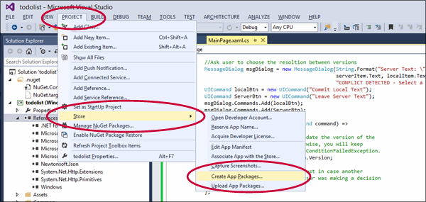

2.  Klicken Sie im Bildschirm Create Your Packages auf **No**, da Sie dieses Paket nicht im Windows Store hochladen werden. Klicken Sie dann auf **Next**.

    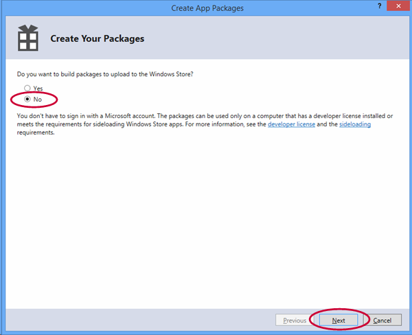

3.  Akzeptieren Sie die Standardwerte im Bildschirm Select and Configure Packages und klicken Sie auf **Create**.

    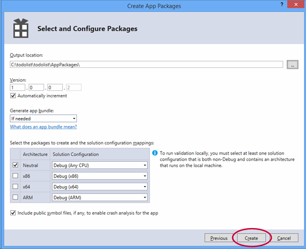

4.  Klicken Sie im Bildschirm Package Creation Completed auf den Link **Output location**, um den Speicherort des Pakets zu öffnen.

      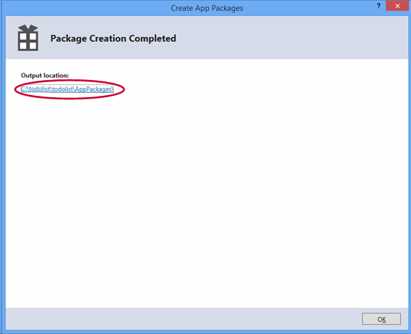

5.  Kopieren Sie den Paketordner "todolist\_1.0.0.0\_AnyCPU\_Debug\_Test" auf den zweiten Computer. Öffnen Sie auf diesem Computer den Paketordner und klicken Sie mit der rechten Maustaste auf das **Add-AppDevPackage.ps1** PowerShell-Skript und klicken Sie auf **Run with PowerShell**, wie unten gezeigt. Folgen Sie den Anweisungen, um die App zu installieren.

    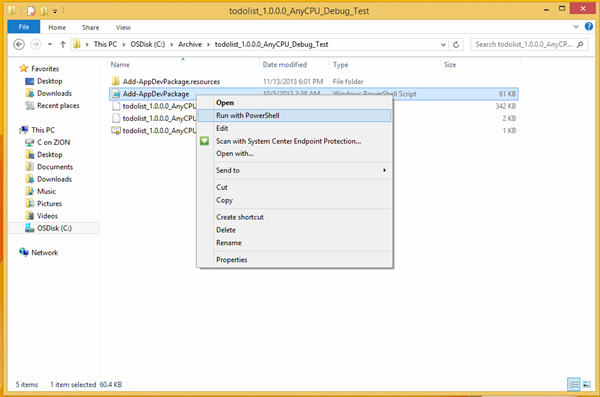

6.  Führen Sie die Instanz 1 der App in Visual Studio aus, indem Sie auf **Debug**-\>**Start Debugging** klicken. Klicken Sie im Startbildschirm des zweiten Computers auf den Pfeil nach unten, um "Apps by Name" anzuzeigen. Klicken Sie anschließend auf die **todolist**-App, um Instanz 2 der App auszuführen.

    App-Instanz 1 
    <br/>

    App-Instanz 2 
    <br/>

7.  Ändern Sie den Text des letzten Elements in Instanz 1 der App zu **Test Write 1** und klicken Sie auf ein anderes Textfeld, damit der `LostFocus` Ereignishandler die Datenbank aktualisiert. Der folgende Screenshot zeigt ein Beispiel.

    App-Instanz 1 
    <br/>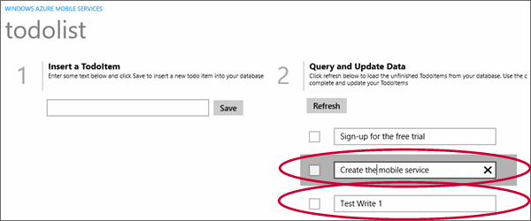

    App-Instanz 2 
    <br/>

8.  Der Wert des entsprechenden Elements in Instanz 2 der App ist nun veraltet. Geben Sie in Instanz 2 der App den Wert **Test Write 2** für die `text` Eigenschaft ein. Klicken Sie auf ein anderes Textfeld, damit der `LostFocus` Ereignishandler versucht, die Datenbank mit der alten `_version` Eigenschaft zu aktualisieren.

    App-Instanz 1 
    <br/>

    App-Instanz 2
    <br/>

9.  Da der beim Aktualisierungsversuch verwendete `__version` ert nicht mit dem `__version` Wert des Servers übereinstimmt, wirft das Mobile Services SDK eine `MobileServicePreconditionFailedException` und gibt der App die Möglichkeit, den Konflikt zu lösen. Um den Konflikt zu lösen, können Sie auf **Commit Local Text** klicken, um die Werte aus Instanz 2 in die Datenbank zu schreiben. Alternativ können Sie auf **Leave Server Text** klicken, um die Werte in Instanz 2 zu verwerfen und die Werte aus Instanz 1 in der Datenbank zu behalten.

    App-Instanz 1 
    <br/>

    App-Instanz 2 
    <br/>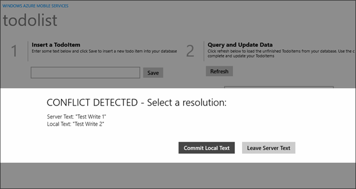

Konfliktbehandlung mit SkriptsAutomatische Konfliktauflösung in Serverskripts
-----------------------------------------------------------------------------

Sie können Schreibkonflikte auch in Serverskripts erkennen und behandeln. Dies macht Sinn, wenn Sie geskriptete Logik anstelle einer Benutzereingabe für die Konfliktauflösung verwenden möchten. In diesem Abschnitt erstellen Sie ein Serverskript für die TodoItem-Tabelle der Anwendung. Die Logik in diesem Skript wird Konflikte wie folgt auflösen:

-   Falls das complete`Feld` der TodoItem-Tabelle den Wert true hat, gilt das Element als abgeschlossen und `text` kann nicht mehr geändert werden.
-   Falls das complete`Feld` der TodoItem-Tabelle den Wert false hat, werden Änderungen an `text` in die Datenbank geschrieben.

Führen Sie die folgenden Schritte aus, um ein Serverskript zu erstellen und zu testen.

1.  Melden Sie sich beim [Azure-Verwaltungsportal](https://manage.windowsazure.com/) an. Klicken Sie auf **Mobile Services** und dann auf Ihre App.

      

2.  Klicken Sie auf die Registerkarte **Data**, dann auf die Tabelle **TodoItem**.

      

3.  Klicken Sie auf **Script**, und wählen Sie dann den Vorgang **Update**.

      

4.  Ersetzen Sie das vorhandene Skript durch die folgende Funktion, und klicken Sie dann auf **Save**.

         function update(item, user, request) { 
             request.execute({ 
                 conflict: function (serverRecord) {
                     // Änderungen nur übernehmen, wenn das Element nicht abgeschlossen ist.
                     if (serverRecord.complete === false) {
                         //Aktualisiertes Element in die Tabelle schreiben
                         request.execute();
                     }
                     else
                     {
                         request.respond(statusCodes.FORBIDDEN, 'The item is already completed.');
                     }
                 }
             }); 
         }   

5.  Führen Sie die **todolist**-App auf beiden Computern aus. Ändern Sie den TodoItem-`text` des letzten Elements in Instanz 2. Klicken Sie auf ein anderes Textfeld, damit der `LostFocus` Ereignishandler die Datenbank aktualisiert.

    App-Instanz 1 
    <br/>

    App-Instanz 2 
    <br/>

6.  Geben Sie in Instanz 1 der App einen anderen Wert text-Eigenschaft ein. Klicken Sie auf ein anderes Textfeld, damit der `LostFocus` Ereignishandler versucht, die Datenbank mit der falschen `_version` Eigenschaft zu aktualisieren.

    App-Instanz 1 
    <br/>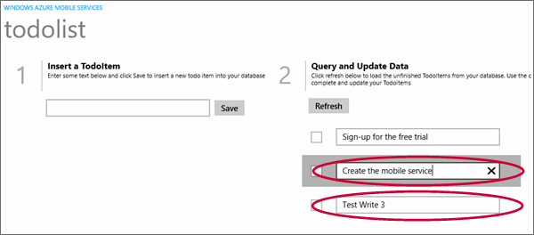

    App-Instanz 2 !
    <br/>[](./media/mobile-services-windows-store-dotnet-handle-database-conflicts/Mobile-oc-store-app2-write3.png)

7.  Beachten Sie, dass keine Ausnahme in der App aufgetreten ist, da der Konflikt vom Serverskript behandelt und die Änderung durchgeführt wurde, da das Element nicht abgeschlossen ist. Klicken Sie in Instanz 2 auf **Refresh**, um die Datenbank erneut abzufragen und sich zu vergewissern, dass die Änderung tatsächlich erfolgreich war.

    App-Instanz 1 
    <br/>

    App-Instanz 2 
    <br/>

8.  Klicken Sie in Instanz 1 auf das Kontrollkästchen, um das letzte Todo-Element als abgeschlossen zu markieren.

    App-Instanz 1 
    <br/>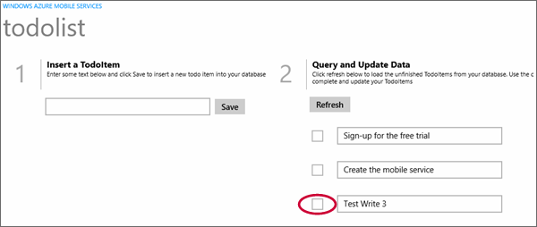

    App-Instanz 2 
    <br/>

9.  Versuchen Sie in Instanz 2, den Text des TodoItems zu ändern und lösen Sie das `LostFocus` Ereignis aus. Das Skript löst den Konflikt, indem die Änderung abgelehnt wird, da das Element bereits abgeschlossen war.

    App-Instanz 1 
    <br/>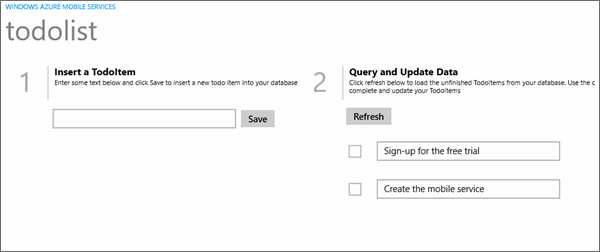

    App-Instanz 2 
    <br/>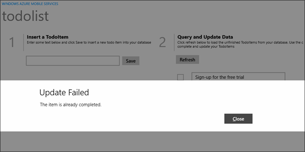

Nächste Schritte
----------------

In diesem Lernprogramm wurden die Grundlagen der Behandlung von Schreibkonflikten in Windows Store-Apps bei der Arbeit mit Daten in Mobile Services gezeigt. Anschließend könnten Sie eines der folgenden Lernprogramme in unserer Daten-Reihe ausführen:

-   [Prüfen und Ändern von Daten mit Skripten](/de-de/develop/mobile/tutorials/validate-modify-and-augment-data-dotnet)
    <br/>Informationen zur Verwendung von Serverskripts in Mobile Services, um von Ihrer App gesendete Daten zu prüfen und zu ändern.

-   [Optimieren von Abfragen mittels Paging](/de-de/develop/mobile/tutorials/add-paging-to-data-dotnet)
    <br/>Informationen zur Verwendung von Paging in Abfragen, um die in einer einzelnen Anforderung behandelte Datenmenge zu steuern.

Sobald Sie die Datenreihe abgeschlossen haben, können Sie sich auch an einem der folgenden Windows Store-Lernprogramme versuchen:

-   [Erste Schritte mit der Authentifizierung](/de-de/develop/mobile/tutorials/get-started-with-users-dotnet)
    <br/>Informationen zur Authentifizierung von Benutzern Ihrer App.

-   [Erste Schritte mit Pushbenachrichtigungen](/de-de/develop/mobile/tutorials/get-started-with-push-dotnet)
    <br/>Verschicken Sie mithilfe Ihres mobilen Dienstes eine einfache Pushbenachrichtigung an Ihre App.


