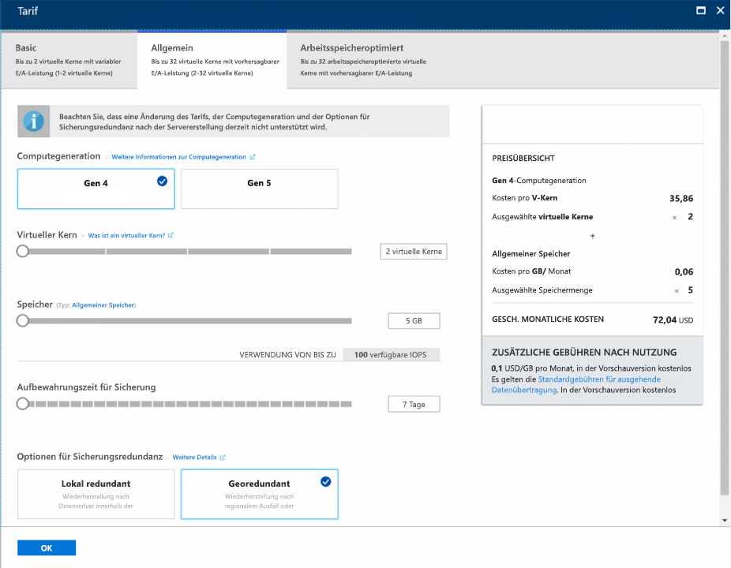
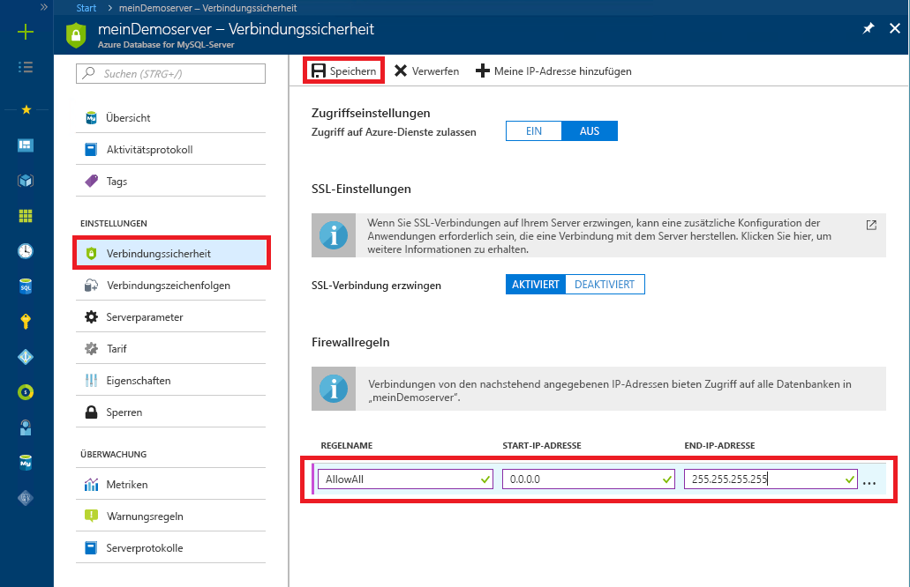

# <a name="design-your-first-azure-database-for-mysql-database"></a>Entwerfen Ihrer ersten Azure Database for MySQL-Datenbank
Azure-Datenbank für MySQL ist ein verwalteter Dienst, mit dem Sie hochverfügbare MySQL-Datenbanken in der Cloud ausführen, verwalten und skalieren können. Mit dem Azure-Portal können Sie mühelos Ihren Server verwalten und eine Datenbank entwerfen.

In diesem Tutorial verwenden Sie das Azure-Portal, um Folgendes zu lernen:

> [!div class="checklist"]
> * Erstellen einer Azure-Datenbank für MySQL
> * Konfigurieren der Serverfirewall
> * Verwenden des mysql-Befehlszeilentools zum Erstellen einer Datenbank
> * Laden von Beispieldaten
> * Abfragen von Daten
> * Aktualisieren von Daten
> * Wiederherstellen von Daten

## <a name="sign-in-to-the-azure-portal"></a>Melden Sie sich auf dem Azure-Portal an.
Öffnen Sie Ihren bevorzugten Browser, und besuchen Sie das [Microsoft Azure-Portal](https://portal.azure.com/). Geben Sie Ihre Anmeldeinformationen ein, um sich beim Portal anzumelden. Die Standardansicht ist Ihr Dienstdashboard.

## <a name="create-an-azure-database-for-mysql-server"></a>Erstellen eines Servers für Azure-Datenbank für MySQL
Ein Azure-Datenbank für MySQL-Server wird mit einer definierten Gruppe von [Compute- und Speicherressourcen](./concepts-compute-unit-and-storage.md) erstellt. Der Server wird in einer [Azure-Ressourcengruppe](https://docs.microsoft.com/azure/azure-resource-manager/resource-group-overview) erstellt.

1. Navigieren Sie zu **Datenbanken** > **Azure-Datenbank für MySQL**. Wenn Sie MySQL-Server nicht unter der Kategorie **Datenbanken** finden, klicken Sie auf **Alle anzeigen**, um alle verfügbaren Datenbankdienste anzuzeigen. Sie können auch **Azure Datenbank für MySQL** in das Suchfeld eingeben, um den Dienst schnell zu finden.
   
   

2. Klicken Sie auf die Kachel **Azure-Datenbank für MySQL**, und klicken Sie dann auf **Erstellen**. Füllen Sie das Azure Database for MySQL-Formular aus.
   
   

    **Einstellung** | **Empfohlener Wert** | **Feldbeschreibung** 
    ---|---|---
    Servername | Eindeutiger Servername | Wählen Sie einen eindeutigen Namen, der Ihren Server für Azure-Datenbank für MySQL identifiziert. Beispiel: mydemoserver. Der Domänenname *.mysql.database.azure.com* wird an den angegebenen Servernamen angefügt. Der Servername darf nur Kleinbuchstaben, Zahlen und den Bindestrich (-) enthalten. Es muss zwischen drei und 63 Zeichen lang sein.
    Abonnement | Ihr Abonnement | Wählen Sie das Azure-Abonnement aus, das Sie für Ihren Server verwenden möchten. Falls Sie über mehrere Abonnements verfügen, wählen Sie das Abonnement aus, über das die Ressource abgerechnet wird.
    Ressourcengruppe | *myresourcegroup* | Geben Sie einen neuen oder vorhandenen Ressourcengruppennamen an.    Ressourcengruppe|*myresourcegroup*| Ein neuer Ressourcengruppenname oder ein bereits vorhandener Name aus Ihrem Abonnement
    Quelle auswählen | *Leer* | Wählen Sie *Leer* aus, um einen neuen Server ohne Vorlage zu erstellen. (Wählen Sie *Sicherung* aus, wenn Sie einen Server auf der Grundlage einer Geosicherung eines vorhandenen Azure Database for MySQL-Servers erstellen).
    Serveradministratoranmeldung | myadmin | Ein Anmeldekonto für die Verbindungsherstellung mit dem Server. Der Administratoranmeldename darf nicht **azure_superuser**, **admin**, **administrator**, **root**, **guest** oder **public** lauten.
    Password | *Beliebig* | Geben Sie ein neues Kennwort für das Serveradministratorkonto an. Es muss zwischen acht und 128 Zeichen lang sein. Das Kennwort muss Zeichen aus drei der folgenden Kategorien enthalten: englische Großbuchstaben, englische Kleinbuchstaben, Zahlen (0-9) und nicht alphanumerische Zeichen (!, $, #, % usw.).
    Kennwort bestätigen | *Beliebig*| Bestätigen Sie das Kennwort des Administratorkontos.
    Speicherort | *Die Region, die Ihren Benutzern am nächsten liegt*| Wählen Sie den Speicherort aus, der Ihren Benutzern oder anderen Azure-Anwendungen am nächsten liegt.
    Version | *Die neueste Version*| Die neueste Version (es sei denn, Sie haben besondere Anforderungen, die eine andere Version erfordern).
    Tarif | **Universell**, **Gen 4**, **2 virtuelle Kerne**, **5 GB**, **7 Tage**, **Georedundant** | Die Compute-, Speicher- und Sicherungskonfigurationen für Ihren neuen Server. Wählen Sie **Tarif**aus. Klicken Sie als Nächstes auf die Registerkarte **Universell**. *Gen 4*, *2 virtuelle Kerne*, *5 GB* und *7 Tage* sind die Standardwerte für **Computegeneration**, **Virtueller Kern**, **Speicher** und **Aufbewahrungszeit für Sicherung**. Sie können diese Schieberegler unverändert lassen. Wählen Sie zum Aktivieren der Serversicherungen in georedundantem Speicher unter **Optionen für Sicherungsredundanz** die Option **Georedundant** aus. Klicken Sie auf **OK**, um die Tarifauswahl zu speichern. Der nächste Screenshot zeigt die gewählten Optionen.
    
   

3. Klicken Sie auf **Create**. In ein oder zwei Minuten wird eine neue Azure-Datenbank für MySQL-Server in der Cloud ausgeführt. Sie können in der Symbolleiste auf die Schaltfläche **Benachrichtigungen** klicken, um den Bereitstellungsprozess zu überwachen.

## <a name="configure-firewall"></a>Konfigurieren der Firewall
Azure SQL-Datenbanken für MySQL werden durch eine Firewall geschützt. Standardmäßig werden alle Verbindungen mit dem Server und den Datenbanken im Server abgelehnt. Vor dem erstmaligen Herstellen einer Verbindung mit Azure-Datenbank für MySQL müssen Sie die Firewall konfigurieren, um die öffentliche Netzwerk-IP-Adresse (oder den IP-Adressbereich) des Clientcomputers hinzuzufügen.

1. Klicken Sie auf den neu erstellten Server und dann auf **Verbindungssicherheit**.
   
   
2. Wählen Sie **Meine IP-Adresse hinzufügen**, oder konfigurieren Sie hier Firewallregeln. Denken Sie nach dem Erstellen der Regeln daran, auf **Speichern** zu klicken.
Sie können jetzt mit dem mysql-Befehlszeilentool oder dem Benutzeroberflächentool MySQL Workbench eine Verbindung mit dem Server herstellen.

> [!TIP]
> Azure-Datenbank für MySQL-Server kommuniziert über Port 3306. Wenn Sie versuchen, eine Verbindung aus einem Unternehmensnetzwerk heraus herzustellen, wird der ausgehende Datenverkehr über Port 3306 von der Firewall Ihres Netzwerks unter Umständen nicht zugelassen. In diesem Fall können Sie nur dann eine Verbindung mit dem Azure MySQL-Server herstellen, wenn Ihre IT-Abteilung Port 3306 öffnet.

## <a name="get-connection-information"></a>Abrufen von Verbindungsinformationen
Rufen Sie den vollqualifizierten **Servernamen** und **Anmeldenamen des Serveradministrators** für Ihre Azure-Datenbank für MySQL-Server aus dem Azure-Portal ab. Sie verwenden den vollqualifizierten Servernamen, um mit dem mysql-Befehlszeilentool eine Verbindung mit Ihrem Server herzustellen. 

1. Klicken Sie im [Azure-Portal](https://portal.azure.com/) im linken Menü auf **Alle Ressourcen**, geben Sie den Namen ein, und suchen Sie nach Ihrer Azure-Datenbank für MySQL-Server. Wählen Sie den Servernamen aus, um die Details anzuzeigen.

2. Notieren Sie sich die Werte für **Servername** und **Anmeldename des Serveradministrators** auf der Seite **Übersicht**. Sie können neben jedem Feld auf die Schaltfläche „Kopieren“ klicken, um die Informationen in die Zwischenablage zu kopieren.
   

In diesem Beispiel lautet der Servername *mydemoserver.mysql.database.azure.com* und die Serveradministratoranmeldung *myadmin@mydemoserver*.

## <a name="connect-to-the-server-using-mysql"></a>Herstellen einer Verbindung mit dem Server unter Verwendung von mysql
Verwenden Sie das [Befehlszeilentool mysql](https://dev.mysql.com/doc/refman/5.7/en/mysql.html) zum Herstellen einer Verbindung mit Ihrer Azure-Datenbank für MySQL-Server. Sie können das mysql-Befehlszeilentool mit der Azure Cloud Shell im Browser oder von Ihrem Computer über die lokal installierten MySQL-Tools ausführen. Um die Azure Cloud Shell zu starten, klicken Sie in einem Codeblock in diesem Artikel auf die Schaltfläche `Try It`, oder besuchen Sie das Azure-Portal, und klicken Sie auf das Symbol `>_` rechts oben auf der Symbolleiste. 

Geben Sie den Befehl für das Herstellen einer Verbindung ein:
```azurecli-interactive
mysql -h mydemoserver.mysql.database.azure.com -u myadmin@mydemoserver -p
```

## <a name="create-a-blank-database"></a>Leere Datenbank erstellen
Sobald Sie mit dem Server verbunden sind, erstellen Sie eine leere Datenbank, um damit zu arbeiten.
```sql
CREATE DATABASE mysampledb;
```

Führen Sie an der Eingabeaufforderung den folgenden Befehl zum Wechseln der Verbindung zu dieser neu erstellten Datenbank aus:
```sql
USE mysampledb;
```

## <a name="create-tables-in-the-database"></a>Erstellen von Tabellen in der Datenbank
Da Sie nun wissen, wie Sie eine Verbindung mit einer Azure Database for MySQL-Datenbank herstellen, können Sie einige grundlegende Aufgaben ausführen:

Zunächst erstellen Sie eine Tabelle und füllen sie mit einigen Daten auf. Wir erstellen eine Tabelle, die Bestandsinformationen speichert.
```sql
CREATE TABLE inventory (
    id serial PRIMARY KEY, 
    name VARCHAR(50), 
    quantity INTEGER
);
```

## <a name="load-data-into-the-tables"></a>Laden von Daten in die Tabellen
Jetzt können Sie Daten in die Tabelle einfügen. Führen Sie im geöffneten Eingabeaufforderungsfenster die folgende Abfrage zum Einfügen einiger Datenzeilen aus.
```sql
INSERT INTO inventory (id, name, quantity) VALUES (1, 'banana', 150); 
INSERT INTO inventory (id, name, quantity) VALUES (2, 'orange', 154);
```

Die Tabelle, die Sie zuvor erstellt haben, enthält nun zwei Zeilen mit Beispieldaten.

## <a name="query-and-update-the-data-in-the-tables"></a>Abfragen und Aktualisieren der Daten in den Tabellen
Führen Sie die folgende Abfrage aus, um Informationen aus der Datenbanktabelle abzurufen.
```sql
SELECT * FROM inventory;
```

Sie können auch die Daten in den Tabellen aktualisieren.
```sql
UPDATE inventory SET quantity = 200 WHERE name = 'banana';
```

Die Zeile wird entsprechend aktualisiert, wenn Sie Daten abrufen.
```sql
SELECT * FROM inventory;
```

## <a name="restore-a-database-to-a-previous-point-in-time"></a>Wiederherstellen eines früheren Zustands einer Datenbank
Angenommen, Sie haben versehentlich eine wichtige Datenbanktabelle gelöscht und können diese Daten nicht einfach wiederherstellen. Mit Azure-Datenbank für MySQL können Sie den Zustand des Servers zu einem bestimmten Zeitpunkt wiederherstellen. Dadurch wird eine Kopie der Datenbanken auf einem neuen Server erstellt. Sie können diesen neuen Server zur Wiederherstellung gelöschter Daten verwenden. Mithilfe der folgenden Schritte wird der Status des Beispielservers zu einem Zeitpunkt wiederhergestellt, der vor dem Hinzufügen der Tabelle liegt.

1. Suchen Sie im Azure-Portal Ihre Azure-Datenbank für MySQL. Klicken Sie auf der Seite **Übersicht** auf der Symbolleiste auf **Wiederherstellen**. Die Seite „Wiederherstellen“ wird geöffnet.

   

2. Geben Sie im Formular **Wiederherstellen** die erforderlichen Informationen ein.
   
   
   
   - **Wiederherstellungspunkt**: Wählen Sie aus dem angezeigten Zeitraum einen Zeitpunkt aus, auf den Sie wiederherstellen möchten. Stellen Sie sicher, dass Sie die lokale Zeitzone in UTC konvertieren.
   - **Auf neuem Server wiederherstellen**: Geben Sie einen neuen Servernamen für die Wiederherstellung ein.
   - **Speicherort**: Die Region ist identisch mit dem Quellserver und kann nicht geändert werden.
   - **Tarif**: Der Tarif ist identisch mit dem Quellserver und kann nicht geändert werden.
   
3. Klicken Sie auf **OK**, um den Status des Servers [auf einen Zeitpunkt wiederherzustellen](./howto-restore-server-portal.md), der vor dem Löschen der Tabelle liegt. Das Wiederherstellen des Zustands eines Servers erstellt eine neue Kopie des Servers zum angegebenen Zeitpunkt. 

## <a name="next-steps"></a>Nächste Schritte
In diesem Tutorial verwenden Sie das Azure-Portal, um Folgendes zu lernen:

> [!div class="checklist"]
> * Erstellen einer Azure-Datenbank für MySQL
> * Konfigurieren der Serverfirewall
> * Verwenden des mysql-Befehlszeilentools zum Erstellen einer Datenbank
> * Laden von Beispieldaten
> * Abfragen von Daten
> * Aktualisieren von Daten
> * Wiederherstellen von Daten

> [!div class="nextstepaction"]
> [Herstellen einer Verbindung zwischen Anwendungen und Azure-Datenbank für MySQL](./howto-connection-string.md)
